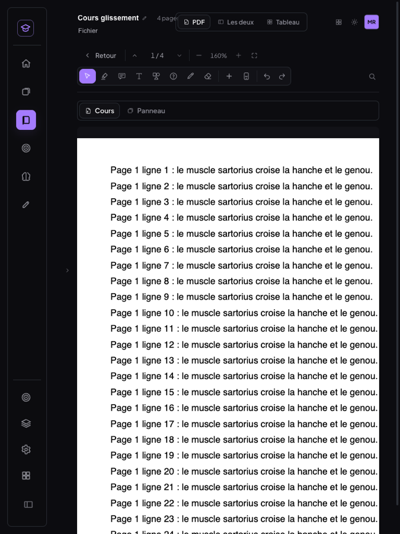
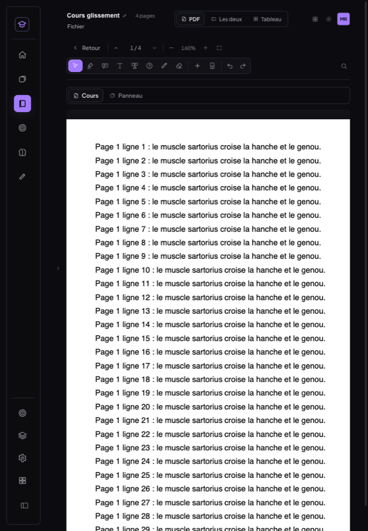
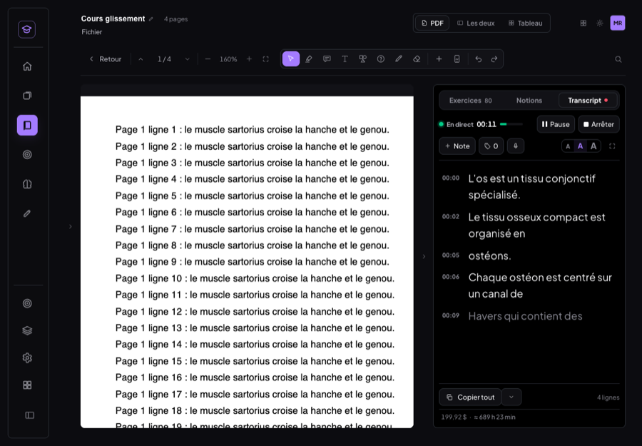
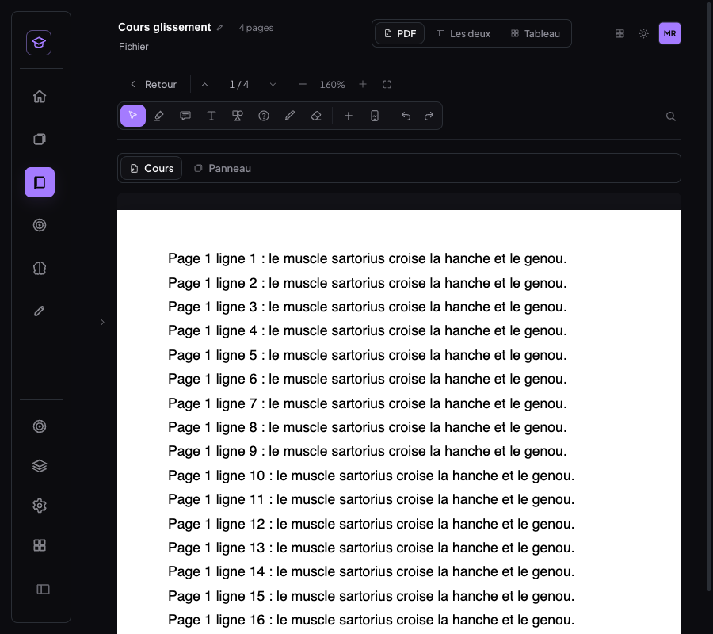
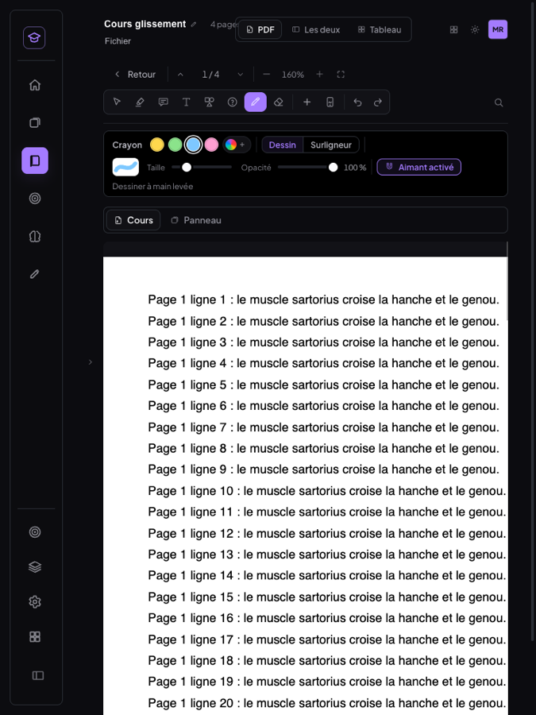
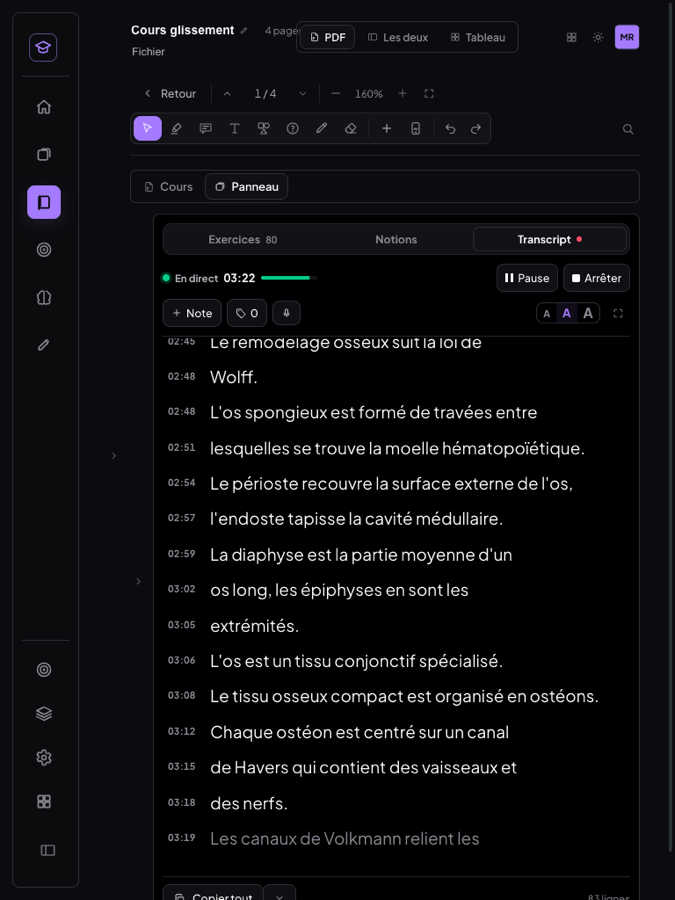

# Audit UX — MedRevise en tablette (07/10/2026)

Largeurs ~700 à ~1 100 px : iPad mini portrait (768 × 1 024), iPad Air portrait (820 × 1 180),
iPad paysage (1 180 × 820), fenêtre Mac de 900 × 800. Avant toute modification (commit `81a6c8a`).

**Méthode.** Chrome piloté en CDP, émulation appareil (`mobile: true`) et **tactile activé**,
vrais événements souris/tactiles. Cours de test : PDF 4 pages, 80 flashcards. **Transcription
en direct active** pendant tout l'audit : micro simulé (voix de synthèse française), faux
Deepgram local (aucune vidéo YouTube possible dans le banc headless, aucun cloud). Les mesures
(positions, hauteurs, nombre de cibles) sont relevées par script dans la page.

Scénario joué à chaque taille, comme pendant un cours : PDF ouvert, transcription active,
annoter une page (crayon), ajouter une note au transcript, créer une flashcard, chercher une
notion, changer de page.

## Captures (avant)

| iPad mini 768 × 1 024 | iPad Air 820 × 1 180 | iPad paysage 1 180 × 820 | Mac 900 × 800 |
|---|---|---|---|
|  |  |  |  |

| iPad mini — outil Crayon | iPad mini — onglet « Panneau » |
|---|---|
|  |  |

## Mesures

| | iPad mini | iPad Air | iPad paysage | Mac 900 |
|---|---|---|---|---|
| Disposition | empilée (bascule) | empilée (bascule) | côte à côte | empilée (bascule) |
| PDF et transcript visibles ensemble | **non** | **non** | oui | **non** |
| En-tête (titre + PDF/Les deux/Tableau) | 2 lignes, **chevauchement** | 2 lignes | 2 lignes | 2 lignes, chevauchement |
| Barre PDF + outils | **99 px, 2 lignes** | 99 px, 2 lignes | 61 px | 99 px, 2 lignes |
| Bascule Cours / Panneau | 38 px, **en haut** | 38 px, en haut | — | 38 px, en haut |
| Haut de la zone PDF | y = 243 (**24 %** de l'écran) | y = 243 | y = 155 | y = 243 (**30 %**) |
| … avec l'outil Crayon (barre de réglages 95 px) | y = 346 (**34 %**) | y = 346 | — | y = 346 (**43 %**) |
| Cibles tactiles < 44 px (visibles) | **29 / 30** | 29 / 30 | **43 / 44** | 29 / 30 |
| Largeur perdue à gauche (rail + marges + poignée de liste) | 148 px (**19 %**) | 148 px | 148 px | 148 px |
| Défilement horizontal de la page | non | non | non | non |

## Ce qui est peu pratique

### A. Disposition

- **A1 — Le PDF et le transcript ne sont jamais visibles ensemble en dessous de 900 px.** La
  bascule Cours / Panneau montre l'un OU l'autre : pour regarder la page dont parle le prof, il
  faut quitter le transcript, et inversement. C'est le défaut principal en cours.
- **A2 — La bascule Cours / Panneau est en haut**, sous deux barres, loin du pouce ; ses
  boutons font 28 px de haut.
- **A3 — En paysage (1 180 px), le côte à côte existe mais le panneau a une largeur fixe
  (380 px)** : impossible de donner plus de place au transcript pendant un cours, ou plus au PDF
  pendant une lecture. Le repli (poignée de 18 px) ne montre plus rien de la session : on ne
  voit ni qu'elle tourne, ni que des lignes arrivent.
- **A4 — Rien ne s'arrête au bas de l'écran.** Le lecteur est plus haut que la fenêtre (zone PDF
  de 836 px commençant à y = 243 sur 1 024) : c'est l'écran entier qui défile, les barres partent
  avec lui. Sur l'onglet Panneau, « Copier tout » et la ligne des crédits sont **coupés** sous le
  bas de l'écran.
- **A5 — 148 px de large perdus à gauche** (rail de navigation 76 px, marges 30 px, poignée de
  la liste repliée) : 19 % de la largeur d'un iPad mini.

### B. Chrome d'interface

- **B1 — Un tiers de la hauteur en interface** : en-tête (2 lignes) + barre de navigation PDF +
  barre d'outils (passée sur 2 lignes) + bascule = 243 px ; 346 px (34 %) dès qu'un outil a des
  réglages. Sur un Mac de 800 px de haut : 43 %.
- **B2 — En-tête qui se chevauche** à 768 et 900 px : « 4 pages » passe sous le sélecteur
  PDF / Les deux / Tableau ; trois icônes (apps, thème, avatar) en plus sur la même ligne.
- **B3 — La barre d'outils passe sur deux lignes** (« Retour, pages, zoom » au-dessus des
  outils), avec huit outils de même poids : Sélection, Surligneur, Boîte, Texte, Forme, ?,
  Crayon, Gomme, puis Insérer et Dessins. Les outils rares occupent autant de place que les
  outils de cours (Surligneur, Crayon).
- **B4 — La barre de réglages de l'outil prend 95 px** (couleurs, mode, curseurs, aimant, et une
  ligne d'aide) au-dessus du PDF.
- **B5 — Les barres restent affichées pendant la lecture** : rien ne se masque quand on fait
  défiler le cours.
- **B6 — La barre du PDF reste affichée sur l'onglet Panneau**, où elle ne sert à rien.

### C. Cibles tactiles

- **C1 — Presque toutes les cibles font moins de 44 px** : boutons de la barre 28–32 px, segments
  du panneau 28 px, tailles de police A/A/A **22 × 22 px**, plein écran 28 px, micro 32 × 28 px.
  Au doigt, on rate « Arrêter » pour « Pause », ou « A » pour « A ».
- **C2 — Contrôles de session sur deux lignes, mais serrés** : « En direct 03:22 », VU-mètre,
  Pause, Arrêter, puis Note, mots-clés, micro, A/A/A, plein écran — cinq petites cibles sur la
  2e ligne.

### D. Saisie, annotation, gestes

- **D1 — Annoter au doigt** : avec le Crayon, la couche de dessin bloque bien le défilement
  (`touch-action: none`), mais **le tracé suit tous les pointeurs de la fenêtre** : un deuxième
  doigt, ou la paume posée pendant qu'on écrit au stylet, ajoute ses points au trait en cours
  (zigzag). Aucun rejet de la paume quand un Apple Pencil est utilisé.
- **D2 — Page rognée** : à 160 % (zoom par défaut), la page est plus large que la colonne à
  768–900 px ; la fin des lignes est coupée (« genou. » au bord), il faut zoomer à la main.
- **D3 — Clavier virtuel** : rien ne garantit que le champ en cours (note du transcript, carte
  flashcard) reste au-dessus du clavier ; le lecteur ne suit pas la hauteur visible.
- **D4 — Chercher une notion** : la recherche est une loupe de 28 px en bout de 2e ligne ; la
  liste des notions est dans le panneau, donc invisible depuis le cours en portrait.
- **D5 — Changer de page** : flèches de 28 px dans la barre ; au doigt, on fait défiler.

### E. Transcript

- **E1** — Le texte du transcript est confortable (19 px, lignes aérées) : **à garder**. Les
  horodatages sont à 11 px.
- **E2** — En portrait, aucun moyen de suivre le direct en regardant le cours : on ne voit ni la
  dernière phrase ni même que la session tourne (seul le point rouge du segment, caché sur
  l'onglet Cours).

## Ce qui va bien (à ne pas casser)

- Aucun défilement horizontal de la page à ces quatre tailles.
- Le côte à côte en paysage est déjà lisible ; le transcript s'y met à jour pendant qu'on annote.
- Le glissement entre les modes du panneau (v1.3) marche au doigt.
