# Apprentissage des flashcards — compte-rendu (06/10/2026)

Un vrai mode d'apprentissage des flashcards, **en amont** de la méthode des J, avec une séance
quotidienne unique et automatique (un seul bouton). La méthode des J n'est pas modifiée : le
moteur (`lib/sm2.js`, aucune ligne changée) et le planning (`lib/planning.js`, un filtre ajouté
en amont) donnent exactement les mêmes résultats pour les cartes en révision (§ 6).

Fichiers : `lib/apprentissageFC.js` (règles, pur), `session/SeanceFC.jsx` (écran de séance,
bureau + mobile), `components/SeanceAujourdhui.jsx` (en-tête), `lib/migrate.js` (migration),
`lib/storage.js` (réglages synchronisés), crochets dans `session/Session.jsx` et
`mobile/MobileSession.jsx`, `supabase/migrations/20261006_apprentissage_flashcards.sql`.

---

## 1. États et transitions

```
              date de départ atteinte              critère de succès consécutifs atteint
  ┌──────┐   (quota du jour, plus anciennes   ┌──────────┐   (3 par défaut ; 2 après un raté)   ┌────────┐
  │ new  │ ─────────── d'abord) ────────────▶ │ learning │ ───────────────────────────────────▶ │ review │
  └──────┘                                    └──────────┘   → intervalDays 1, dueDate = J+1      └────────┘
     ▲                                          ▲    │ ▲                                            │
     │ départ repoussé dans le futur            │    │ │ Pas su : série → 0                         │
     │ (« Décaler le départ »)                  │    └─┘ Su : série + 1                             │
                                                │                                                  │
                                                └──── « Raté » en révision (séance OU série du jour)┘
                                                      advanceQuestion inchangé (intervalle 1, J+1),
                                                      PUIS learning, critère 2, à partir du lendemain
```

| État | Où la carte apparaît | Champs |
|---|---|---|
| **new** | nulle part (ni séance, ni série, ni calendrier, ni retard) | `learnState: 'new'`, `dueDate` = date de départ (inchangée) |
| **learning** | bloc Apprendre de la séance | `learningStreak`, `learningCriterion`, `learningPresented`, `lastSeenAt`, `learningIntroducedOn` (jour d'entrée), `learningDue` (jour où elle est attendue), `learningSource` (`nouvelle` = compte dans le quota, `rate` = hors quota) |
| **review** | méthode des J, telle qu'avant | `learnState: 'review'`, `learningDoneOn` à la sortie |

- Tous les champs sont des **ajouts** : recto, verso, image, trous, historique, `intervalDays`,
  `dueDate` existants ne sont jamais réécrits — sauf à la sortie d'apprentissage (première
  échéance J+1, comme demandé). Les réponses d'apprentissage n'écrivent **pas** dans
  `historique` (il reste le journal des notations J : carnet d'erreurs, statistiques intacts).
- Une carte **sans `learnState`** (créée par un appareil pas encore à jour, ou pas encore migrée)
  est classée à la volée par les mêmes règles que la migration (`etatFC`).
- Les flashcards concernées sont celles de type `flashcard` (texte, trous, image, masques). Les
  QCM et les flashcards d'erreur du carnet gardent leur fonctionnement.
- « Réinitialiser les dates » (Réglages) efface aussi l'état d'apprentissage : la carte attend son
  nouveau J0 comme les autres.

## 2. La séance quotidienne

**En-tête « Aujourd'hui »** (accueil mobile, en premier ; panneau du lecteur → Exercices →
Flashcards au bureau) : « 23 à réviser · 15 nouvelles · ≈ 22 min » et **un** bouton
« Démarrer la séance ». Variantes : « · 3 à reprendre » (cartes en cours ou ratées la veille),
« N nouvelles au-delà du quota (15/jour) : elles passent à demain », « Reprendre la séance
(8 restantes) » le même jour, « Rien à faire aujourd'hui · Prochaine séance : mercredi 8 octobre ».
Estimation = révisions × 15 s + cartes à apprendre × 70 s, **recalibrée** dès 3 séances
terminées sur les temps réels (moyennes des 10 dernières, temps actif, onglet caché exclu).

1. **Révisions** : toutes les flashcards `review` échues (échéance ≤ aujourd'hui, retard compris ;
   « Sauter aujourd'hui » respecté), une vue chacune, notation Raté / Difficile / Facile de la
   méthode des J (`advanceQuestion`, inchangé), cours mélangés. Raté → apprentissage demain.
2. **Transition** : « Révisions terminées ✓ · N révisions faites · 15 nouvelles à apprendre ·
   1 à reprendre », enchaînement automatique (2,2 s, ou bouton). Pas de transition s'il n'y a pas
   de révisions.
3. **Apprendre** : cartes en cours / redescendues (hors quota, en premier), puis les nouvelles
   du jour (quota). Première vue = **présentation** recto + verso, bouton « Compris, suivante ».
   Ensuite **tests** : recto, « Voir la réponse » (ou toucher la carte), « Pas su » / « Su » ;
   « Une hésitation compte comme « Pas su ». » au premier test de la séance seulement. Points de
   progression (●○○) sur la carte.
4. **Synthèse** : cartes apprises aujourd'hui, révisions faites, minutes de travail réel,
   « Terminer ». Rien d'autre.

**Quota** : 15 nouvelles par jour (réglable 5–50). Les nouvelles au-delà glissent au lendemain
**sans écriture** : elles restent éligibles, les plus anciennes d'abord (décision : ne pas
réécrire chaque jour la date de départ de centaines de cartes — même effet, aucune synchro
inutile). Le quota compte les cartes **entrées** dans la séance du jour (`learningIntroducedOn`),
même si elles en sont déjà sorties.

**Arrêt / reprise** : l'état de la séance (file, position, compteurs, temps) est écrit dans
IndexedDB (store `meta`, local) après **chaque** réponse, quand l'onglet passe en arrière-plan et
à la fermeture ; la progression de chaque carte est écrite sur la carte (synchronisée). Le même
jour : « Reprendre la séance (N restantes) » — les cartes sorties entre-temps sur un autre
appareil sont retirées de la file. Le lendemain : l'état local est ignoré ; les cartes non
sorties repassent dans le bloc Apprendre, **avec leur série**.

## 3. Règles de réinsertion (telles qu'implémentées)

La file du bloc Apprendre est une liste d'identifiants ; la carte affichée est la tête de file.

| Réponse | Effet sur la carte | Réinsertion |
|---|---|---|
| Présentation (« Compris ») | `learningPresented = true` | position **3 à 4** (tirée au hasard) |
| Pas su | série → 0 | position **3 à 4** |
| Su, série < critère | série + 1 | position **8 à 10** |
| Su, série = critère | sortie : `review`, intervalle 1, échéance J+1 | retirée de la file |

- Position k = k autres cartes passent avant son retour **au moment de la réponse**.
- **Petit paquet** : s'il reste moins de k autres cartes, la carte va **en fin de file** ; elle
  repasse quand le reste a été vu. Paquet d'une seule carte : elle repasse tout de suite.
  **Aucune attente, aucun minuteur** (le seul délai du code est la transition entre les deux
  blocs) : tant que la file n'est pas vide, il y a une carte à montrer.
- **Ordre initial** : cours (fiches) alternés — à chaque pas, le cours qui a le plus de cartes
  restantes et différent du précédent ; ordre mélangé dans chaque cours. **Réinsertion** : parmi
  les positions de la plage, la première qui évite deux cartes du même cours côte à côte.
- **Écart vécu** : toujours ≥ la position d'insertion (seule la tête quitte la file), parfois
  plus quand d'autres cartes sont réinsérées devant entre-temps. Un modèle « rang cible » qui
  garantirait l'écart exact a été essayé et écarté : avec 15 cartes actives et une carte montrée
  par passage, chaque carte ne peut revenir en moyenne qu'après ≈ 14 autres ; seule l'insertion
  en position 3–4 (qui passe devant les autres) fait revenir vite une carte ratée. Mesuré : avec
  le modèle à rang cible, la présentation revenait après 5 à 13 cartes (au lieu de 3 à 4).

## 4. Migration des cartes existantes

`migrate.js` → `apprentissage-flashcards-v1`, au premier démarrage après déploiement (après la
synchro de démarrage, comme les autres migrations) :

1. `putBackup('pre-apprentissage-flashcards-v1', toutes les flashcards)` ;
2. pour chaque flashcard **sans `learnState`** :
   - déjà notée au moins une fois dans les J (une entrée `historique` avec une note), ou cycle
     terminé → **review**, rien d'autre ne change ;
   - jamais notée, date de départ passée ou aujourd'hui → **learning**, critère 3, non présentée,
     pas encore introduite (bloc Apprendre, soumise au quota, plus anciennes d'abord) ;
   - jamais notée, date de départ future → **new** ; sans date (« en attente d'un J0 » après
     « Réinitialiser les dates ») → **new** aussi (elle n'a pas de jour de départ) ;
3. écriture par lots de 200 (`putMany`, synchronisée), compte-rendu dans la console
   (`[MedRevise] migration apprentissage-flashcards-v1 : {…}`) et dans `meta`
   (`migration.apprentissage-flashcards-v1`).

Idempotente : liste des migrations appliquées, **et** cartes déjà classées sautées (un autre
appareil a pu migrer et synchroniser avant). Verrou contre deux exécutions simultanées (le
démarrage en mode développement de React lance les effets deux fois — constaté au test, corrigé).

### Résultat sur le jeu de données réaliste

Jeu de test (profil Chrome neuf, faux Supabase, anciennes migrations marquées appliquées comme en
production) : 3 cours, 9 fiches, **1 150 flashcards** + 100 QCM, écrits **sans** `learnState` :
700 déjà notées (1 à 6 notes, dont terminées et plafonnées), 300 jamais notées au départ passé,
130 jamais notées au départ futur, 20 sans date.

| Démarrage | Rapport | Base après |
|---|---|---|
| 1ᵉʳ | flashcards 1 150 · déjà classées 0 · **review 700 · learning 300 · new 150** · total 1 250 | review 700 / learning 300 / new 150 ; sauvegarde de 1 150 cartes |
| 2ᵉ | (migration déjà appliquée : ne tourne pas) | identique |
| 3ᵉ (drapeau effacé à la main) | déjà classées **1 150** · review 0 · learning 0 · new 0 (rien écrit) | identique |

Empreinte de chaque carte (type, fiche, recto, verso, énoncé, historique, intervalDays, dueDate,
capped, termine, j0Date, cloze, imageId) avant / après les 3 démarrages : **1 250 / 1 250 cartes,
0 perdue, 0 modifiée**.

> Ce que l'appli fera chez toi : les cartes jamais notées dont la date de départ est passée (les
> cours importés mais jamais révisés) quittent « À rattraper » et entrent dans le bloc Apprendre,
> 15 par jour. Dans le jeu de test, 287 cartes sortent ainsi du « retard » (§ 6).

## 5. Réglages

Réglages → « Apprentissage des flashcards » : **Nouvelles cartes par jour** (15, de 5 à 50),
**Critère de succès** (3, de 2 à 5), **Critère après un raté** (2, de 1 à 5). Saisie bornée
(99 → 50). Synchronisés entre appareils (`prompts/reglagesFC`, même mécanique que les couleurs
du lecteur). Rien d'autre. Le mobile n'a pas d'écran Réglages : les valeurs viennent du bureau.

## 6. Tests (Chrome headless piloté en CDP — vrais événements tactiles et souris, faux Supabase local, jamais le cloud)

Mobile : iPhone 14 (390 × 844, tactile). Bureau : 1440 × 900. « Changer la date système » :
`Date` décalée de N jours dans la page avant le chargement de l'app.

| Test | Résultat |
|---|---|
| 20 nouvelles cartes (3 cours, départ aujourd'hui, créées par le chemin normal de l'app) + 6 révisions | ✅ en-tête « 6 à réviser · 15 nouvelles · ≈ 19 min » + « 5 nouvelles au-delà du quota (15/jour) : elles passent à demain » |
| Démarrer | ✅ 6 révisions d'abord (1 Raté, 5 Facile) → transition « Révisions terminées ✓ · 15 nouvelles à apprendre » → enchaînement automatique → présentation (« Nouvelle carte », recto + verso) → tests à deux boutons |
| Raté en révision | ✅ `advanceQuestion` : intervalle 1, échéance demain (inchangé) ; puis `learning`, critère 2, attendue demain, source `rate` |
| Su / Pas su (64 passages, 15 cartes) | ✅ positions d'insertion : présentation 3 (7 fois) / 4 (8) ; Pas su 3 / 4 ; Su 8 (9) / 9 (9) / 10 (4), fin de file 10 fois (paquet trop petit) ; **aucun retour avant la position** ; Pas su revenus après exactement 3 et 4 cartes |
| Carte du scénario (Pas su, Su, Su, Pas su, Su, Su, Su) | ✅ série 0 → 0 → 1 → 2 → **0** → 1 → 2 → **sortie** au 3ᵉ succès consécutif, échéance J+1 |
| Sorties | ✅ 15 / 15 exactement au 3ᵉ Su consécutif ; jamais la même carte deux fois de suite ; file 15 → 0 sans attente |
| Paquet de 2 cartes (J+3) | ✅ A, B, A, B… : A présentation, B présentation, A Pas su, B Su, A Su, B Su, A Su, B Su (sortie), A Su (sortie) — alternance stricte, aucune attente |
| Quitter à mi-séance (après 25 actions) | ✅ accueil « Reprendre la séance (15 restantes) » = taille exacte de la file sauvegardée ; reprise puis fin normale |
| Fin | ✅ synthèse « 15 cartes apprises aujourd'hui · 6 révisions faites · 2 min de travail réel » ; puis « Rien à faire aujourd'hui · Prochaine séance : mercredi 7 octobre » |
| Lendemain (J+1) | ✅ « 15 à réviser · 5 nouvelles · 1 à reprendre » : les 15 sorties en révision (J+1), les 5 qui avaient glissé dans le quota, la ratée « À réapprendre » (2 points) ; 2 Su → `review`, intervalle 1, échéance J+2 |
| Non sorties le lendemain (J+1 quitté avec 5 cartes en série 1 → J+2) | ✅ « 1 à réviser · 5 à reprendre » ; les 5 reviennent en test direct (déjà présentées), **série 1 conservée** ; 2 Su chacune → sortie (10 actions) |
| Série du jour existante (« Commencer la série ») | ✅ Raté sur une flashcard en révision : intervalle 1, J+1, historique + 1 (comme avant) **puis** apprentissage demain, critère 2 ; le lendemain « 1 à reprendre » |
| Estimation recalibrée | ✅ après 3 séances terminées : 10 révisions + 10 nouvelles = 78 s (mes temps de test, automatisés) au lieu de 14 min par défaut |
| Réglages (bureau) | ✅ quota 15 → 5 au clavier, enregistré ; 99 → ramené à 50 ; à J+6 : « 24 à réviser · 5 nouvelles · 6 à reprendre » + « 3 nouvelles au-delà du quota (5/jour) » |
| Bureau | ✅ en-tête dans Exercices → Flashcards du lecteur ; séance en écran bureau ; Quitter → retour à la Bibliothèque |
| Fluidité mobile | ✅ 40 réponses : tap → carte suivante affichée, médiane **97 ms**, p90 105, max 114 (dont 40 ms d'appui simulé) — aucune relecture de la base pendant la séance |
| Synchro entre deux appareils (deux Chrome, profils séparés, même faux cloud, même horloge) | ✅ A : 3 cartes présentées + 1 Su, Quitter, synchro → B les reçoit `learning`, série 1, présentées ; B affiche « 3 à reprendre », les fait sortir, synchro → A les reçoit `review`, J+1, et ne propose plus de reprise (« Rien à faire ») ; **31 cartes partout, 31 identifiants uniques**, 31 lignes au cloud, 0 doublon |
| Garde-fou `updated_at` | ✅ version périmée (encore `learning`, série 1, updated_at plus ancien) poussée par la RPC `medrevise_push` → **0 ligne écrite**, le cloud garde `review` |
| Non-régression des J (jeu réaliste, HEAD contre nouveau code, mêmes données) | ✅ restreintes aux cartes en révision, les listes sont **identiques** : dues aujourd'hui (34), en retard (91), dues à J+5 (33), cartes planifiées (800) ; seules différences = flashcards nouvelles / en apprentissage retirées (13, 287, 8, 450) ; **90 / 90 notations** (30 cartes × Facile, Difficile, Raté) donnent le même intervalle, la même échéance, le même historique qu'avec le moteur de HEAD ; `sm2.js` : 0 ligne modifiée |
| Console | ✅ 0 erreur sur tous les scénarios (avertissement GoTrue préexistant) |
| MealWeek | ✅ aucun fichier MealWeek ni `src/shared/` modifié ; classes `.sfa/.sfc/.rfc/.zd` absentes de MealWeek ; builds HEAD et nouveau (sans Supabase) servis sur la même origine : hub, accueil, courses, recettes **identiques au pixel près** |

## 7. Captures (mobile, iPhone 14)

| En-tête | Révision | Transition | Présentation |
|---|---|---|---|
|  | 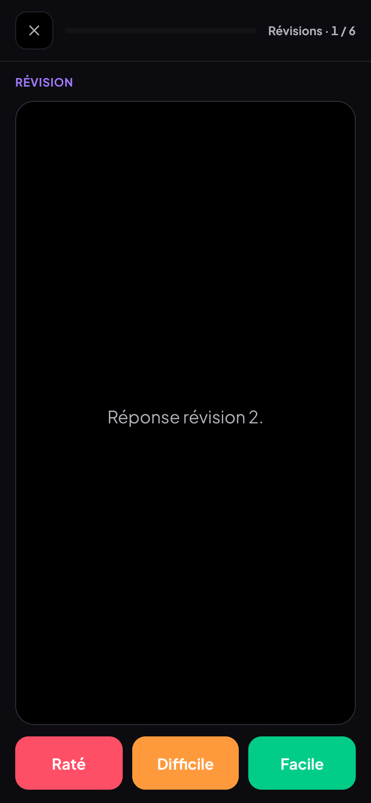 | 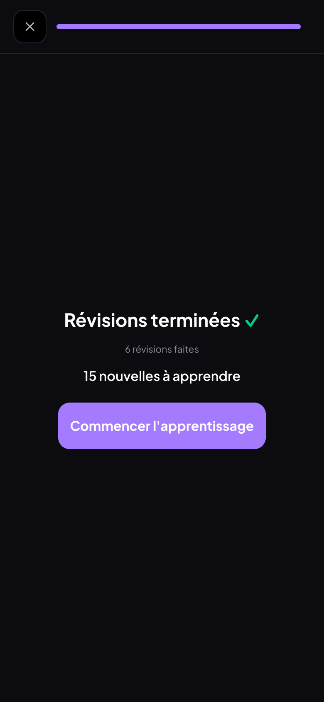 | 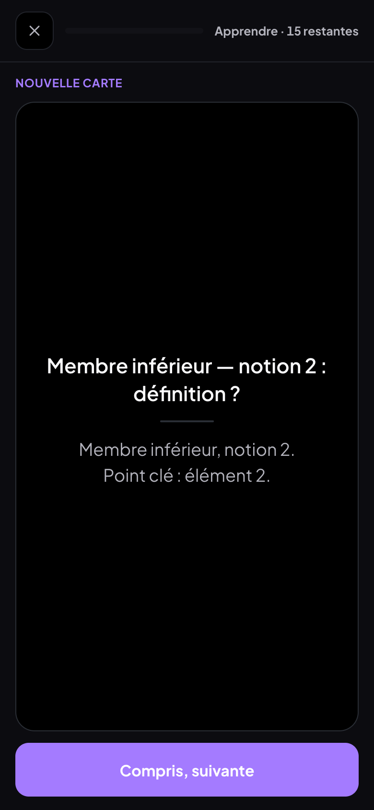 |

| Test (recto) | Test (réponse) | Synthèse | Rien à faire |
|---|---|---|---|
| 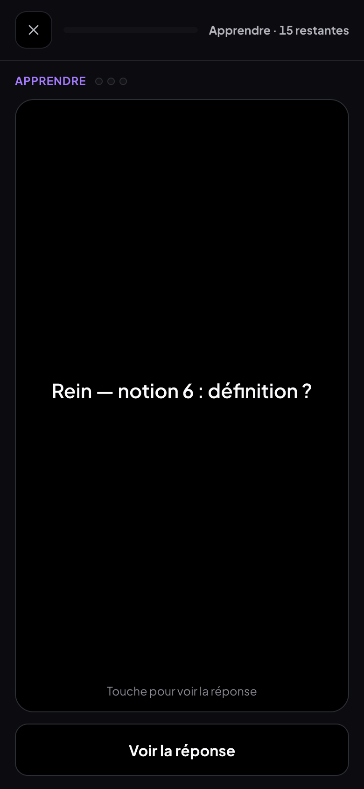 | 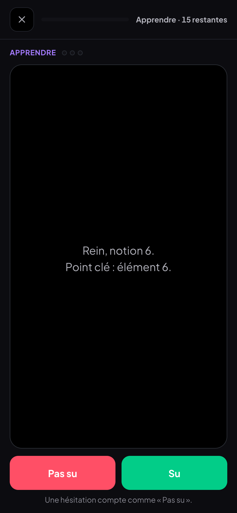 | 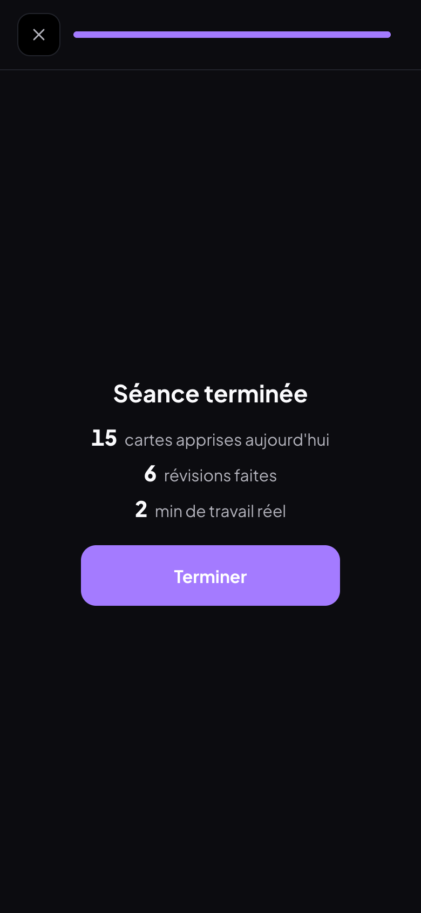 |  |

| Lendemain | À réapprendre (critère 2) | Quota 5 |
|---|---|---|
|  | 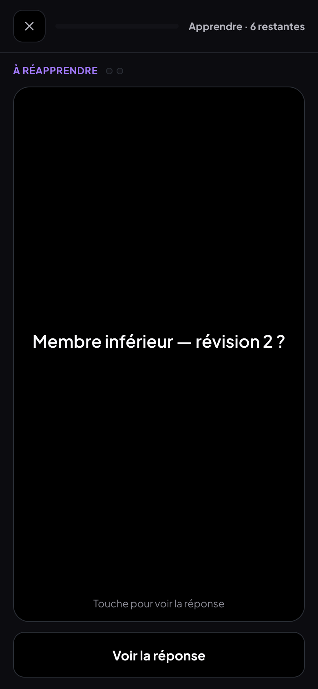 |  |

Bureau : panneau du lecteur 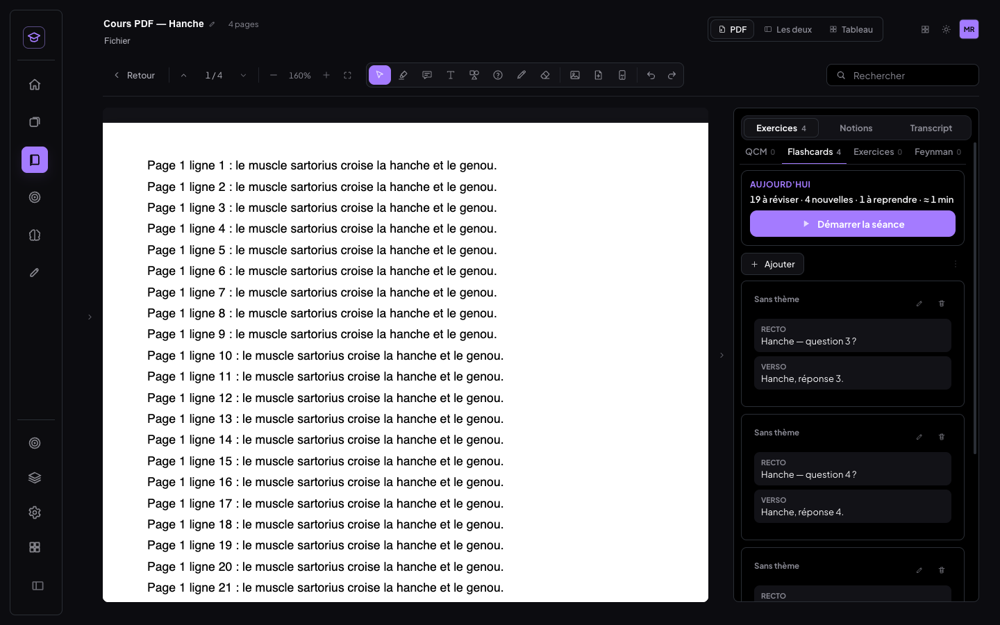 ·
séance 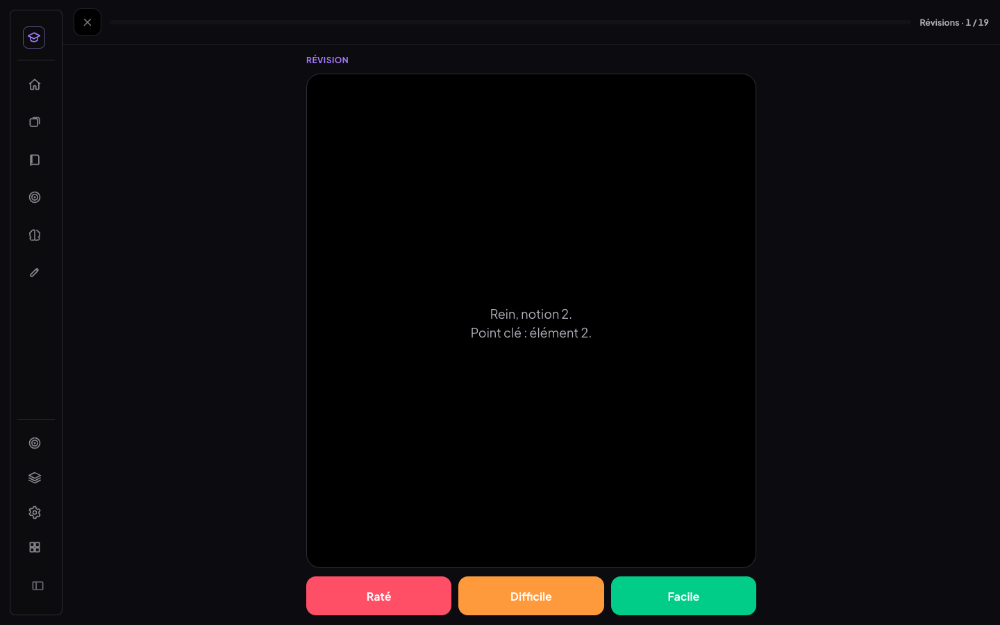 ·
réglages 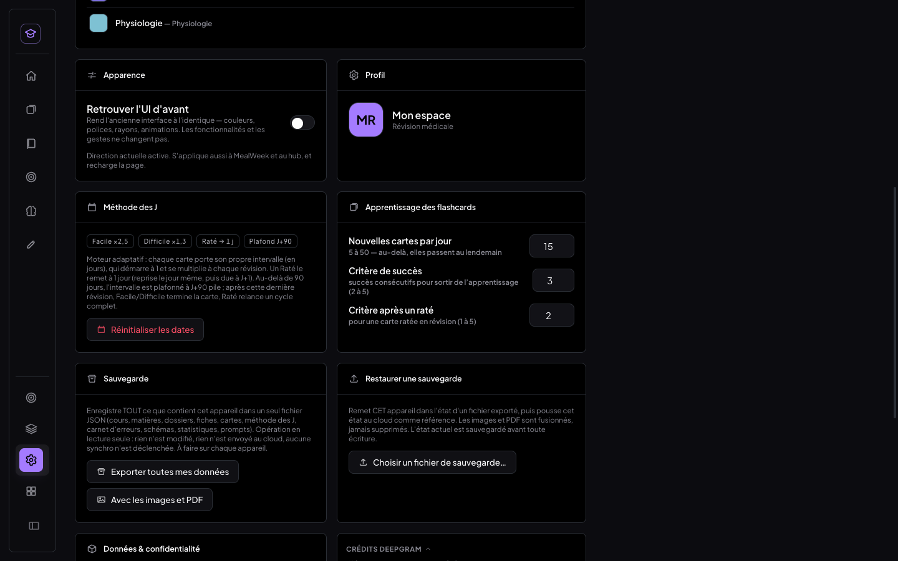

## 8. Migration SQL à appliquer

`supabase/migrations/20261006_apprentissage_flashcards.sql` — **non appliquée**, facultative,
additive : un index partiel sur `data->>'learnState'` (store `questions`) + requêtes de contrôle
en lecture seule (répartition des états, aucune flashcard vide). Les nouveaux champs sont des clés
de `data` (jsonb) : **l'app fonctionne sans ce script**, en local comme avec le cloud. À exécuter
dans Supabase → SQL Editor si tu veux pouvoir compter les états côté cloud.

## 9. Limites connues

- **Deux séances du jour** : la « série du jour » existante (QCM + flashcards en révision dues
  aujourd'hui) reste en place. Une flashcard en révision due aujourd'hui apparaît donc dans les
  deux ; la noter dans l'une la retire de l'autre (son échéance avance). Les nouvelles et les
  cartes en apprentissage ne sont **que** dans la séance. Le compteur « cartes dues aujourd'hui »
  de l'accueil baisse en conséquence.
- **Retard** : la séance inclut les flashcards en retard (« échues »), toutes ; un gros retard
  donne une grosse séance (la boîte « À rattraper » existe toujours à côté).
- **Appareil pas encore mis à jour** : il ne connaît pas l'apprentissage ; s'il note une carte en
  apprentissage dans son ancienne série, la dernière écriture gagne. Mettre à jour tous les
  appareils (rechargement de la page).
- **État de séance local** : la reprise « (8 restantes) » est par appareil ; sur un autre appareil,
  les mêmes cartes apparaissent en « à reprendre » avec leur série (synchronisée).
- **Écart de réinsertion** : position exacte à l'insertion, écart vécu ≥ position (§ 3).
- **Estimation** : « 70 s par nouvelle » compte toutes les cartes du bloc Apprendre (nouvelles et à
  reprendre) ; recalibrée dès la 3ᵉ séance terminée, par appareil.
- **Glissement des nouvelles** : calculé, pas écrit (§ 2) — la date de départ affichée d'une carte
  reportée reste sa date d'origine.
- **Tests** : faits sur des données de test réalistes, pas sur tes 1 100+ cartes réelles ; dates
  simulées en décalant `Date` dans la page ; deux appareils simulés par deux Chrome headless.
  La migration tournera chez toi au premier démarrage ; son rapport sera dans la console.

## 10. Commits

| Commit | Message |
|---|---|
| `d747681` | feat(medrevise): cycle d'apprentissage des flashcards en amont de la méthode des J |
| `731153e` | feat(medrevise): séance quotidienne des flashcards — un bouton, révisions puis apprentissage |
| `da09bdb` | chore(supabase): migration additive apprentissage des flashcards (index partiel, non appliquée) |
| (ce commit) | docs(medrevise): compte-rendu apprentissage des flashcards |

---

## v1.1 — critère 2, sans quota (08/10/2026)

### Ce qui change

| | Avant (v1) | Maintenant (v1.1) |
|---|---|---|
| Critère de sortie d'Apprendre | 3 succès consécutifs (2 après un raté en révision), deux réglages | **2 succès consécutifs**, **un seul réglage** (plage 1–5), le même après un raté |
| Carte déjà en apprentissage | gardait son critère d'entrée (`learningCriterion: 3`) | c'est le **réglage courant** qui décide pour toutes les cartes ; une carte qui a **déjà 2 succès** sort au démarrage de la séance suivante (révision J+1) **sans repasser** |
| Après « Su » du premier coup, juste après la présentation | revenait 8–10 cartes plus loin | **2ᵉ vérification en fin de paquet** (pas revue trop tôt) ; « Pas su » : 3–4 cartes plus loin, comme avant |
| Nouvelles cartes | **quota de 15/jour** (réglable 5–50) ; les suivantes « glissaient » au lendemain, avec une alerte dans l'en-tête | **aucun quota** : une carte entre dans Apprendre **le jour de sa date de départ**, comme une carte entre dans les J à sa date. C'est toi qui gères, par les dates de départ. |
| En-tête de séance | « 6 à réviser · 15 nouvelles · 1 à reprendre · ≈ 19 min » + « N nouvelles au-delà du quota… » | « **23 à réviser · 41 à apprendre · ≈ 35 min** » |
| Estimation | 70 s par nouvelle (critère 3) | **45 s par carte à apprendre** (critère 2). Les mesures de séance prises au critère 3 sont ignorées pour l'apprentissage ; la recalibration reprend dès 3 séances au critère 2. |

Ce qui ne change pas :
- la méthode des J : intervalles, notation Raté / Difficile / Facile, « Raté → réapprentissage demain » ;
- la bascule Révisions / Apprentissage en cours de séance ;
- la synchro et le schéma des cartes (champs ajoutés seulement).

**Retiré partout :**
- le réglage « Nouvelles cartes par jour » ;
- le réglage « Critère après un raté » ;
- le glissement au lendemain (`glissent`, `quotaNouvelles`) ;
- l'alerte « au-delà du quota » ;
- le « demain » forcé de « Prochaine séance ».

### Rattrapage des cartes repoussées par l'ancien quota

**L'ancien quota n'a jamais réécrit de date de départ.** Le glissement était *calculé* à chaque séance (planDuJour, v1 § 2) ; la date d'une carte reportée restait sa date d'origine. Les cartes qu'il retenait sont donc reconnaissables : en apprentissage, jamais entrées dans le bloc Apprendre, avec une date de départ **passée**.

Il n'y a **aucune date à restaurer**. Sans quota, ces cartes entrent dans Apprendre **dès la prochaine séance**, avec leur date d'origine intacte.

La migration `apprentissage-flashcards-v1.1` (lib/migrate.js) ne réécrit **aucune carte**. Une fois par appareil, au démarrage :
- elle **compte** ces cartes (« rattrapées ») et celles qui ont déjà 2 succès (« sorties sans repasser ») ;
- elle passe le réglage synchronisé de 3 à 2 et retire les champs du quota (sauvegarde `pre-apprentissage-flashcards-v1.1-reglages`) ;
- elle enregistre ce bilan.

Le bilan s'affiche dans **Réglages → Apprentissage des flashcards** et dans la console (`[MedRevise] migration apprentissage-flashcards-v1.1`).

**Nombre de cartes rattrapées :**
- **Jeu de test : 5 cartes rattrapées** (départs du 03 au 07/10, jamais entrées) et **2 cartes à série 2 sorties sans repasser**.
  - Les 5 sont entrées dans Apprendre à la séance suivante, date d'origine conservée.
  - Les 2 sont passées en révision J+1 au démarrage de la séance.
  - Les 30 nouvelles du jour sont toutes entrées, aucune repoussée.
- **Tes données réelles :** je n'y ai pas accès (tests jamais sur le cloud). Le nombre exact s'affichera dans Réglages → Apprentissage des flashcards au premier démarrage de cette version sur chaque appareil (« N cartes retenues par l'ancien quota sont revenues dans Apprendre »).

### Tests (Chrome headless, Vite local, faux Supabase — jamais le cloud)

Le jeu de test a été créé par le chemin normal de l'app (`appendItemsToFiche`, date de départ du jour) :
- 30 nouvelles cartes sur 2 cours ;
- 5 cartes « retenues par l'ancien quota » (départ passé, jamais entrées) ;
- 2 cartes à série 2 et 1 à série 1 (critère d'entrée 3) ;
- 3 révisions dues ;
- l'ancien réglage { quota 15, critère 3, critère après raté 2 }.

La migration a été rejouée au rechargement, comme chez toi.

| Scénario | Résultat |
|---|---|
| Moteur (`node scripts/tests-apprentissage/test-v11.mjs`) : critère 2 et plage 1–5, anciens champs ignorés, 30 (et 60) nouvelles toutes dans Apprendre, départ demain → demain, sortie au 2ᵉ succès, raté puis 2 succès, critère d'entrée 3 → sort à 2, série 2 → sortie sans repasser, raté en révision → réapprentissage demain (critère 2), fin de paquet / 3–4 cartes, estimation, prochaine séance | ✅ 17/17 |
| Migration : rapport { rattrapées 5 (dès le 03/10), sorties sans repasser 2 } ; réglage 3 → 2, quota retiré | ✅ |
| En-tête (bureau) : « **3 à réviser · 36 à apprendre · ≈ 28 min** » (30 nouvelles + 5 rattrapées + 1 en cours) ; boutons « Révisions (3) · Apprentissage (36) » ; aucune trace du quota | ✅ |
| Réglages : un seul critère (2, plage 1–5) ; plus de « Nouvelles cartes par jour » ni de « Critère après un raté » ; bilan du passage | ✅ |
| Démarrage de séance : les 2 cartes à série 2 → révision J+1, absentes de la file (36 cartes) | ✅ |
| Révisions J : Facile / Raté / Difficile comme avant (intervalles 3 → 8 et 3 → 4) ; Raté → réapprentissage demain, critère 2 ; bascule vers Apprendre puis retour « Révisions · 2 / 3 » | ✅ |
| Bloc Apprendre : **les 36 cartes sortent à 2 succès consécutifs** (la série 1 existante au 1er), y compris 3 cartes ratées une fois puis réussies 2 fois | ✅ |
| Réussie du premier coup après présentation → **2ᵉ vérification en fin de paquet** | ✅ 33/33 |
| 38 cartes sorties, toutes en révision le lendemain | ✅ |
| **Lendemain** (horloge +1 j) bureau : « 38 à réviser · 1 à apprendre · ≈ 10 min » ; les 38 dans les révisions, notées comme avant | ✅ |
| **Synchro → téléphone** (390 px, profil neuf) : lendemain « 35 à réviser · 1 à apprendre · ≈ 10 min » (les 3 révisions faites sur l'ordinateur sont arrivées) ; aujourd'hui « Rien à faire · Prochaine séance : vendredi 9 octobre » ; aucune trace du quota | ✅ |
| **Téléphone, séance au doigt** : 3 nouvelles cartes → « 3 à apprendre · ≈ 2 min » ; apprises en 6 « Su » (2 chacune), retour en fin de paquet après un premier coup, révision demain | ✅ |
| MealWeek : accueil avant / après identique octet pour octet ; rien dans `src/mealweek/` ni `src/shared/` | ✅ |
| Erreurs console | aucune |
| `npm run build` | ✅ |

**Limite :** un appareil pas encore mis à jour qui réenregistre ses réglages renverrait l'ancien objet (critère 3). La v1.1 ignore les champs du quota, mais un critère 3 ainsi revenu serait respecté. Remets 2 dans les Réglages si cela arrive.

| En-tête (bureau) | Réglages | Lendemain (bureau) |
|---|---|---|
| 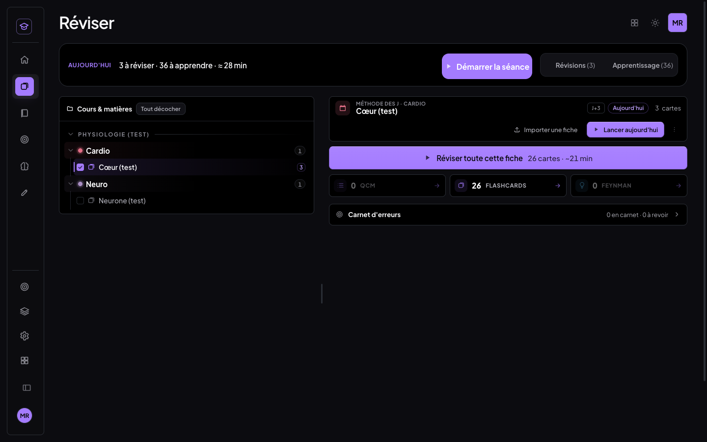 | 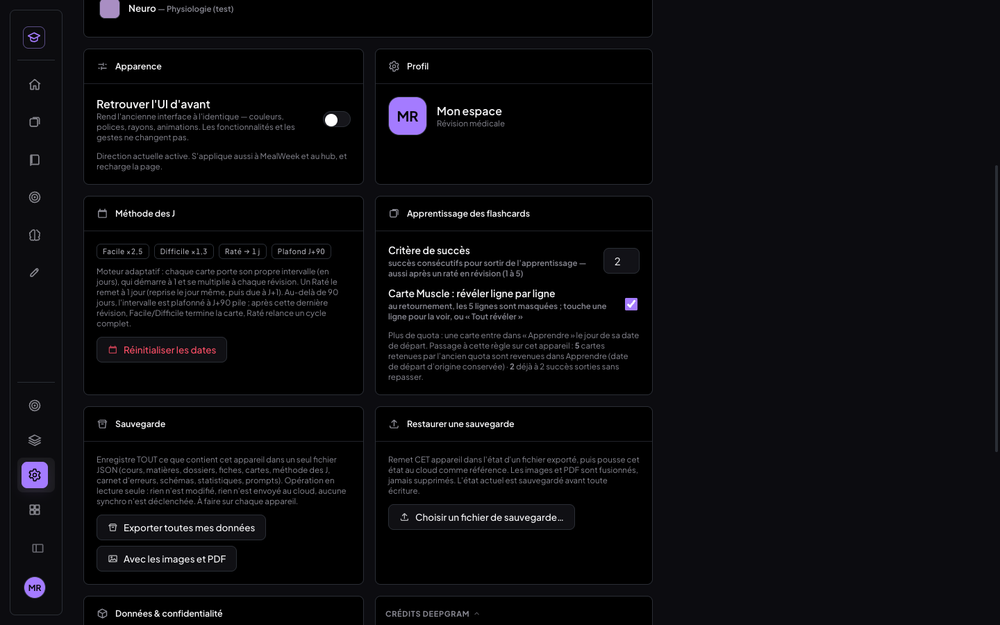 | 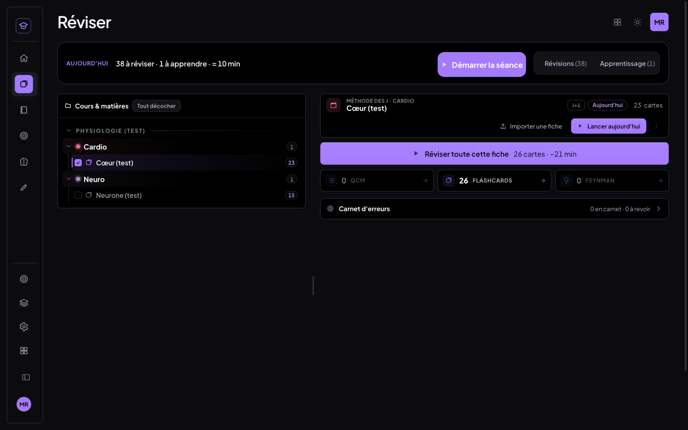 |

| Téléphone : 3 à apprendre | Téléphone : lendemain |
|---|---|
|  | 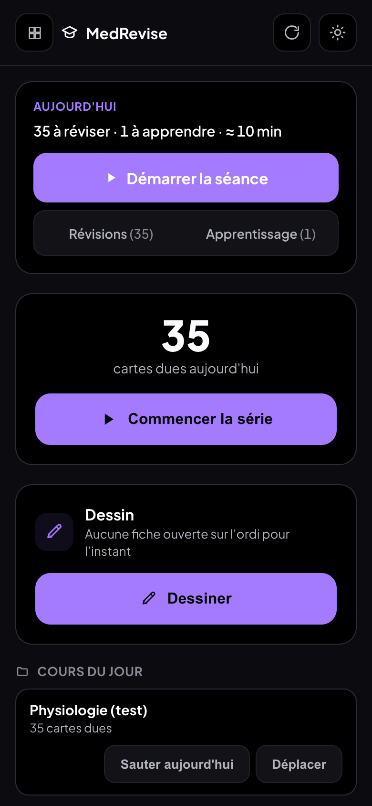 |

### Commits v1.1

| Commit | Message |
|---|---|
| `0a25988` | feat(medrevise): apprentissage des flashcards v1.1 — critère 2, plus aucun quota de nouvelles cartes |
| `c51e7f1` | docs(medrevise): compte-rendu v1.1 — critère 2, sans quota |
