# Flashcards à texte long sur mobile — compte-rendu (06/10/2026)

Demande : « le texte est coupé en bas et les sauts de ligne ne sont pas respectés ». Reproduire
d'abord, puis corriger. **Les deux problèmes sont confirmés**, et le même défaut, en plus grave,
existait sur la session bureau / tablette.

Banc de test : Chrome headless isolé piloté en CDP (vrais événements tactiles, souris, clavier),
Vite local, **faux Supabase local** (aucune écriture dans le vrai cloud). L'extension Chrome
n'étant pas utilisée ici, les formats « device toolbar » sont émulés par
`Emulation.setDeviceMetricsOverride` (mobile, DPR 2, orientation) et le tactile par
`Emulation.setTouchEmulationEnabled`. Cours de test créé pour l'occasion (le contenu des cartes
existantes n'est jamais modifié) :

| Carte | Recto | Verso |
|---|---|---|
| Courte | « Innervation du sartorius ? » (26 car.) | « Nerf fémoral. » |
| Longue | 683 car., 4 paragraphes + liste à tirets, 11 `\n`, finit par « FIN DU RECTO » | 724 car., 6 paragraphes, 12 `\n`, finit par « FIN DU VERSO » |
| Image + texte | image (aux deux faces) + 2 lignes | 2 lignes |

Formats : iPhone SE 375 × 667, iPhone 14 390 × 844, Pixel 7 412 × 915 (portrait **et**
paysage), tablette 768 × 1024 et 1024 × 768. Le shell mobile (`MobileSession.jsx`) s'affiche
sous 760 px de large ou sous 500 px de haut en tactile (téléphone en paysage) ; la tablette
affiche la session bureau (`Session.jsx`).

---

## 1. Diagnostic (code d'avant, mesures dans la page)

### Stockage des sauts de ligne

Les cartes stockent du **texte brut avec des `\n`** (ni ` `, ni markdown) — vérifié sur les
enregistrements (`"…complet.\n\nPréciser :\n- son origine…"`). `Tex` rend ce texte dans des
`` (formules KaTeX à part) ; rien ne convertit les `\n`.

### Ce qui se produisait

| Constat | Mesure | Cause exacte |
|---|---|---|
| **Sauts de ligne aplatis** (mobile ET bureau) | `white-space: normal` ; 11 `\n` dans la carte → 0 rendu ; paragraphes et liste fondus en un bloc | aucune règle `white-space` sur `.mrm-flash-text` / `.mrm-flash-back` (mobile) ni `.ff-text` / `.ff-imgq` (bureau) |
| **Mobile : bas de carte et boutons sous le pli** | SE : carte longue de 97 à 712 px pour un écran de 667 ; verso : « Facile » à 720 px (2/3 boutons visibles) | la carte grandit avec son texte (`min-height`, aucune hauteur maximale) et pousse tout dans la page ; rien n'indique qu'il faut défiler |
| **Mobile paysage : aucun bouton visible** | 667 × 375, 844 × 390, 915 × 412 : **0/3** boutons de notation à l'écran sur le verso ; carte image sous le pli | même cause + 3 boutons de 56 px empilés |
| Mobile : texte réellement rogné ? | **non** — la page défile au doigt (73 px mesurés), la dernière ligne est atteignable | — l'impression « coupé » vient de la carte qui sort de l'écran sans indice |
| **Bureau / tablette : texte réellement rogné** | 768 × 1024 : contenu de 74 à 580 px pour une carte de 177 à 477 → les **3 premières lignes passent sous l'en-tête**, le bas recouvre « Clique pour révéler » | faces en `position: absolute; inset: 0` dans une carte de `min-height: 300px`, contenu centré (`justify-content: center`) : un contenu plus haut que la carte déborde des deux côtés |
| Verso mobile trop petit | 14 px | `.mrm-flash-back { font-size: 14px }` |
| Image | `object-fit: contain`, jamais déformée | — (pas de défaut) |
| Geste de swipe | aucun dans la session mobile (tap = retourner, boutons = noter) | — rien à désarmer |
| Retournement qui change la hauteur | oui (recto 615 px → verso 415 px sur SE) | conséquence de la hauteur au contenu |

| Avant — recto long (SE) | Avant — verso long (SE) | Avant — verso paysage (SE) | Avant — tablette 768 |
|---|---|---|---|
| 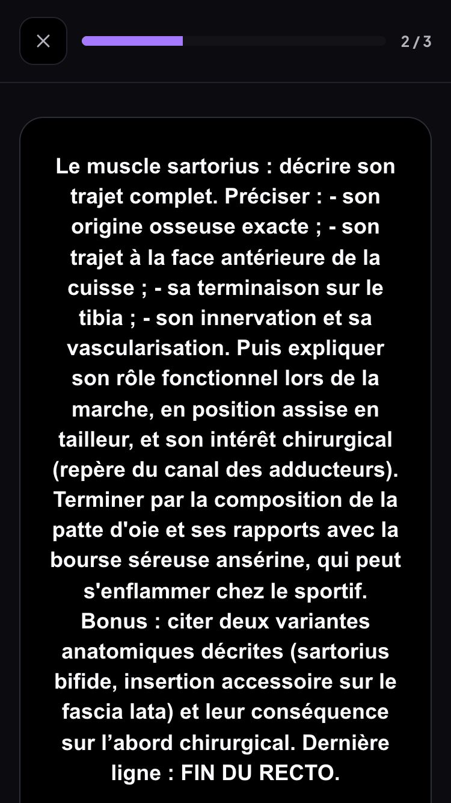 | 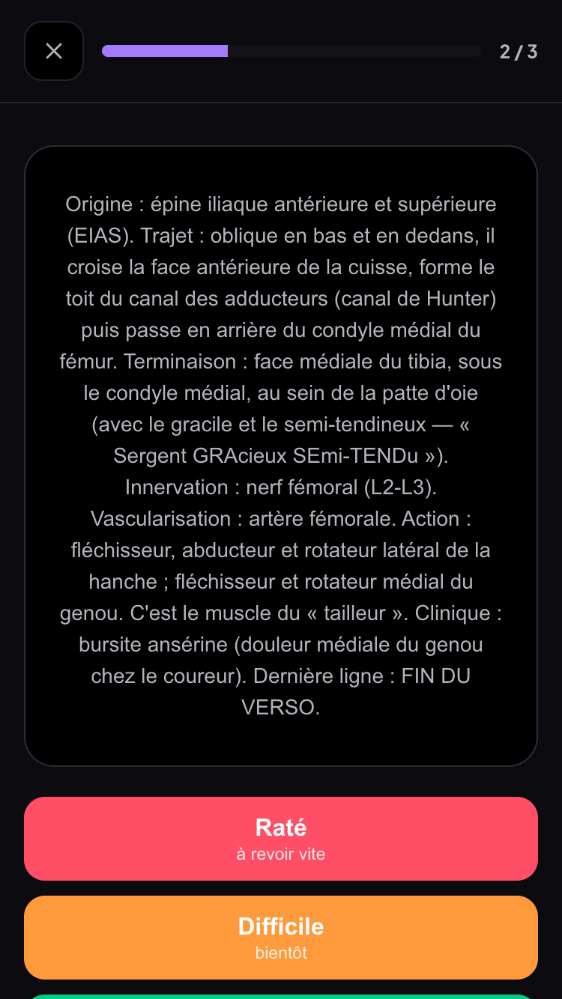 | 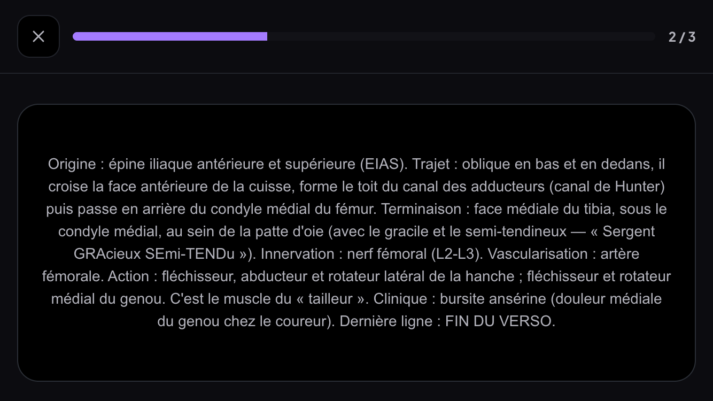 | 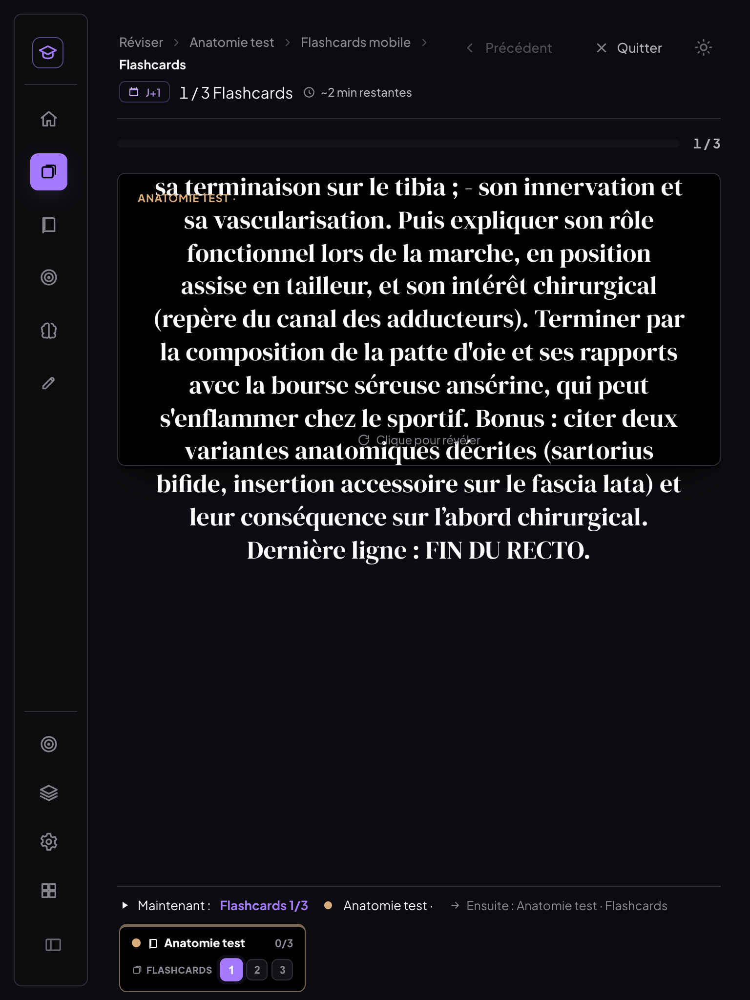 |

---

## 2. Correctif

- **Sauts de ligne** : `white-space: pre-wrap` (+ `overflow-wrap: anywhere`) sur le texte des
  faces, de l'indice et de « À retenir », **mobile et bureau** (même règle partout). Aucun
  contenu de carte modifié : c'est le rendu qui change.
- **Zone défilante** (`components/ZoneDefilante.jsx`, commune mobile + bureau) : le texte défile
  **à l'intérieur** de la carte ; un **dégradé discret** en bas tant qu'il reste à lire (mesuré au
  défilement et par `ResizeObserver`, plus une mesure immédiate au montage). Le contenu court
  reste centré par des **marges automatiques** — un contenu long commence en haut et n'est jamais
  rogné au-dessus (ce que faisait `justify-content: center`).
- **Mobile, écran « carte »** (flashcard à retourner seulement — le QCM et le cloze en saisie,
  avec leurs champs et le clavier, gardent le défilement de page) :
  - l'app fait **exactement la hauteur visible** : `height: 100dvh` (repli `100vh` pour les
    navigateurs sans `dvh`), `overflow: hidden` ;
  - la carte prend tout l'espace entre l'en-tête et la barre de notation ; marges latérales et
    basse = `env(safe-area-inset-*)` ;
  - la **barre de notation** est en bas, toujours visible ; si elle s'allonge (carnet d'erreurs,
    clavier ouvert) elle défile elle-même et la carte garde au moins 120 px ;
  - **image** : hors de la zone défilante, contenue (`object-fit: contain`, hauteur
    `min(220px, 30dvh)`), le texte défile en dessous ;
  - **paysage** (≤ 500 px de haut) : notation sur une ligne (48 px), en-tête resserré, image à
    côté du texte ;
  - **taille adaptative** selon la longueur (recto + indice, verso + « À retenir ») : ≤ 90 car.
    → 22 px (verso 19), ≤ 260 → 19 px (verso 17), au-delà → 17 px (verso **16 px**, minimum),
    aligné à gauche pour les textes longs. Le verso n'est plus jamais en 14 px.
- **Bureau / tablette** : faces superposées dans **une cellule de grille** au lieu de
  `position: absolute` — la carte prend la hauteur de la plus haute face, plafonnée à
  `max(300px, 100dvh − 420px)`, et le surplus défile dans la face. Texte long : 21 px au recto
  (au lieu de 26), 17 px au verso, aligné à gauche. **Cartes courtes : rendu inchangé** (voir § 3).
- **Défaut trouvé en testant, antérieur au chantier** : après « Raté », la carte qui revient en
  fin de série (même id) **réapparaissait déjà retournée** sur mobile, réponse visible —
  `key={item.id}` gardait l'état du composant. Clé = position dans la série + id (le bureau
  utilisait déjà l'index).

---

## 3. Tests (code corrigé)

### Matrice : 8 formats × 3 cartes × recto/verso (48 mesures)

| Format | Sauts de ligne | Carte dans l'écran | Texte long | Boutons de notation | Police |
|---|---|---|---|---|---|
| SE 375 × 667 | ✅ 11→11 / 12→12 | ✅ 97–655, page fixe | ✅ défile dans la carte, dégradé, dernière ligne visible sans rien dessus | ✅ 3/3 | 22 / 19 · 17 / 16 |
| iPhone 14 390 × 844 | ✅ | ✅ 97–832 | ✅ (recto tient sans défiler, verso défile) | ✅ 3/3 | idem |
| Pixel 7 412 × 915 | ✅ | ✅ 97–903 | ✅ | ✅ 3/3 | idem |
| SE paysage 667 × 375 | ✅ | ✅ 73–363 | ✅ | ✅ **3/3** (avant : 0/3) | idem |
| iPhone 14 paysage 844 × 390 | ✅ | ✅ | ✅ | ✅ **3/3** (avant : 0/3) | idem |
| Pixel 7 paysage 915 × 412 | ✅ | ✅ | ✅ | ✅ **3/3** (avant : 0/3) | idem |
| Tablette 768 × 1024 | ✅ | ✅ 177–781, plus de débordement | ✅ défile dans la face | ✅ 3/3 | 21 / 17 |
| Tablette 1024 × 768 | ✅ | ✅ 154–502 | ✅ | ✅ 3/3 | 21 / 17 |

Image + texte : image contenue (`contain`), 305 × 191 (SE) à 355 × 222 ; en paysage, à côté du texte.

### Gestes réels au doigt (SE)

| Test | Résultat |
|---|---|
| Défilement vertical dans la carte (recto) | ✅ la zone défile (0 → 160 px, fin atteinte, dégradé retiré), **la carte ne se retourne pas**, la page ne bouge pas |
| Glissé horizontal sur la carte | ✅ rien ne se passe (pas de geste de swipe dans la session mobile) |
| Tap sur la carte | ✅ retournement → verso, zone en haut, dégradé affiché |
| Défilement dans le verso | ✅ 203 px, toujours le verso |
| « Raté » (2ᵉ échec) → carnet d'erreurs, **clavier virtuel ouvert** (viewport 667 → 377 px) | ✅ en-tête visible, carte réduite à 120 px, champ visible et focalisé, « Ajouter au carnet » atteignable ; raison enregistrée ; recto 683 / verso 724 car. inchangés |
| Carte ratée qui revient en fin de série | ✅ s'affiche côté **recto** (avant le correctif : déjà retournée) |

### Non-régression

| Test | Résultat |
|---|---|
| Bureau 1440 × 900, cartes courtes | ✅ code d'avant (`Session.jsx`, `etudes.css` de HEAD remis temporairement) contre code corrigé : recto court **1 / 255 au plus** sur 3 pixels, verso court 1 / 255 sur 240 pixels (anticrénelage) — identiques à l'œil |
| Bureau, carte image + texte | seule différence : le saut de ligne saisi (« schéma. ⏎ Quels muscles… ») est maintenant respecté — même défaut qu'au mobile |
| Bureau : retourner, noter (3 cartes) | ✅ |
| Mobile : QCM | ✅ écran inchangé (défilement de page), validation, notation |
| Mobile : flashcard à trous, mode Saisie | ✅ écran inchangé ; champ visible clavier ouvert ; « Valider » → « Continuer » |
| Création de cartes | code inchangé (`appendItemsToFiche`, formulaires) ; cartes ajoutées par ce chemin rendues correctement |
| Synchro (faux Supabase) | ✅ notations poussées (`medrevise_push`) ; la carte longue au cloud : 683 car., 11 `\n` intacts |
| Console | ✅ 0 erreur |
| MealWeek / `src/shared/` | ✅ aucun fichier modifié ; classes `.flash-*`, `.mrm-*`, `.zd*` absentes de MealWeek, du hub et de `src/shared/` |

| Après — recto long (SE) | Après — verso long (SE) | Après — verso paysage (SE) | Après — tablette 768 |
|---|---|---|---|
| 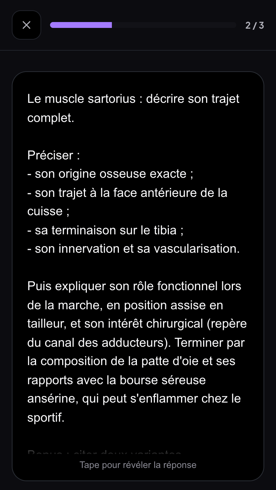 | 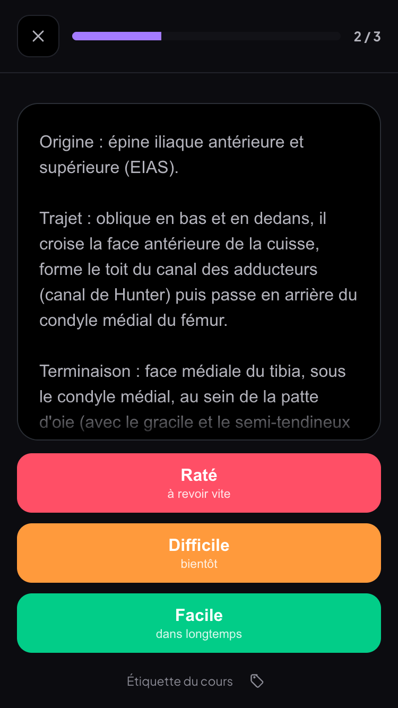 | 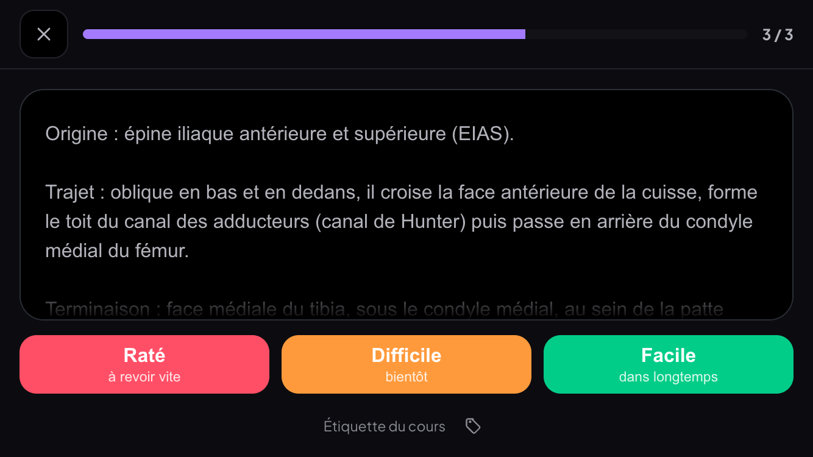 | 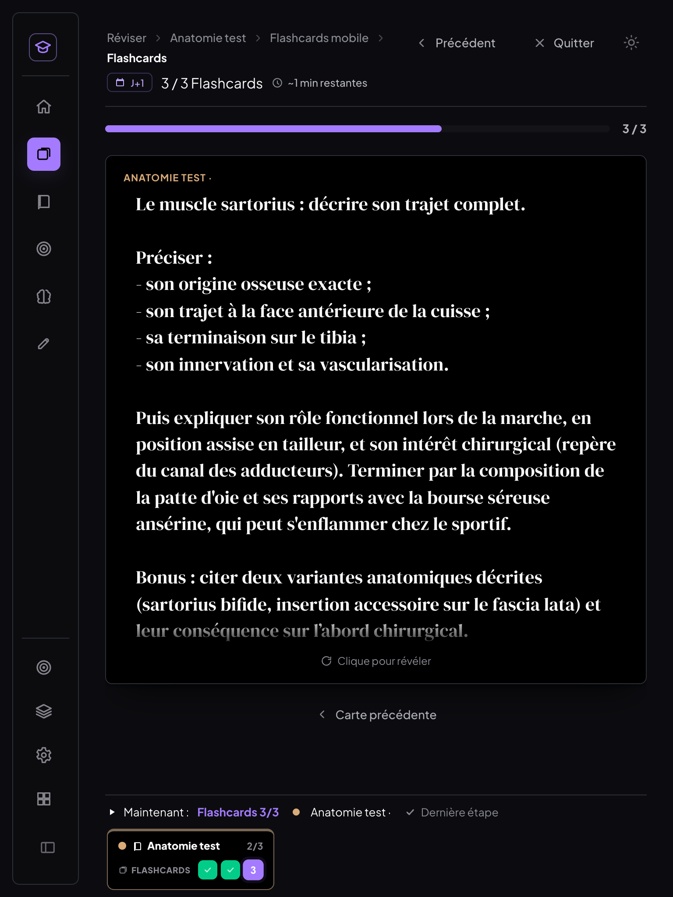 |

| Image + texte, paysage — avant | après | Carnet + clavier ouvert (SE) |
|---|---|---|
| 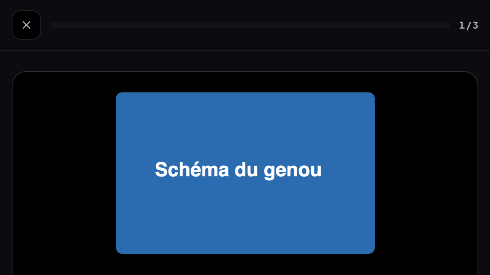 | 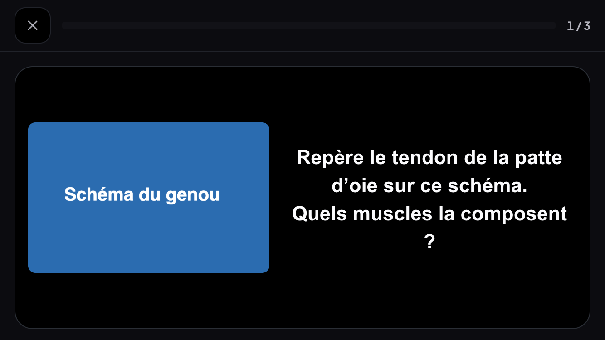 | 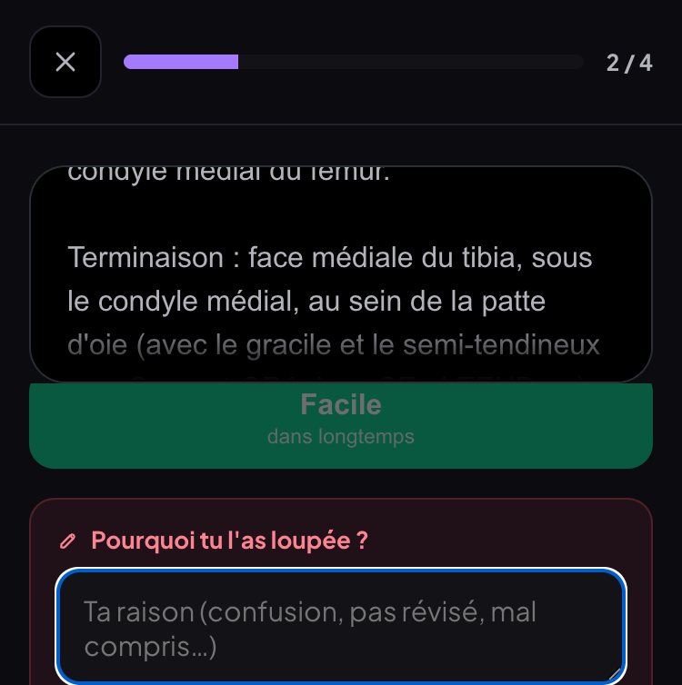 |

---

## 4. Limites

- **Émulation, pas un vrai téléphone** : Chrome headless émule les formats, le tactile et
  l'orientation ; il n'a ni encoche ni barre d'accueil (`safe-area` = 0 ici) et pas de vrai
  clavier virtuel (simulé en réduisant la hauteur visible de 290 px). À vérifier sur l'iPhone :
  marge basse avec la barre d'accueil, clavier réel sur le carnet d'erreurs.
- **Safari iOS** : l’unité `dvh` est prise en charge depuis iOS 15.4 ; avant, repli sur
  `100vh` (la barre d'adresse peut alors masquer le bas de l'écran).
- **Bureau** : la hauteur maximale de la carte (`100dvh − 420px`, 300 px minimum) est un réglage
  fixe ; sur une fenêtre très basse, un texte long défile dans une carte de 300 px.
- **Paysage avec image** : l'indication « Tape pour révéler » est masquée pour laisser la place
  au texte (le tap reste actif).
- Hors périmètre, non modifiés : l'aperçu de la carte dans le panneau du lecteur et la carte
  d'ajout (`CarteAjoutFlashcard`) — ils ne sont pas des écrans de révision.

---

## 5. Commits

| Commit | Message |
|---|---|
| `3489c2f` | fix(medrevise): flashcards à texte long — sauts de ligne respectés, texte qui défile dans la carte, notation toujours visible (mobile, tablette, bureau) |
| (ce commit) | docs(medrevise): compte-rendu flashcards mobile (diagnostic, correctif, tests) |
