# Éditeur de flashcard et surlignage — quatre corrections (08/10/2026)

Quatre bugs corrigés : zone image, thème de fiche, touche Entrée, surlignage en mode Sélection.

**Conditions de test**
- Chrome headless piloté en CDP, avec de vrais événements souris, clavier et tactiles (`Input.dispatch*`).
- Serveur Vite local avec `VITE_SUPABASE_URL` vide : **aucune écriture Supabase**. On a vérifié qu'aucune requête `supabase` ne part.
- Données de test semées dans une base IndexedDB isolée : un cours PDF, une fiche HTML, des documents.
- Largeurs testées :
  - bureau 1 440 px ;
  - tablette 1 024 px, et 820 px avec le tactile émulé ;
  - téléphone 390 px tactile, pour le rendu de révision.
- « Mobile » : le shell téléphone (< 760 px) n'a **pas** d'éditeur de flashcard. L'éditeur s'y teste donc en tablette tactile 820 px. Le téléphone sert à vérifier le rendu à la révision.
- Les captures sont dans `docs/img/flashcards-surlignage/`.

---

## 1. Zone image superposée aux champs en modification

**Symptôme** : en modification, la zone « Image (optionnelle) » s'affichait par-dessus « Indice ».

**Cause** : une collision de nom de classe CSS.
- Le conteneur du champ image (`FlashcardImage.jsx#ChampImageFlashcard`) portait la classe `fc-champ`.
- Le 07/10, la fenêtre de création commune (commit `afab594`, `fenetre-creation.css`) a défini une règle globale `.fc-champ` pour ses champs de saisie : `height: 40px; padding: 0 12px; border…`.
- Le conteneur de la zone image était donc **écrasé sur 40 px**, et son contenu débordait sur les champs suivants.
- Mesures relevées avant le correctif :
  - 267 px de débordement sur « Indice » quand une image est attachée ;
  - 45 px quand seule la zone de dépôt est affichée.
- Pourquoi la création semblait correcte : la carte d'ajout du panneau masque ce champ (`sansImage`) et passe par son propre volet « Image ». Le champ image n'est affiché qu'en **modification**, et dans la fenêtre « Ajouter un item ».

**Correctif** : la classe devient `fci-champ`. La zone image retrouve sa place dans le flux :
- image attachée : aperçu de l'image existante, « Afficher au » (Recto / Verso / Les deux), **Remplacer** et **Retirer l'image** ;
- pas d'image : la zone de dépôt (« Ajouter une image — ou colle-la (⌘V / Ctrl+V), ou glisse-la ici »).

On a vérifié qu'aucune autre classe `fc-*` n'entre en collision :
- `fc-ligne` et `fc-etiquette` sont réutilisées volontairement par `TreeFileDrop` ;
- toutes les autres sont propres à la fenêtre de création.

| Test (chevauchement mesuré entre chaque champ et le suivant) | Avant | Après |
|---|---|---|
| Carte avec image, modification, 1 440 px | ❌ 267 px sur Indice | ✅ aucun |
| Carte sans image, modification, 1 440 px | ❌ 45 px sur Indice | ✅ aucun |
| Les deux cartes, 1 024 px et 820 px | — | ✅ aucun |
| Volet Image : coller une image (⌘V) → recto/verso → ⌘Entrée → enregistrée (`imageId`, place recto, thème de la fiche) | — | ✅ 1 440 px et 820 px tactile |
| Rouvrir cette carte en modification : aperçu chargé, liens « Remplacer » / « Retirer l'image », aucun chevauchement | — | ✅ 1 440 px et 820 px tactile |

Captures :

| Avant (1 440 px) | Après (1 440 px) | Après (carte sans image, 820 px) |
|---|---|---|
| 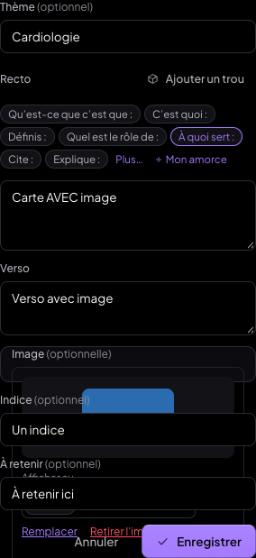 | 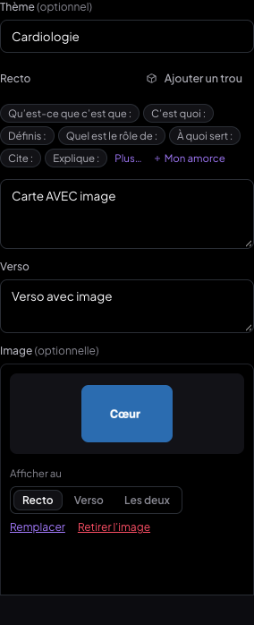 | 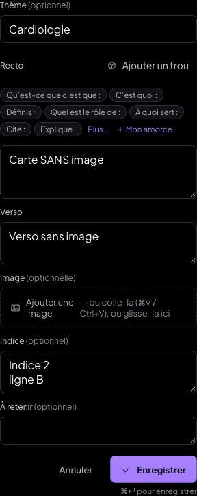 |

| Avant, sans image | Carte créée puis rouverte (1 440 px) | Idem, 820 px tactile |
|---|---|---|
| 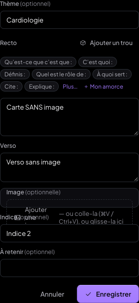 | 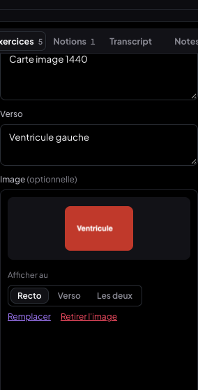 | 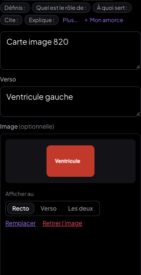 |

---

## 2. Le thème de la fiche ne s'appliquait plus à toutes ses cartes

**Cause (régression du commit `2d62bcc`, 05/10, « panneau latéral du lecteur en 3 modes »)** :
- Le comportement « thème auto par fiche » (commit `e2b5217`, 04/10) existait toujours dans le code :
  - le champ `fiche.themeFlashcards` ;
  - le pré-remplissage des formulaires ;
  - le thème posé par `appendItemsToFiche`.
- Mais `2d62bcc` a retiré la ligne « Thème auto : … » du haut de l'onglet Flashcards. Il l'a placée derrière le menu « ⋯ » (`voirTheme`, **fermé par défaut**, refermé à chaque changement d'onglet).
- Seul restait visible le champ « Thème » de **chaque carte**. Ce champ ne vaut que pour la carte en cours.
- Sur une fiche sans thème, saisir un thème sur une carte ne le donnait donc qu'à elle. On ne trouvait plus l'endroit où le régler pour toute la fiche.
- Défaut secondaire : la carte d'ajout du panneau (`aa9e915`, toujours montée) lisait le thème de la fiche **une seule fois**, au montage. Un thème défini ou changé pendant que la carte était ouverte n'était pas repris.

**Correctif** :
- La ligne **« Thème auto : X — Modifier »** est de nouveau **toujours visible** en tête de l'onglet Flashcards. L'entrée du menu « ⋯ » est retirée.
- **Pré-remplissage** : chaque nouvelle carte reçoit le thème de la fiche (formulaire texte et volet Image). Le champ suit un changement du thème de la fiche, sauf si on l'a retouché.
- **Retouche ponctuelle** : changer le thème d'une carte ne vaut que pour elle.
  - Une aide l'indique : « Pour cette carte seulement — la fiche garde « Cardiologie ». Remettre ».
  - La carte suivante repart du thème de la fiche, qui ne change pas.
- **Fiche sans thème** : le premier thème saisi à la main sur une carte devient celui de la fiche. L'aide le dit avant l'enregistrement. Ce cas recolle à l'attente « thème auto par fiche ». Un thème de fiche déjà posé n'est **jamais** remplacé ainsi : il se change dans la ligne « Thème auto ».
- **Changer le thème de la fiche** propose **« N cartes avaient l'ancien thème « X » — Appliquer aux N cartes… »**.
  - L'application passe par une confirmation.
  - Elle n'agit que sur les cartes qui portaient exactement l'ancien thème : une carte à thème retouché ne change pas.
  - La progression (méthode des J) est conservée.
  - Le bouton **Annuler** reste disponible juste après.
- L'ancienne proposition « N cartes sans thème — Leur appliquer… » reste disponible.

| Tests (`theme.mjs`, `adopt.mjs`) | Résultat |
|---|---|
| Ligne « Thème auto : Cardiologie — Modifier » visible dès l'onglet Flashcards | ✅ |
| 3 cartes créées : formulaire pré-rempli « Cardiologie » à chaque fois → les 3 cartes ont « Cardiologie » | ✅ |
| Thème d'une carte changé en « Rythmologie » : la carte a « Rythmologie », la fiche garde « Cardiologie », le formulaire suivant est pré-rempli « Cardiologie » | ✅ |
| Fiche passée à « Cardio-vasculaire » : proposition « 8 cartes avaient l'ancien thème « Cardiologie » », confirmation, 8 cartes passées, « Rythmologie » inchangée | ✅ |
| « Annuler » : les 8 cartes reviennent à « Cardiologie » | ✅ |
| Fiche sans thème : carte créée avec « Neurologie » (Ctrl+Entrée) → la fiche reçoit « Neurologie », la carte suivante est pré-remplie | ✅ |

| Ligne toujours visible | Retouche ponctuelle | Proposition | Confirmation |
|---|---|---|---|
| 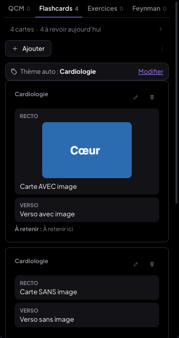 | 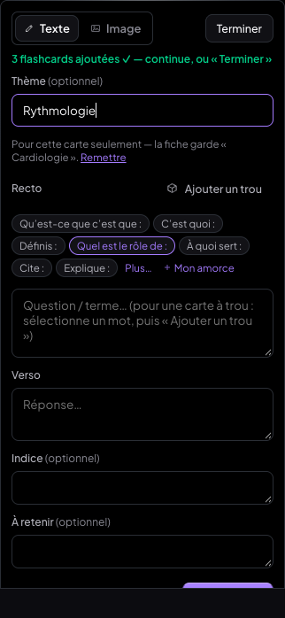 | 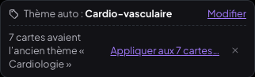 | 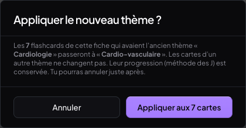 |

---

## 3. Entrée = retour à la ligne, ⌘Entrée = enregistrer

**Cause** :
- La carte d'ajout du panneau (`aa9e915`, option `clavier` de `FlashcardForm`) et son volet Image interceptaient **Entrée** pour « Ajouter ».
- Seul Maj+Entrée donnait un retour à la ligne.
- En tapant un verso en plusieurs paragraphes, le premier Entrée enregistrait la carte. La suite partait dans le recto de la carte suivante. Capture « avant » : « Paragraphe deuxParagraphe trois » collés dans le recto suivant.
- Indice et À retenir étaient des champs d'une seule ligne.

**Correctif**, dans tous les formulaires de flashcard (ajout dans le panneau, volet Image, modification, fenêtre « Ajouter un item ») :
- **Entrée** insère un retour à la ligne (comportement natif) ;
- **⌘Entrée / Ctrl+Entrée** enregistre ;
- **Échap** annule ;
- Tab passe du recto au verso, comme avant ;
- **Indice** et **À retenir** deviennent des zones de texte de plusieurs lignes, qui démarrent sur une ligne ;
- « ⌘↵ pour enregistrer » (« Ctrl+↵ » hors Mac) est affiché discrètement **sous** les boutons, pour tenir dans un panneau de 270 px.

Les retours à la ligne sont conservés tels quels : seuls les bords du texte sont rognés. Ils sont rendus à la révision avec `pre-wrap`. Ce rendu existait déjà (`.sfc-verso`, `.ff-text`…) et s'applique maintenant aussi :
- à la liste des cartes du panneau ;
- à l'aperçu (`.pis-face`).

| Tests (`entree.mjs`, `edit-clavier.mjs`, `revision.mjs`, `mob-rev.mjs`) | Avant | Après |
|---|---|---|
| 3 paragraphes au verso avec Entrée : nombre de cartes | ❌ 2 → 3 (enregistrée au 1er Entrée) | ✅ inchangé |
| Contenu du champ Verso | ❌ vide (texte parti ailleurs) | ✅ `"Paragraphe un\nParagraphe deux\nParagraphe trois"` |
| ⌘Entrée | — | ✅ carte enregistrée, verso stocké avec ses 2 `\n` |
| Modification : Entrée dans Indice | — | ✅ retour à la ligne, formulaire ouvert, rien d'enregistré |
| Modification : Échap | — | ✅ formulaire fermé, rien d'enregistré |
| Modification : ⌘Entrée | — | ✅ enregistré avec le retour à la ligne |
| Révision 1 440 px : verso sur 3 lignes, `white-space: pre-wrap` | — | ✅ |
| Révision téléphone 390 px tactile : verso sur 3 lignes, `pre-wrap` | — | ✅ |

| Avant : Entrée a enregistré | Après : 3 paragraphes, rien d'enregistré | Révision (1 440 px) | Révision (390 px) |
|---|---|---|---|
| 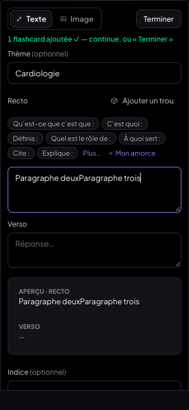 | 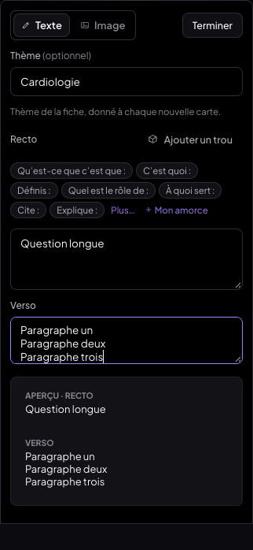 | 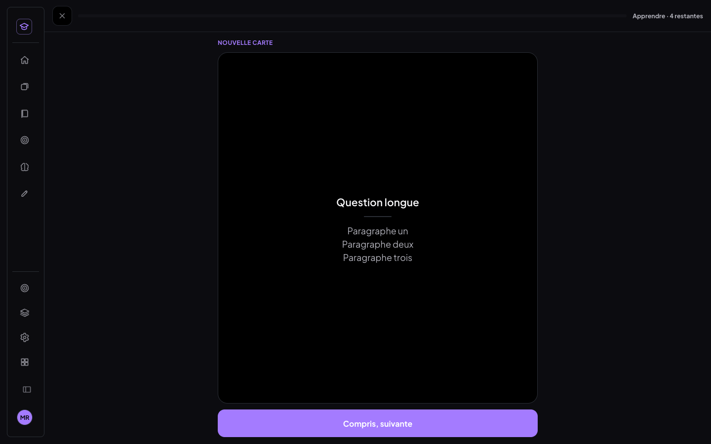 | 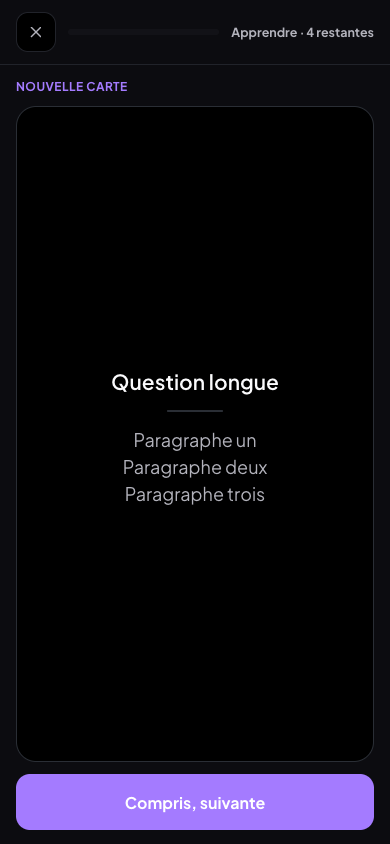 |

---

## 4. Mode Sélection : plus de gestion des surlignages

**Avant** :
- En mode Sélection, un clic sur un surlignage ouvrait une bulle avec la couleur, « Ajouter une boîte » et « Supprimer » (`PdfReader` : `editingHl`).
- Le survol entourait le surlignage et montrait une main.
- La fiche HTML avait sa propre bulle (couleur / supprimer).
- Repasser au surligneur sur un passage déjà surligné ne faisait **rien**.

**Maintenant** :
- **Sélection** : cliquer sur un surlignage ne fait rien de particulier, le texte se sélectionne comme s'il n'y avait pas de surlignage.
  - Plus de bulle, plus de contour au survol, plus de main.
  - Sur un PDF, le test de position sert encore à relier une boîte à un surlignage (outil Boîte).
- **Surligneur** :
  - passer sur un passage **déjà surligné de la même couleur le retire** ;
  - passer dessus **avec une autre couleur le recolore** ;
  - du texte libre dans la sélection est surligné, et les surlignages touchés d'une autre couleur prennent la couleur active ;
  - un geste = une seule entrée d'annulation (⌘Z).
  - Côté PDF : `pdfShared.js#surlignagesTouches` compare ancre contre ancre. Pour les anciens surlignages sans ancre, la comparaison est géométrique.
- **Composants supprimés** (ils n'étaient plus utilisés ailleurs) :
  - la bulle du PDF : `editingHl`, `handleHighlightClick`, `changeHighlightColor`, `deleteHighlightConfirmed`, `creerBoiteLiee` ;
  - la bulle de la fiche HTML : `bulle`, `agirSurMarque` ;
  - leur CSS : `.hl-picker`, `.hl-picker-sep`, `.hl-delete`, `.hl-lier`, `.hl-swatch-col`, `.pdfr-hl-rect.survol`.
  - Changer la couleur ou supprimer un surlignage reste possible dans le **mode Notions** du panneau.
- **Fiche HTML** : même règle. La pastille « off » du gabarit s'applique aux surlignages touchés (même couleur), ou la pastille de couleur les recolore.
- **Pages de document** (les notions jouent le rôle des surlignages) : même règle.
  - La notion est retirée, ou recolorée **en gardant son id**.
  - `synchroniserNotionsDoc` resynchronise maintenant aussi la couleur.
  - La bulle de sélection (Notion / Retirer la notion / Flashcard) est inchangée.

| Tests (`surl.mjs`, `html.mjs`, `doc.mjs`) | Avant | Après |
|---|---|---|
| PDF : surligner « Page 1 ligne 3 » (jaune) | ✅ créé | ✅ créé |
| PDF : repasser en jaune | ❌ rien | ✅ retiré |
| PDF : re-surligner, puis repasser en **vert** | — | ✅ le même passage devient vert (pas de doublon) |
| PDF : Sélection + clic sur un surlignage | ❌ bulle ouverte | ✅ aucune bulle |
| PDF : Sélection + glisser sur le texte surligné → sélection | ✅ | ✅ « Page 1 ligne 3 : » sélectionné, sans bulle |
| PDF : ⌘C sur cette sélection | — | ✅ texte copié |
| PDF : 4 anciens surlignages (sans ancre, couleurs jaune, bleu, rose, perso) pendant tout le scénario | — | ✅ intacts |
| HTML (gabarit simulé) : surligner puis repasser en jaune | — | ✅ créé puis retiré |
| HTML : jaune sur un passage déjà surligné en bleu | — | ✅ recoloré en jaune |
| HTML : Sélection + clic sur un surlignage | ❌ bulle | ✅ aucune bulle |
| Document : surligner (jaune), repasser en vert, puis encore en vert | — | ✅ créée → recolorée (même id `ndmuyaq30ejlpf`) → retirée (notion supprimée du store) |
| Document : Sélection sur du texte de notion | — | ✅ bulle de sélection « Retirer la notion / Flashcard » |

| Avant : clic en Sélection = bulle | Après : clic en Sélection = rien | Après : repassé en vert = recoloré | Après : fiche HTML, clic |
|---|---|---|---|
| 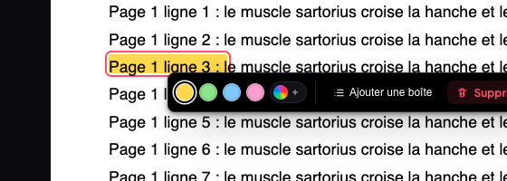 | 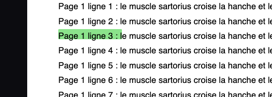 | 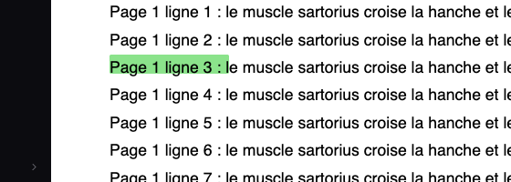 | 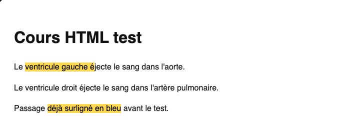 |

**Surlignages existants intacts au pixel près.**
- Page 1 du PDF de test, avec 5 surlignages (4 anciens sans ancre, dont une couleur perso, et 1 avec ancre).
- Capture faite avec le code d'avant (`git stash`), puis avec le nouveau, sur la même origine et les mêmes données.
- `cmp` des deux PNG : **identiques**.
- On n'a écrit dans aucun surlignage ni aucune carte existants hors des gestes de test.

| Ancien code | Nouveau code |
|---|---|
| 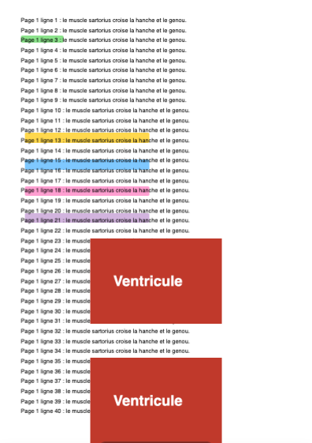 |  |

---

## Non-régression générale

- `npm run build` : ✅ vert.
- 0 erreur JavaScript dans tous les scénarios.
- MedRevise s'affiche sans erreur : Accueil, Réviser, Bibliothèque, Carnet d'erreurs, Apprentissage.
- Aller-retour hub → MealWeek → MedRevise : ✅ (capture `nonreg-mealweek.png`).
- **MealWeek et `src/shared/`** : `git diff --stat 8ed0640 HEAD -- src/mealweek src/shared` est **vide**.
- Aucune requête vers Supabase pendant les tests.

## Limites et points ouverts

- **Gabarit HTML** : le vrai gabarit des fiches HTML n'est pas dans le dépôt.
  - Le test HTML utilise un gabarit **simulé**, avec des pastilles `.swatch[data-hl]` dont « off », `mark.hl` et `#bUndo`.
  - Le code s'appuie sur la pastille « off », que l'ancienne bulle utilisait déjà pour « Supprimer ».
  - Si un gabarit n'a pas de pastille « off », repasser dans la même couleur ne fait rien, comme avant.
- **Vue HTML** : elle n'offre que le jaune (pas de choix de couleur dans sa barre). La recoloration y a donc été testée avec du jaune sur un passage bleu.
- **Retrait d'un surlignage PDF** : il retire le surlignage **entier** touché, même si l'on n'en repasse qu'une partie. Il n'y a pas de découpage partiel.
- **Artefact du banc de test** : dans un document, le tout premier glisser juste après la saisie sélectionne « L' » au lieu du mot visé, en headless. Le même comportement apparaît avec l'ancien `PageTexte.jsx` : ce n'est pas lié à ces changements.

## Commits

| Commit | Contenu |
|---|---|
| `4c8d9e2` | fix : zone image de l'éditeur de flashcard superposée aux champs en modification (point 1) |
| `01f5344` | fix : mode Sélection sans gestion des surlignages ; le surligneur retire ou recolore (point 4) |
| `c3ac465` | fix : thème auto de la fiche rétabli ; Entrée = retour à la ligne dans l'éditeur de flashcard (points 2 et 3, mêmes fichiers) |
| `5d9765a` | docs : ce compte-rendu + captures avant/après |
