# Compte-rendu — Flashcards

## Carte Muscle (08/10/2026)

Nouveau type de flashcard pour l'anatomie des muscles :
- **recto** : le nom du muscle ;
- **verso** : un tableau à 5 lignes fixes, dans cet ordre : Origine · Direction des fibres / Trajet · Insertion · Action · Innervation.

### Utilisation

**Créer une carte**
- Dans un cours, panneau **Exercices › Flashcards › + Ajouter**, le sélecteur propose désormais **Texte · Image · Muscle**.
- En choisissant **Muscle**, le formulaire affiche :
  - le champ **Nom du muscle** ;
  - le tableau, avec ses 5 lignes déjà étiquetées ;
  - les champs Thème, Indice et À retenir, comme pour les autres cartes.
- Raccourcis du tableau :
  - **Entrée** = retour à la ligne ;
  - **Tab** / **Maj+Tab** = ligne suivante / précédente (depuis le nom, Tab va à Origine) ;
  - **⌘Entrée** = enregistrer ;
  - **Échap** = fermer.
- Chaque zone de texte grandit avec son contenu : rien ne se chevauche, ni à la création ni en modification.
- **Puces collées depuis un slide** : les puces PowerPoint/Word (« • », « ◦ », « ▪ », « – », « - », « * », caractère privé U+F0B7…), suivies d'une tabulation ou d'un espace, deviennent « • ». En révision, elles s'affichent en vraie liste.
- **Une ligne peut rester vide** : elle s'affiche « — » en révision et n'est jamais masquée.

**Pré-remplir depuis une capture**
- Bouton **Pré-remplir depuis une image**, ou ⌘V de la capture du tableau, ou glisser-déposer.
- L'OCR existant (Tesseract.js de l'app, dans son Web Worker, sans aucun service externe) lit l'image et cherche les étiquettes Origine / Trajet (ou « Direction ») / Insertion / Action / Innervation.
- Le texte de chaque bloc est placé dans la bonne ligne, puces comprises. Si le nom est vide et qu'une ligne « m. … » figure au-dessus du tableau, elle remplit le nom.
- Une étiquette introuvable laisse sa ligne telle quelle. Une image sans tableau affiche un message, sans jamais d'erreur bloquante.
- Mises en page reconnues :
  - tableau à 2 colonnes, étiquettes en haut de cellule ou centrées verticalement ;
  - tableau horizontal (étiquettes en en-tête) ;
  - étiquettes en titres.
- Quand l'OCR rate le « • » (fréquent), la puce est retrouvée grâce au **retrait** du texte.

**Réviser une carte**
- **Recto** : le nom, grand et centré.
- **Verso** : le nom en petit titre, puis le tableau :
  - deux colonnes : étiquette grise en petites capitales à gauche, contenu à droite ;
  - lignes séparées par un filet fin ;
  - un contenu long défile **dans** la carte, sans jamais être coupé.
- Sur téléphone, le tableau occupe toute la largeur de la carte, avec une colonne d'étiquettes de 86 px.
- **Ligne par ligne** (actif par défaut) : au retournement, les contenus sont masqués (« Toucher pour révéler »).
  - Toucher une ligne révèle son contenu. La carte ne se retourne pas.
  - **Tout révéler (n)** affiche le reste.
  - Ce mode se désactive dans **Réglages › Apprentissage des flashcards › Carte Muscle : révéler ligne par ligne**. Le réglage est synchronisé entre appareils.
- La notation (Raté / Difficile / Facile, Su / Pas su) et la logique Apprendre / J ne changent pas : une carte Muscle compte pour une carte.

**Copier et exporter**
- Le bouton **Copier** d'une carte Muscle (liste du panneau) donne :

  ```
  m. Grand glutéal (fessier)
  Origine :
    • Face postérieure de l'ilium, en arrière de la ligne glutéale postérieure
    …
  Direction des fibres / Trajet : Oblique en bas et en dehors, fibres parallèles
  …
  Innervation : Nerf glutéal inférieur (L5, S1, S2)
  ```

- L'export du cours (`cartes_manuelles`) inclut ce même texte en `verso`, plus le champ `muscle`.

### Données et compatibilité (aucune écriture destructive)

Une carte Muscle est une flashcard **ordinaire** : `type: 'flashcard'`, même création (`appendItemsToFiche` → `toInternalItem`), même planning, même synchro (`medrevise_records`, une ligne par carte). Ce qu'elle a en plus est **additif** :

```js
{ recto: 'm. Grand glutéal (fessier)',
  verso: 'Origine :\n  • …\nDirection des fibres / Trajet : …',   // tableau mis à plat
  muscle: { v: 1, lignes: { origine, trajet, insertion, action, innervation } } }
```

- Le `verso` texte rend la carte lisible partout où le type n'est pas connu : ancien appareil pas encore mis à jour, carnet d'erreurs, recherche, export.
- Aucune carte existante n'est touchée et aucune migration n'est nécessaire.
- Aucun changement de schéma Supabase.
- Le réglage `muscleLigneParLigne` est une clé ajoutée à l'enregistrement `reglagesFC` (déjà synchronisé). Absent, il vaut « actif ».

**Fichiers**
- `src/medrevise/lib/muscle.js` : modèle, puces, mise à plat, décodeur du tableau OCR (pur, testé sous Node).
- `src/medrevise/components/FlashcardMuscle.jsx` : formulaire (création et modification) et tableau de révision.
- `src/medrevise/ocr/ocrMuscle.js` : OCR d'une capture.
  - Même moteur et même préparation que `ocrImage.js`, dont `preparer` est maintenant exporté.
  - Garde les puces en début de ligne.
- Branchements :
  - `CarteAjoutFlashcard.jsx` (3ᵉ onglet) ;
  - `AddItemForm.jsx` (modification) ;
  - `CourseItemsSidebar.jsx` (liste + Copier) ;
  - `Session.jsx`, `SeanceFC.jsx`, `MobileSession.jsx` (révision) ;
  - `Reglages.jsx` et `apprentissageFC.js` (réglage) ;
  - `courseExport.js`.
- Styles : préfixe propre `mu-*` (les `fc-*` sont partagés avec `fenetre-creation.css`), dans `etudes.css` et `medrevise-mobile.css`.
- Changement visuel volontaire dans `panneau-modes.css` : les 3 onglets ont un padding de 7 px au lieu de 10 px. Avec le 3ᵉ onglet, l'en-tête de la carte d'ajout débordait de 19 px dans le panneau de 342 px et créait une barre de défilement horizontale ; c'est corrigé.

### Tests (Chrome réel en headless piloté par CDP, Vite local, faux Supabase local — jamais le cloud)

Banc de test :
- deux Chrome isolés : « ordinateur » 1 440 × 900 et « téléphone » 390 × 844 tactile ;
- serveur Vite avec `VITE_SUPABASE_URL=http://localhost:54399` (`scripts/faux-supabase.mjs`) ;
- cours de test « Muscles de la hanche » (PDF) avec une carte Texte et une carte Image existantes ;
- capture de tableau de cours générée : `00-capture-du-cours.png`.

Ce banc est simulé : ce n'est pas une capture de ton cours. Le jour où tu colles une vraie capture, le décodeur pourra demander un ajustement (voir Limites).

| Scénario | Résultat |
|---|---|
| Sélecteur « Texte · Image · Muscle », 5 lignes étiquetées dans l'ordre | ✅ |
| Nom, puis **Tab** → Origine ; vrai **⌘V** (presse-papier système) d'un contenu de slide à puces U+F0B7 + tabulation → 3 lignes « • » | ✅ |
| Tab Origine → Trajet → … → Innervation ; **Entrée** = retour à la ligne (3 lignes dans Action) | ✅ |
| Aucune zone tronquée ni chevauchement (création et modification) | ✅ |
| **⌘Entrée** : carte enregistrée (une seule), formulaire vidé, focus sur le nom pour enchaîner | ✅ |
| Liste du panneau : tableau compact ; **Copier** → texte structuré (lu dans le presse-papier) | ✅ |
| Rouvrir en **modification** : nom et 5 lignes rechargés, correction enregistrée, carte non dupliquée | ✅ |
| **⌘V de la capture du cours** → « 5/5 lignes pré-remplies » en 1 à 3 s ; les 5 lignes et le nom sont exacts, puces comprises (dont celles que Tesseract n'avait pas lues) ; sauvegarde | ✅ |
| ⌘V d'une image sans tableau → message, lignes vides, rien de bloquant | ✅ |
| Ligne vide → « — » dans la liste et en révision, jamais masquée ; « Tout révéler (1) » | ✅ |
| **Séance Apprendre** (bureau) : présentation (tableau complet), test recto → verso 5 lignes masquées, tap Origine → révélée seule et la carte reste au verso, Tout révéler, Su ; la carte sort de l'apprentissage comme les autres (échéance J+1) | ✅ |
| **J+1** (horloge décalée) : la carte est dans les **Révisions** ; ligne par ligne ; notation Raté/Difficile/Facile inchangée ; Facile → échéance repoussée (moteur des J inchangé) | ✅ |
| **Séance classique** (carte qui se retourne) : verso masqué, tap sur une ligne → révélée, la carte ne se retourne pas ; Tout révéler ; Difficile appliqué | ✅ |
| Réglage décoché → verso complet d'emblée ; recoché → 5 lignes masquées ; valeur enregistrée dans `reglagesFC` | ✅ |
| **Synchro vers un 2ᵉ appareil** : le téléphone reçoit les 2 cartes Muscle, empreinte SHA-256 identique à l'ordinateur ; en retour, l'ordinateur reçoit l'état d'apprentissage fait sur le téléphone | ✅ |
| **Mobile** : séance Apprendre (FaceFC) et série du jour (MobileSession) — tableau pleine largeur, contenu qui défile dans la carte (rien de coupé), boutons de notation visibles, pas de défilement horizontal de la page | ✅ |
| Non-régression : création d'une carte **Texte** et d'une carte **Image + texte** (⌘V de l'image dans le volet Image, non intercepté par le volet Muscle) → enregistrements identiques à avant (pas de champ `muscle`) ; modifier une carte Texte → formulaire Texte habituel | ✅ |
| Non-régression au pixel : recto et verso d'une carte Texte en séance classique, avant (HEAD) et après → **PNG identiques octet pour octet** | ✅ |
| **MealWeek** : capture de l'accueil MealWeek avant et après → identiques octet pour octet ; `git status` : rien dans `src/mealweek/` ni `src/shared/` | ✅ |
| Erreurs console pendant tous les scénarios | aucune |
| `npm run build` | ✅ vert |
| `node scripts/tests-muscle/test-tableau.mjs` (vrais mots OCR de la capture, figés + tableaux simulés : étiquettes centrées, horizontal, étiquettes manquantes, entrées vides ; puces ; mise à plat) | ✅ 16/16 |

**Limites et doutes**
- **L'OCR a été validé sur une capture générée** (police nette, tableau à 2 colonnes) et sur des tableaux simulés, pas sur une vraie capture de ton cours.
  - Des slides très chargés (fond coloré, étiquettes en biais, cellules fusionnées) peuvent mal découper une ligne.
  - Le pré-remplissage reste un brouillon à relire : c'est le principe demandé.
- **Création sur téléphone** : le panneau Exercices n'existe pas sous 760 px (shell mobile de révision). La création se fait sur ordinateur ou tablette, comme pour les cartes Texte et Image.
- **Faux problème de synchro vu pendant les tests, puis compris** : en rechargeant un onglet avec l'horloge avancée d'un jour, des réponses de séance pas encore envoyées ont été écrasées par la version du cloud.
  - C'est le piège déjà connu des horloges décalées sur le banc.
  - Rejoué sans ce raccourci, avec un vrai 2ᵉ appareil : tout est parti au cloud et revenu à l'identique.
  - Rien à voir avec la carte Muscle.

### Captures

**Capture de cours utilisée pour l'OCR (générée)**

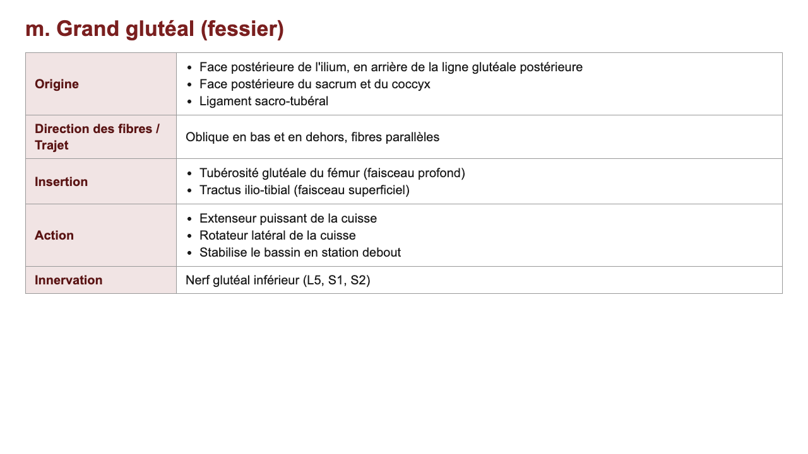

**Création**

| Formulaire vide | Collé depuis un slide | Pré-rempli par l'OCR |
|---|---|---|
| 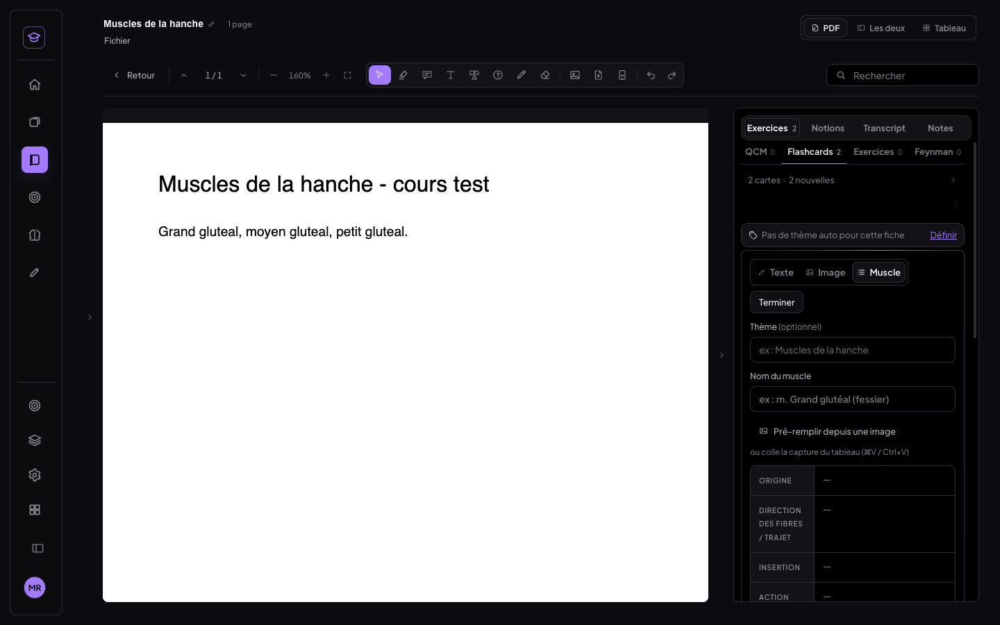 | 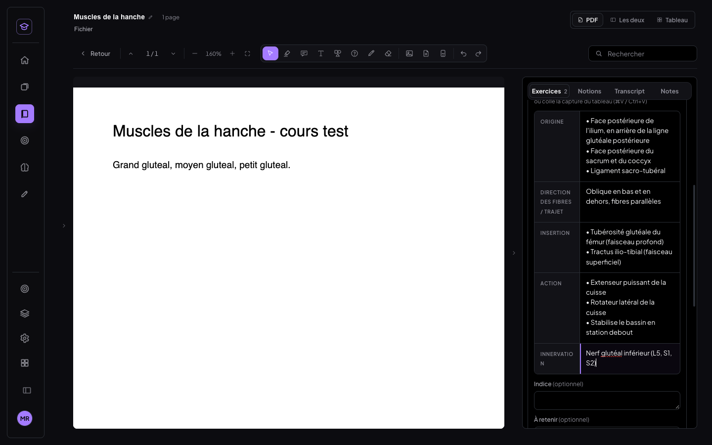 | 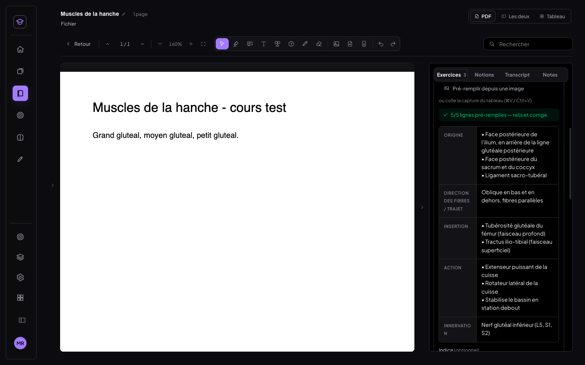 |

| Modification (aucun chevauchement) | Liste du panneau (Copier, Éditer, Supprimer) |
|---|---|
| 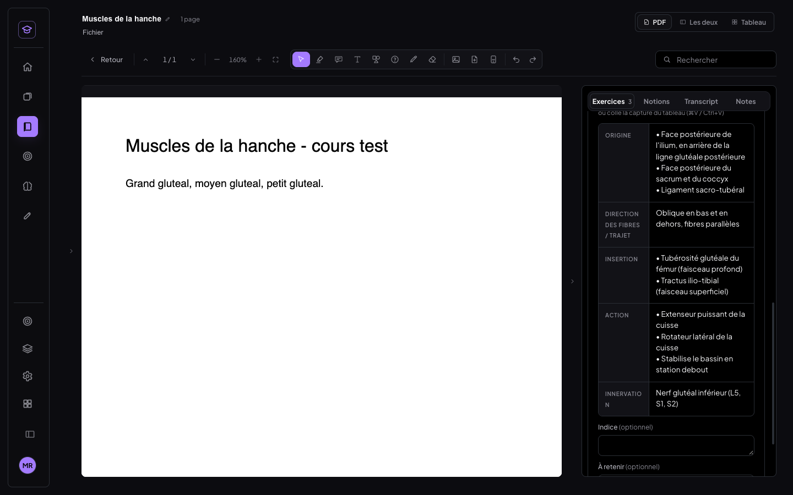 | 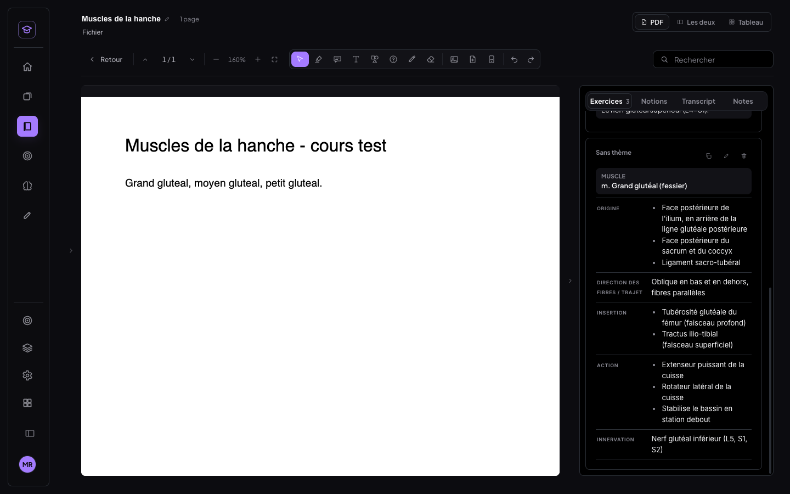 |

**Révision — bureau**

| Recto | Verso complet (séance des J) |
|---|---|
| 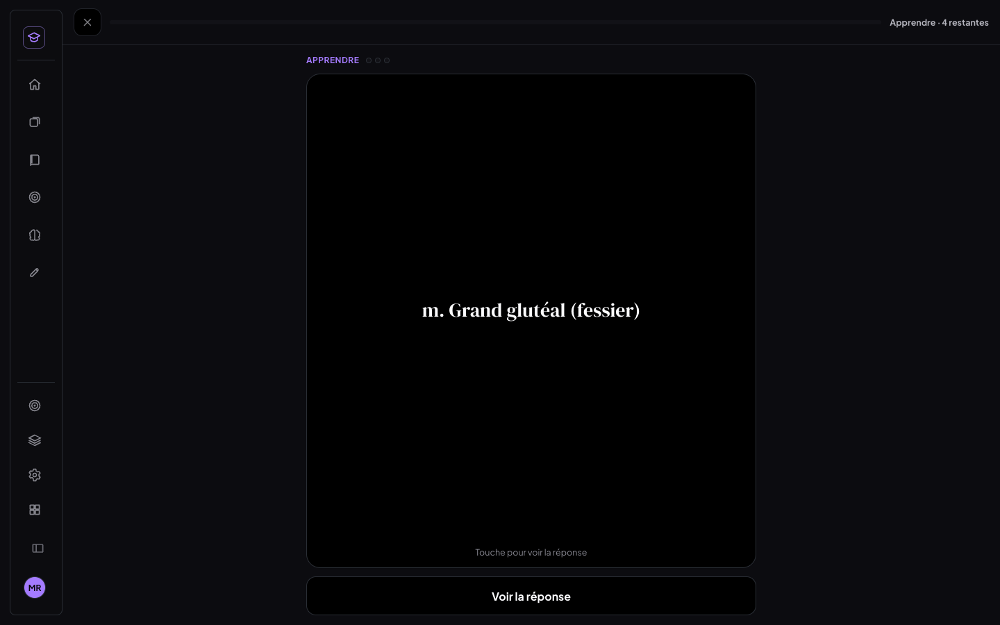 | 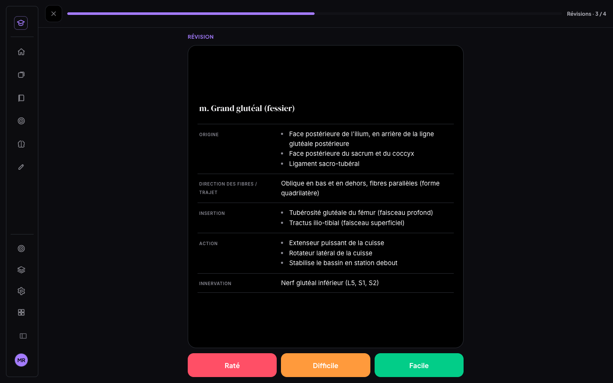 |

| Ligne par ligne (Trajet révélé) | Tout révélé (séance classique) |
|---|---|
| 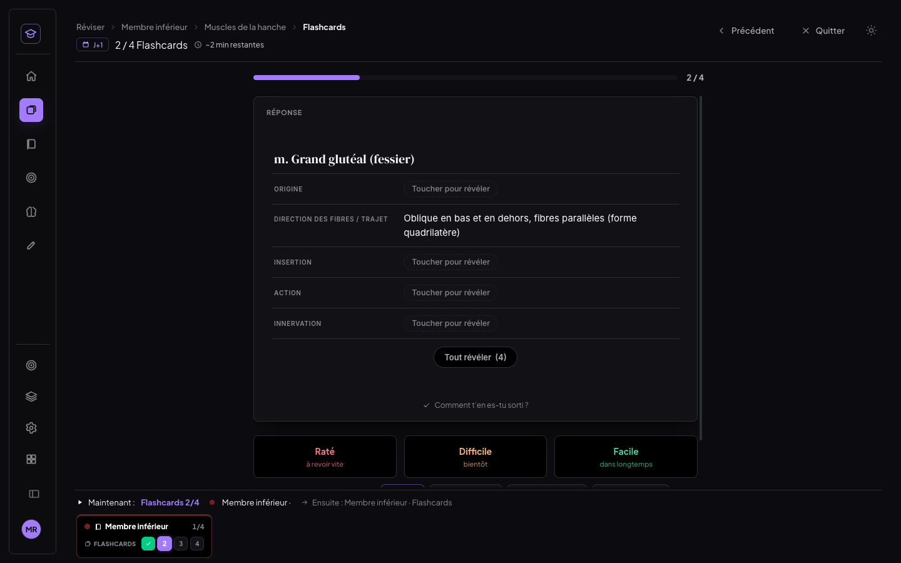 | 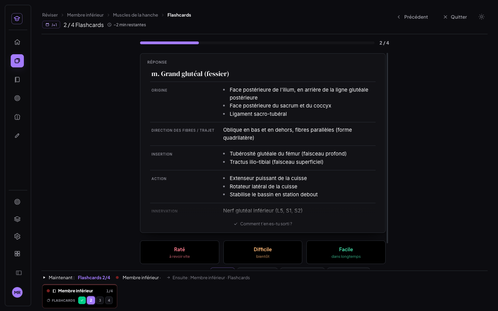 |

| Lignes vides « — » | Réglage |
|---|---|
| 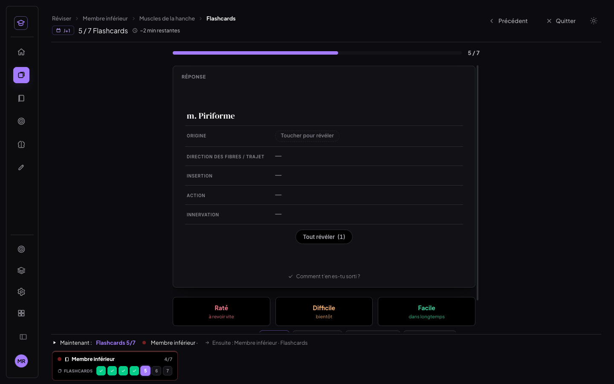 | 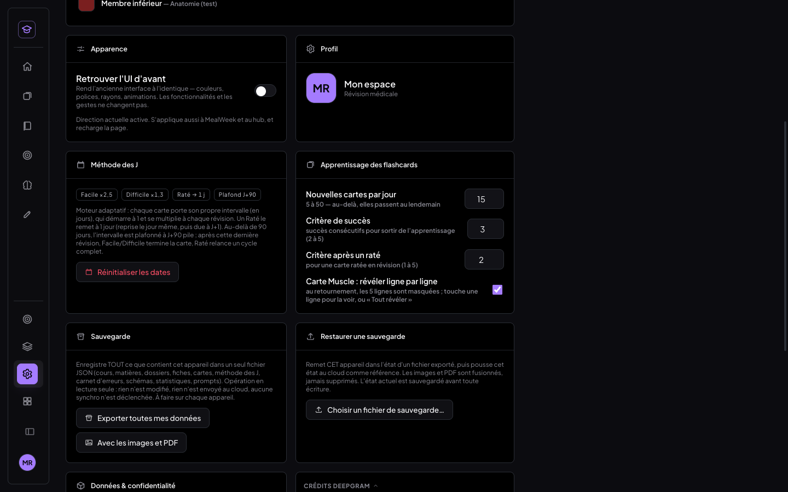 |

**Révision — téléphone (390 px)**

| Recto | Ligne par ligne | Verso long : défile dans la carte | Série du jour |
|---|---|---|---|
| 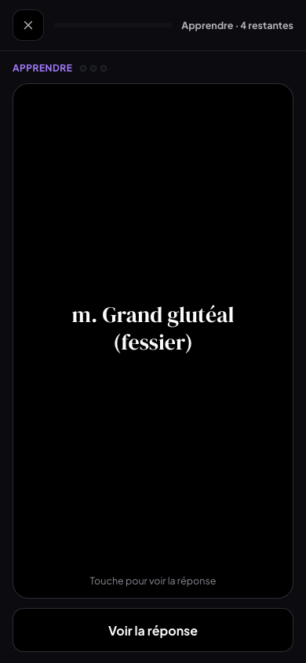 | 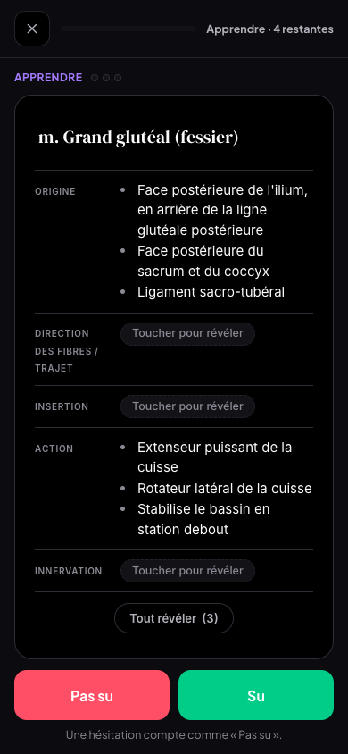 | 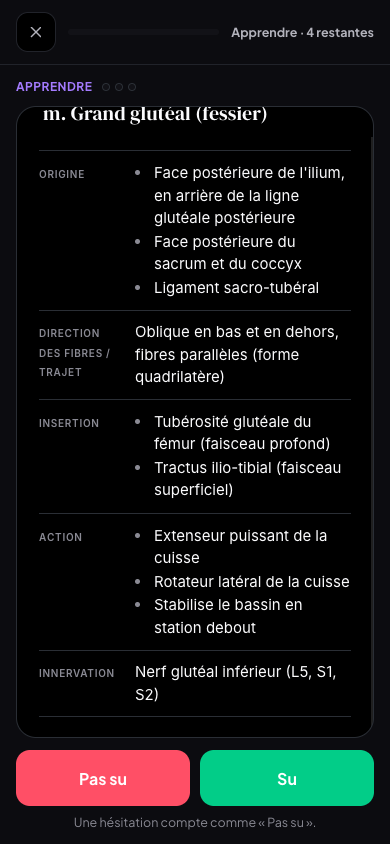 | 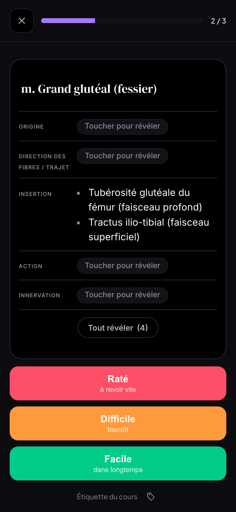 |

### Commits

| Commit | Contenu |
|---|---|
| fde61e1 | `feat(medrevise)` : flashcard « Muscle » (création, OCR, révision ligne par ligne, réglage, copie, export) |
| c005f2d | `test(medrevise)` : décodeur du tableau Muscle (vrais mots OCR + cas simulés) |
| (ce commit) | `docs(medrevise)` : ce compte-rendu et ses captures |
