# Compte rendu — Images dans les documents, re-surlignage, textes d'annotations en JSON (10/10/2026)

Trois chantiers sur MedRevise. Tout a été testé dans un Chrome isolé piloté en CDP (sans extension), devant
le serveur Vite local **sans Supabase** (`VITE_SUPABASE_URL=` vide). Le test « deux appareils » passe par le
faux Supabase du dépôt (`scripts/faux-supabase.mjs`). **Le vrai cloud n'a jamais été touché.**

Règles respectées :

- **MealWeek et `src/shared/` intacts.** `git diff e872af5 -- src/mealweek src/shared` est vide. MealWeek est
  identique au pixel près avant/après (builds de production servis sur la même origine, ordinateur et
  téléphone : fichiers PNG identiques).
- **Aucune écriture Supabase destructive.** Tous les champs nouveaux sont **ajoutés**. Aucun enregistrement
  n'est supprimé, pas même les images flottantes converties : elles sont seulement marquées.
- **Pas de migration SQL.** Les enregistrements sont du JSONB. Une requête de comptage **en lecture seule** est
  préparée, mais pas exécutée : `supabase/compte-images-textes-annotations.sql`.
- **Aucune annotation, image ou surlignage perdu ou déplacé.**
  - Page d'un PDF avec boîtes et surlignage d'avant, rendue par l'ancienne puis la nouvelle version : captures
    identiques octet pour octet.
  - Conversion des images : sauvegarde `putBackup` d'abord.
- **Direction artistique existante.** Le panneau reprend la facture de « Mise en page ». Les boutons, la
  palette et les icônes sont ceux de l'app.

Bilan des tests : sur la passe finale, **86 vérifications automatiques sur 87 ont réussi du premier coup**. La
87ᵉ a échoué à cause de l'assertion du test, pas de l'app. Le test a été corrigé et relancé : réussi (4/4).
Détail plus bas.

---

## 1. Documents : une image s'insère toujours dans le flux

### Ce qui change

Dans un **document créé dans l'app**, les quatre chemins d'ajout produisent un **bloc image du texte** :

- le bouton Image de la barre d'annotation ;
- ⌘V ;
- le glisser-déposer d'un fichier ;
- le menu **Dessins** : « Poser » ou glisser une carte.

Ce bloc a le comportement déjà en place : déplaçable entre blocs, redimensionnable, paginé automatiquement,
avec texte reconnu (OCR). L'image arrive à l'un de ces endroits :

| Situation | Où arrive l'image |
|---|---|
| Le curseur est dans le texte, sur la page visée | À la position du curseur, sans couper le paragraphe |
| Le curseur n'est pas sur cette page | À la fin de la page affichée |
| Glisser-déposer, dans le texte ou dans la marge | À la limite de bloc la plus proche du point de dépôt |

L'infobulle du bouton devient : « Image — l'insérer dans le texte, au curseur ».

L'**onglet Notes** d'un cours insère aussi un bloc du flux, avec le même bloc image :

- ⌘V ;
- le glisser d'un fichier ;
- le glisser d'un dessin depuis le menu Dessins.

Sur un **PDF importé**, rien ne change : le bouton Image et ⌘V posent une image-annotation flottante.

Les zones de texte d'un dessin reçu du téléphone deviennent des paragraphes sous l'image. Dans un document,
rien ne flotte.

### Conversion des images flottantes déjà posées dans un document

La conversion a lieu **une seule fois**, à l'ouverture du document, dès que son texte est chargé et paginé.

1. `putBackup('pre-images-flux-…')` sauvegarde les images, leurs surlignages et le flux.
2. Chaque image est insérée à la **limite de bloc la plus proche de son centre**.
   - Sa **taille est conservée** : largeur = largeur d'origine × largeur de page. La hauteur est fixée
     seulement si les proportions avaient été changées.
   - Une **rotation** est appliquée aux pixels : un nouveau blob est créé, l'original n'est pas touché.
   - Les mots surlignés de l'image deviennent des notions de l'image.
3. L'annotation d'origine reçoit le champ ajouté `convertieEnFlux` (date) et n'est plus affichée. Elle n'est
   pas supprimée.
4. Le bloc porte `deAnnotation` (l'id d'origine). Si un autre appareil ouvre le document, il ne convertit pas
   une seconde fois.
5. Compte gardé sur l'appareil (meta `images-flux-converties`, par document), plus une ligne en console :
   `[MedRevise] N image(s) flottante(s) convertie(s) en blocs du flux`.

**Nombre d'images converties**

- **Jeu de test :** 2 images, dans 1 document (« Document ancien J » : une droite, une pivotée à 90°).
  Résultat : 2 blocs (largeurs 298 et 89 unités de page), 0 image flottante restante, 2 images enregistrées
  dans le flux.
- **Tes vraies données :** elles n'ont pas été lues, puisque le cloud n'est pas touché. Chaque document est
  converti à sa première ouverture. Pour connaître le nombre à l'avance :
  `supabase/compte-images-textes-annotations.sql`, requête 1, en lecture seule.

Le **2ᵉ appareil** (faux Supabase) reçoit le flux avec les 2 blocs et les annotations marquées : 0 image
flottante, aucune conversion en double.

| Avant (image flottante, posée sur le texte) | Après (bloc du flux, même largeur) |
|---|---|
| 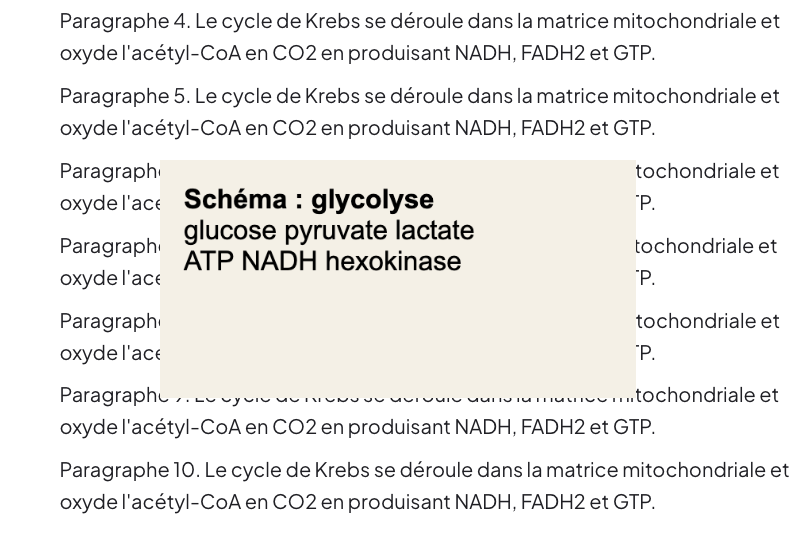 | 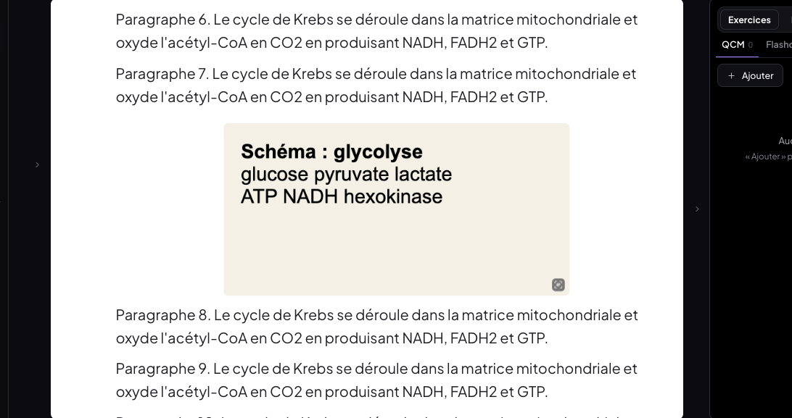 |
| 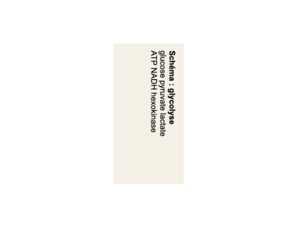 | 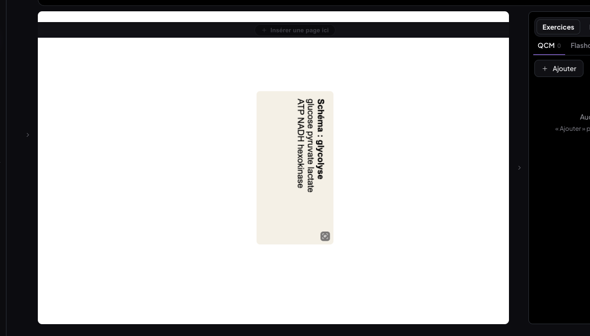 |

### Tests (ordinateur 1 440 × 900)

Les résultats ci-dessous viennent de `scripts/tests-images-json/`. Les deux premiers groupes concernent
« Document neuf J ».

**Les quatre chemins d'ajout**

| Test | Résultat |
|---|---|
| A. Bouton de la barre, curseur dans P2 | ✅ bloc juste sous P2 |
| B. ⌘V, curseur dans P4 | ✅ bloc sous P4 |
| B2. ⌘V après un clic hors du texte | ✅ bloc du flux (au curseur conservé) |
| C. Glisser un fichier entre P1 et P2 | ✅ bloc à cet endroit |
| C2. Glisser un fichier dans la **marge**, au niveau de P3 | ✅ bloc sous P3 |
| D. Dessins › Poser | ✅ bloc au curseur |
| D2. Dessins › glisser la carte (vrai glisser HTML5) entre P2 et P3 | ✅ bloc à cet endroit |

**Comportement des blocs**

| Test | Résultat |
|---|---|
| Pagination | ✅ chaque image a sa page (3 pages) |
| Flux enregistré | ✅ 7 images, comme à l'écran |
| E. Curseur sur la page 1, page 3 affichée | ✅ image en fin de page affichée |
| F. Déplacer un bloc image au pointeur (au-dessus de P1) | ✅ |
| G. ⌘Z sur ce déplacement | ✅ annulé |

**PDF importé et onglet Notes**

| Test | Résultat |
|---|---|
| PDF importé : bouton Image | ✅ image-annotation flottante (0 → 1) |
| PDF importé : ⌘V | ✅ image-annotation flottante (1 → 2) |
| Onglet Notes : ⌘V | ✅ bloc du flux des notes, aucune annotation |

Aucune exception JS.

| Bouton Image (bloc sous le paragraphe) | Dessins (poser / glisser) | PDF importé : toujours flottante |
|---|---|---|
| 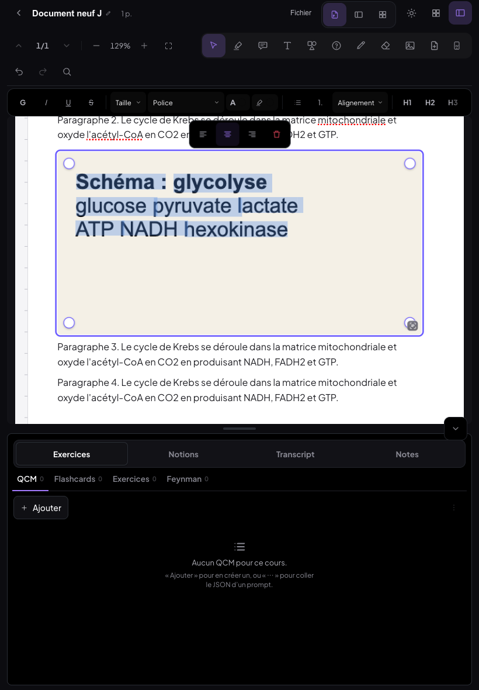 | 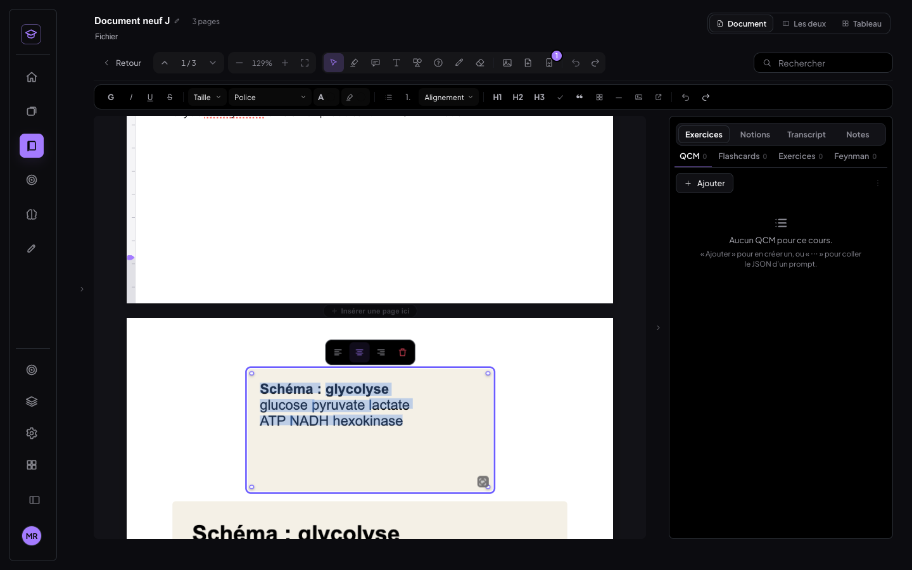 | 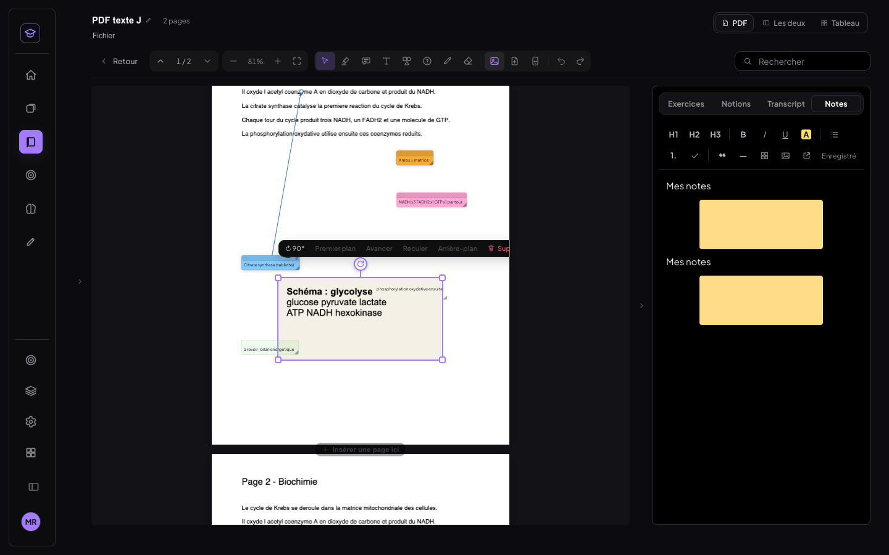 |

---

## 2. Re-surlignage : même couleur = retire, autre couleur = remplace

### La règle (un seul calcul pour toutes les surfaces)

Tout passe par un seul module pur, `lib/resurlignage.js`, avec deux fonctions :

- `planSurlignage` travaille sur des **ancres de texte** ;
- `planMots` travaille sur des **indices de mots OCR**.

Comportement :

- **Même couleur sur un passage entièrement déjà de cette couleur → retiré** sur la seule portion repassée. Si
  on retire le milieu, le surlignage est **scindé** en deux.
- **Autre couleur → la portion repassée change de couleur.** Les surlignages d'une autre couleur sont rognés :
  **jamais deux couches superposées**.
- **Deux surlignages adjacents de même couleur fusionnent.** Ils fusionnent aussi quand seul un blanc les
  sépare.
- Le surlignage conservé **garde son id**, donc sa note et les boîtes qui lui sont reliées. Un morceau détaché
  par une scission reçoit un id neuf.
- Un geste = **une entrée d'annulation**.

### Surfaces couvertes

| Surface | Stockage | Branché dans |
|---|---|---|
| Texte natif d'un PDF | `highlights` (ancre item/char) | PdfPage → PdfReader |
| Texte OCR d'un PDF image | `highlights` (même couche de texte) | idem |
| Texte d'un document | marques `notion` du flux | `documents/lib/notionMarks.js` (DocumentFlux, PageTexte) |
| Mots d'une image de document | `notions` du nœud image | `documents/lib/imageVue.js` |
| Mots d'une image collée sur un PDF | `highlights` + `imageId`/`mots` | PdfReader |
| Soulignement (barre de mise en forme) | marque `underline` | déjà « toggle » à la portion, vérifié |
| Surligneur de fond (barre de mise en forme) | `textStyle.backgroundColor` | PdfPage (EditToolbar) |

Cas particulier : les très anciens surlignages **sans ancre** (avant le 30/09) gardent la règle d'avant. Ils
sont retirés ou recolorés en entier, faute de pouvoir les découper.

### Tests

Chaque surface a été testée avec la même suite d'étapes :

1. surligner en ambre ;
2. repasser le **milieu** en ambre ;
3. repasser une portion en vert sauge ;
4. resurligner le milieu en ambre ;
5. ⌘Z × 4, puis ⇧⌘Z × 4.

**Texte natif d'un PDF** (« Il oxyde l acetyl coenzyme A en dioxyde… »)

| Étape | Résultat |
|---|---|
| 1 | ✅ `ambre:«oxyde l acetyl coenzyme»` |
| 2 | ✅ scindé : `ambre:«oxyde l» \| ambre:«coenzyme»` |
| 3 | ✅ une seule couche : `ambre:«oxyde l» \| sauge:«coenzyme A en dioxyde»` |
| 4 | ✅ fusion : `ambre:«oxyde l acetyl» \| sauge:«coenzyme A en dioxyde»` |
| Rendu | ✅ 0 rectangle superposé à l'écran |
| 5 | ✅ ⌘Z × 4 → état de départ ; ⇧⌘Z × 4 → état final |

**Texte OCR (PDF image)**

| Étape | Résultat |
|---|---|
| 1 à 4 | ✅ mêmes résultats sur les mots reconnus (`«oxyde l'» \| «coenzyme»` → … → fusion) |
| 5 | ✅ annuler / rétablir |

**Texte d'un document**

| Étape | Résultat |
|---|---|
| 1 | ✅ `«cycle de Krebs se déroule dans la matrice»` |
| 2 | ✅ deux notions, **ids distincts** |
| 3 | ✅ portion recolorée |
| 4 | ✅ fusion : `ambre:«cycle de Krebs se» \| sauge:«déroule dans la matrice mitochondriale»` |
| Panneau Notions | ✅ les notions enregistrées sont identiques aux passages surlignés |
| 5 | ✅ annuler / rétablir |

**Mots OCR d'une image de document, puis d'une image collée sur un PDF**

| Étape | Résultat |
|---|---|
| 1 | ✅ `«glucose pyruvate lactate»` |
| 2 | ✅ `«glucose» \| «lactate»` |
| 3 | ✅ `ambre:«glucose» \| sauge:«lactate»` |
| 4 | ✅ fusion : `ambre:«glucose pyruvate» \| sauge:«lactate»` |
| 5 | ✅ annuler / rétablir |

**Soulignement et surligneur de fond (barre de mise en forme)**

| Étape | Résultat |
|---|---|
| Souligné | ✅ appliqué |
| Resouligner le milieu | ✅ scindé |
| Resouligner l'ensemble | ✅ fusionné |
| Fond ambre | ✅ appliqué |
| Même couleur au milieu | ✅ retiré sur la portion |
| Vert sur une portion | ✅ remplacé, une seule couche |

| Milieu retiré (scindé) | Autre couleur + fusion | Texte d'un document |
|---|---|---|
|  | 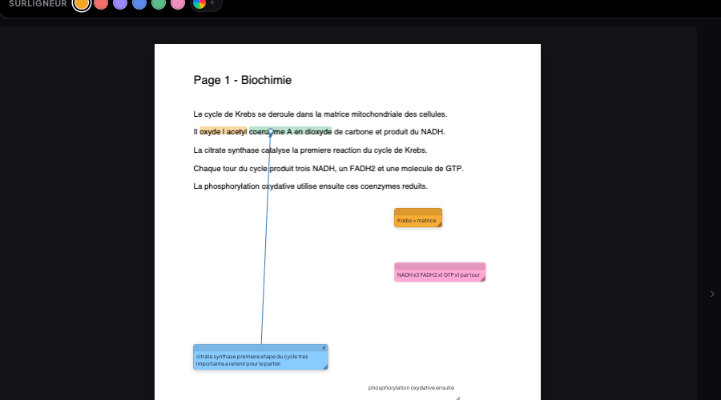 | 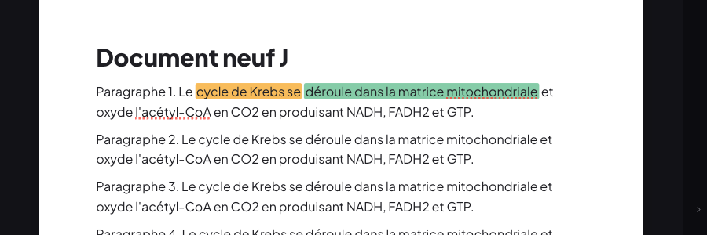 |

| Texte OCR : scindé | Texte OCR : fusion | Souligné / fond |
|---|---|---|
| 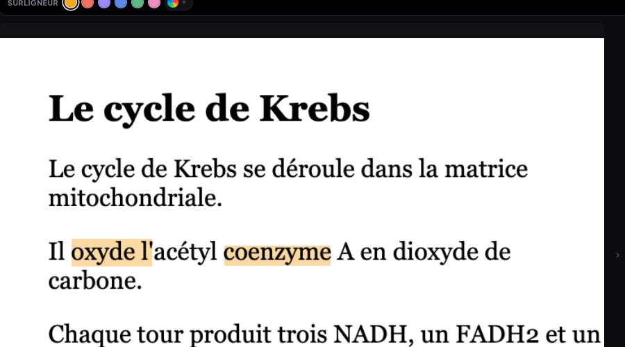 | 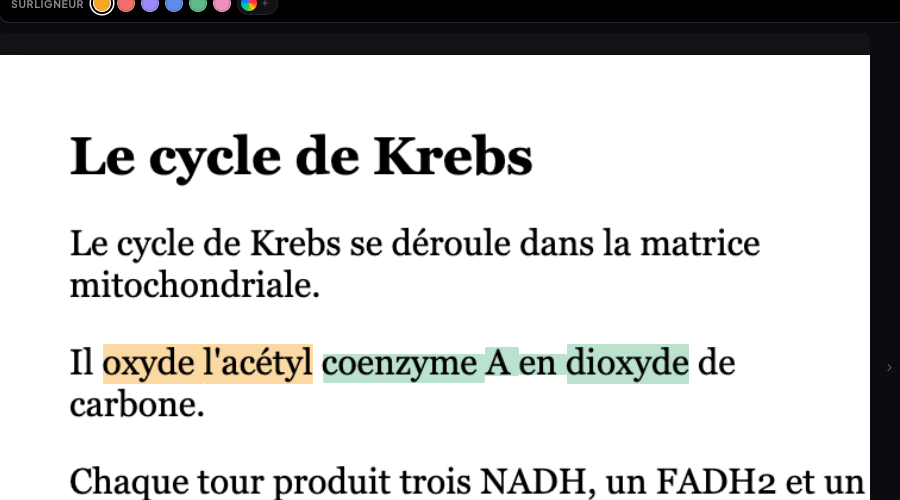 | 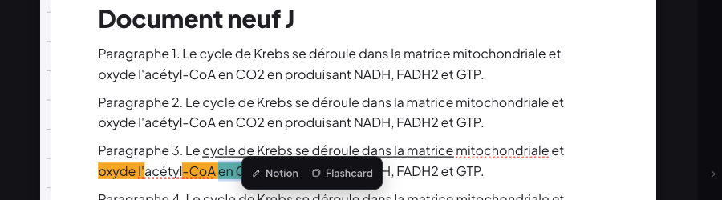 |

---

## 3. Aller-retour JSON des textes d'annotations, avec double version

### Identifiants stables

Chaque boîte (`kind: 'libre'`) et chaque texte libre (`kind: 'texte'`) reçoit son `id` **à la création**
(`genId('an')`, `lib/storage.js`). Cet id est la clé de synchro (`record_id`). Aucun code ne le recalcule, ni
au déplacement, ni à l'édition, ni à la synchro. **Aucune migration n'était nécessaire.**

### Format du JSON

On y accède par **Fichier › « Exporter les textes d'annotations… »**. Portée : page courante ou cours entier.
Deux sorties : un fichier `.json`, ou « Copier le JSON » dans le presse-papiers.

```json
{
  "course": "PDF texte J",
  "page": 1,
  "boxes": [
    { "id": "an-b1", "text": "Krebs = matrice" },
    { "id": "an-b2", "text": "NADH x3 FADH2 x1 GTP x1 par tour" },
    { "id": "an-b3", "text": "citrate synthase premiere etape du cycle tres importante a retenir pour le partiel" },
    { "id": "an-b4", "text": "phosphorylation oxydative ensuite" },
    { "id": "an-b5", "text": "a revoir : bilan energetique" }
  ]
}
```

Règles du format :

- `page` est absent pour l'export du cours entier.
- Le fichier ne contient **rien d'autre** : ni coordonnées, ni style, ni flèche.
- L'ordre est l'ordre de lecture : page, puis haut, puis gauche.
- `text` = texte brut de la boîte ; un paragraphe par ligne (`\n`).

### Import

On y accède par **Fichier › « Importer des textes d'annotations… »**, par collage ou par fichier.

- Formats acceptés : l'objet ci-dessus, la liste `boxes` seule, ou un JSON entouré de ```` ``` ````.
- Chaque entrée est retrouvée par son **id**. Seul le **texte** est remplacé, et le style de base de la boîte
  (taille, police, couleur du premier mot) est réappliqué au nouveau texte.
- Restent **strictement intacts** : position, taille, couleur, fond, flèches, épingle, page et ordre.
- Une boîte absente du fichier n'est pas modifiée.
- Un id inconnu est ignoré et listé.
- Résumé affiché : « 1 boîte mise à jour, 4 inchangées, 1 id inconnu ignoré · Id ignoré : an-inconnu-42 ».
- L'import entier = **une entrée d'annulation**.

### Deux versions par boîte

Tous ces champs sont **ajoutés** au même enregistrement ; aucun champ existant n'est retiré.

| Champ | Rôle |
|---|---|
| `textOriginal` / `contentOriginal` | Texte d'origine, **figé au premier import**. Un réimport ne l'écrase jamais. |
| `textAlt` / `contentAlt` | Texte importé, **remplacé à chaque import**. |
| `displayVersion` | `original` ou `alt`. |
| `content` | Reste le contenu **affiché** : le rendu, l'export PDF annoté, la synchro et les anciens clients lisent toujours la version affichée. |

Bascule de version :

- **Par boîte** : bouton « Voir l'original » / « Voir la version IA » dans la mini barre de la boîte. Il
  n'apparaît que si une version IA existe.
- **Globale** : Fichier › « Version des textes (IA / originale)… » › Page ou Cours entier › « Tout afficher en
  version IA » ou « Tout afficher en version originale ».

La bascule est un simple affichage : réversible à l'infini, et annulable.

- **Édition à la main** : elle s'applique à la version affichée.
- **Badge discret** « IA » ou « orig. » sur la boîte quand les deux versions existent.
- **Exports** : tout ce qui lit le texte d'une boîte lit `content`, donc la version affichée. C'est le cas du
  rendu, de l'export PDF annoté et de la sélection dans la boîte ouverte (« Flashcard »). Les exports
  « Copier les notions » et « Exporter en JSON » du cours ne contiennent pas les textes des boîtes,
  aujourd'hui comme avant.
- **Lecteur ouvert** : il relit désormais les boîtes après une synchro (correctif `7cf315e`). Un import ou une
  bascule faits sur un autre appareil s'affichent sans rouvrir le cours.

### Tests (« PDF texte J », 5 boîtes sur la page 1 : boîtes, post-it, texte libre, flèche)

**Export**

| Test | Résultat |
|---|---|
| 1. Copier le JSON (page) | ✅ clés exactement `course,page,boxes` ; chaque boîte exactement `id,text` |
| 1b. Exporter le JSON (cours entier) | ✅ fichier `PDF-texte-J-textes-annotations.json`, sans `page` |

**Import d'un fichier où une seule boîte est modifiée (plus un id inconnu)**

| Test | Résultat |
|---|---|
| 2. Résumé | ✅ « 1 boîte mise à jour, 4 inchangées, 1 id inconnu ignoré » |
| 3a. Les 4 autres boîtes | ✅ enregistrements **strictement identiques** (JSON complet) |
| 3b. an-b3 : géométrie, couleur, flèche, épingle, page | ✅ intactes |
| 3c. an-b3 : versions | ✅ `textOriginal` figé, `textAlt` importé, `displayVersion: alt` |
| 3d. an-b3 : style | ✅ taille de police conservée |
| **3e. Capture avant / après de la page** | ✅ 6 476 pixels changent, **tous dans la boîte an-b3 et sa flèche** (la flèche part du bord de la boîte, qui a rapetissé). **Ailleurs : identique au pixel près.** |

**Bascules**

| Test | Résultat |
|---|---|
| 4a. Bascule par boîte | ✅ texte d'origine, badge « IA » → « orig. » |
| 4b. Après retour à l'original | ✅ seuls **87 pixels** diffèrent de la capture d'avant import : le badge « orig. » |
| 4c. Retour en version IA | ✅ |
| 5. « Tout afficher en version originale » (page), puis « … IA » (cours) | ✅ dans les deux sens |

**Réimport, édition, annulation**

| Test | Résultat |
|---|---|
| 6. Réimport d'une nouvelle version | ✅ `textAlt` remplacé, `textOriginal` et `contentOriginal` intacts |
| 7. Édition à la main en version IA | ✅ seule `textAlt` change |
| 8. ⌘Z / ⇧⌘Z | ✅ |

**Synchro deux appareils** (faux Supabase, deux Chrome à profils séparés)

| Test | Résultat |
|---|---|
| Cloud | ✅ la ligne `annotations/an-b3` porte `textOriginal`, `textAlt` et `displayVersion: alt` |
| 2ᵉ appareil | ✅ les deux versions sont conservées, la version IA est affichée avec le badge « IA » |
| Bascule faite sur le 2ᵉ appareil | ✅ l'ordi affiche l'original (badge « orig. ») ; la version IA reste |

| Avant import | Après import (seule an-b3 change) | Retour à l'original |
|---|---|---|
| 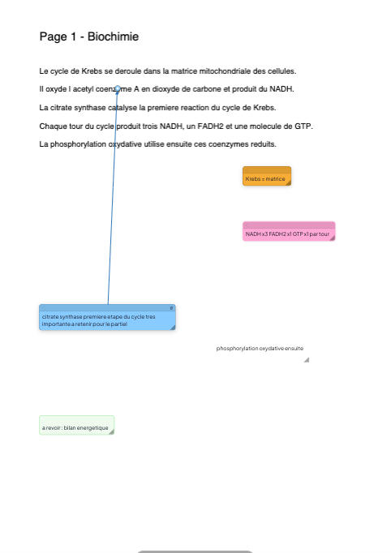 | 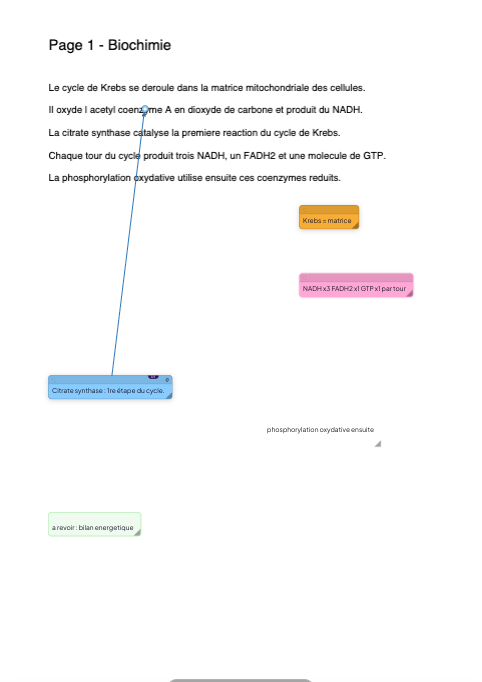 | 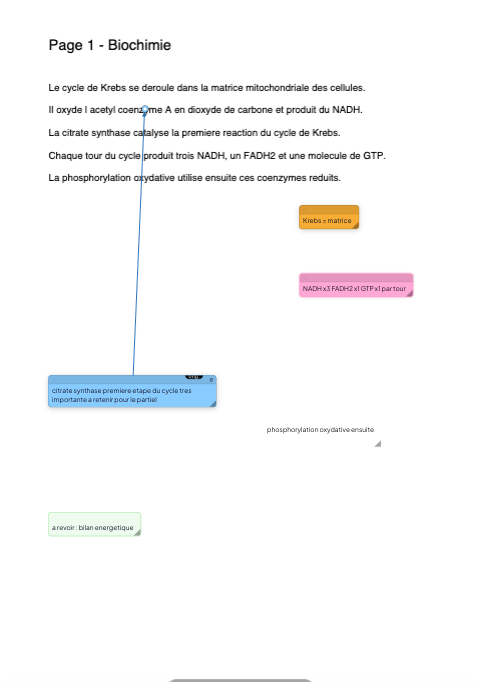 |

| Exporter | Importer (résumé) | Affichage | Mini barre et badge |
|---|---|---|---|
| 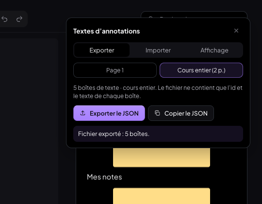 | 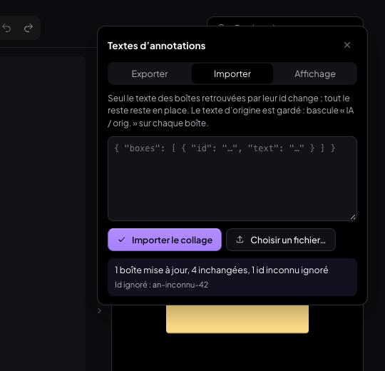 | 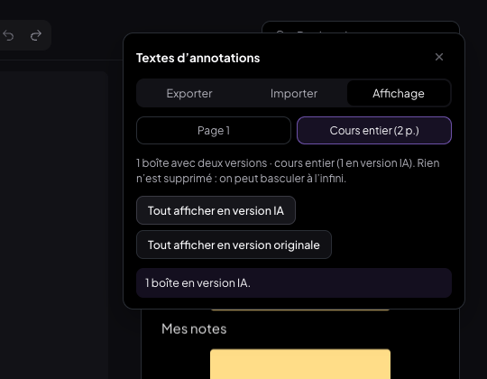 | 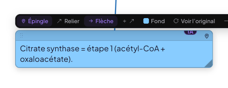 |

| 2ᵉ appareil : version IA reçue | Ordi : original après bascule faite sur le 2ᵉ appareil |
|---|---|
|  | 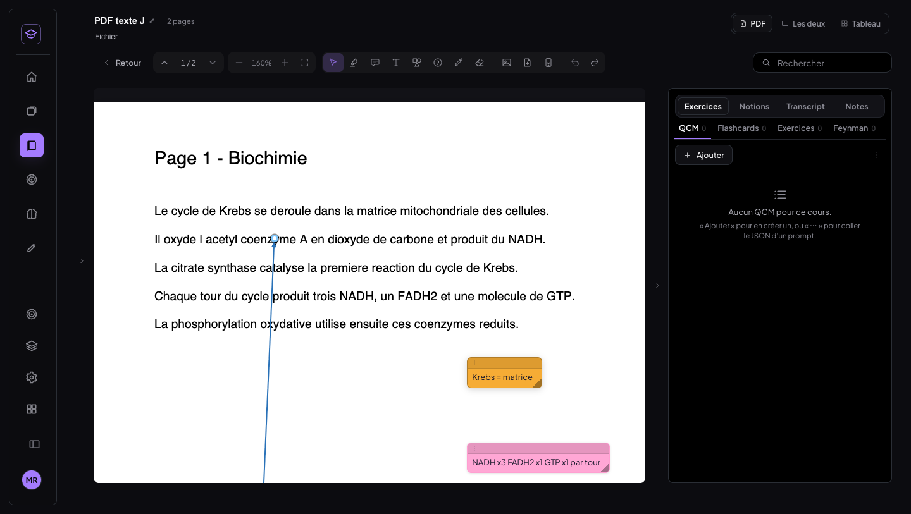 |

---

## Tablette (820 × 1 180, tactile émulé)

| Test | Résultat |
|---|---|
| Document : tap dans P2, puis tap sur « Insérer une image » | ✅ bloc sous P2 |
| Surligneur **au stylet** sur le texte du document | ✅ surligné → milieu retiré (scindé) → portion recolorée |
| Panneau « Textes d'annotations » | ✅ entièrement à l'écran |
| Import au doigt | ✅ « 1 boîte mise à jour » |
| Bascule par boîte au doigt | ✅ alt → original → alt |

Aucune exception JS.

| Image au doigt | Surligneur au stylet | Import | Bascule |
|---|---|---|---|
|  | 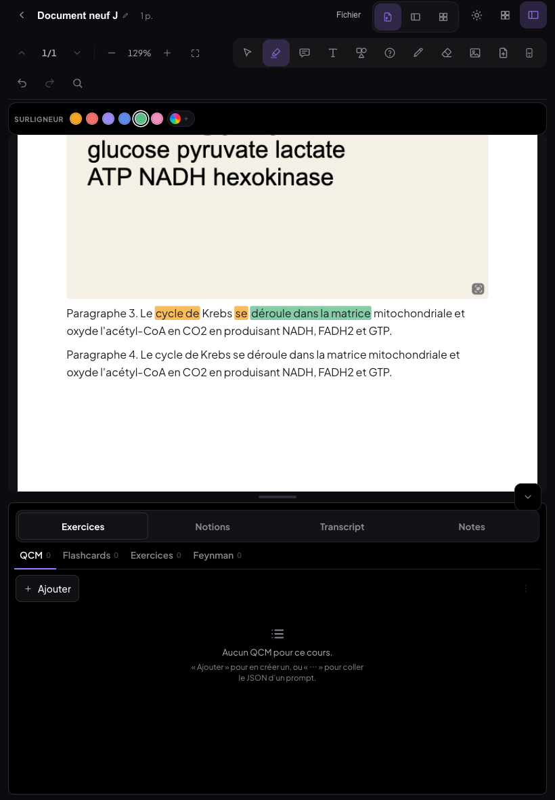 | 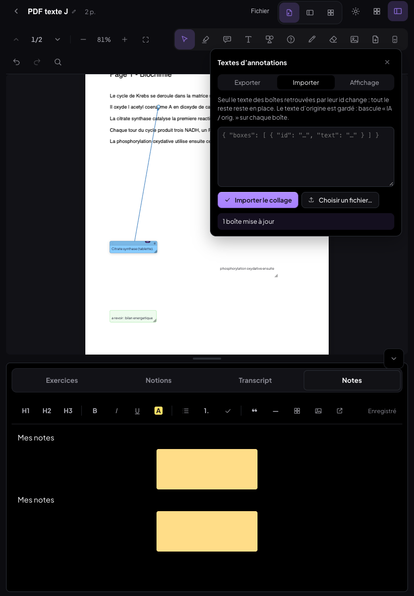 | 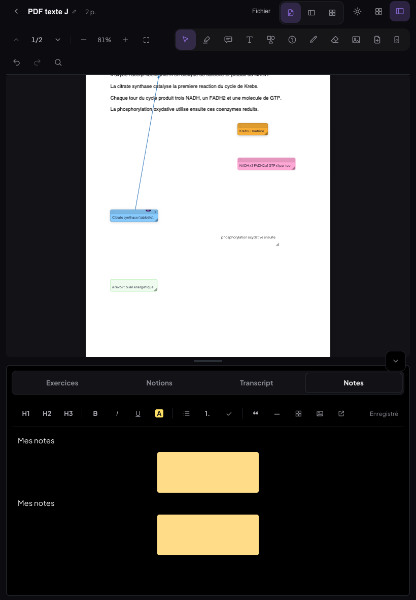 |

---

## Non-régression

- **Annotations d'avant inchangées.** La page 1 de « PDF texte J » a été rendue par l'ancienne version
  (`e872af5`, servie par `git worktree` sur le même port) puis par la nouvelle. Elle porte 5 boîtes, dont une
  avec flèche, et un surlignage posé avec l'ancienne version. Les deux captures sont **identiques octet pour
  octet** (`nr-avant.png` / `nr-apres.png`).
- **MealWeek** : builds de production des deux versions, servis tour à tour sur la même origine. Ordinateur et
  téléphone : **PNG identiques**, et chaque version est stable d'une capture à l'autre.
  - En mode dev, la capture ordinateur variait de 4 pixels entre les deux versions. C'est un artefact : les
    styles de MedRevise restent injectés après la navigation. Il n'apparaît pas sur les builds.
- **Tests du lecteur v2 rejoués** :
  - `t1-boite` : mise en forme d'une boîte, fermeture au clic dehors ;
  - `t-annuler doc` : annuler / rétablir la frappe ;
  - `t1-barre` : 20 bascules, 0 barre manquée, 0 saut.

  Tous passent.
- **Builds** : `npm run build` vert à chaque commit. Les états intermédiaires ont aussi été vérifiés.

**Passe finale** : `journal-final` du banc, 86 ✅ et 1 ❌. Le ❌ venait de l'assertion « onglet Notes ». Elle
comptait les images en absolu alors que les notes en gardaient une d'un passage précédent. L'image avait bien
été insérée en bloc. Le test a été corrigé pour compter l'écart, puis relancé : 4/4 ✅.

## Ce qui reste simulé ou non couvert

- Le « tactile » est l'émulation de Chrome (taps, stylet `pointerType: pen`), pas un iPad réel.
- Le glisser de sélection au **doigt** n'a pas été testé. Le surligneur sur tablette a été testé au stylet.
- Le décompte des images converties porte sur le jeu de test. Sur tes données, chaque document est converti à
  sa première ouverture. Le comptage préalable se fait avec la requête en lecture seule fournie.
- Les surlignages « sans ancre » (avant le 30/09) gardent l'ancienne règle, puisqu'on ne peut pas les découper.

## Commits

| Hash | Message |
|---|---|
| `51c90fa` | feat(medrevise): dans un document, toute image ajoutée devient un bloc du flux |
| `4fd4409` | fix(medrevise): repasser au surligneur — même couleur retire, autre couleur remplace, à la portion près |
| `430b9b4` | feat(medrevise): aller-retour JSON des textes d'annotations, avec version d'origine et version IA |
| `7cf315e` | fix(medrevise): lecteur ouvert — les boîtes changées sur un autre appareil s'affichent après la synchro |
| `756fb00` | style(medrevise): badge IA / orig. décalé pour ne pas couvrir l'épingle de la boîte |
| `f7adaea` | docs(medrevise): compte rendu images / surlignage / JSON, tests et requête SQL en lecture seule |

Fichiers nouveaux :

- `src/medrevise/lib/resurlignage.js`
- `src/medrevise/documents/lib/notionMarks.js`
- `src/medrevise/lib/textesAnnotations.js`
- `src/medrevise/pdf/TextesAnnotations.jsx`
- `scripts/tests-images-json/`
- `supabase/compte-images-textes-annotations.sql`
