# Nettoyage et cohérence visuelle — création de document, document = lecteur PDF, Bibliothèque, Flashcards (08/10/2026)

Quatre points livrés ensemble.

**Conditions de test**
- Chrome piloté en CDP (headless), avec de vrais événements souris, clavier, tactiles et stylet (`pointerType: pen`).
- Données locales isolées : aucune écriture Supabase, `VITE_SUPABASE_URL` vide.
- Bureau 1 440 et 1 200 px, tablette (iPad mini, iPad Air, iPad paysage), mobile 390 et 480 px.

---

## 1. Fenêtre « Nouveau document » refaite (et « Importer un PDF » identique)

**Avant** : des rangées de puces pour le cours et la matière, et un champ Titre blanc, hors DA.

**Maintenant** : une seule fenêtre, `components/FenetreCreation.jsx`.
- Modale compacte (440 px), centrée, fond et bordure de la DA.
- Contenu, dans l'ordre :
  - **Titre** : champ sombre, focus accent, placeholder « Titre du document », autofocus ;
  - **Cours de destination** : menu déroulant avec pastille de couleur, « + Nouveau cours » en bas du menu ;
  - **Matière** : même menu, filtré par le cours choisi, « + Nouvelle matière » en bas ;
  - **Annuler / Créer**.
- **Pré-remplie** avec le contexte, par ordre de priorité :
  1. la matière depuis laquelle on clique (menu « ⋯ » d'une matière → « Nouveau document ») ;
  2. sinon celle du cours ouvert ;
  3. sinon la dernière utilisée ;
  4. sinon le premier cours.
- **Clavier** : Entrée crée. Échap ferme d'abord un menu ouvert, puis la fenêtre. ↑ ↓ et Entrée parcourent un menu.
- **« Importer un PDF »** (fichier glissé sur l'arbre, Bibliothèque comme Réviser) passe par **la même fenêtre**. Elle a en plus :
  - le nom du fichier sous le titre (et le dossier visé) ;
  - la date de premier passage (J0), un réglage qui existait déjà et reste disponible.

| Tests (`t-creation.mjs`) | Résultat |
|---|---|
| Ouverture depuis la Bibliothèque : ≤ 440 px, ordre Titre / Cours / Matière, focus dans Titre | ✅ |
| Champ sombre de la DA, focus accent, placeholder « Titre du document » | ✅ |
| Tab puis ↓ ouvre le menu « Cours » ; Échap ferme le menu, la fenêtre reste | ✅ |
| « + Nouvelle matière » en bas du menu : créée et sélectionnée | ✅ |
| Échap (menu fermé) : fenêtre fermée, rien de créé | ✅ |
| Depuis le menu d'une matière : cours **et** matière déjà sélectionnés | ✅ |
| Entrée = créer : le document est rangé dans la matière choisie et s'ouvre | ✅ |
| Dépôt d'un PDF : **même fenêtre**, pré-remplie là où le fichier a été lâché, + J0 ; Échap annule | ✅ |

| Avant | Après |
|---|---|
| 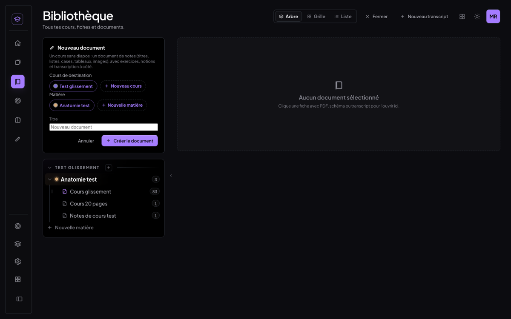 | 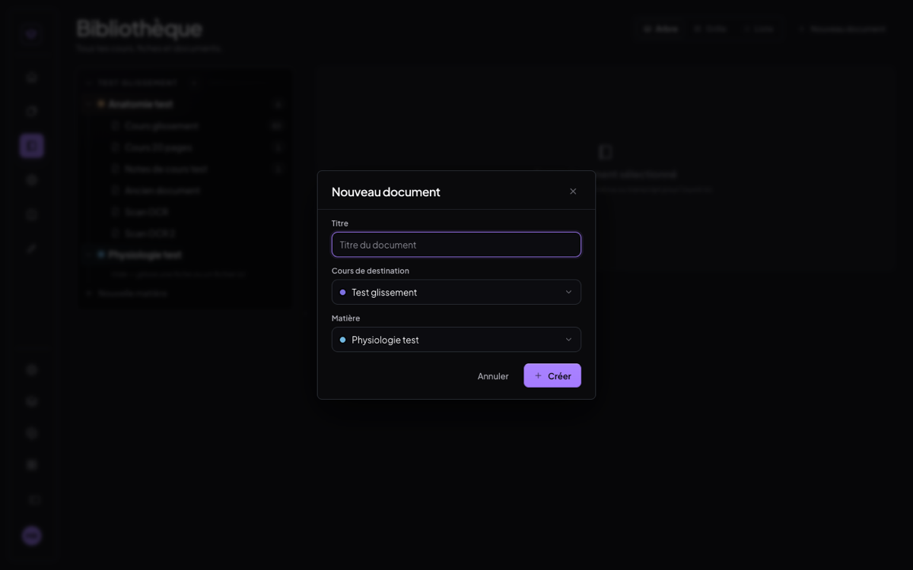 |
| 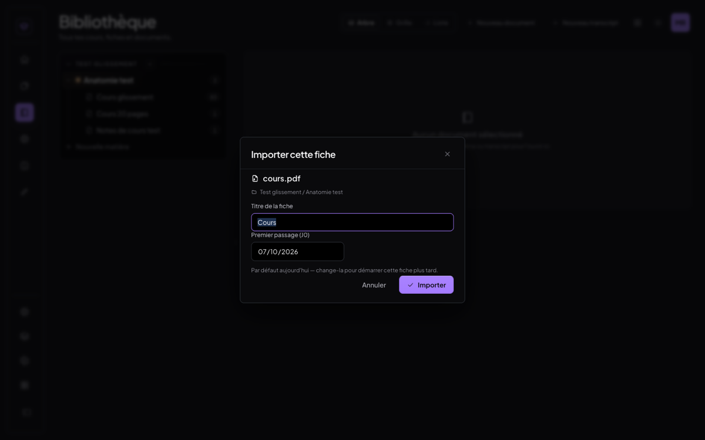 | 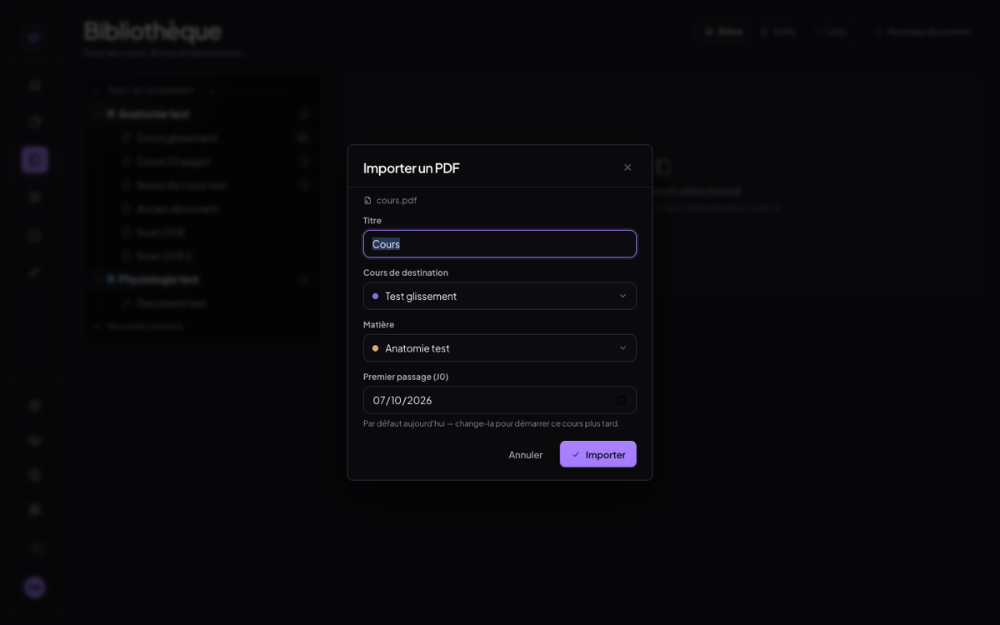 |
| | 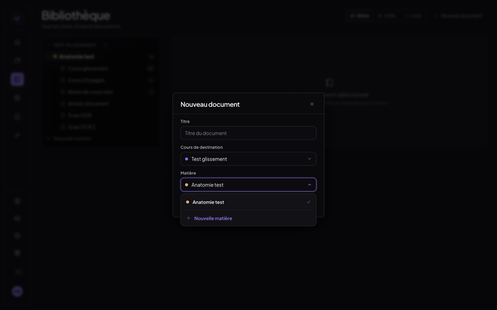 |

---

## 2. Un document s'ouvre exactement comme un PDF

**Avant** : un éditeur plein écran à part (`documents/DocumentCours.jsx`), avec ses propres barres. Il est supprimé.

**Maintenant** : un document s'ouvre **dans le lecteur PDF** (`pdf/PdfReader.jsx`). On y retrouve :
- les mêmes composants : en-tête, menu Fichier, barre d'outils, icônes, panneau latéral (Exercices · Notions · Transcript · Notes) ;
- le même mode focus et le même mode tablette.

À la place du PDF, il y a des **pages A4 blanches** (595 × 842).

**Écrire sur les pages** (`pdf/PageTexte.jsx`)
- Le texte riche est celui de l'éditeur existant (`NOTES_EXTENSIONS`) : titres, listes, cases, tableaux, citations, liens, images collées ou glissées, saisie Markdown, raccourcis.
- Le texte est mis en page à l'échelle de la page puis agrandi. Les retours à la ligne sont donc les mêmes à tous les zooms et à l'impression.
- **Débordement automatique** : quand le texte atteint le bas de la page, la suite part sur la page suivante (créée au besoin) et on continue d'y écrire.
  - Ce qui est tapé pendant le passage d'une page à l'autre n'est ni perdu ni mis dans le désordre.
  - Retour arrière en début de page : le premier bloc remonte sur la page précédente.
- **Barre de mise en forme** : c'est **celle des boîtes de texte du PDF** (gras, italique, souligné, barré, taille, police, couleur, surligneur de fond, listes, alignement, annuler / rétablir), complétée par titres H1–H3, cases, citation, tableau, séparateur, image et lien.
  - Elle flotte en bas de la zone de lecture : la page ne bouge pas quand elle apparaît.

**Annoter avec tous les outils du PDF** : surligneur, boîte, texte libre, formes, « ? », crayon, gomme, images, annuler / rétablir.
- Les annotations sont stockées en coordonnées de page, exactement comme sur un PDF.
- Le **surligneur** sur le texte en fait une **notion**, comme sur un PDF.
  - Elle apparaît dans le panneau Notions (« p. 1 ») ; un clic y ramène.
- Une sélection affiche une petite bulle : **Notion · Flashcard**.
  - Flashcard ouvre la carte d'ajout, recto pré-rempli.

**Pages, fond, exports, position**
- **Ajouter une page** : « Insérer une page ici » entre deux pages, ou le bouton Page de la barre, comme sur un PDF.
- **Fond de page blanc / noir** (menu Fichier), mémorisé par document et synchronisé :
  - en noir, le texte s'inverse ;
  - les annotations gardent leurs couleurs, une encre sombre devient claire.
- **Exports** (menu Fichier) :
  - **PDF** : toutes les pages, à l'échelle A4 (texte, dessins, images, boîtes), toujours sur fond blanc ;
  - **Markdown** : le texte de toutes les pages, dans l'ordre, images incluses.
- **Position de lecture** mémorisée comme pour un PDF (type `reading_position`, synchronisé) : même page, même endroit.
- **Recherche** de la barre : elle trouve aussi le texte des pages. Chaque occurrence est surlignée et amenée à l'écran.

**Stockage** (types existants, rien d'écrit sur Supabase)
- Les pages sont des « pages ajoutées » (`annotations`, kind `page`).
- Le texte de chaque page est dans `notes_doc.pages`, et le fond dans `notes_doc.fond`. Ce sont des champs ajoutés au même enregistrement synchronisé.
- **Aucune migration SQL** n'est nécessaire.

| Tests (`t-doc.mjs`, `t-doc2.mjs`, `t-fond.mjs`, `t-compare.mjs`, `t-recherche.mjs`, `volet-doc.sh`) | Résultat |
|---|---|
| Document créé : ouvert dans le lecteur, une page A4 | ✅ |
| Texte riche sur la page (titres, puces, cases, citation, gras, italique) ; barre de mise en forme du lecteur | ✅ |
| Débordement en tapant vite : 26 paragraphes, chacun le sien, dans l'ordre, sur 3 pages ; curseur sur la dernière ; aucune page ne déborde | ✅ |
| Image du presse-papiers : **dans** le texte si le curseur y est, **posée sur la page** sinon | ✅ |
| Surligneur sur le texte → notion ; un clic dans Notions ramène au passage | ✅ |
| Crayon, forme, boîte de texte, gomme, ⌘Z | ✅ |
| « Insérer une page ici » | ✅ 3 → 4 pages |
| Fond noir, mémorisé ; encre noire rendue claire, couleurs claires gardées ; retour au blanc | ✅ |
| Export .md (toutes les pages, dans l'ordre, image incluse) | ✅ |
| Export PDF (4 pages A4, texte + dessin + 2 images, fond blanc) ; le lecteur retrouve son zoom | ✅ |
| Fermer / rouvrir : même page, même endroit (page 2, 50 %) | ✅ |
| Sélection → bulle Notion · Flashcard ; recto pré-rempli | ✅ |
| Ancien document (texte d'avant le 08/10) : texte déplacé sur ses pages, 40 paragraphes dans l'ordre, rien de perdu | ✅ |
| « Importer un PDF… » : le document devient un cours PDF, ses pages écrites restent (avant le PDF) | ✅ |
| **Côte à côte avec un PDF** : même en-tête, même barre (13 outils, mêmes icônes, même ordre), mêmes commandes, mêmes fonds / bordures / états, même panneau | ✅ identiques |
| Rechercher dans le document | ✅ |
| Mode focus : même comportement depuis un document et depuis un PDF | ✅ |
| Tablette (iPad mini, Air, paysage) : outils tous visibles, aucune barre qui défile, cibles ≥ 40 px, volet, doigt / stylet / paume, transcription | ✅ 36 / 36 |
| Ordinateur 1 200 px : pas de mode tablette, barre complète | ✅ |

| PDF | Document (mêmes barres, même panneau) |
|---|---|
| 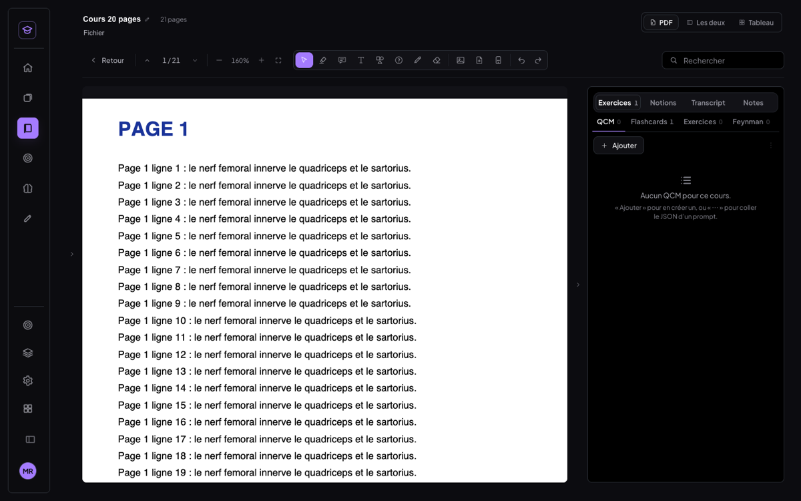 |  |

| Avant : l'éditeur à part | Après : écrire, la barre flotte en bas |
|---|---|
| 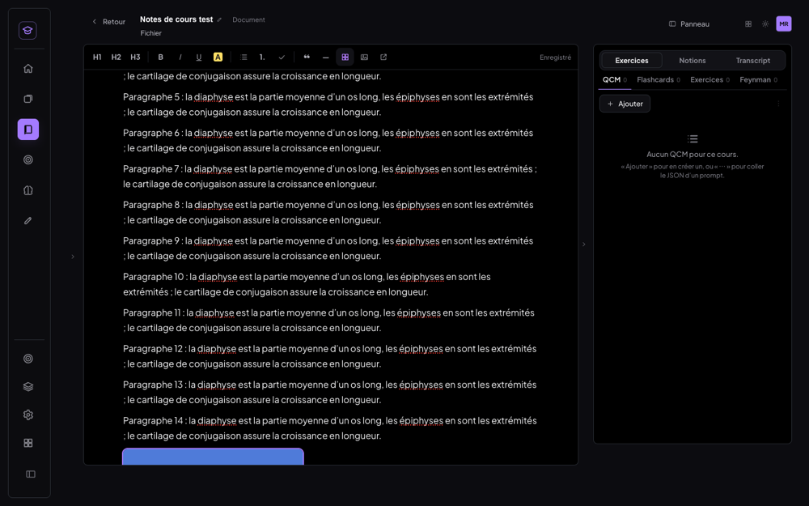 | 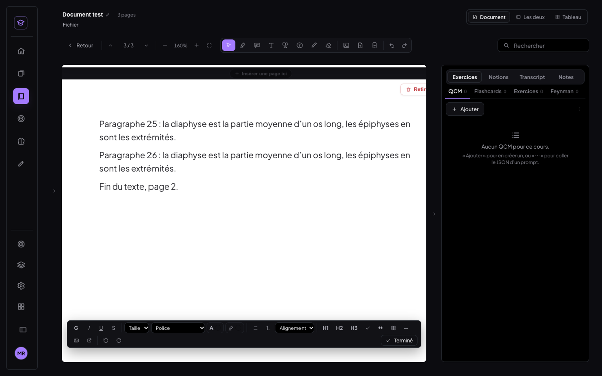 |

| Annoté (image collée, image posée, notion, crayon, forme, boîte) | Fond noir |
|---|---|
| 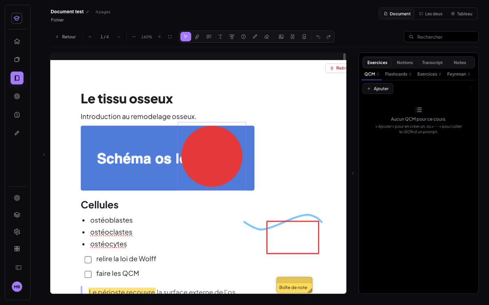 | 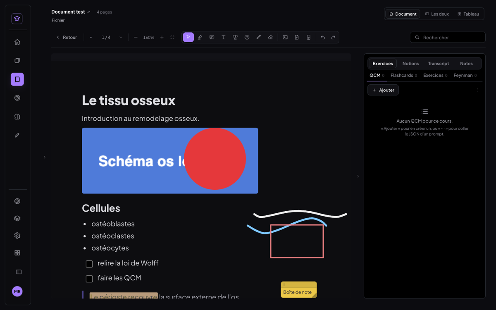 |

| Export PDF (page 1) | Flashcard depuis une sélection |
|---|---|
| 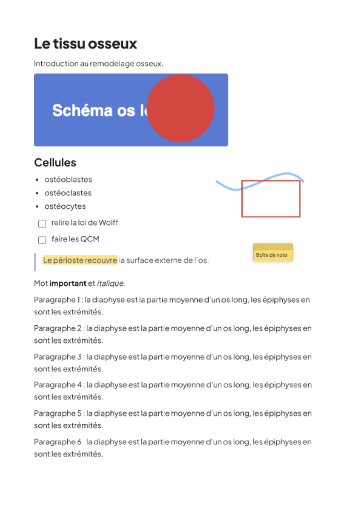 | 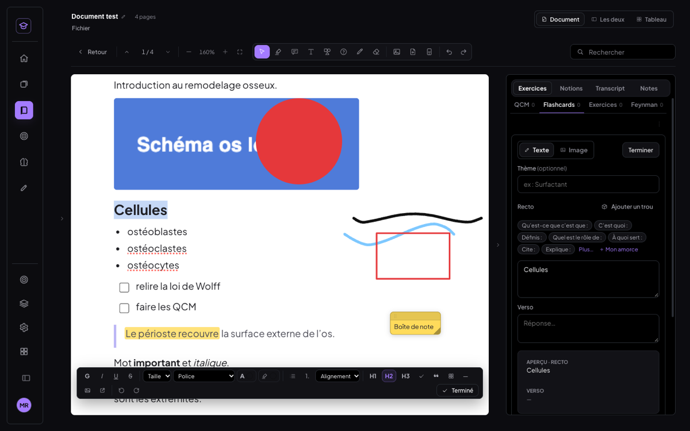 |

| iPad portrait | iPad paysage |
|---|---|
| 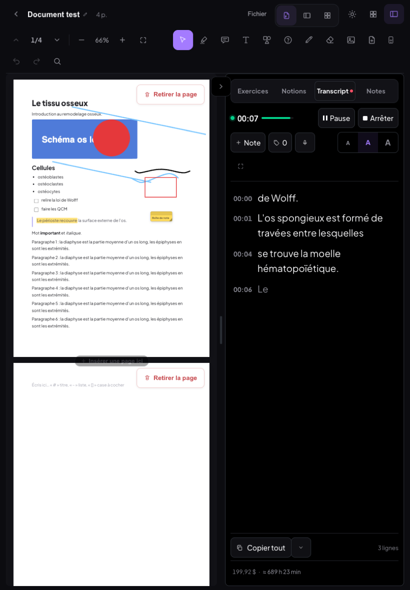 | 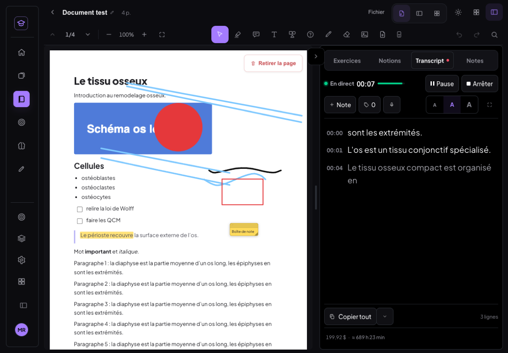 |

---

## 3. Bibliothèque : ce qui n'avait rien à y faire

- **OCR** :
  - le panneau de progression a quitté la Bibliothèque, l'OCR tourne en silence ;
  - sa progression **et** son bouton Pause / Reprendre sont dans **Réglages → Reconnaissance de texte**, avec le lancement sur un dossier qui y était déjà ;
  - le menu Fichier de chaque cours garde son état (« en cours 6/8 pages », « terminée · 94 % »…).
- **Barre du haut** : « + Nouveau transcript », l'icône grille, le bouton de thème et l'avatar sont retirés.
  - Les sessions de transcript se créent dans le mode Transcript d'un cours.
  - Changer d'app reste dans la barre de navigation.
  - Restent : le titre, les modes d'affichage et « Nouveau document ».
- **Menu utilisateur** : clic sur l'avatar MR, **en bas de la barre de navigation**. Il propose :
  - thème clair / sombre ;
  - Réglages ;
  - Synchroniser maintenant (avec l'état de la synchro).

| Tests (`t-biblio.mjs`, avec un OCR qui tourne : PDF scanné de 8 pages importé juste avant) | Résultat |
|---|---|
| Aucun panneau ni mention d'OCR dans la Bibliothèque pendant l'OCR (page 2/8 en cours) | ✅ |
| Plus de « Nouveau transcript », d'icône grille, de thème ni d'avatar dans la barre | ✅ |
| Avatar → menu : thème, Réglages, synchro ; le thème bascule | ✅ |
| Réglages → Reconnaissance de texte : progression, Pause, relancer un dossier | ✅ |
| Menu Fichier du cours : état de l'OCR | ✅ |

| Avant (OCR en cours) | Après (OCR en cours) |
|---|---|
| 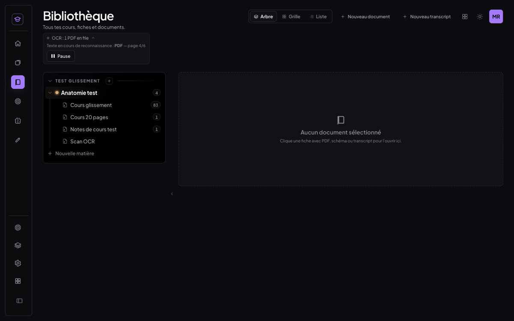 | 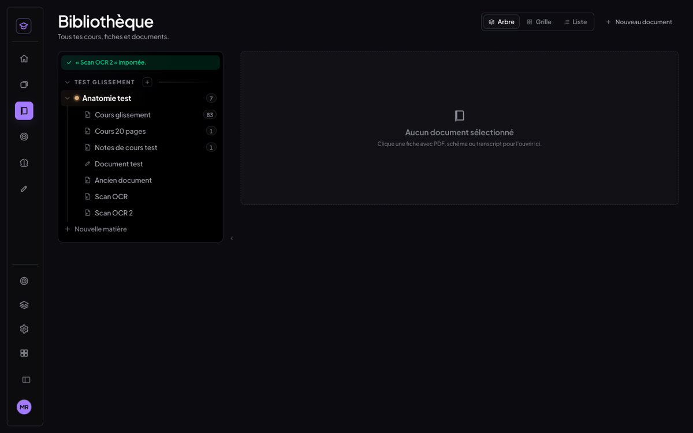 |

| Menu de l'avatar | Réglages → Reconnaissance de texte |
|---|---|
| 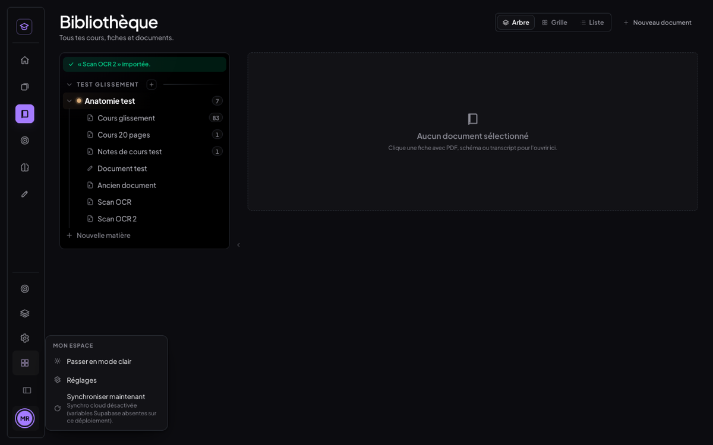 | 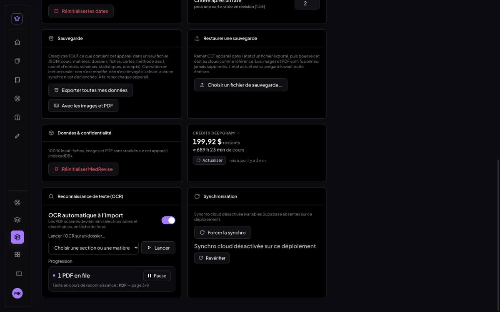 |

---

## 4. Panneau d'un cours → Flashcards : la séance du jour en est retirée

- L'onglet Flashcards d'un cours sert à gérer **ses** cartes : « + Ajouter », la liste recto / verso, l'édition et la suppression.
- En haut, **une ligne discrète**, cliquable vers l'espace Réviser : « 83 cartes · 68 nouvelles · 15 à revoir aujourd'hui ».
- La **séance quotidienne** (révisions et apprentissage, toutes matières) est **en tête de Réviser**, avec son bouton Démarrer / Reprendre.

| Tests (`t-seance.mjs`) | Résultat |
|---|---|
| Plus de bloc « Aujourd'hui · Séance commencée · Reprendre » dans le panneau | ✅ |
| Ligne « N cartes · X nouvelles · Y à revoir aujourd'hui » ; « + Ajouter » juste dessous | ✅ |
| Clic sur la ligne → Réviser : « Séance commencée · 15 cartes restantes » | ✅ |
| « Reprendre la séance » repart exactement où elle en était (15 restantes) ; quitter → état intact | ✅ |

| Avant | Après (panneau) | Après (Réviser) |
|---|---|---|
| 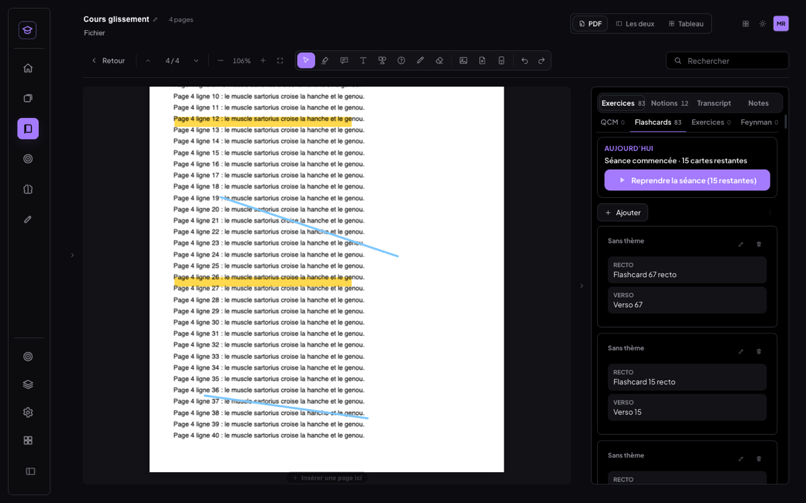 | 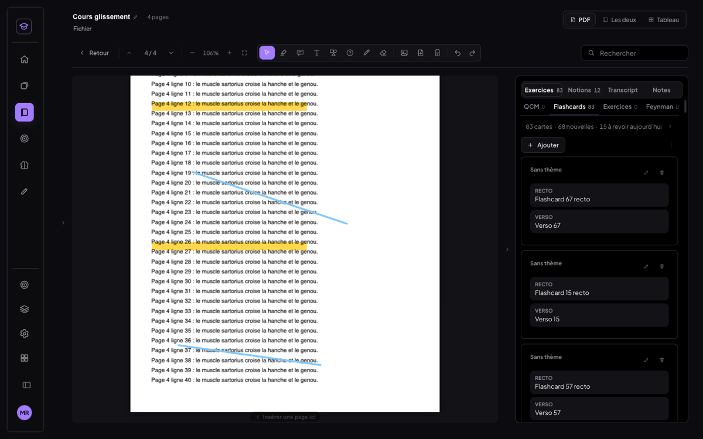 | 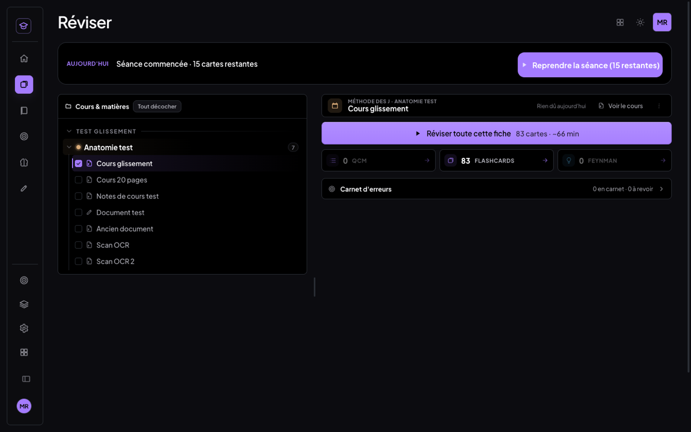 |

---

## Non-régression

| | Résultat |
|---|---|
| Mobile 390 et 480 px | ✅ captures **identiques à l'octet** entre `eae159c` et maintenant (mêmes données, même port) |
| Glissement du panneau, ordinateur (final-desk) | ✅ 0 erreur console |
| Gestes v1.4 (t-v14) | ✅ 9 / 9 au trackpad, 9 / 9 au doigt |
| Lecteur PDF : barres, outils, panneau | ✅ inchangés (comparaison ci-dessus) |
| MealWeek | ✅ ouverte depuis le hub, 0 erreur |
| `git diff eae159c -- src/mealweek src/shared src/styles/design.css src/App.jsx src/Selecteur.jsx` | ✅ **vide** |
| Build | ✅ `npm run build` vert |

**Deux défauts anciens trouvés en testant, et corrigés** :
1. **Reprise de position bloquée.** Quand le zoom et la disposition mémorisés étaient déjà les bons, la zone de lecture restait masquée (rien ne relançait la pose du défilement). Cela touchait aussi les PDF.
2. **Imprimer fermait le cours ouvert.** Pendant une impression (⌘P, « Enregistrer en PDF »), la largeur du papier faisait basculer l'app en affichage mobile, ce qui démontait le lecteur.
   - Le choix bureau / tablette / mobile est maintenant figé pendant l'impression (`lib/tablette.js#useHorsImpression`).

---

## Décisions prises seul

1. **Focus « teal »** : la DA n'a pas de teal. Le focus des champs prend la couleur d'accent de l'app, comme tous ses champs.
2. **Import = même fenêtre, plus un champ** : la date de premier passage (J0) existait déjà à l'import ; elle est gardée sous la matière, dans le même style.
3. **« Nouveau document » reste dans la barre de la Bibliothèque**, à côté des modes d'affichage, et entre dans le menu « ⋯ » de chaque matière. La barre n'est pas vide : elle ne garde que l'utile.
4. **Pages d'un document = pages ajoutées du lecteur** (stockage déjà existant). Résultat : mêmes outils, même annuler / rétablir, mêmes exports d'annotations, sans nouveau type de données.
5. **Un éditeur par page, avec débordement automatique** plutôt qu'un seul long texte coupé à l'affichage. C'est ce qui permet d'annoter en coordonnées de page, comme sur un PDF.
6. **Barre de mise en forme du texte = celle des boîtes de texte du PDF**, complétée, **flottante en bas**. Placée en haut, elle décalait toute la page au premier clic dans le texte.
7. **Surligner du texte de document = créer une notion**, comme le surligneur d'un PDF.
8. **Fond noir** :
   - le papier et le texte s'inversent ;
   - les annotations gardent leurs couleurs (un bleu clair reste lisible), une encre sombre est éclaircie dans la même teinte ;
   - les images ne changent pas ;
   - l'export PDF est toujours sur fond blanc.
9. **Export PDF d'un document = impression des pages** (« Enregistrer en PDF ») à l'échelle A4, et non pdf-lib : le texte riche (titres, listes, tableaux, images) n'y serait pas dessiné fidèlement.
10. **L'onglet « Notes » est gardé dans un document**, pour avoir le même panneau qu'un PDF : ce sont des notes à côté des pages.
11. **Ancien document** : son texte est **déplacé** sur sa première page (puis il déborde sur les suivantes), rien n'est copié en double. L'éditeur à part (`DocumentCours.jsx`) et sa position par bloc sont supprimés.
12. **Importer un PDF dans un document** : le cours devient un cours PDF et **ses pages écrites restent**, avant le PDF. Avant, le texte devenait l'onglet Notes : avec des pages annotables, les garder telles quelles est plus fidèle.
13. **Menu avatar** :
    - thème, Réglages et synchro y sont, sur tous les écrans d'ordinateur ;
    - l'avatar et le thème quittent la barre de la Bibliothèque et l'en-tête du lecteur sur ordinateur ;
    - les autres écrans (Accueil, Réviser…), non visés, gardent leur en-tête ;
    - l'en-tête tablette garde ses boutons (exigence du chantier tablette : tout visible).
14. **Ligne d'information Flashcards** :
    - « nouvelles » = jamais commencées ;
    - « à revoir aujourd'hui » = révisions dues + cartes en apprentissage du jour.
15. **Séance du jour sur mobile** : l'accueil mobile garde la sienne (identique à l'octet), car le mobile n'a pas d'écran Réviser.
16. **`@tiptap/pm`** passe en dépendance directe. Il était déjà installé (même version 3.27.3, dépendance de TipTap) ; seule la déclaration est ajoutée.

## Limites connues

- **Bloc plus haut qu'une page** (très grande image, paragraphe démesuré) : il reste sur sa page, rogné en bas. Il n'est pas coupé en deux.
- **Supprimer du texte ne fait pas remonter automatiquement la page suivante** : seul le retour arrière en tout début de page remonte un bloc.
- **Historique** : ⌘Z du texte est propre à chaque page. ⌘Z des annotations est global, comme sur un PDF.
- **Recherche dans un document** : elle trouve une occurrence à l'intérieur d'un même morceau de texte. Un mot coupé par une mise en forme (moitié en gras) n'est pas trouvé.
- **Export Markdown** : il contient le texte des pages, pas les dessins ni les formes (le .md n'a pas de calque). Le PDF les contient.
- **Synchro en direct** : le texte d'une page modifié sur un autre appareil arrive à la réouverture du document, pas pendant l'écriture.
- **Matériel** : pas d'iPad ni d'Apple Pencil réels (tactile et stylet émulés par Chrome), et pas de vraie transcription (faux Deepgram).

## Commits

| Commit | Message |
|---|---|
| `afab594` | feat(medrevise): document = le lecteur PDF avec des pages blanches · fenêtre de création commune · Bibliothèque épurée · séance du jour dans Réviser |
| `d6f75f5` | docs(medrevise): compte-rendu nettoyage & document (captures avant/après, décisions, limites) |
| (ce commit) | docs(medrevise): compte-rendu — liste des commits |
