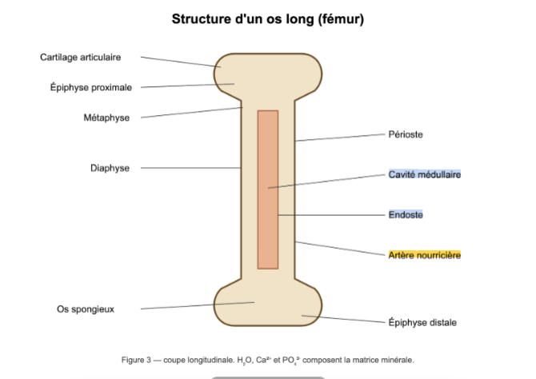
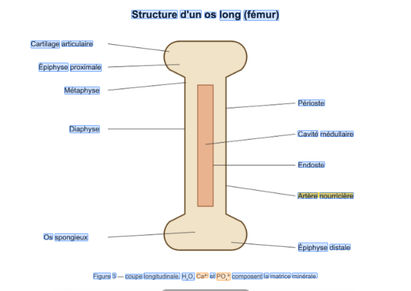
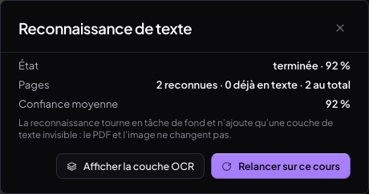
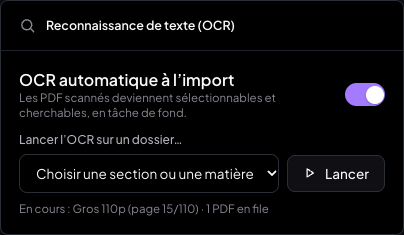
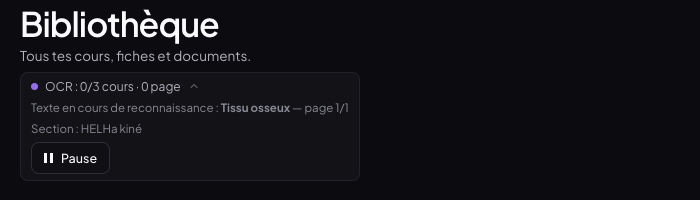
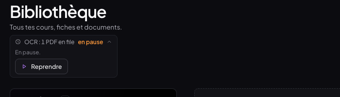

# Compte-rendu — Couche de texte OCR sur les PDF image (05/10/2026)

Les PDF scannés, les diapos exportées en image et les schémas deviennent **sélectionnables,
copiables, surlignables et cherchables (⌘F)**, à la manière du Live Text d'Apple. Le texte
reconnu est une **couche invisible posée sur la page** : le PDF d'origine n'est jamais
modifié et aucun pixel ne change à l'écran.

| | |
|---|---|
|  |  |
| Sélection à la souris de deux étiquettes d'un schéma scanné (« Cavité médullaire », « Endoste ») ; « Artère nourricière » est surlignée. | Fichier › « Afficher la couche OCR » : une boîte par mot reconnu. En orange, les mots à faible confiance (ici les formules chimiques). |

---

## 1. Ce qui a été livré

- **Moteur local** : Tesseract.js 7.0.0 dans un Web Worker, langues `fra+eng`, modèles
  `4.0.0_best_int`. Tout est auto-hébergé sous `/tesseract/` (worker, cœur wasm, modèles) :
  **aucun CDN, aucune clé, aucun service externe**. Les modèles sont mis en cache par le
  navigateur (IndexedDB de Tesseract) après le premier téléchargement.
- **Interface moteur interchangeable** (`ocr/moteur.js`) : `recognizePage(imageBitmap) →
  { confidence, mots[{ t, x, y, w, h, c, line, para }] }`. Tesseract est la seule
  implémentation (`ocr/moteurTesseract.js`).
- **Couche texte dans le lecteur** : un `<span>` transparent par mot, dimensionné sur sa
  boîte, dans le même calque que la couche texte native de pdf.js. Sélection, copie,
  surlignage, création de notion, ⌘F et propositions de mots-clés de la transcription
  marchent donc comme sur un PDF texte.
- **Menu Fichier › « Reconnaissance de texte »** : état (non lancée / en cours x/y /
  terminée · confiance moyenne), pages reconnues, pages déjà en texte, **pages à faible
  confiance (< 70 %) signalées**, « Relancer sur ce cours », bascule de débogage
  « Afficher la couche OCR ».
- **Déclenchement automatique à l'import** de tout PDF : la lecture est immédiate, l'OCR
  tourne en fond page par page, **en priorité sur la page affichée et ses voisines**,
  enregistré page par page et **repris après un rechargement**.
- **OCR initial en masse de la section « HELHa kiné »** (toutes ses matières et sous-dossiers,
  **jamais « Rattrapage »**), un cours à la fois, au premier démarrage qui suit le
  déploiement. Panneau repliable dans la Bibliothèque (« OCR : 1/3 cours · 2 pages ») avec
  **Pause / Reprendre**.
- **Réglages › Reconnaissance de texte (OCR)** : « OCR automatique à l'import » (activé par
  défaut sur ordinateur) et « Lancer l'OCR sur un dossier… » (section ou matière au choix).
- **Données** : nouveau type `ocr_layer`, ajouté sans rien modifier d'existant, synchronisé
  par le même canal que les autres enregistrements (outbox → `medrevise_push`, garde-fou
  `updated_at`). Un autre appareil **reçoit la couche et ne recalcule rien**.

| Menu Fichier › Reconnaissance de texte | Réglages |
|---|---|
|  |  |

| Panneau Bibliothèque pendant la masse | En pause |
|---|---|
|  |  |

---

## 2. Pipeline retenu (une page)

`ocr/pipeline.js#traiterPage` :

1. **Texte natif d'abord** : `page.getTextContent()`. Avec **≥ 30 caractères visibles**, la
   page garde son texte natif et n'est pas traitée (`{ natif: true }`). Les PDF mixtes sont
   donc gérés page par page.
2. **Rendu** par pdf.js (intent `print`, fond blanc) à **~300 dpi** (échelle 300/72 ≈ 4,17),
   au moins 2×, plafonné à **12 Mpx** (un A4 ou une diapo 16:9 tiennent vers 9 Mpx).
3. **Prétraitement** : recopie sur un `OffscreenCanvas` avec `grayscale(1) contrast(1.3)`
   → `ImageBitmap`. Les canvas sont ramenés à 1 px aussitôt pour libérer la mémoire.
4. **Reconnaissance** (`moteurTesseract.recognizePage`) : bitmap → PNG (encodé hors du fil
   principal) → `worker.recognize(…, { blocks: true })`.
   - Passe 1 : segmentation automatique (`PSM.AUTO`), `user_defined_dpi = 300`.
   - **Passe 2 pour les pages peu denses (< 80 mots)** en « texte épars » (`PSM.SPARSE_TEXT`).
     On n'en garde que les mots qui ne recouvrent aucun mot de la passe 1. Sans elle,
     4 étiquettes du schéma de test sur 13 n'étaient pas lues (« Périoste », « Cavité
     médullaire », « Endoste », « Figure 3… ») : la segmentation automatique les rattachait
     aux traits de rappel.
   - Le bitmap est fermé dès qu'il est encodé.
5. **Conversion** en **unités PDF** (viewport à l'échelle 1, origine en haut à gauche),
   arrondies au dixième de point. C'est le repère des annotations : `largeur × fraction`.
6. **Filtrage léger** (`motUtile`). Sont écartés :
   - les mots de confiance < 30 % ;
   - les « mots » faits uniquement de symboles (`|`, `—`, `=`…) ;
   - les lettres isolées sauf `à a y ô A À` (les « H », « O », « C » des formules) ;
   - les bribes de 1 à 2 caractères sous 50 % (hors nombres).

   Tout le reste est gardé, même imparfait.

**Rendu dans le lecteur** (`pdf/pdfShared.js#construireCoucheOcr`) : les mots sont triés par
ligne puis par x. Chaque mot porte une espace finale s'il a un voisin sur la même ligne, et
s'étend jusqu'à lui, pour que la sélection soit continue et que la copie donne « Cavité
médullaire » et non « Cavitémédullaire ». Un `<br>` termine chaque ligne. Position = boîte ×
échelle, `font-size` = hauteur de la boîte, `scaleX` ajusté à la largeur. Le texte est
transparent.

**Orchestration** (`ocr/service.js`) :
- une file persistée (`localStorage`), un seul PDF traité à la fois, une page à la fois ;
- la couche est écrite **après chaque page**, ce qui permet la reprise ;
- 25 ms de respiration entre deux pages ;
- le worker est libéré après 60 s d'inactivité ;
- une page en échec est marquée `{ erreur: true }` et la suite continue ;
- la pause est mémorisée et survit à un rechargement.

---

## 3. Données — type `ocr_layer`

Store IndexedDB `medrevise-ocr_layer`. **Une couche = un fichier PDF.**

```js
{
  id: 'ocr_<sha256 32 car.>_<version moteur>',   // ex. ocr_5a3ffe08…_7-0-0-best-int-sparse
  courseId, fileHash /* SHA-256 complet */, engine: 'tesseract',
  engineVersion: '7.0.0+best_int+sparse', langs: ['fra', 'eng'],
  status: 'en_cours' | 'complete', pageCount, pagesDone, confidence,
  pagesGz,   // JSON des pages, gzip (CompressionStream) puis base64
  createdAt, updatedAt,
}
// pages décompressées :
[{ pageIndex, width, height, natif?, erreur?, confidence, ms,
   words: [{ t, x, y, w, h, c, line, para }] }]   // x, y, w, h en unités PDF
```

- **Identifiant = SHA-256 du fichier + version du moteur** : le même PDF rattaché à deux cours
  (testé : « Os long » et sa copie) ou reçu d'un autre appareil n'est **jamais traité deux
  fois**. Changer de moteur ou de réglage (nouvelle version) relance proprement l'OCR.
- **Compression** : 10,6 Ko de JSON par page en moyenne → **2,7 Ko par page** une fois
  compressé (voir mesures).
- **Synchronisation** : par `creerSynchroIsolee('ocr_layer', { envoyable: complete })`
  (`lib/synchroIsolee.js`), la même mécanique que les sessions de transcription, extraite en
  fabrique générique pour l'occasion. Envoi un enregistrement par appel, après le lot commun.
  Réception ciblée : métadonnées d'abord, puis seulement les couches manquantes ou plus
  récentes. **Seules les couches complètes partent** ; une couche partielle reste locale.
  `ocr_layer` est exclu de `pullAllRecords`.
- **Sans la migration**, l'app fonctionne : la table est générique, la migration n'ajoute
  qu'un index.

---

## 4. Migration SQL à appliquer (non appliquée)

`supabase/migrations/20261005_ocr_layer.sql` — additive, idempotente, aucune ligne touchée.
À coller dans Supabase → SQL Editor → New query → Run :

```sql
create index if not exists medrevise_records_ocr_meta
  on public.medrevise_records (record_id, updated_at, deleted)
  where store = 'ocr_layer';

notify pgrst, 'reload schema';
```

Le fichier contient aussi deux requêtes de vérification en lecture seule.

---

## 5. Tests réalisés (Chrome, banc local, aucun accès au cloud)

Banc : Vite en local, faux Supabase (`scripts/faux-supabase.mjs`), faux Deepgram, Chrome
headless piloté en CDP. PDF de test fabriqués avec pdf-lib à partir d'images uniquement :
schéma d'os long annoté avec une ligne de formules (H₂O, Ca²⁺, PO₄³⁻), page de cours scannée,
liste dense, diapo colorée, tableau en petits caractères, PDF mixte (texte natif + scan +
schéma), PDF de 110 pages.

| Test | Résultat |
|---|---|
| Page schéma : sélection souris aux zooms **46 / 91 / 184 %** | « Cavité médullaire » sélectionné et copié à l'identique aux 3 zooms |
| Alignement des spans sur les boîtes OCR | écart max **0,02 px** aux 3 zooms |
| Copie (⌘C) | presse-papiers = « Cavité médullaire » |
| Surlignage droit | 2 rectangles, même hauteur, écart aux mots ≤ 2 px |
| Notion depuis la sélection | « Artère nourricière » apparaît dans le mode Notions |
| ⌘F d'un mot présent seulement dans l'image | « Endoste » trouvé, résultat surligné sur le mot |
| Mots-clés de transcription | proposés depuis les pages OCR (ostéocytes, système de Havers, canaux de Volkmann…) |
| Couche de débogage | 33 boîtes alignées sur le schéma, formules en orange |
| **PDF mixte** | page 1 : 31 spans natifs pdf.js, **0 OCR** ; pages 2 et 3 : OCR |
| **Import d'un PDF image** | lecture immédiate ; couche disponible ~2 s/page en fond |
| **110 pages**, page 50 affichée | l'OCR commence par 52, 47, 46, 56, 43… (autour de la page vue) |
| **Reprise après rechargement** | 31 pages conservées, la file repart seule, 38 pages 8 s plus tard |
| **Masse HELHa** | 3 cours traités un à un (Tissu osseux → Muscles → Os long), panneau à jour |
| **Rattrapage non touché** | aucune empreinte calculée, aucune couche pour le cours « Rattrapage » |
| `putBackup` avant la masse | sauvegarde `pre-ocr-masse-<ts>` (liste des 3 cours) |
| **Pas de doublon au 2ᵉ démarrage** | file vide, 3 couches, rien relancé (drapeau + empreintes) |
| Même PDF dans deux cours | une seule couche, partagée |
| **Pause / Reprendre** | 6 → 6 pages en 10 s en pause ; la pause survit au rechargement ; reprise ensuite |
| **Mémoire sur 110 pages** | tas JS de l'onglet **stable à 48–49 Mo** du début à la fin ; mémoire totale de Chrome 1,2–1,6 Go, en baisse en fin de traitement |
| **Aucun pixel ne change** | captures de la page avec et sans couche OCR **identiques à l'octet** |
| Annotations existantes | rectangles de surlignage aux mêmes coordonnées avec et sans couche |
| **PDF d'origine intacts** | SHA-256 en base = SHA-256 des fichiers sur disque (4/4, rattrapage compris) |
| **Synchro** | 5 couches complètes au faux cloud ; 2ᵉ appareil : 5 couches reçues, 229 mots affichés, **modèle Tesseract jamais téléchargé** |
| **Mobile** (390×844 tactile émulé) | OCR auto **désactivé par défaut** ; aucun wasm ni modèle chargé ; les couches synchronisées restent utilisables |
| Synchro des transcripts (refactor) | 17/17 sessions reçues sur le 2ᵉ appareil |
| **Build de production** | `/tesseract/*` émis dans `dist/` et servis (200) ; OCR complet sur le build |
| Console | aucune erreur (lecteur, Bibliothèque, Réglages) |
| **MealWeek** | builds avant (7da6bce) et après servis sur la **même origine** : hub et vue principale **identiques au pixel** ; aucun fichier de `src/mealweek/` ni de `src/shared/` modifié |

---

## 6. Mesures

Mac de développement, Chrome headless, page par page, mesuré par le pipeline lui-même
(rendu + prétraitement + reconnaissance + filtrage) :

| Page | Mots | Confiance | Temps | JSON |
|---|---|---|---|---|
| Schéma (os long annoté) | 33 | 90 % | 2,5 s | 2,6 Ko |
| Cours scanné (texte courant) | 196 | 94 % | 2,7 s | 14,8 Ko |
| Liste dense (myologie) | 379 | 93 % | 4,7 s | 29,5 Ko |
| Diapo colorée 16:9 | 29 | 94 % | 3,3 s | 2,2 Ko |
| Tableau en petits caractères | 50 | 93 % | 2,2 s | 3,9 Ko |
| **Moyenne** | | **93 %** | **3,1 s / page** | **10,6 Ko → 2,7 Ko compressé** |

- Le premier lancement télécharge ~4 Mo de cœur wasm et 3,6 Mo de modèles, ensuite en cache.
- Ordre de grandeur pour la section HELHa : **~1 h pour 1 000 pages** en fond, sans bloquer
  la lecture ; ~2,7 Mo de données synchronisées pour 1 000 pages.
- La seconde passe des schémas n'ajoute du temps qu'aux pages de moins de 80 mots.

---

## 7. Décisions prises seul

1. **Identifiant de couche = empreinte SHA-256 + version du moteur**, et non l'id du cours :
   une même couche sert à tous les cours qui pointent vers le même fichier, et à tous les
   appareils. `courseId` est gardé à titre indicatif (premier cours rencontré).
2. **Pages compressées (gzip + base64) dans `pagesGz`**, avec le schéma documenté ci-dessus :
   quatre fois moins de volume local et synchronisé.
3. **Seules les couches complètes sont synchronisées** : pas de couches à moitié faites qui
   se croisent entre deux appareils.
4. **Assets Tesseract auto-hébergés** (plugin Vite `tesseractAssets`) plutôt que le CDN par
   défaut de Tesseract.js : c'est la règle « aucun service externe ».
5. **Modèles `best_int`** (version entière des modèles « best », celle que Tesseract.js
   publie par défaut) : précision des modèles « best » pour un coût raisonnable. Je n'ai pas
   comparé `fast` ni `best` en flottants sur le banc.
6. **Seconde passe « texte épars » sur les pages < 80 mots** (voir §2), et **version moteur
   `7.0.0+best_int+sparse`** pour que les couches faites sans elle soient refaites
   automatiquement.
7. **Seuil « texte natif » à 30 caractères** : en dessous (numéro de page, filigrane), la page
   est considérée comme image.
8. **Un span par mot, avec l'espace finale et une largeur étendue jusqu'au mot suivant** :
   sélection continue, copie propre, ⌘F mot à mot.
9. **OCR automatique désactivé par défaut sur mobile** (pointeur tactile et largeur < 1 000 px,
   ou moins de 4 Go de mémoire annoncés) : wasm et modèles y seraient lourds. Le réglage
   reste disponible et les couches reçues sont utilisées.
10. **Déclenchement par l'enregistrement du fichier** (`putBlob` émet
    `medrevise:pdf-ajoute`) : tout nouveau PDF image est traité, y compris ceux importés plus
    tard dans « Rattrapage ». Seule l'**opération de masse initiale** exclut Rattrapage, comme
    demandé.
11. **Repérage de la section** : nom normalisé (sans accents ni casse) contenant `helha` et
    `kin`, et ne contenant pas `rattrapage`. Le drapeau `medrevise.ocr.masse.helha.v1` ne
    fait lancer la masse qu'une fois. Les cours dont le PDF n'est pas encore présent
    localement ne sont pas comptés comme faits : la masse reprendra quand ils arriveront.
12. **`putBackup('pre-ocr-…')` avant toute opération de masse** (masse initiale ou « Lancer
    l'OCR sur un dossier »), avec la liste des cours et des couches existantes. L'OCR n'écrit
    pourtant que dans `ocr_layer`.
13. **Une pause est globale et mémorisée** : elle tient après un rechargement, jusqu'au clic
    sur « Reprendre ».
14. **Pas d'indicateur visible par défaut** dans le lecteur. L'état est dans le menu Fichier
    et le panneau de la Bibliothèque n'apparaît que s'il y a du travail en cours ou récent.

---

## 8. Limites connues

- **Formules chimiques** : indices et exposants mal lus. « H₂O, Ca²⁺, PO₄³⁻ » devient
  « H,O, Ca” et PO,* », avec une confiance basse et en orange dans la couche de débogage. Les
  lettres isolées sont filtrées volontairement, et les formules ne sont pas cherchables de
  façon fiable.
- **Écriture manuscrite** : Tesseract n'est pas fait pour ça. Les annotations à la main sur
  un scan donnent peu ou pas de mots, ou des mots de faible confiance (filtrés sous 30 %).
- **Pages à faible confiance** (scan flou, penché, très petit texte, texte sur photo) :
  signalées dans Fichier › Reconnaissance de texte (« pages à faible confiance : 3, 7… »).
  « Relancer sur ce cours » ne fera pas mieux sans un meilleur scan.
- **⌘F sur plusieurs mots** : la recherche se fait span par span. Un seul mot est toujours
  trouvé, mais une expression qui enjambe deux mots OCR (« Cavité médullaire ») peut ne pas
  l'être.
- **« Copier les notions » / export de structure** (`pdfCourseText`) lisent encore le seul
  texte natif, pas la couche OCR.
- **Texte vertical, colonnes serrées, tableaux complexes** : l'ordre de lecture suit
  l'analyse de Tesseract, la copie d'un tableau sort ligne par ligne.
- **La masse HELHa n'a pas tourné sur tes vraies données** : elles sont dans l'IndexedDB de
  ton navigateur, pas sur le banc. Elle démarrera seule, 1,5 s après l'ouverture de
  MedRevise, au premier lancement de cette version **sur ton ordinateur**. Pense à garder
  l'onglet ouvert. Sur mobile, elle ne démarre pas (OCR auto désactivé).
- **Onglet en arrière-plan** : le navigateur peut ralentir le traitement ; il continue quand
  l'onglet revient au premier plan.

---

## 9. Fichiers

Nouveaux :
- `src/medrevise/ocr/` : `moteur.js`, `moteurTesseract.js`, `pipeline.js`, `couches.js`,
  `service.js`, `useOcr.js`, `PanneauOcr.jsx` ;
- `src/medrevise/lib/synchroIsolee.js` ;
- `supabase/migrations/20261005_ocr_layer.sql`.

Modifiés :
- lecteur : `pdf/pdfShared.js`, `pdf/PdfPage.jsx`, `pdf/PdfReader.jsx` ;
- transcription : `transcription/keyterms.js`, `TranscriptPanel.jsx`, `synchro.js` ;
- données : `lib/storage.js`, `data/sync.js` ;
- pages : `MedReviseApp.jsx`, `pages/Bibliotheque.jsx`, `pages/Reglages.jsx` ;
- styles : `styles/etudes.css` (sélecteurs `.ocr-*` et `.pdfr-ocr-debug` uniquement) ;
- build : `vite.config.js`, `package.json`.

Rien dans `src/mealweek/` ni `src/shared/`.

## 10. Commits

| Commit | Message |
|---|---|
| `4ebdaae` | refactor(medrevise): synchro ciblée générique (creerSynchroIsolee) extraite des transcripts |
| `307cb73` | feat(medrevise): moteur OCR local (Tesseract.js fra+eng, worker) + couches ocr_layer + service en tâche de fond |
| `da62d92` | feat(medrevise): couche texte OCR invisible dans le lecteur, menu Reconnaissance de texte, panneau de progression et réglages OCR |
| `de1d4ba` | chore(supabase): migration additive ocr_layer (index partiel, non appliquée) |
| *(ce commit)* | docs(medrevise): compte-rendu OCR (pipeline, mesures, décisions, limites) |
