# Refonte du panneau latéral, de la barre du lecteur et de la source audio — compte-rendu (05/10/2026)

Point de départ : l'audit en conditions réelles, `docs/audit-ux-panneau-lateral.md` (captures
« avant » dans `docs/img/panneau-lateral/avant-*.png`). Tout est livré, testé dans Chrome
(bureau 1440 px, tablette 820 px, fenêtres 780–1100 px, téléphone 390 px), commité et poussé.
Build vert ; MealWeek identique au pixel près.

---

## 1. Décisions prises à partir de l'audit

| Audit | Décision appliquée |
|---|---|
| **M1** 6 onglets à plat sur 2 lignes · **c1** singulier/pluriel · **c3** « 0 » partout | **3 modes** : *Exercices · Notions · Transcript*, sélecteur segmenté avec indicateur glissant (style Apple), compteurs gris atténués à 0, libellés au pluriel. Les 4 types d'items passent en **sous-navigation soulignée** dans Exercices. |
| **M2** le panneau rouvre toujours sur QCM | **Mode et sous-onglet mémorisés par cours** (`localStorage`, clés `medrevise.panneau.mode.<cours>` / `.sous.<cours>`), y compris après rechargement. |
| **M4** « Panneau » dans la barre + poignée du panneau | Bouton **« Panneau » retiré** : la poignée suffit ; en étroit, la bascule Cours / Panneau existante. |
| **M5** doublons menu Fichier ↔ barre / panneau | Retirés du menu Fichier : *Insérer une page*, *Insérer une image* (barre), *Ajouter un item*, *Importer des items* (mode Exercices). Fichier : 10 → 6 entrées. |
| **M6** micro de transcription isolé dans la barre du PDF | **Bouton retiré de la barre** ; « Transcrire le cours » vit **en tête du mode Transcript**. Une session en cours se voit sur le segment (**point rouge + chrono**), dans n'importe quel mode. |
| **M3** barre sur 3 lignes en étroit · **m5** placeholder tronqué | Palier de compacité ajouté **avant** le passage à la ligne : insertions (Image, Page) dans un menu « + », recherche en **loupe dépliable** (⌘F la déplie). Une règle CSS forçait le retour à la ligne dès 1 050 px : elle ne s'applique plus qu'au dernier palier. Résultat à 780–900 px : **99 px au lieu de 149**, PDF à 243 px du haut au lieu de 315. Placeholder « Rechercher ». |
| **m1** formulaires et boutons d'ajout envahissants | **Une seule barre d'actions** en Exercices : « + Ajouter » (s'adapte au sous-onglet, devient « Fermer ») et « ⋯ » (Coller du JSON ; en Flashcards : Flashcard image, Thème automatique). États vides avec icône et phrase d'aide. |
| **m2** pas de recherche dans les notions · **m3** pas de mise en évidence | Mode Notions = **recherche/filtre + liste, rien d'autre** (« Copier les notions » reste dans Fichier). Clic → défilement vers la page **et** surlignage entouré 1,6 s. |
| **m4** carte crédits de 116 px permanente | **Une ligne grise** en bas du mode Transcript (« 199,93 $ · ≈ 689 h 25 min »), clic → carte complète (Actualiser, mis à jour il y a…), clic sur son titre → repliée. Seuils ambre/rouge sur la ligne. Même composant aux Réglages (déplié). |
| **M7** AirPods : on découvre l'absence de son après coup · **m6** pas d'« Automatique » · **m7** changer de micro = arrêter | Feuille Transcrire refaite (§ 3) : **Automatique**, **VU-mètre 3 s avant le démarrage**, alerte « aucun son » + **guide**, **bascule de micro à chaud**. |
| (constaté en testant) menus du transcript fermés à chaque nouvelle ligne | `ContextMenu` se fermait au moindre défilement — l'auto-défilement du transcript le refermait aussitôt (« Copier sans horodatage » était déjà touché). Option `fermerAuDefilement={false}` pour les menus du transcript. |
| (cohérence) cours HTML | Le mode Transcript existe aussi sur un cours HTML (même panneau). |

### Écartées (et pourquoi)

- **M8 — lecteur sur téléphone** : le shell mobile (≤ 760 px) est volontairement « révision
  uniquement » ; y porter le lecteur PDF, les annotations et le panneau est un chantier en soi.
  Sur téléphone, une session lancée ailleurs reste pilotable par la pastille flottante.
- **c4 — « Les deux / Tableau » qui replient le panneau sans le dire** : comportement du tableau
  hors périmètre.
- **c5 — « Fichier » loin de la barre** : le déplacer toucherait la Bibliothèque embarquée et la
  vue HTML, pour un gain faible.
- **Glisser à la souris pour changer de mode** : refusé — à la souris, glisser sert à
  sélectionner du texte (transcript, notions). Glissement au doigt/stylet et au trackpad seulement.
- **Masquer les compteurs à 0** : gardés (atténués) — l'absence d'un chiffre se lit comme
  « inconnu », un 0 gris se lit comme « rien encore ».

---

## 2. Le panneau en 3 modes

- **Exercices** — sous-navigation *QCM · Flashcards · Exercices · Feynman* avec compteurs ;
  « + Ajouter » ouvre le formulaire du type actif ; « ⋯ » pour le reste ; liste des items
  (éditer / supprimer inchangés).
- **Notions** — champ « Chercher dans N notions » (insensible aux accents, cherche aussi dans la
  note et l'étiquette de couleur) + liste ; clic → page + mise en évidence.
- **Transcript** — tout le module : « Transcrire le cours », sessions, reprise, transcript en
  direct, notes, copier/exporter, plein écran ; ligne de crédits en bas.
- **Glissement** : doigt/stylet (pointeurs, `touch-action: pan-y` sur tout le contenu pour que
  le défilement vertical reste natif) et trackpad (roue horizontale cumulée > 120 px) ; transition
  latérale de 0,26 s, désactivée si « réduire les animations ».
- **Compatibilité** : `CourseItemsSidebar` garde son interface (`ongletsEnPlus`, `ongletDemande`,
  `ongletInitial`, `replie`) ; nouveau `cleMemo` pour la mémorisation.

| Bureau | Tablette (820 px, vue Panneau) |
|---|---|
| 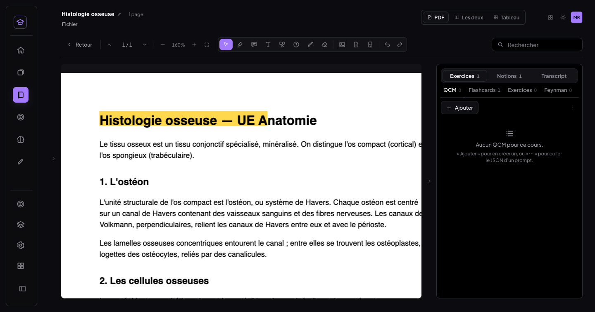 | 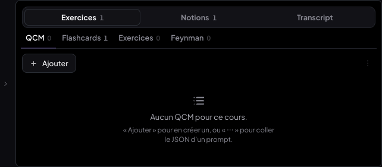 |
| 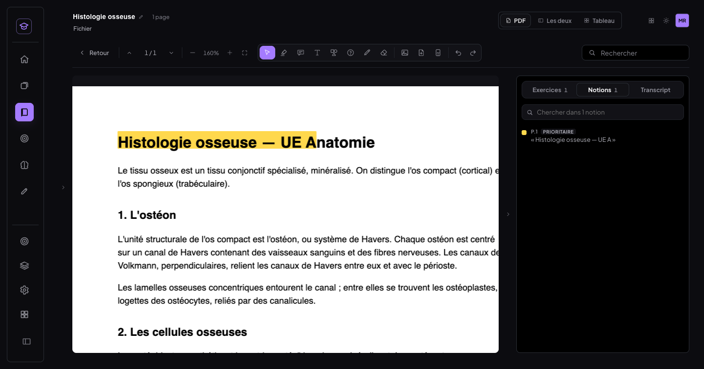 | 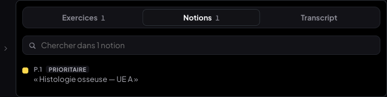 |
| 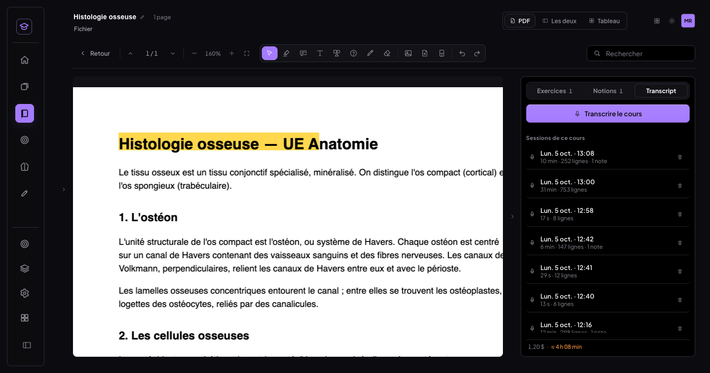 | 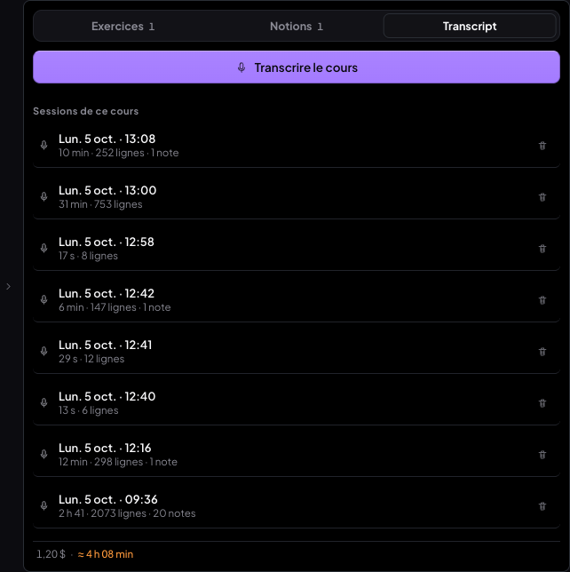 |

Barre à 820 px (2 lignes) : 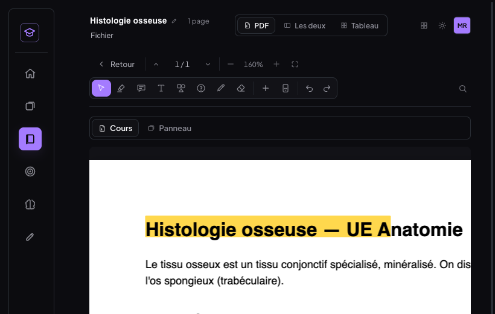
Session en direct (segment avec chrono, ligne de crédits) : 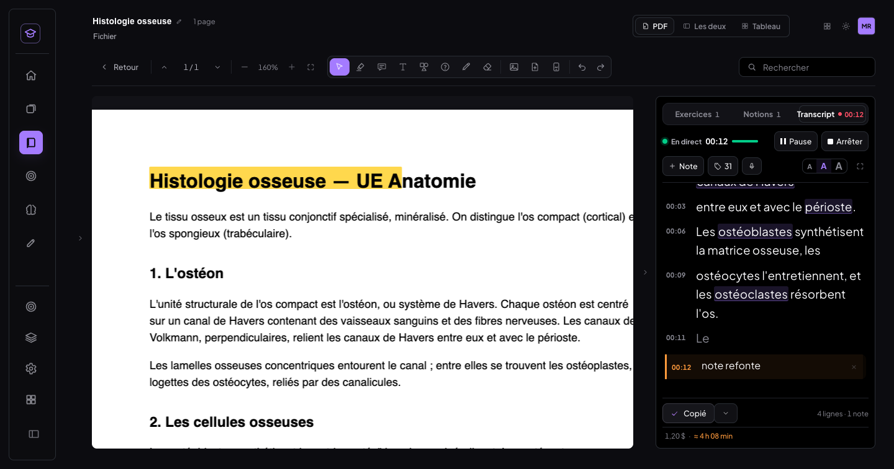
Notion → page + mise en évidence : 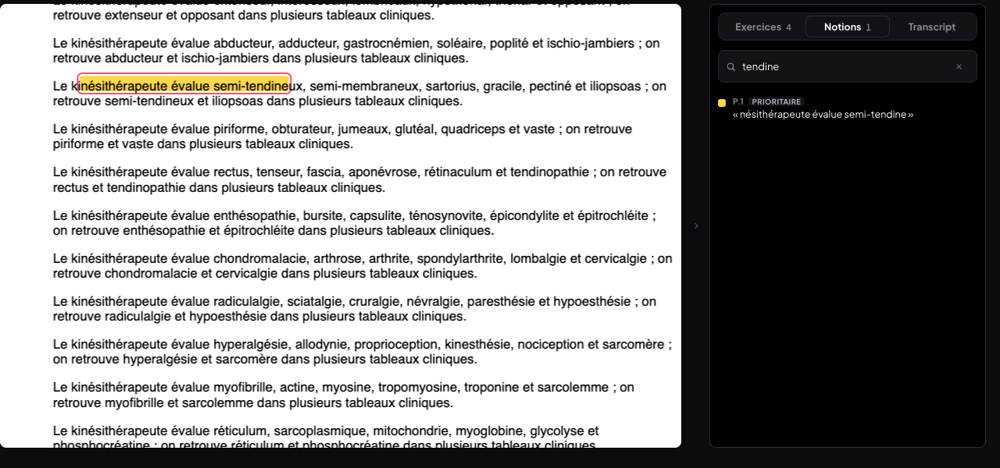
Crédits dépliés / ligne en ambre : 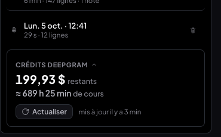 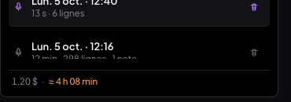

---

## 3. Source audio de la transcription

- **Une seule liste** dans la feuille : *Automatique — [entrée retenue]*, chaque entrée audio
  (`enumerateDevices`, « (bouclage) » pour un périphérique virtuel), *Onglet Chrome*. Rafraîchie
  sur `devicechange`. Choix **mémorisé par appareil** (`medrevise.transcription.source.choix` ;
  l'ancien réglage source/micro est repris au premier passage).
- **Automatique** : 1) bouclage virtuel (nom contenant BlackHole, Loopback, Soundflower, VB-Cable,
  Aggregate/agrégé, Multi-Output/multi-sortie) ; 2) dernière entrée **validée** sur cet appareil
  (= une session démarrée alors que la sonde avait détecté du son) ; 3) entrée par défaut.
  Ligne « Retenue : *BlackHole 2ch* · périphérique de bouclage détecté — Changer ».
- **Sonde avant démarrage** : dès l'ouverture de la feuille, VU-mètre sur l'entrée retenue ;
  verdict à 3 s. Muet → alerte ambre « Aucun son détecté sur [nom]. Tu écoutes le cours en
  AirPods/casque ? Le micro ne peut pas entendre ce qui joue dans tes oreilles. » + « Ouvrir le
  guide » / « Choisir une autre source ». Démarrer reste possible. L'entrée est libérée avant que
  le moteur ne l'ouvre.
- **Guide** (vue dans la feuille) : Teams/Zoom dans Chrome + Onglet Chrome ; haut-parleurs + micro
  du Mac ; BlackHole en 4 étapes (installer, périphérique à sorties multiples AirPods + BlackHole
  dans Configuration audio et MIDI, sortie de Teams, détection automatique).
- **Traitement du navigateur** : `echoCancellation`, `noiseSuppression`, `autoGainControl` à
  **false** pour un bouclage virtuel, **true** pour un vrai micro (v1 : toujours false/false/true).
- **Bascule à chaud** : bouton micro dans la barre de la session → liste des entrées + Onglet
  Chrome. La nouvelle capture démarre avant l'arrêt de l'ancienne, bascule atomique (compteur de
  génération) : même horloge, même tampon, **même WebSocket**.

| VU-mètre (son détecté) | Aucun son | Guide | BlackHole branché → Automatique |
|---|---|---|---|
| 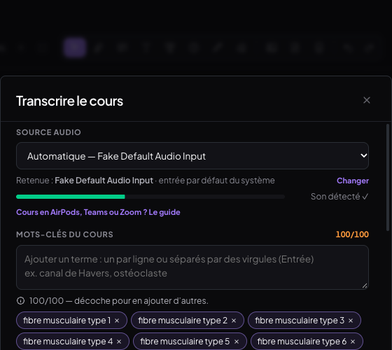 | 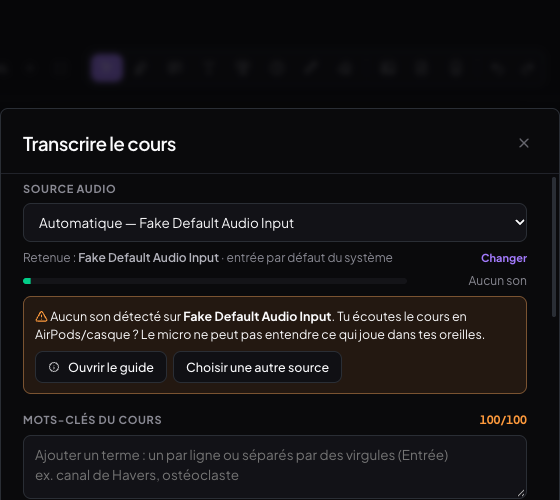 | 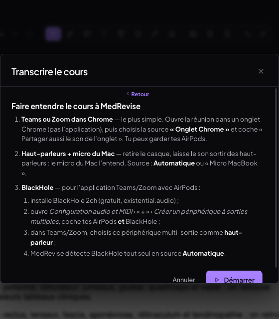 | 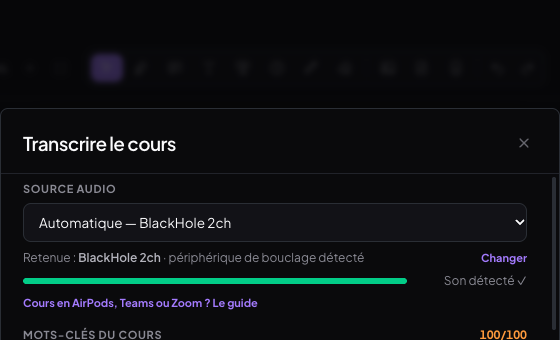 |

---

## 4. Tests (Chrome headless piloté en CDP, vrais événements souris/clavier/tactile)

| Test | Résultat |
|---|---|
| Changement de mode au clic | ✅ |
| Glissement | ✅ trackpad (Exercices → Notions) ; doigt (Notions → Transcript ; rien au-delà du dernier mode) — le doigt échouait d'abord (`pointercancel` du défilement natif), corrigé par `touch-action: pan-y` |
| Mémorisation par cours | ✅ Myologie sur Notions, Histologie sur Exercices → rouverts / rechargés : chacun retrouve son mode |
| Données existantes | ✅ flashcard d'avant la refonte en Exercices › Flashcards, surlignage en Notions, 8 sessions en Transcript |
| Ajout d'un item dans chaque sous-onglet | ✅ QCM, Flashcards, Exercices, Feynman — confirmation + compteurs 1/1/1/1 ; « ⋯ » (Coller du JSON, Flashcard image, Thème) |
| Notions | ✅ recherche (« tendine » → 1, « sartor » → message), clic depuis la page 2 → page 1 + surlignage entouré, retiré après 1,6 s |
| Transcript | ✅ lancer, note, Copier tout (note incluse), badge chrono vu depuis Exercices, pas de pastille flottante en double, arrêt + « Cette session : … » |
| Crédits | ✅ ligne en bas (199,93 $ · ≈ 689 h 25 min), dépliée/repliée, ambre à 4 h 08 min ; aucun reliquat (pastille, carte en haut, bouton dans la barre) |
| Barre | ✅ ⌘F (bureau et loupe repliée), ⌘Z, menu « + » (page insérée puis annulée), boîte posée ; Fichier : 6 entrées sans doublon ; aucun débordement de 1440 à 780 px (2 lignes max) |
| Source audio | ✅ 3 entrées listées + Onglet ; Automatique affiche son choix ; « Son détecté ✓ » à 3 s ; entrée muette simulée → alerte + guide, Démarrer actif ; BlackHole simulé « branché » via `devicechange` → listé « (bouclage) », retenu automatiquement, contraintes `false/false/false` ; « débranché » → retour au défaut, `true/true/true` |
| Bascule à chaud | ✅ Fake Default → Fake Audio Input 1 en pleine session : 1 seul WebSocket ouvert du début à la fin, transcript continu (75,4 → 75,7 s…) |
| Cours HTML | ✅ 3 modes, feuille Transcrire avec sonde |
| Console | ✅ rien de nouveau (avertissement GoTrue préexistant) |
| MealWeek | ✅ aucun fichier MealWeek/partagé modifié ; builds `7bcac0c` / HEAD servis sur la même origine : accueil et liste de courses **identiques au pixel près** |

---

## 5. Commits

| Commit | Message |
|---|---|
| `fe97562` | docs(medrevise): audit UX du lecteur et du panneau latéral (avant refonte) |
| `2d62bcc` | feat(medrevise): panneau latéral du lecteur en 3 modes — Exercices · Notions · Transcript |
| `85eba5a` | feat(medrevise): barre du lecteur recentrée sur la lecture et l'annotation |
| `805bf75` | feat(medrevise): source audio automatique, sonde 3 s, guide, bascule à chaud ; crédits en une ligne |
| (ce commit) | docs(medrevise): compte-rendu de la refonte du panneau latéral |

`2d62bcc` importe `BadgeTranscript`, livré dans `805bf75` : seul l'état de la tête de `main`
est à considérer comme compilable (le build a été vérifié à chaque push).

---

## 6. Limites connues

- **Téléphone (≤ 760 px)** : pas de lecteur, donc ni panneau ni barre (décision écartée M8). « Mobile »
  testé ici = tablette / fenêtre étroite (780–900 px), où le lecteur existe.
- **Périphériques réels** : BlackHole, le branchement/débranchement et une entrée muette sont
  **simulés** (Chrome headless n'a que des entrées factices) — la logique (liste, choix automatique,
  contraintes, alerte) est vérifiée, pas un vrai BlackHole. À valider sur le Mac avec AirPods.
- **Bascule vers « Onglet Chrome » en session** : passe par la fenêtre de partage de Chrome
  (interface native, non pilotable en test) — codée, non testée en réel.
- **Bascule à chaud** : une fraction de seconde d'audio peut manquer au moment exact de la bascule
  (entre l'arrêt de l'ancienne entrée et le premier bloc de la nouvelle) ; le transcript n'en montre
  pas de trou.
- **Glissement à la souris** : volontairement non pris en charge (sélection de texte).
- **Barre à 1 440 px** : la mesure de débordement se fait au chargement ; si elle a masqué les
  libellés des outils, ils ne reviennent qu'au prochain redimensionnement (comportement antérieur
  conservé).
- **Vue HTML** : son mode Notions garde son contenu propre (marques du cours HTML), sans la
  recherche ajoutée au PDF.

---

## v1.1 — glissement trackpad et carte flashcard (05/10/2026)

### Pourquoi le choix Texte / Image avait disparu

**Régression introduite par `2d62bcc`** (« panneau latéral du lecteur en 3 modes », même jour),
c'est-à-dire par la refonte elle-même — pas un composant non monté ni une condition d'affichage.
Avant (`7bcac0c`), le sous-onglet Flashcard affichait deux boutons côte à côte
(`.pis-ajout-duo` : « Flashcard texte » / « Flashcard image », ajoutés par `deda3ca` et
`50aec11` le 30/09). En appliquant la règle « une seule barre d'actions », `2d62bcc` a remplacé
la paire par un « Ajouter » unique qui ouvrait **le formulaire texte**, et a relégué la flashcard
image dans le menu « ⋯ » (« Flashcard image (masques) ») : le choix existait encore, mais n'était
plus visible là où on le cherche. Erreur de jugement de la refonte, corrigée ici.

### Carte d'ajout de flashcard (`components/CarteAjoutFlashcard.jsx`)

- « + Ajouter » dans Exercices › Flashcards ouvre une **carte en place** (pas de modale) avec en
  tête un **sélecteur Texte / Image** et « Terminer ». Les deux volets restent **montés** (l'un
  masqué) : changer de mode ne perd rien — vérifié dans les deux sens (recto en cours de saisie
  conservé, image collée conservée).
- **Texte** : le formulaire existant (`FlashcardForm` : thème automatique de la fiche, recto avec
  amorces et trous, verso, indice, à retenir) + **aperçu** recto/verso. Son champ image et son
  collage sont désactivés dans la carte (`sansImage`) : l'image appartient au volet Image.
- **Image** : zone de dépôt / **⌘V, Ctrl+V** / parcourir, aperçu, Remplacer / Retirer, puis :
  « **Image + texte** » (recto, verso, image au recto / verso / les deux — thème automatique
  pré-rempli) ou « **Masques à deviner** » → l'éditeur d'occlusion existant, ouvert **avec
  l'image déjà chargée** (décision : cet éditeur a besoin de toute la largeur de l'écran, il
  reste une fenêtre).
- **Clavier** : Entrée = ajouter (Maj+Entrée = retour à la ligne), Échap = fermer la carte, Tab
  recto → verso (Maj+Tab retour). Après un ajout, la carte reste ouverte et vide, curseur sur le
  recto, compteur « N flashcards ajoutées ✓ ».
- **Schéma inchangé** : les deux chemins passent par `appendItemsToFiche` comme avant ; une carte
  texte et une carte image + texte ont **exactement les mêmes champs** qu'une carte créée avant la
  refonte (`_schema, a_retenir, capped, cloze, concept, difficulte, dueDate, ficheId, historique,
  id, imageId, imagePlace, indice, intervalDays, j0Date, missed, recto, srcId, tags, termine,
  theme, type, updatedAt, verso` — comparaison faite sur les objets stockés).
- Le doublon « Fermer » de la barre d'actions est masqué tant que la carte est ouverte, et
  l'entrée « Flashcard image » quitte le menu « ⋯ ».
- Défaut trouvé en test et corrigé : **Échap dans l'éditeur de masques fermait toute la carte**
  (l'éditeur est rendu dans la carte, l'événement remontait) — il demande maintenant « Fermer
  sans enregistrer ? » et la carte reste ouverte.

| Texte (aperçu) | Image (fichier choisi) | Masques, image préchargée | Révision d'une carte image |
|---|---|---|---|
| 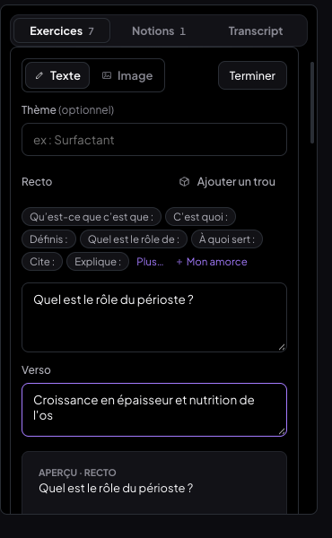 | 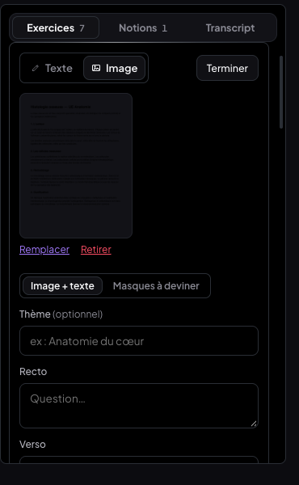 | 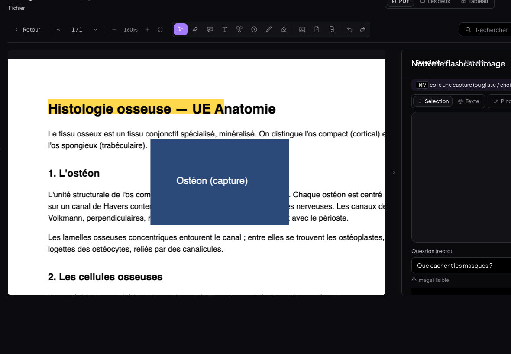 | 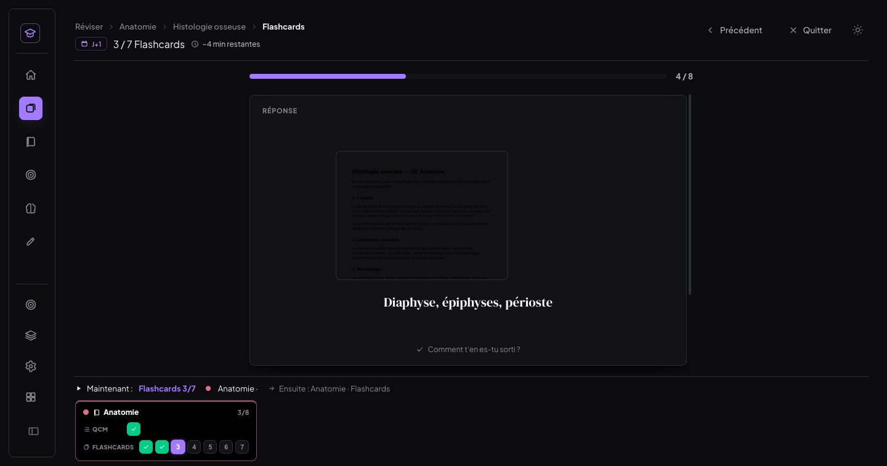 |

### Glissement qui suit le geste

- **Trackpad** : roue avec **|deltaX| > 1,5 × |deltaY|**, écouteur **non passif** (sinon Chrome
  déclenche « page précédente » ; plus `overscroll-behavior-x: contain`). Le contenu se
  **translate avec les doigts** et l'indicateur du sélecteur glisse en continu (`--i`
  fractionnaire) ; plus d'événement pendant 140 ms = doigts levés → **aimantation** : mode voisin
  si le geste dépasse **80 px**, sinon retour animé. **Élastique** aux extrémités (30 % du geste,
  56 px max).
- **Jamais** : défilement vertical (et 250 ms après lui), dominante horizontale trop faible, zone
  qui défile horizontalement (tout ancêtre `overflow-x: auto|scroll` qui déborde, ou un canvas),
  texte sélectionné dans le panneau.
- **Inertie macOS** : après un changement, blocage **≥ 400 ms et tant que l'élan continue**
  (événements à < 150 ms d'intervalle). Le premier réglage (400 ms fixes) laissait un second saut
  pendant l'élan — constaté en test, corrigé.
- **Doigt / stylet** : même sensation (suivi en temps réel, mêmes seuils, même aimantation).

### Tests (Chrome, CDP — vrais événements roue, tactiles, souris, clavier, presse-papier, sélecteur de fichiers)

| Test | Résultat |
|---|---|
| Trackpad, droite→gauche depuis Exercices / Notions | ✅ pendant : contenu à −120 px, indicateur 0,34 / 1,34 → Notions / Transcript |
| Trackpad, gauche→droite depuis Transcript / Notions | ✅ +120 px, indicateur 1,66 / 0,66 → Notions / Exercices |
| Extrémités | ✅ élastique 36 px, pas de changement |
| Geste court (45 px) | ✅ retour au mode de départ |
| Défilement vertical / diagonal / dominante < 1,5× | ✅ aucun mouvement |
| Inertie macOS simulée (geste puis 30 événements décroissants) | ✅ un seul saut (deux avant le correctif) ; geste volontaire juste après : accepté |
| Texte sélectionné dans un transcript | ✅ aucun changement, sélection conservée ; même geste sans sélection → mode précédent |
| Zone à défilement horizontal | ✅ elle défile (scrollLeft 120 px), le mode ne change pas |
| Doigt (tactile) | ✅ suivi −100 px / +100 px, indicateur 1,28 / 1,72, changement au relâchement |
| 3 cartes texte enchaînées au clavier | ✅ Tab → verso, Entrée → ajoutée, carte vidée, focus sur le recto, compteur 1 → 3 |
| Bascule Texte ↔ Image en cours de saisie | ✅ recto et image conservés dans les deux sens |
| Carte image collée (⌘V, vrai événement `paste`) | ✅ enregistrée avec `imageId`, `imagePlace: recto` |
| Carte image depuis fichier (vrai `input file`) | ✅ « Image + texte », `imagePlace: deux` ; « Masques à deviner » → éditeur avec l'image |
| Schéma / anciennes cartes | ✅ mêmes champs qu'avant ; l'ancienne carte inchangée ; édition d'une ancienne carte : formulaire complet (champ image compris) |
| Révision | ✅ série du jour : 1 QCM + 7 flashcards (dont les 5 nouvelles) ; la carte image s'affiche en révision avec ses images |
| Synchro | ✅ faux Supabase : les 6 flashcards du cours au cloud, les 2 images des nouvelles cartes dans le stockage |
| Non-régression panneau | ✅ QCM / Exercices / Feynman : formulaire habituel ; Notions ; Transcript (9 sessions, ligne de crédits) ; console : rien de nouveau |
| MealWeek | ✅ aucun fichier modifié ; builds `85856bb` / HEAD sur la même origine : identiques au pixel près |

### Commits v1.1

| Commit | Message |
|---|---|
| `aa9e915` | feat(medrevise): carte d'ajout de flashcard Texte / Image, en place dans le panneau |
| `aa35070` | feat(medrevise): glissement trackpad / doigt qui suit le geste entre les 3 modes |
| (ce commit) | docs(medrevise): compte-rendu v1.1 — glissement trackpad et carte flashcard |

### Limites (v1.1)

- Pendant le geste, seul le mode **courant** se translate (et s'estompe) ; le mode voisin entre
  par la transition latérale au relâchement — il n'est pas rendu à côté pendant le geste (rendre
  deux modes à la fois, dont un transcript en direct, coûterait plus qu'il n'apporte).
- Trackpad réel : testé avec des événements roue synthétiques reproduisant un geste et l'inertie de
  macOS ; les seuils (80 px, 140 ms, 150 ms) sont à valider au doigt sur le Mac.
- Observé pendant une série de révision (composant `ImageFlashcard`, non modifié ici) : deux
  « ERR_FILE_NOT_FOUND » sur des URL `blob:` quand on enchaîne vite les cartes à image — sans effet
  visible ; non reproduit par la carte d'ajout.
