# Refonte du panneau latéral, de la barre du lecteur et de la source audio — compte-rendu (05/10/2026)

Point de départ : l'audit en conditions réelles, `docs/audit-ux-panneau-lateral.md` (captures
« avant » dans `docs/img/panneau-lateral/avant-*.png`). Tout est livré, testé dans Chrome
(bureau 1440 px, tablette 820 px, fenêtres 780–1100 px, téléphone 390 px), commité et poussé.
Build vert ; MealWeek identique au pixel près.

---

## 1. Décisions prises à partir de l'audit

| Audit | Décision appliquée |
|---|---|
| **M1** 6 onglets à plat sur 2 lignes · **c1** singulier/pluriel · **c3** « 0 » partout | **3 modes** : *Exercices · Notions · Transcript*, sélecteur segmenté avec indicateur glissant (style Apple), compteurs gris atténués à 0, libellés au pluriel. Les 4 types d'items passent en **sous-navigation soulignée** dans Exercices. |
| **M2** le panneau rouvre toujours sur QCM | **Mode et sous-onglet mémorisés par cours** (`localStorage`, clés `medrevise.panneau.mode.<cours>` / `.sous.<cours>`), y compris après rechargement. |
| **M4** « Panneau » dans la barre + poignée du panneau | Bouton **« Panneau » retiré** : la poignée suffit ; en étroit, la bascule Cours / Panneau existante. |
| **M5** doublons menu Fichier ↔ barre / panneau | Retirés du menu Fichier : *Insérer une page*, *Insérer une image* (barre), *Ajouter un item*, *Importer des items* (mode Exercices). Fichier : 10 → 6 entrées. |
| **M6** micro de transcription isolé dans la barre du PDF | **Bouton retiré de la barre** ; « Transcrire le cours » vit **en tête du mode Transcript**. Une session en cours se voit sur le segment (**point rouge + chrono**), dans n'importe quel mode. |
| **M3** barre sur 3 lignes en étroit · **m5** placeholder tronqué | Palier de compacité ajouté **avant** le passage à la ligne : insertions (Image, Page) dans un menu « + », recherche en **loupe dépliable** (⌘F la déplie). Une règle CSS forçait le retour à la ligne dès 1 050 px : elle ne s'applique plus qu'au dernier palier. Résultat à 780–900 px : **99 px au lieu de 149**, PDF à 243 px du haut au lieu de 315. Placeholder « Rechercher ». |
| **m1** formulaires et boutons d'ajout envahissants | **Une seule barre d'actions** en Exercices : « + Ajouter » (s'adapte au sous-onglet, devient « Fermer ») et « ⋯ » (Coller du JSON ; en Flashcards : Flashcard image, Thème automatique). États vides avec icône et phrase d'aide. |
| **m2** pas de recherche dans les notions · **m3** pas de mise en évidence | Mode Notions = **recherche/filtre + liste, rien d'autre** (« Copier les notions » reste dans Fichier). Clic → défilement vers la page **et** surlignage entouré 1,6 s. |
| **m4** carte crédits de 116 px permanente | **Une ligne grise** en bas du mode Transcript (« 199,93 $ · ≈ 689 h 25 min »), clic → carte complète (Actualiser, mis à jour il y a…), clic sur son titre → repliée. Seuils ambre/rouge sur la ligne. Même composant aux Réglages (déplié). |
| **M7** AirPods : on découvre l'absence de son après coup · **m6** pas d'« Automatique » · **m7** changer de micro = arrêter | Feuille Transcrire refaite (§ 3) : **Automatique**, **VU-mètre 3 s avant le démarrage**, alerte « aucun son » + **guide**, **bascule de micro à chaud**. |
| (constaté en testant) menus du transcript fermés à chaque nouvelle ligne | `ContextMenu` se fermait au moindre défilement — l'auto-défilement du transcript le refermait aussitôt (« Copier sans horodatage » était déjà touché). Option `fermerAuDefilement={false}` pour les menus du transcript. |
| (cohérence) cours HTML | Le mode Transcript existe aussi sur un cours HTML (même panneau). |

### Écartées (et pourquoi)

- **M8 — lecteur sur téléphone** : le shell mobile (≤ 760 px) est volontairement « révision
  uniquement » ; y porter le lecteur PDF, les annotations et le panneau est un chantier en soi.
  Sur téléphone, une session lancée ailleurs reste pilotable par la pastille flottante.
- **c4 — « Les deux / Tableau » qui replient le panneau sans le dire** : comportement du tableau
  hors périmètre.
- **c5 — « Fichier » loin de la barre** : le déplacer toucherait la Bibliothèque embarquée et la
  vue HTML, pour un gain faible.
- **Glisser à la souris pour changer de mode** : refusé — à la souris, glisser sert à
  sélectionner du texte (transcript, notions). Glissement au doigt/stylet et au trackpad seulement.
- **Masquer les compteurs à 0** : gardés (atténués) — l'absence d'un chiffre se lit comme
  « inconnu », un 0 gris se lit comme « rien encore ».

---

## 2. Le panneau en 3 modes

- **Exercices** — sous-navigation *QCM · Flashcards · Exercices · Feynman* avec compteurs ;
  « + Ajouter » ouvre le formulaire du type actif ; « ⋯ » pour le reste ; liste des items
  (éditer / supprimer inchangés).
- **Notions** — champ « Chercher dans N notions » (insensible aux accents, cherche aussi dans la
  note et l'étiquette de couleur) + liste ; clic → page + mise en évidence.
- **Transcript** — tout le module : « Transcrire le cours », sessions, reprise, transcript en
  direct, notes, copier/exporter, plein écran ; ligne de crédits en bas.
- **Glissement** : doigt/stylet (pointeurs, `touch-action: pan-y` sur tout le contenu pour que
  le défilement vertical reste natif) et trackpad (roue horizontale cumulée > 120 px) ; transition
  latérale de 0,26 s, désactivée si « réduire les animations ».
- **Compatibilité** : `CourseItemsSidebar` garde son interface (`ongletsEnPlus`, `ongletDemande`,
  `ongletInitial`, `replie`) ; nouveau `cleMemo` pour la mémorisation.

| Bureau | Tablette (820 px, vue Panneau) |
|---|---|
|  |  |
|  |  |
|  |  |

Barre à 820 px (2 lignes) : 
Session en direct (segment avec chrono, ligne de crédits) : 
Notion → page + mise en évidence : 
Crédits dépliés / ligne en ambre :  

---

## 3. Source audio de la transcription

- **Une seule liste** dans la feuille : *Automatique — [entrée retenue]*, chaque entrée audio
  (`enumerateDevices`, « (bouclage) » pour un périphérique virtuel), *Onglet Chrome*. Rafraîchie
  sur `devicechange`. Choix **mémorisé par appareil** (`medrevise.transcription.source.choix` ;
  l'ancien réglage source/micro est repris au premier passage).
- **Automatique** : 1) bouclage virtuel (nom contenant BlackHole, Loopback, Soundflower, VB-Cable,
  Aggregate/agrégé, Multi-Output/multi-sortie) ; 2) dernière entrée **validée** sur cet appareil
  (= une session démarrée alors que la sonde avait détecté du son) ; 3) entrée par défaut.
  Ligne « Retenue : *BlackHole 2ch* · périphérique de bouclage détecté — Changer ».
- **Sonde avant démarrage** : dès l'ouverture de la feuille, VU-mètre sur l'entrée retenue ;
  verdict à 3 s. Muet → alerte ambre « Aucun son détecté sur [nom]. Tu écoutes le cours en
  AirPods/casque ? Le micro ne peut pas entendre ce qui joue dans tes oreilles. » + « Ouvrir le
  guide » / « Choisir une autre source ». Démarrer reste possible. L'entrée est libérée avant que
  le moteur ne l'ouvre.
- **Guide** (vue dans la feuille) : Teams/Zoom dans Chrome + Onglet Chrome ; haut-parleurs + micro
  du Mac ; BlackHole en 4 étapes (installer, périphérique à sorties multiples AirPods + BlackHole
  dans Configuration audio et MIDI, sortie de Teams, détection automatique).
- **Traitement du navigateur** : `echoCancellation`, `noiseSuppression`, `autoGainControl` à
  **false** pour un bouclage virtuel, **true** pour un vrai micro (v1 : toujours false/false/true).
- **Bascule à chaud** : bouton micro dans la barre de la session → liste des entrées + Onglet
  Chrome. La nouvelle capture démarre avant l'arrêt de l'ancienne, bascule atomique (compteur de
  génération) : même horloge, même tampon, **même WebSocket**.

| VU-mètre (son détecté) | Aucun son | Guide | BlackHole branché → Automatique |
|---|---|---|---|
|  |  |  |  |

---

## 4. Tests (Chrome headless piloté en CDP, vrais événements souris/clavier/tactile)

| Test | Résultat |
|---|---|
| Changement de mode au clic | ✅ |
| Glissement | ✅ trackpad (Exercices → Notions) ; doigt (Notions → Transcript ; rien au-delà du dernier mode) — le doigt échouait d'abord (`pointercancel` du défilement natif), corrigé par `touch-action: pan-y` |
| Mémorisation par cours | ✅ Myologie sur Notions, Histologie sur Exercices → rouverts / rechargés : chacun retrouve son mode |
| Données existantes | ✅ flashcard d'avant la refonte en Exercices › Flashcards, surlignage en Notions, 8 sessions en Transcript |
| Ajout d'un item dans chaque sous-onglet | ✅ QCM, Flashcards, Exercices, Feynman — confirmation + compteurs 1/1/1/1 ; « ⋯ » (Coller du JSON, Flashcard image, Thème) |
| Notions | ✅ recherche (« tendine » → 1, « sartor » → message), clic depuis la page 2 → page 1 + surlignage entouré, retiré après 1,6 s |
| Transcript | ✅ lancer, note, Copier tout (note incluse), badge chrono vu depuis Exercices, pas de pastille flottante en double, arrêt + « Cette session : … » |
| Crédits | ✅ ligne en bas (199,93 $ · ≈ 689 h 25 min), dépliée/repliée, ambre à 4 h 08 min ; aucun reliquat (pastille, carte en haut, bouton dans la barre) |
| Barre | ✅ ⌘F (bureau et loupe repliée), ⌘Z, menu « + » (page insérée puis annulée), boîte posée ; Fichier : 6 entrées sans doublon ; aucun débordement de 1440 à 780 px (2 lignes max) |
| Source audio | ✅ 3 entrées listées + Onglet ; Automatique affiche son choix ; « Son détecté ✓ » à 3 s ; entrée muette simulée → alerte + guide, Démarrer actif ; BlackHole simulé « branché » via `devicechange` → listé « (bouclage) », retenu automatiquement, contraintes `false/false/false` ; « débranché » → retour au défaut, `true/true/true` |
| Bascule à chaud | ✅ Fake Default → Fake Audio Input 1 en pleine session : 1 seul WebSocket ouvert du début à la fin, transcript continu (75,4 → 75,7 s…) |
| Cours HTML | ✅ 3 modes, feuille Transcrire avec sonde |
| Console | ✅ rien de nouveau (avertissement GoTrue préexistant) |
| MealWeek | ✅ aucun fichier MealWeek/partagé modifié ; builds `7bcac0c` / HEAD servis sur la même origine : accueil et liste de courses **identiques au pixel près** |

---

## 5. Commits

| Commit | Message |
|---|---|
| `fe97562` | docs(medrevise): audit UX du lecteur et du panneau latéral (avant refonte) |
| `2d62bcc` | feat(medrevise): panneau latéral du lecteur en 3 modes — Exercices · Notions · Transcript |
| `85eba5a` | feat(medrevise): barre du lecteur recentrée sur la lecture et l'annotation |
| `805bf75` | feat(medrevise): source audio automatique, sonde 3 s, guide, bascule à chaud ; crédits en une ligne |
| (ce commit) | docs(medrevise): compte-rendu de la refonte du panneau latéral |

`2d62bcc` importe `BadgeTranscript`, livré dans `805bf75` : seul l'état de la tête de `main`
est à considérer comme compilable (le build a été vérifié à chaque push).

---

## 6. Limites connues

- **Téléphone (≤ 760 px)** : pas de lecteur, donc ni panneau ni barre (décision écartée M8). « Mobile »
  testé ici = tablette / fenêtre étroite (780–900 px), où le lecteur existe.
- **Périphériques réels** : BlackHole, le branchement/débranchement et une entrée muette sont
  **simulés** (Chrome headless n'a que des entrées factices) — la logique (liste, choix automatique,
  contraintes, alerte) est vérifiée, pas un vrai BlackHole. À valider sur le Mac avec AirPods.
- **Bascule vers « Onglet Chrome » en session** : passe par la fenêtre de partage de Chrome
  (interface native, non pilotable en test) — codée, non testée en réel.
- **Bascule à chaud** : une fraction de seconde d'audio peut manquer au moment exact de la bascule
  (entre l'arrêt de l'ancienne entrée et le premier bloc de la nouvelle) ; le transcript n'en montre
  pas de trou.
- **Glissement à la souris** : volontairement non pris en charge (sélection de texte).
- **Barre à 1 440 px** : la mesure de débordement se fait au chargement ; si elle a masqué les
  libellés des outils, ils ne reviennent qu'au prochain redimensionnement (comportement antérieur
  conservé).
- **Vue HTML** : son mode Notions garde son contenu propre (marques du cours HTML), sans la
  recherche ajoutée au PDF.

---

## v1.1 — glissement trackpad et carte flashcard (05/10/2026)

### Pourquoi le choix Texte / Image avait disparu

**Régression introduite par `2d62bcc`** (« panneau latéral du lecteur en 3 modes », même jour),
c'est-à-dire par la refonte elle-même — pas un composant non monté ni une condition d'affichage.
Avant (`7bcac0c`), le sous-onglet Flashcard affichait deux boutons côte à côte
(`.pis-ajout-duo` : « Flashcard texte » / « Flashcard image », ajoutés par `deda3ca` et
`50aec11` le 30/09). En appliquant la règle « une seule barre d'actions », `2d62bcc` a remplacé
la paire par un « Ajouter » unique qui ouvrait **le formulaire texte**, et a relégué la flashcard
image dans le menu « ⋯ » (« Flashcard image (masques) ») : le choix existait encore, mais n'était
plus visible là où on le cherche. Erreur de jugement de la refonte, corrigée ici.

### Carte d'ajout de flashcard (`components/CarteAjoutFlashcard.jsx`)

- « + Ajouter » dans Exercices › Flashcards ouvre une **carte en place** (pas de modale) avec en
  tête un **sélecteur Texte / Image** et « Terminer ». Les deux volets restent **montés** (l'un
  masqué) : changer de mode ne perd rien — vérifié dans les deux sens (recto en cours de saisie
  conservé, image collée conservée).
- **Texte** : le formulaire existant (`FlashcardForm` : thème automatique de la fiche, recto avec
  amorces et trous, verso, indice, à retenir) + **aperçu** recto/verso. Son champ image et son
  collage sont désactivés dans la carte (`sansImage`) : l'image appartient au volet Image.
- **Image** : zone de dépôt / **⌘V, Ctrl+V** / parcourir, aperçu, Remplacer / Retirer, puis :
  « **Image + texte** » (recto, verso, image au recto / verso / les deux — thème automatique
  pré-rempli) ou « **Masques à deviner** » → l'éditeur d'occlusion existant, ouvert **avec
  l'image déjà chargée** (décision : cet éditeur a besoin de toute la largeur de l'écran, il
  reste une fenêtre).
- **Clavier** : Entrée = ajouter (Maj+Entrée = retour à la ligne), Échap = fermer la carte, Tab
  recto → verso (Maj+Tab retour). Après un ajout, la carte reste ouverte et vide, curseur sur le
  recto, compteur « N flashcards ajoutées ✓ ».
- **Schéma inchangé** : les deux chemins passent par `appendItemsToFiche` comme avant ; une carte
  texte et une carte image + texte ont **exactement les mêmes champs** qu'une carte créée avant la
  refonte (`_schema, a_retenir, capped, cloze, concept, difficulte, dueDate, ficheId, historique,
  id, imageId, imagePlace, indice, intervalDays, j0Date, missed, recto, srcId, tags, termine,
  theme, type, updatedAt, verso` — comparaison faite sur les objets stockés).
- Le doublon « Fermer » de la barre d'actions est masqué tant que la carte est ouverte, et
  l'entrée « Flashcard image » quitte le menu « ⋯ ».
- Défaut trouvé en test et corrigé : **Échap dans l'éditeur de masques fermait toute la carte**
  (l'éditeur est rendu dans la carte, l'événement remontait) — il demande maintenant « Fermer
  sans enregistrer ? » et la carte reste ouverte.

| Texte (aperçu) | Image (fichier choisi) | Masques, image préchargée | Révision d'une carte image |
|---|---|---|---|
|  |  |  |  |

### Glissement qui suit le geste

- **Trackpad** : roue avec **|deltaX| > 1,5 × |deltaY|**, écouteur **non passif** (sinon Chrome
  déclenche « page précédente » ; plus `overscroll-behavior-x: contain`). Le contenu se
  **translate avec les doigts** et l'indicateur du sélecteur glisse en continu (`--i`
  fractionnaire) ; plus d'événement pendant 140 ms = doigts levés → **aimantation** : mode voisin
  si le geste dépasse **80 px**, sinon retour animé. **Élastique** aux extrémités (30 % du geste,
  56 px max).
- **Jamais** : défilement vertical (et 250 ms après lui), dominante horizontale trop faible, zone
  qui défile horizontalement (tout ancêtre `overflow-x: auto|scroll` qui déborde, ou un canvas),
  texte sélectionné dans le panneau.
- **Inertie macOS** : après un changement, blocage **≥ 400 ms et tant que l'élan continue**
  (événements à < 150 ms d'intervalle). Le premier réglage (400 ms fixes) laissait un second saut
  pendant l'élan — constaté en test, corrigé.
- **Doigt / stylet** : même sensation (suivi en temps réel, mêmes seuils, même aimantation).

### Tests (Chrome, CDP — vrais événements roue, tactiles, souris, clavier, presse-papier, sélecteur de fichiers)

| Test | Résultat |
|---|---|
| Trackpad, droite→gauche depuis Exercices / Notions | ✅ pendant : contenu à −120 px, indicateur 0,34 / 1,34 → Notions / Transcript |
| Trackpad, gauche→droite depuis Transcript / Notions | ✅ +120 px, indicateur 1,66 / 0,66 → Notions / Exercices |
| Extrémités | ✅ élastique 36 px, pas de changement |
| Geste court (45 px) | ✅ retour au mode de départ |
| Défilement vertical / diagonal / dominante < 1,5× | ✅ aucun mouvement |
| Inertie macOS simulée (geste puis 30 événements décroissants) | ✅ un seul saut (deux avant le correctif) ; geste volontaire juste après : accepté |
| Texte sélectionné dans un transcript | ✅ aucun changement, sélection conservée ; même geste sans sélection → mode précédent |
| Zone à défilement horizontal | ✅ elle défile (scrollLeft 120 px), le mode ne change pas |
| Doigt (tactile) | ✅ suivi −100 px / +100 px, indicateur 1,28 / 1,72, changement au relâchement |
| 3 cartes texte enchaînées au clavier | ✅ Tab → verso, Entrée → ajoutée, carte vidée, focus sur le recto, compteur 1 → 3 |
| Bascule Texte ↔ Image en cours de saisie | ✅ recto et image conservés dans les deux sens |
| Carte image collée (⌘V, vrai événement `paste`) | ✅ enregistrée avec `imageId`, `imagePlace: recto` |
| Carte image depuis fichier (vrai `input file`) | ✅ « Image + texte », `imagePlace: deux` ; « Masques à deviner » → éditeur avec l'image |
| Schéma / anciennes cartes | ✅ mêmes champs qu'avant ; l'ancienne carte inchangée ; édition d'une ancienne carte : formulaire complet (champ image compris) |
| Révision | ✅ série du jour : 1 QCM + 7 flashcards (dont les 5 nouvelles) ; la carte image s'affiche en révision avec ses images |
| Synchro | ✅ faux Supabase : les 6 flashcards du cours au cloud, les 2 images des nouvelles cartes dans le stockage |
| Non-régression panneau | ✅ QCM / Exercices / Feynman : formulaire habituel ; Notions ; Transcript (9 sessions, ligne de crédits) ; console : rien de nouveau |
| MealWeek | ✅ aucun fichier modifié ; builds `85856bb` / HEAD sur la même origine : identiques au pixel près |

### Commits v1.1

| Commit | Message |
|---|---|
| `aa9e915` | feat(medrevise): carte d'ajout de flashcard Texte / Image, en place dans le panneau |
| `aa35070` | feat(medrevise): glissement trackpad / doigt qui suit le geste entre les 3 modes |
| (ce commit) | docs(medrevise): compte-rendu v1.1 — glissement trackpad et carte flashcard |

### Limites (v1.1)

- Pendant le geste, seul le mode **courant** se translate (et s'estompe) ; le mode voisin entre
  par la transition latérale au relâchement — il n'est pas rendu à côté pendant le geste (rendre
  deux modes à la fois, dont un transcript en direct, coûterait plus qu'il n'apporte).
- Trackpad réel : testé avec des événements roue synthétiques reproduisant un geste et l'inertie de
  macOS ; les seuils (80 px, 140 ms, 150 ms) sont à valider au doigt sur le Mac.
- Observé pendant une série de révision (composant `ImageFlashcard`, non modifié ici) : deux
  « ERR_FILE_NOT_FOUND » sur des URL `blob:` quand on enchaîne vite les cartes à image — sans effet
  visible ; non reproduit par la carte d'ajout.

---

## v1.2 — glissement physique (06/10/2026)

### Le défaut

En v1.1, seul le mode **courant** était rendu : pendant le geste il se translatait (et
s'estompait) sur un fond vide, et le mode voisin n'était **monté qu'au relâchement**, puis
entrait par une animation de 0,26 s. D'où la zone noire pendant le geste et le délai à la fin.
De plus, chaque événement de roue ou de doigt passait par un `setState` : tout le panneau
(200 items dans le cours de test) se re-rendait à chaque image du geste.

### Ce qui change

- **Les modes sont tous montés en permanence**, côte à côte. Le volet *k* est décalé de
  `(k − p) × 100 %` de la largeur, `p` étant la position (fractionnaire pendant le geste) : à
  mi-geste on voit la moitié du mode courant et la moitié du voisin, **déjà rendu**.
- **Transform uniquement** (`translate3d`, jamais `width`/`left`), écrit **directement dans
  le DOM** par une fonction `appliquer(p)` : **aucun rendu React pendant le geste**. React ne
  rend qu'une fois, au changement de mode (aria, `inert`).
- **Aimantation** au mode le plus proche au relâchement — ou au voisin si le geste est vif
  (> 0,45 px/ms sur les 100 dernières ms et > 24 px), jamais plus d'un mode d'écart — en
  **220 ms**, courbe ease-out `cubic-bezier(.22, .8, .3, 1)`. Élastique conservé aux extrémités.
- **Le sélecteur suit la même valeur** : `--i = p`, même durée, même courbe ; pas de
  transition pendant le geste.
- **Modes hors écran** : `inert` + `aria-hidden` + `tabIndex=-1` (clavier et lecteurs d'écran
  ne s'y perdent pas) ; `overflow: hidden` sur le corps du panneau. La bascule de `inert` est
  faite **à la fin de l'aimantation** (240 ms) : retirer `inert` d'un mode de 200 items coûte
  ~26 ms de recalcul de style, on ne le paie pas pendant le mouvement.
- **Volets superposés dans une même cellule de grille** (pas de position absolue) : la hauteur
  du panneau est celle du plus haut des modes, plafonnée comme avant par `.pis` ; elle ne change
  plus d'un mode à l'autre et changer de mode ne provoque aucun relayout. (Premier essai en
  position absolue : en vue étroite « Panneau », où `.pis` n'a qu'une hauteur maximale, le corps
  tombait à **0 px** — défaut trouvé au test tablette, corrigé ainsi.)
- **Défilement vertical** : chaque mode garde son propre conteneur défilant, indépendant (le
  défilement d'Exercices est conservé quand on va et revient de Notions). Détection du geste
  horizontal inchangée (deltaX dominant 1,5×, rien pendant un défilement vertical, une
  sélection de texte ou dans une zone qui défile horizontalement ; souris exclue).
- **Passivité des modes cachés** : un contexte `ModeVisibleCtx` (`components/modeVisible.js`)
  dit à chaque mode s'il est affiché. Le panneau Transcript **ne lance ses requêtes réseau
  (crédits, synchro ciblée des sessions) qu'à la première apparition du mode** ; sa lecture
  locale (IndexedDB) et le direct ne dépendent pas de la visibilité. La transcription est
  portée par le moteur (`engine.js`), hors du panneau : elle n'a jamais dépendu du mode affiché.
- **Écart assumé à la consigne « piste de 300 % translatée »** : chaque volet porte sa propre
  translation plutôt qu'une piste transformée d'un bloc. Rendu identique, même chemin GPU ;
  mais au repos le volet affiché n'a **aucune** transformation. Raison : un ancêtre transformé
  devient le repère des `position: fixed` — les modales rendues dans un mode (éditeur de
  masques de la carte flashcard, confirmation de suppression d'une session) auraient été
  enfermées dans le panneau au lieu de couvrir l'écran. (Même raison pour ne pas mettre de
  `contain` sur le corps.)
- **Premier rendu lourd** : rien à virtualiser — les 3 modes sont rendus à l'ouverture du cours
  (200 items : 120 QCM avec formule KaTeX, 80 flashcards ; 40 notions ; un transcript), plus
  jamais pendant un glissement. Le contenu du mode Exercices est **mémoïsé** : changer de mode ne
  re-rend plus la liste (mesuré avant : 1 à 3 images perdues à chaque changement, au moment
  précis de l'aimantation).

### Tests (Chrome headless piloté en CDP — vrais événements roue, tactiles, souris ; faux Supabase et faux Deepgram locaux, jamais le cloud)

Extension Chrome non connectée ce jour-là : tout en Chrome headless (1440 × 757 utiles ; tablette 820 × 1180).
Cours de test : PDF 4 pages, 120 QCM, 80 flashcards, 40 notions.

| Test | Résultat |
|---|---|
| Doigt : glisser 176 px (moitié de 352) et **tenir** 400 ms | ✅ Exercices à −50 %, Notions à +50 %, indicateur `--i = 0,5` ; les deux contenus rendus (19 383 et 2 430 caractères), aucune zone noire — capture ci-dessous |
| Relâcher | ✅ 60 ms après : cible posée (Notions à 0 %), transition en cours ; 460 ms après : volet au repos `transform: none`, Exercices `inert` |
| Trackpad (roue) pendant le flux d'événements | ✅ le voisin (Exercices) visible et rendu pendant le geste — capture ci-dessous |
| **20 allers-retours rapides** au trackpad | ✅ chaque geste vers un voisin change de mode (vers l'extrémité : élastique, pas de changement) ; **59 images/s** sur ~22 s (1 297 images), **0 tâche longue** ; 18 images à 33 ms (une image sautée) : 2 pendant les 10 aimantations, 7 juste après l'immobilisation (bascule `inert`), 9 au **début** d'un geste (promotion du volet en calque GPU, voir limites) |
| Transcription lancée, **2 min sur Exercices**, retour | ✅ (code final) lignes finales écrites dans le mode caché : 8 → 18 → 28 → 41 → 53 (à 0/30/60/90/120 s), badge chrono à jour dans le sélecteur ; retour : **54 lignes**, collé en bas ; arrêt : session enregistrée (54 lignes). Premier passage (code intermédiaire) : 12 → 56, **une seule connexion** au faux Deepgram |
| Réseau des modes cachés | ✅ cours rouvert sur Exercices : aucune requête `transcript_session` ; elle part au premier affichage du mode Transcript (crédits : demandés par le lecteur à l'ouverture du cours, comportement antérieur) |
| Défilement vertical | ✅ Exercices défilé à 1 500 px → Notions → retour : 1 500 px ; chaque mode garde le sien ; un défilement vertical au doigt ne change jamais de mode |
| Modales `position: fixed` | ✅ suppression d'un item (Exercices, 1er volet) et d'une session (Transcript, 3e volet) : voile plein écran 1440 × 757 |
| Mémoire : 50 allers-retours (Exercices → Notions → Transcript → retour) étalés sur 10 min, GC forcé avant chaque mesure | ✅ (code final) tas JS 22,86 → 22,34 → 22,35 → 22,44 → 22,45 → 22,45 Mo ; **nœuds DOM 11 439 et écouteurs 679 constants** du début à la fin. Premier passage (code intermédiaire) : 25,69 → 26,28 Mo, nœuds et écouteurs constants. Pas de fuite |
| Clavier / lecteurs d'écran | ✅ Tab × 60 : focus 58 fois dans le mode affiché, **0 fois** dans un mode caché ; arbre d'accessibilité de Chrome : aucun nœud des modes cachés exposé ; aucun débordement horizontal de la page |
| Tablette tactile (820 px, vue Panneau) | ✅ doigt tenu à mi-chemin : moitié Exercices / moitié Notions sur toute la hauteur ; Notions → Exercices, extrémité (élastique), retour Notions ; défilement vertical au doigt : la liste défile (268 px), le mode ne change pas |
| Cours HTML | ✅ 3 modes montés ; glissement à 43 % puis relâché → retour au mode de départ (le plus proche) |
| Non-régression | ✅ clic sur les segments ; mode mémorisé par cours (rouvert sur le dernier mode) ; Exercices : sous-onglets (120 QCM, 80 flashcards, Feynman vide avec son message), « Ajouter » ouvre/ferme le formulaire, confirmation de suppression ; Notions : recherche (« Notion 38 » → 1), clic → page 1 / 4 → 2 / 4 ; Transcript : lancer, direct, arrêter, liste des sessions ; **0 erreur console** |
| MealWeek / `src/shared/` | ✅ aucun fichier modifié (`git status` : `CourseItemsSidebar.jsx`, `TranscriptPanel.jsx`, `panneau-modes.css`, `modeVisible.js` — tous MedRevise ; les classes `.pm-*` n'existent pas dans MealWeek) ; MealWeek ouverte : accueil et recettes normaux, 0 erreur console |

| Mi-chemin au doigt (tenu) | Pendant un geste trackpad | Exercices pendant le direct | Retour sur Transcript |
|---|---|---|---|
| 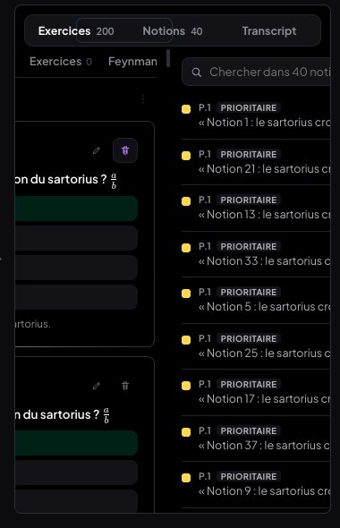 | 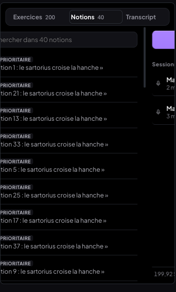 | 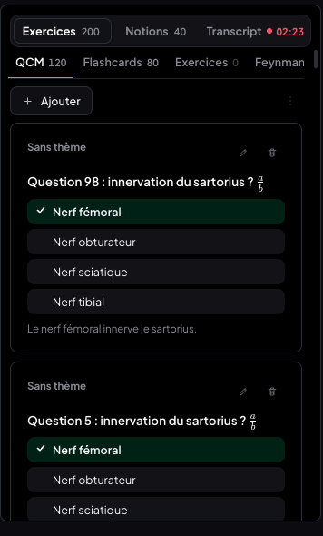 | 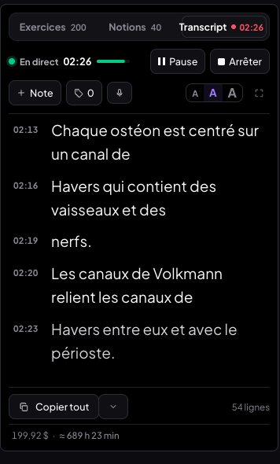 |

Tablette 820 px, doigt tenu à mi-chemin : 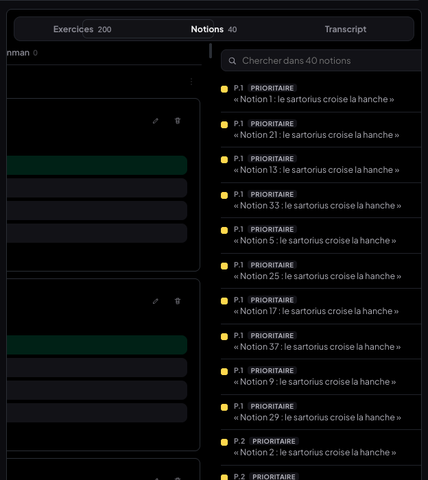

### Limites (v1.2)

- **Trackpad et « tenir à mi-chemin »** : macOS n'envoie aucun événement quand les doigts sont
  posés immobiles, et Chrome n'expose pas la levée des doigts. Après 140 ms sans événement, le
  geste est considéré terminé et s'aimante. Au doigt (tactile), on peut tenir indéfiniment.
- **60 fps mesurés en headless** (rAF, intervalle entre images), pas dans l'onglet Performance
  d'un Chrome à l'écran : à confirmer sur le Mac avec un vrai trackpad.
- **Une image sautée au début d'un geste** (33 ms en headless) : au repos, le volet affiché n'a
  aucune transformation (pour les modales fixes) ; au premier événement il devient un calque GPU
  et doit être rastérisé. Vérifié : volets promus en permanence → cette image disparaît. Non
  retenu, car une transformation permanente enfermerait dans le panneau toute modale fixe rendue
  dans un mode (une vingtaine de classes `position: fixed` dans l'app). Headless rastérise en
  logiciel : sur le GPU du Mac le coût devrait tenir dans une image — à vérifier dans l'onglet
  Performance.
- **Interactivité après l'aimantation** : le mode d'arrivée devient cliquable 240 ms après le
  relâchement (fin du mouvement), pas avant.
- Les crédits Deepgram restent demandés à l'ouverture d'un cours par le lecteur lui-même
  (`PdfReader`, comportement antérieur, limité à une fois par minute) — ce n'est pas le
  panneau monté qui les déclenche.

### Commits v1.2

| Commit | Message |
|---|---|
| `8a748ac` | fix(medrevise): glissement physique entre les 3 modes du panneau — modes montés, piste en translateX, aimantation 220 ms |
| (ce commit) | docs(medrevise): compte-rendu v1.2 — glissement physique |

## v1.3 — chrono unique, focus des modes, crédits en direct (07/10/2026)

### 1. Un seul chrono

Le temps de session s'affichait deux fois : dans le segment « Transcript • 01:44 » du
sélecteur et dans la ligne « En direct 01:44 ». Le segment ne montre plus qu'un **point**
(`BadgeTranscript`, `TranscriptPanel.jsx`) : rouge et **pulsant** (anneau qui s'élargit et
s'efface, 1,6 s, coupé si « réduire les animations ») pendant une session de ce cours, gris
fixe en pause, absent sinon. Il reste visible depuis Exercices et Notions. Le seul chrono est
celui de la ligne « En direct ». Libellé accessible : « Transcription en cours / en pause ».

### 2. Changer de mode sans clic de « focus »

**Cause exacte** (reproduite dans Chrome avant correction, vrais événements roue/clavier/souris) :
les quatre pistes de l'énoncé ont été vérifiées.

- *Écouteur attaché au mode monté ?* **Non** — la roue et les pointeurs étaient déjà sur
  `.pm-corps`, le conteneur de la piste. Pas la cause (inchangé).
- *État de progression non remis à zéro après l'aimantation ?* **Oui, c'est la cause au
  trackpad** : le **verrou anti-inertie** (`bloqueJusqua`). Après un relâchement, le geste était
  bloqué 400 ms **et prolongé de 150 ms à chaque événement de roue reçu**. Or l'inertie de
  macOS fait déjà partie du geste (il ne se termine qu'après 140 ms sans événement) : ce verrou
  ne filtrait plus rien d'utile, mais il **avalait entièrement un geste neuf** commencé dans les
  ~550 ms suivantes — chacun de ses propres événements repoussant l'échéance. Mesuré avant
  correction (geste réaliste : 8 événements « doigts » + 45 d'inertie décroissante) :

  | Pause entre deux gestes | 0 ms | 150 ms | 300 ms | 500 ms | 700 ms |
  |---|---|---|---|---|---|
  | Exercices → ? → ? | Notions (les deux gestes fusionnés en un) | Notions, Notions | Notions, Notions | Notions, Notions | Notions → Transcript |

  Le « clic dedans » ne faisait que laisser passer le temps.
- *`inert` / `aria-hidden` mal levés ?* **Oui, cause au clic et au doigt** : `inert` n'était
  retiré du mode d'arrivée qu'à la **fin** de l'aimantation (240 ms). Un clic ou un tap dans ce
  délai tombait sur un sous-arbre inerte et était perdu — mesuré : clic sur « Flashcards » 100 ms
  après le changement → le sous-onglet restait sur QCM.
- *Focus clavier resté sur l'ancien mode ?* **Oui, cause au clavier** : le focus restait sur le
  segment cliqué (ou retombait sur `<body>` quand l'ancien mode devenait inerte) ; Page↓ ne
  faisait rien (mesuré : `scrollTop` 0 → 0) tant qu'on n'avait pas cliqué dans le mode.

**Correctif** (`CourseItemsSidebar.jsx`, `panneau-modes.css`) :
- verrou ramené à la **durée de l'aimantation (220 ms), sans prolongation** ; ce qui arrive
  pendant ces 220 ms est **reporté** (cumulé puis appliqué au premier événement suivant), pas perdu ;
- **geste neuf pendant l'inertie** du précédent : l'élan de macOS décroît sans remonter ; un delta
  qui repart à la hausse (×3, ou ×2 après une pause de 50 ms, ≥ 6–8 px) une fois l'élan retombé
  sous la moitié de son pic, ou qui change de sens, clôt le premier geste et en commence un
  autre. Le seuil ×3 évite les faux départs quand Chrome fusionne deux événements d'élan (< ×2) ;
- `inert`, `aria-hidden` et `tabIndex` du mode d'arrivée sont levés **dès le début** de
  l'aimantation (le coût de style, ~26 ms sur 200 items, est payé pendant une transition de
  transform composée par le GPU) ;
- le mode arrivé **reçoit le focus** programmatiquement, sans défilement (`preventScroll`), sur
  son conteneur défilant (`.pis-scroll`, `.trx-liste`, `.trx-accueil-defile`) — seulement si le
  changement vient du panneau (geste ou segment) et si le focus est dans le panneau ou nulle
  part : jamais volé au lecteur ni à un champ. Anneau de focus seulement au clavier.

### 3. Crédits et temps restant en direct

`credits.js`, `Credits.jsx`, `engine.js`. Pendant une session, la ligne « 199,93 $ · ≈ 689 h
25 min » (et la carte dépliée, même composant) **décompte localement** à partir de la dernière
valeur serveur connue : coût = secondes envoyées × tarif effectif / 3600, temps restant = solde
estimé ÷ tarif effectif. **Aucun appel réseau** pendant la session (inchangé : `actualiserCredits`
refuse tant qu'une session tourne).
- **Lissage** : la carte lit un nombre de secondes par **paliers de 10 s**
  (`consoNonFactureeS`) via `useSyncExternalStore` — elle ne se re-rend que lorsqu'il change.
- **Pause** : le moteur n'avance plus son horloge de cours → le décompte se fige.
- **Reprise d'une session interrompue** : seules les secondes de cette reprise comptent
  (`secondesDepart` dans l'état du moteur).
- **Arrêt** (ou erreur fatale en cours de session) : l'estimation reste affichée (`attente`)
  jusqu'à la relecture serveur forcée, lancée aussitôt (la limite de 30 s du bouton ne s'applique
  pas), qui la **remplace**. Si la relecture échoue, l'estimation reste, marquée « hors ligne ».
- **Recalage du tarif** : coût réel = solde avant − solde après. Écart > 5 % avec l'estimation →
  tarif réel stocké (`localStorage medrevise.transcription.tarif`), utilisé ensuite partout
  (décompte, temps restant, coût figé des sessions). Garde-fous : session ≥ 60 s, solde de départ
  frais (< 30 min), valeurs non périmées, coût réel entre 0,5× et 2× l'estimation (au-delà :
  solde Deepgram pas encore à jour ou consommation d'un autre appareil), et **coût estimé
  ≥ 0,20 $ (~40 min)** : le solde renvoyé est arrondi au centime, une session de 3 min
  (~1,5 centime) ne permet pas de mesurer un écart de 5 %.
- Carte dépliée : « estimation en direct » remplace « mis à jour il y a… » pendant la session.

### Tests (Chrome headless piloté en CDP — vrais événements roue, souris, clavier, tactiles ; faux Supabase vide et faux Deepgram locaux, jamais le cloud)

| Test | Résultat |
|---|---|
| Trackpad : Exercices → Notions → Transcript → Notions → Exercices, **pause 0 ms** entre gestes, lecture 160 ms après chacun | ✅ Exercices → Notions → Transcript → Notions → Exercices (avant : 2e geste avalé) |
| Trackpad : deux gestes collés (le 2e pendant l'inertie du 1er), puis deux retours collés | ✅ Exercices → Transcript → Exercices |
| Trackpad : pause de 150 / 300 / 500 ms entre deux gestes | ✅ Notions → Transcript dans les trois cas (avant : bloqué) |
| Un seul geste, inertie longue (90 événements), dont 4 avec événements fusionnés au hasard | ✅ 6 × exactement un mode d'écart, aucun faux départ |
| Segments cliqués à 120 ms d'intervalle | ✅ Exercices → Notions → Transcript → Notions → Exercices |
| Clic dans le mode arrivé 100 ms après le changement | ✅ « Flashcards » pris (avant : perdu) |
| Clavier sans clic : segment Notions puis Exercices, Page↓ | ✅ focus sur la liste d'Exercices, `scrollTop` 0 → 481 (avant : 0 → 0) |
| Tablette tactile 820 px (vue Panneau) : la même séquence au doigt (250 ms entre gestes) puis aux segments (taps à 120 ms) ; tap « QCM » 100 ms après l'arrivée | ✅ les deux séquences complètes ; sous-onglet QCM pris |
| Téléphone (< 760 px) | sans objet : le shell mobile n'a pas de lecteur, donc pas ce panneau |
| Session en direct de 3 min 30 (voix de synthèse, faux Deepgram réglé sur le compte réel : 199,93 $, 0,29 $/h) | ✅ un seul chrono visible (ligne « En direct ») ; point rouge pulsant dans le segment depuis Notions et Exercices ; disparu à l'arrêt |
| Changement de mode **pendant** la session (Transcript → Notions → Exercices → Transcript au trackpad) | ✅ le transcript continue d'arriver (chrono 00:38 → 00:47, lignes ajoutées pendant l'absence) |
| Décompte des crédits | ✅ 199,93 $ · 689 h 25 → 689 h 24 (25 s) → 199,92 $ (1:15) → 689 h 23 (1:30) → 689 h 22 (2:30) |
| Pause de 30 s | ✅ figé : 199,92 $ · 689 h 23 min aux 4 relevés ; chrono 01:30, point gris |
| Arrêt (solde « réel » simulé à 199,91 $) | ✅ +150 ms : 199,91 $ · 689 h 21 min (valeur serveur), point disparu |
| Réseau pendant la session | ✅ **0** requête `/api/deepgram-credits` ; une seule après l'arrêt (`?force=1`) |
| Recalage (module de l'app, sessions synthétiques d'1 h) | ✅ coût réel +20,7 % → tarif 0,29 → 0,35 $/h ; −11,4 % → 0,31 $/h (ligne : 199,25 $ · ≈ 642 h 45 min) ; écart 3 % → inchangé ; session de 3 min → jamais recalé (garde-fou) |
| Non-régression | ✅ défilement d'Exercices conservé (1 500 px) ; défilement vertical ne change pas de mode ; « Ajouter » ; confirmation de suppression plein écran (1 440 × 757) ; Tab × 40 : 0 fois dans un mode caché ; **0 erreur console** |
| MealWeek / `src/shared/` | ✅ aucun fichier modifié (`git status` : 5 fichiers sous `src/medrevise/` + `src/styles/panneau-modes.css`, classes `.pm-*` propres à MedRevise) ; MealWeek ouverte depuis le hub : accueil normal, 0 erreur console |
| Build | ✅ `npm run build` vert |

| Transcript en direct | Notions : point seul | Exercices : point seul | En pause | Après l'arrêt |
|---|---|---|---|---|
| 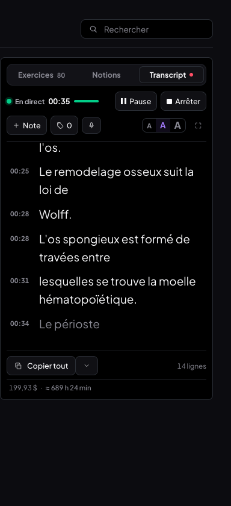 | 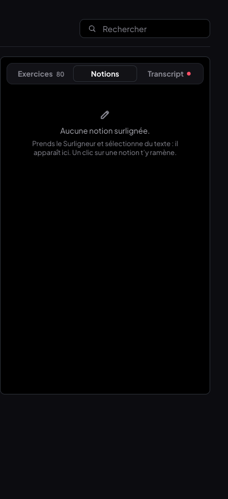 | 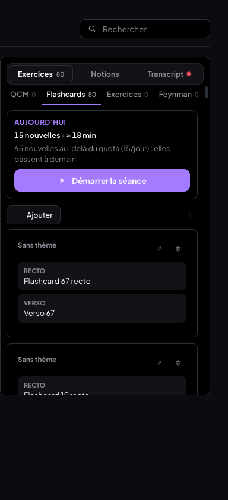 | 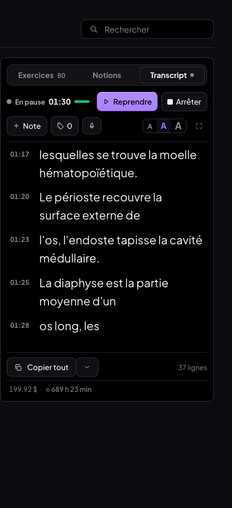 | 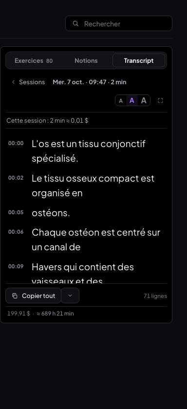 |

Tablette 820 px après la séquence tactile : 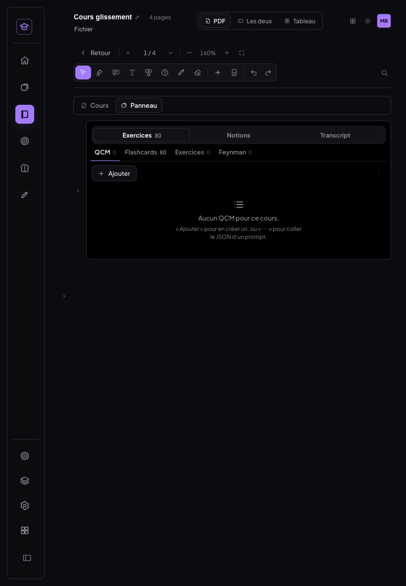

### Limites (v1.3)

- **Comparaison avec la console Deepgram : non faite.** L'extension Chrome n'était pas connectée
  (console illisible), et le test réel par relais local vers la fonction de prod a été refusé
  par le garde-fou de permissions de la session. La session de 3 min a donc tourné sur le faux
  Deepgram ; à refaire sur le Mac : une session réelle de 3 min, puis comparer la ligne
  après l'arrêt avec le solde de console.deepgram.com. Attendu : ~1,5 centime à 0,29 $/h
  (~1,8 centime au tarif réellement facturé de 0,354 $/h constaté le 05/10).
- **Trackpad réel** : gestes reproduits par des événements roue synthétiques (doigts + inertie
  décroissante, événements fusionnés) ; Chrome n'expose ni la pose ni la levée des doigts, d'où
  l'heuristique « l'élan remonte = nouveau geste ». À confirmer avec un vrai trackpad.
- **Recalage** : effectif seulement pour les sessions d'au moins ~40 min (précision du centime).
  Pour les sessions courtes, le tarif du serveur (ou le dernier recalé) reste utilisé.
- **Estimation en mémoire** : si la relecture de fin échoue et que l'onglet est rechargé,
  l'estimation est perdue et l'ancienne valeur serveur réapparaît jusqu'à la relecture suivante.

### Commits v1.3

| Commit | Message |
|---|---|
| (ce commit) | fix(medrevise): panneau — chrono unique, modes enchaînés sans clic, crédits en direct (v1.3) |

## v1.4 — geste fluide (07/10/2026)

Demande : glissement entre Exercices · Notions · Transcript instantané et parfaitement fluide —
il marchait mais accrochait (latence au début du geste, saccades, ratés en enchaînant vite).

### Méthode de mesure (identique avant et après)

Chrome headless piloté en CDP, 1 440 × 900, **transcription active** (micro simulé, faux Deepgram
local, jamais le cloud), session reprise de **320 → 866 lignes** de transcript. Scénario : **10 s de
glissements rapides aller-retour** (Exercices → Notions → Transcript → Notions → Exercices…),
une fois au **trackpad** (événements roue à 60 Hz : 8 « doigts » + 24 d'inertie décroissante,
120 ms entre deux gestes), une fois au **doigt** (événements tactiles).
- **Performance** : trace Chrome (catégories `devtools.timeline` — celles de l'onglet Performance),
  analysée sur les seules **fenêtres de mouvement** (repères posés au premier changement de
  `transform` et au `transitionend` de l'aimantation). Image perdue = rapport de pipeline
  `DROPPED` ou présenté partiellement ; « sans changement » (aucune nouvelle position reçue
  pendant l'image) n'est pas une saccade.
- **Rendus React** : crochet DevTools injecté avant le chargement (même principe que le
  Profiler) — un composant compte s'il a réellement été ré-exécuté dans un commit
  (fibre retravaillée + `PerformedWork`), et chaque commit est daté pour savoir s'il tombe
  pendant un mouvement.
- **Délai du premier mouvement** : de l'horodatage du premier événement d'un geste à l'écriture
  du `transform` dans l'image, décomposé en « navigateur » (horodatage → exécution du
  gestionnaire) et « notre code » (gestionnaire → transform écrit).
- **Avant** = code de `d77a1a4`, remis temporairement sur le même serveur de dev, mêmes données.

### Mesures

| | Avant — trackpad | Après — trackpad | Avant — doigt | Après — doigt |
|---|---|---|---|---|
| Rendus React **pendant le mouvement** | **89 commits** (transcript, pastille, VU-mètre, crédits, 80 cartes d'Exercices + 164 formules) | **0** | **147 commits** | **0** |
| Délai du premier mouvement, part de notre code (médiane) | **205 ms** (jusqu'à 660) | **0 ms** (0–2) | 0 ms | **1 ms** (0–3) |
| … total, horodatage → transform écrit (médiane) | 244 ms | 27 ms | 22 ms | 25 ms |
| Images perdues ou partielles pendant le mouvement | **125** | **0** | **238** | **0** |
| Écarts entre images > 20 ms (pire) | 7 (50 ms) | 0 (16,7 ms) | 0 | 1 (33 ms, « sans changement ») |
| Tâche la plus longue (≈ frame la plus longue) | 19,2 ms | **10,9 ms** | 19,8 ms | **10,4 ms** |
| Tâches > 16 ms | 10 | **0** | 8 | **0** |
| Tâches > 8 ms | 72 | 8 | 90 | 16 |
| Recalcul de style le plus gros | 3 110 éléments (13,1 ms) | 377 éléments (4,1 ms) | 3 123 éléments | 144 éléments (2,9 ms) |
| Recalculs de style / image | 1,03 | 1,01 (celui du `transform` de la piste) | 0,96 | 1,66 |
| Mises en page / image | 0,08 | 0,09 | 0,08 | 0,06 |
| Script pendant le mouvement | 450 ms | **57 ms** | 1 735 ms | 307 ms |
| Images par seconde (intervalle médian / p95) | 16,7 / 16,7 ms | 16,7 / 16,7 ms → **60 i/s** | 16,7 / 16,7 ms | 16,7 / 16,7 ms → **60 i/s** |
| Propriété animée | `transform` de chaque volet + `--i` de l'indicateur | `transform` de la **piste** et de l'indicateur, seuls | idem | idem |
| Lignes de transcript rendues | 866 (toutes) | ~20 (virtualisé) | 866 | ~20 |

Délai visible : avec le code final, le gestionnaire s'exécute **dans l'image en cours** (Chrome
aligne les entrées sur les images : l'horodatage de cette image précède la réception) et le
`transform` est écrit 0 à 3 ms après — il est peint dans cette même image, **sous une image**
de délai. Les ~25 ms « navigateur » séparent l'horodatage de l'événement de son arrivée dans la
page : c'est la chaîne d'entrée de Chrome headless piloté en CDP, identique avant et après.

### Causes racines

1. **La latence au début du geste et les ratés en enchaînant** venaient du **verrou de
   l'aimantation** : tout geste neuf était retenu 220 ms (« reporté »), et la fin d'un geste
   n'était détectée qu'après 140 ms de silence — l'inertie de macOS faisant partie du geste.
   Résultat mesuré : 205 ms (jusqu'à 660 ms) entre l'événement et le premier mouvement dès qu'on
   enchaîne. Avec des événements d'inertie espacés de plus de 30 ms, l'inertie puis le geste
   suivant étaient même suivis comme un seul geste (piste à −133 %, un seul changement).
2. **Les saccades** venaient des **rendus React pendant le mouvement** : la transcription en
   direct publie plusieurs fois par seconde (lignes, chrono, niveau audio), et chaque
   publication re-rendait le transcript (866 lignes), la pastille, le VU-mètre, les crédits ;
   le changement de mode re-rendait la liste d'Exercices (80 cartes, formules KaTeX) ; et la
   bascule de `inert` en fin d'aimantation recalculait le style de ~3 100 éléments (jusqu'à 13 ms).
3. **Les images partielles au trackpad** (seule source restante après les deux premiers
   correctifs : 13 à 21 par scénario) venaient de l'**écouteur de roue passif** : le compositeur
   ne savait pas que la page prenait le geste et n'attendait plus l'image du fil principal.

### Ce qui change

- **Le geste vit hors de React** (`components/glissementModes.js`) : un gestionnaire unique sur
  le conteneur de la piste — roue (non passive, `preventDefault()` seulement une fois le geste
  horizontal pris en charge ; un défilement vertical n'est jamais retenu) et pointeurs (passifs,
  souris exclue). Il écrit `transform: translate3d(x, 0, 0)` sur la **piste** et sur l'indicateur
  du sélecteur, **une seule fois par image** dans `requestAnimationFrame` (la dernière valeur
  gagne). Aucun `setState`, aucun contexte pendant le mouvement : React est prévenu **une fois**, à
  la fin de l'aimantation, dans une tâche à part (après l'image qui termine le mouvement).
- **Axe décidé une fois par geste**, dès 8 px cumulés (horizontal si |dx| > |dy|, sinon on laisse
  défiler) ; jamais pris en charge sur une zone qui défile horizontalement, un canvas, ou avec du
  texte sélectionné. Pour ne pas attendre les 8 px, un début nettement horizontal déplace déjà la
  piste à titre provisoire (elle revient si l'axe est vertical).
- **Aimantation** : `transform 200ms cubic-bezier(0.2, 0, 0, 1)`, aucune transition pendant le
  suivi. Un geste lancé pendant l'aimantation la **fige à sa position réelle** et repart de là,
  sans attente. Pendant le suivi, la piste reste à un mode d'écart au plus (élastique au-delà).
- **Inertie macOS** : fin du geste détectée dès le **début de l'inertie** (deltas qui décroissent
  régulièrement) ou après 120 ms de silence ; la traîne est ensuite **ignorée** (250 ms au moins,
  et tant qu'elle décroît) — sauf un geste franc (delta qui remonte, 24 px cumulés), qui repart
  immédiatement. Un delta qui remonte pendant le suivi (doigts reposés) clôt le geste et en ouvre
  un nouveau.
- **Rendus différés pendant un geste** (`lib/gesteEnCours.js`) : les abonnements React aux stores
  vivants (transcription, niveau audio, crédits, indicateur global, OCR) mettent leurs
  notifications de côté et les rejouent à la fin du geste. Le **moteur ne s'arrête jamais** : l'audio
  part, les lignes s'enregistrent ; seul l'affichage attend (< 1 s).
- **Volets** : `React.memo` (`Volet`), contenus mémoïsés (props stables) ; translation fixe
  (k × 100 %), `contain: layout paint` ; `will-change: transform` sur la piste ; `overflow: hidden`
  sur le conteneur (inchangé). `inert` + `aria-hidden` sur les modes cachés, retirés du mode arrivé
  **à la fin de l'animation**, dans le même rendu que le mode actif ; le mode arrivé reçoit le focus
  (sans défilement) après **tout** geste ou clic — un geste peut repartir sans clic.
- **Cartes hors de la zone visible** (`.pis-item`, notions) en `content-visibility: auto` : la
  bascule de `inert` ne recalcule plus que ce qui se voit (3 110 → 377 éléments).
- **Transcript virtualisé au-delà de 150 lignes** : seules les lignes autour de la zone visible
  (± 800 px) sont rendues, deux cales gardent la hauteur ; hauteurs mesurées, collé en bas. Une
  session de 1 400 lignes ne rend plus qu'une vingtaine de lignes.
- **Modales des modes sorties de la piste** : la piste est désormais transformée en permanence,
  ce qui enfermerait un `position: fixed`. Le panneau pose `ModalesHorsPanneauCtx` : ses `Modal` /
  `ConfirmModal` passent par un portail vers la racine de l'app (`[data-app="medrevise"]`, styles
  gardés). Ça corrige au passage un piège du mode tablette (le `container-type` du panneau
  enfermait déjà ces modales).
- Clic sur un segment : même chemin qu'un glissement (animé), comparé à la position **visée** par
  la piste — avant, un clic sur le mode de départ pendant une rafale était ignoré.

### Tests (Chrome, CDP — vrais événements roue, tactiles, souris, clavier ; transcription active, 300+ lignes)

| Test | Trackpad | Doigt |
|---|---|---|
| Glisser lentement (20 pas) : la piste suit chaque pas | ✅ 0,02 → 0,40, sans retard | ✅ |
| À 40 % : 60 % Exercices + 40 % Notions visibles, contenus rendus, pas de zone noire | ✅ (capture) | ✅ (capture) |
| Relâché lentement à 40 % → retour au mode de départ | ✅ | ✅ |
| Glisser rapidement → mode voisin | ✅ | ✅ |
| 5 changements enchaînés | ✅ en 3,09 s* | ✅ en 1,66 s |
| Aller à mi-chemin puis revenir dans le même geste (doigt tenu 240 ms) → reste | ✅ | ✅ |
| Geste lancé pendant l'aimantation du précédent → repart aussitôt (deux changements) | ✅ | ✅ |
| Un geste avec inertie longue (70 événements) → **un seul** changement | ✅ | ✅ |
| Événements d'inertie espacés de 30 ms et plus : Exercices → Notions → Transcript → Notions → Exercices | ✅ (avant : −133 %, un seul changement) | — |
| **50 allers-retours** pendant le direct : transcript intact | ✅ 1 371 → 1 394 lignes, 0 doublon, collé en bas | ✅ 1 399 → 1 411, 0 doublon |
| Segments cliqués à 120 ms d'intervalle (rafale qui revient au départ) | ✅ Exercices → Notions → Transcript → Notions → Exercices ; état React et focus sur Exercices | — |
| Mode arrivé : `inert` retiré et focus à la fin de l'animation ; clic et Page↓ sans clic préalable | ✅ à 250 ms : inerte → non, focus sur le mode ; Page↓ 0 → 624 px | — |
| Défilement vertical interne gardé (1 500 px) ; un défilement vertical ne change jamais de mode | ✅ | ✅ (liste défilée de 387 px, piste immobile) |
| Sélection de texte à la souris dans le transcript ; geste horizontal ignoré tant que du texte est sélectionné | ✅ | — |
| Modale d'un mode (supprimer une carte) : plein écran, rendue hors de la piste | ✅ 1 440 × 900, dans `[data-app]` | — |
| Clavier : Tab × 40 → 0 fois dans un mode caché | ✅ | — |
| Mode tablette (iPad mini portrait, iPad paysage, rotations) : batteries de la refonte tablette | ✅ 30/31 (le ❌ : le test supposait un départ en page 1) | ✅ |
| Erreurs console | 0 | 0 |

\* Le banc envoie 32 événements de 16 ms par geste (≈ 0,5 s chacun) : la durée est celle du banc.

| À 40 % au trackpad | À 40 % au doigt |
|---|---|
| 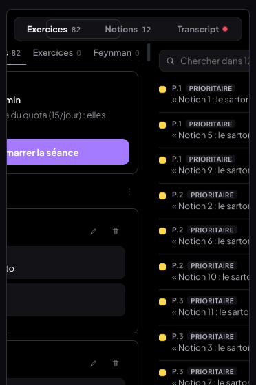 | 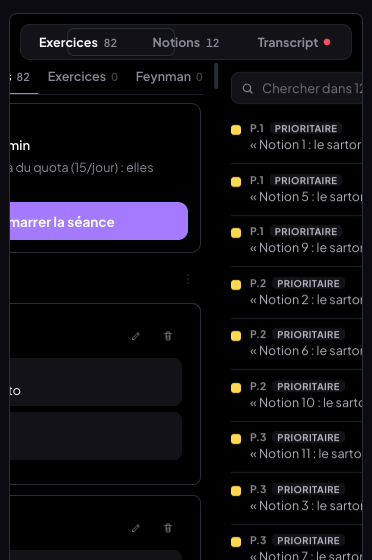 |

### Limites (v1.4)

- **Mesures en headless** (rendu logiciel, entrées injectées en CDP), pas sur le Mac avec un vrai
  trackpad : l'ordre de grandeur avant/après est fiable, les valeurs absolues dépendent de la
  machine. À confirmer dans l'onglet Performance de Chrome DevTools sur le Mac.
- **Rafale au doigt** plus rapide que l'aimantation (gestes à moins de 200 ms d'écart) : l'état
  React (segment actif, `aria-selected`, focus) n'est mis à jour qu'à la fin de la rafale ;
  l'indicateur, lui, suit en direct.
- Un clic dans le mode d'arrivée **pendant** les 200 ms de l'aimantation est ignoré (`inert` retiré
  à la fin de l'animation, comme demandé) — la v1.3 le levait dès le début.
- **Trackpad et « s'arrêter à moitié »** : macOS n'envoie rien quand les doigts sont immobiles ; au
  bout de 120 ms sans événement, le geste s'aimante (au doigt, on peut tenir indéfiniment).
- Le chrono et la dernière ligne du transcript se figent pendant un geste (< 1 s) puis rattrapent
  d'un coup ; l'enregistrement, lui, ne s'interrompt jamais.
- Le crochet DevTools et `window.__medreviseGeste` ne servent qu'aux mesures (le second n'existe
  qu'en développement).

### Commits v1.4

| Commit | Message |
|---|---|
| (ce commit) | perf(medrevise): glissement des modes hors de React, rendus différés pendant le geste, transcript virtualisé (v1.4) |
