# Position de lecture, document de notes, tablette refaite — compte-rendu (07/10/2026)

Trois chantiers livrés ensemble. Tests dans Chrome piloté en CDP (headless) : vrais événements souris,
roue, tactiles, stylet (`pointerType: pen`) et clavier. Données locales isolées. Synchro testée
entre **deux navigateurs indépendants** (deux profils = deux bases IndexedDB) reliés à un
**faux Supabase local** (`scripts/faux-supabase.mjs`). **Aucune écriture dans le vrai cloud.**

---

## 1. Reprendre exactement où l'on en était dans un PDF

### Ce qui est fait
- **Type `reading_position`** (store IndexedDB neuf, synchronisé), un enregistrement par cours :
  `{ id: 'rp:'+ficheId, kind: 'pdf', cle, index, fraction, scale, zoomManuel, disposition, empreinte }`.
  `fraction` = décalage du haut de la zone visible dans la page (0–1 de sa hauteur, jamais des pixels).
  L'utilisateur est celui de la session cloud ; la table est déjà par utilisateur.
- **Sauvegarde** (`pdf/PdfReader.jsx`, `lib/positionLecture.js`) :
  - à l'arrêt du défilement (500 ms) ;
  - au changement de page, de zoom ou de disposition ;
  - à `visibilitychange` (onglet caché), à `pagehide` et à la fermeture du cours.
- **Écriture regroupée** (`lib/storage.js#ecrireRegroupe`) : IndexedDB est écrit tout de suite, mais la
  file d'envoi cloud ne reçoit la position qu'**au plus une fois toutes les 30 s**. Une version
  qui n'aurait pas eu le temps de partir (onglet fermé) part au démarrage suivant : `reconcileAll`
  pousse tout enregistrement local plus récent que le cloud (garde-fou `updated_at`).
- **Restauration silencieuse**, sans bouton ni question, en quatre temps :
  1. la position est lue en parallèle du PDF ;
  2. la zone de lecture reste invisible (`visibility: hidden`) pendant ce temps ;
  3. on pose dans l'ordre le zoom, la disposition, puis le défilement ;
  4. on attend que la page visée soit **réellement dessinée** (`data-rendu` sur son canvas) avant
     d'afficher.

  Aucune image de la page 1 n'est jamais montrée. Filet de sécurité : affichage au bout de 2,5 s
  au plus.
- **PDF changé** (autre `pdfId` ou autre nombre de pages) : la position est ignorée, on retombe sur la
  page 1 sans erreur.
- En tablette, le zoom ajusté à la largeur suit l'écran. Un zoom manuel, lui, est restauré tel quel.

### Tests
| Test | Résultat |
|---|---|
| Lire jusqu'au milieu de la page 14 à 121 % (PDF de 20 pages), fermer, rouvrir | ✅ page 14, décalage 0,50, 121 % |
| Aucun flash | ✅ 3 images masquées pendant la restauration, puis 240 images visibles, **toutes sur la page 14** (avant elles, le PDF en chargement, sans aucune page) |
| Recharger toute l'app puis rouvrir | ✅ page 14, 0,50, 121 % |
| **Deuxième appareil** (profil neuf, synchro de démarrage) | ✅ même page, même décalage, même zoom |
| Regroupement : 12 arrêts de défilement en 15 s | ✅ 12 enregistrements locaux, **1** écriture cloud ; la dernière position part après 30 s (cloud = local) |
| PDF remplacé (21 pages au lieu de 20) | ✅ page 1, affichée, aucune erreur ni exception |

| Rouvert : page 14 à 121 % | Deuxième appareil |
|---|---|
| 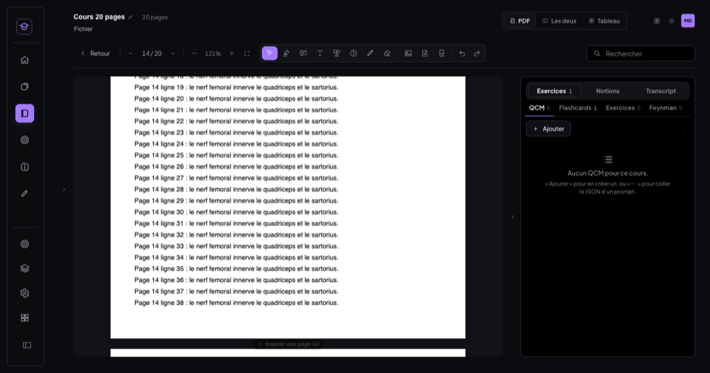 |  |

---

## 2. Document de notes

### Ce qui est fait
- **Bibliothèque → « Nouveau document »** (`pages/Bibliotheque.jsx`) : on choisit une destination et un
  titre, le document s'ouvre aussitôt. C'est un **cours sans PDF** (fiche `type: 'standard'`,
  `docNotes: true`) avec un éditeur riche plein écran (`documents/NotesEditor.jsx`).
- **Éditeur** : le moteur unique de l'app (TipTap/ProseMirror, `documents/lib/richtext.js`), étendu
  sans rien changer aux autres usages (`NOTES_EXTENSIONS`).
  - **Mise en forme** : titres H1–H3, gras, italique, souligné, barré, surlignage.
  - **Blocs** : listes à puces, listes numérotées, cases à cocher, tableaux simples, citations,
    séparateurs, liens.
  - **Images** collées (⌘V) ou glissées : stockées en **blobs IndexedDB**, jamais en base64 dans le JSON.
  - **Raccourcis** : ⌘B, ⌘I, ⌘U, ⌘⇧7, ⌘⇧8, ⌘⇧9 (cases), ⌘K (lien).
  - **Saisie Markdown** : « # », « ## », « - », « 1. », « [] », « > », « --- ».
  - **Barres** : une barre fixe compacte, et une barre flottante à la sélection (gras, italique,
    souligné, surligner, lien, **Notion**, **Flashcard**).
- **Un cours à part entière** (`documents/DocumentCours.jsx`) : même panneau latéral (Exercices,
  Notions, Transcript).
  - On peut lancer une transcription à côté de ses notes.
  - **Flashcard depuis une sélection** : le mode Exercices s'ouvre, carte d'ajout ouverte, recto
    pré-rempli.
  - **Notion depuis une sélection** : le passage est marqué dans le document et enregistré comme
    notion (`highlights`, `source: 'doc'`). Un clic dans Notions fait défiler jusqu'au passage.
  - Le document fait foi : un passage supprimé retire sa notion, un « annuler » la recrée.
- **Sauvegarde continue** (800 ms, immédiate quand l'onglet est caché ou fermé) dans le store
  **`notes_doc`** (JSON ProseMirror, synchronisé). La position de lecture est mémorisée comme au
  point 1 : bloc en haut de la zone visible et décalage dans ce bloc.
- **Exports** :
  - **Markdown** (.md) : titre, titres, listes, cases, tableaux, citations, liens, souligné en
    `<u>`, images incluses en data URL ;
  - **Impression / PDF** : feuille d'impression dédiée, sans le fond ni l'interface de l'app.
  - Pas de .docx : aucune bibliothèque docx dans le projet (voir décisions).
- **Conversion** : « Importer un PDF » dans le document → le cours devient un cours PDF et le
  document devient son **onglet « Notes »** (mêmes données). Dans l'autre sens, **tout cours PDF
  gagne un onglet « Notes »**, vide par défaut, avec le même éditeur (4ᵉ mode du panneau).
- Les notions venues des Notes sont listées à part dans le mode Notions d'un cours PDF : sans page ni
  rectangles, elles ne sont jamais mêlées aux surlignages du PDF.

### Tests
| Test | Résultat |
|---|---|
| « Nouveau document » → éditeur plein écran + panneau (Exercices · Notions · Transcript) | ✅ |
| Écrire 2 pages : titres, puces, numérotée, cases, citation, ⌘B / ⌘I / ⌘U, ⌘⇧8, tableau, séparateur, 14 paragraphes, image collée | ✅ les 13 vérifications de structure |
| Sauvegarde : JSON ProseMirror, image en blob, aucun base64 | ✅ |
| Fermer, recharger l'app, rouvrir | ✅ HTML identique à l'octet (4 410 caractères) ; position retrouvée (905 → 931 px, au bloc près) |
| Barre flottante à la sélection | ✅ B · I · U · A · Lien · Notion · Flashcard |
| Flashcard depuis « la loi de Wolff » | ✅ recto pré-rempli, carte créée (0 → 1) |
| Notion depuis « Le périoste recouvre » | ✅ marquée dans le document, listée, un clic y ramène |
| Transcription en direct à côté, en écrivant | ✅ chrono qui avance, lignes qui arrivent, titre modifié pendant ce temps |
| Export .md | ✅ 11 925 caractères, structure complète, image incluse |
| Impression / PDF | ✅ PDF rendu par Chrome (`Page.printToPDF`), mise en page propre |
| Importer un PDF dans le document | ✅ cours PDF ; modes Exercices · Notions · Transcript · **Notes**, notes intactes |
| Cours PDF existant | ✅ onglet « Notes » présent et vide |
| Synchro sur un 2ᵉ appareil | ✅ le document arrive (titre, case cochée) |
| Exceptions JavaScript | 0 |

| Éditeur | Avec la transcription en direct |
|---|---|
|  | 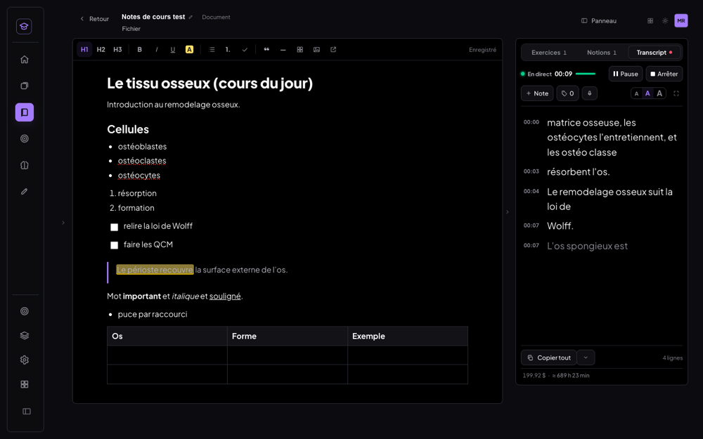 |

| Cours converti : onglet « Notes » | Impression / PDF |
|---|---|
| 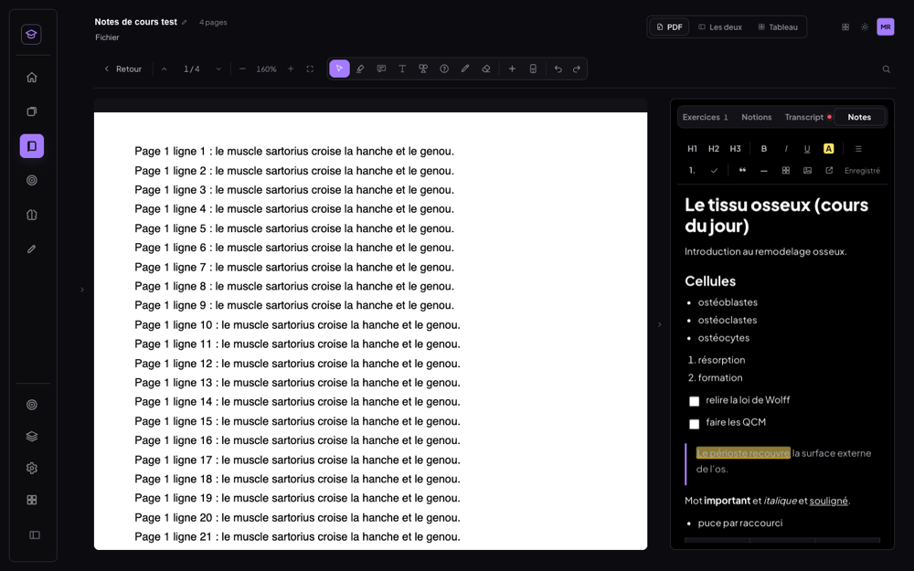 | 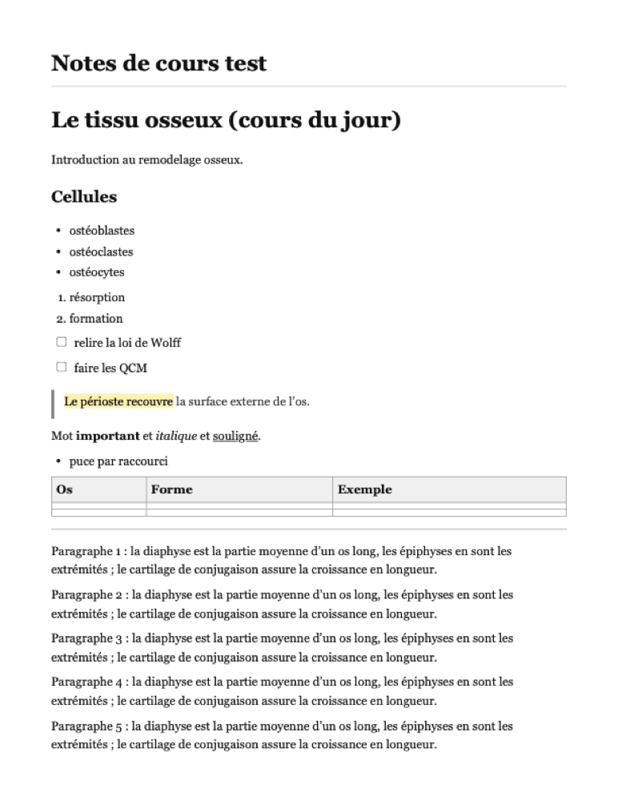 |

---

## 3. Mode tablette refait (761–1 199 px)

### Ce qui est fait
- **Volet latéral, paysage comme portrait** : le panneau s'ouvre depuis le bord droit. Le **PDF se
  redimensionne à côté** et reste visible et annotable, avec son zoom réajusté à la largeur
  disponible.
  - **Largeur par défaut** : ~40 % en paysage, ~45 % en portrait. Le volet ne dépasse jamais 60 % :
    le PDF garde toujours au moins ~38 %.
  - **Séparateur glissable** : largeur mémorisée par appareil **et par orientation**.
  - **Poignée toujours visible sur le bord** (volet fermé) : un tap ou un glissement vers la gauche
    ouvre. Elle montre aussi le point de session et le nombre de nouvelles lignes.
  - **Fermeture** : le bouton, ou le séparateur glissé vers la droite au-delà du minimum.
- **Supprimés** : la bascule « Cours / Panneau », les onglets du bas, la bande « en direct », la barre
  auto-masquée, le menu « … » de l'en-tête, « Plus d'outils » et le menu « Aa » du transcript.
- **Tout visible en permanence** :
  - En-tête d'une ligne : retour, titre tronqué, pages, Fichier, disposition PDF / Les deux /
    Tableau, thème, apps, volet.
  - Barre unique : pages, zoom (−, %, +, ajuster), les 8 outils, image, page, dessins,
    annuler / rétablir, recherche.
  - Quand la largeur manque, la barre passe sur **deux rangées** ; les réglages d'outil vont à la
    ligne. **Aucune barre ne défile**, aucun débordement de page.
- **Annotation au doigt et au stylet** sur le PDF :
  - jamais d'ouverture ou de fermeture du volet : ses seules commandes sont le bouton, la poignée
    et le séparateur, hors du PDF ;
  - jamais de changement de mode du panneau : son geste ne vit que dans le panneau ;
  - rejet de la paume conservé : dès qu'un stylet a touché la page, le doigt fait défiler.
- **Rotation sans perte** : on ne change que des classes, rien n'est démonté.

### Tests (tactile activé, transcription active pendant tout le scénario)
Chaque taille est testée sur une page rechargée, avec les largeurs par défaut.

| | iPad mini 768 × 1 024 | iPad Air 820 × 1 180 | iPad paysage 1 180 × 820 | Mac 900 × 800 |
|---|---|---|---|---|
| Outils visibles, sans menu (19 boutons de barre) | ✅ 2 rangées | ✅ 2 rangées | ✅ 1 rangée | ✅ 2 rangées |
| Aucune barre qui défile, aucun débordement | ✅ | ✅ | ✅ | ✅ |
| Cibles ≥ 40 px | ✅ | ✅ | ✅ | ✅ |
| Volet ouvert : PDF visible à côté, jamais recouvert | ✅ PDF 393 px, volet 45 % | ✅ 422 px, 45 % | ✅ 624 px, 40 % | ✅ 510 px, 40 % |
| Bouton → fermé, PDF élargi, poignée visible | ✅ 393 → 696 px | ✅ 422 → 748 | ✅ 624 → 1 018 | ✅ 510 → 828 |
| Glissement depuis la poignée → ouvert | ✅ | ✅ | ✅ | ✅ |
| Séparateur −80 px → élargi, mémorisé (par orientation) | ✅ 335 → 415 | ✅ 358 → 438 | ✅ 426 → 506 | ✅ 350 → 430 |
| Séparateur glissé loin à droite → fermé ; tap poignée → rouvert à la largeur mémorisée | ✅ | ✅ | ✅ | ✅ |
| Doigt puis stylet : 1 trait chacun ; ensuite la paume ne trace plus | ✅ | ✅ | ✅ | ✅ |
| Annotation : ni volet ouvert / fermé, ni mode du panneau changé | ✅ | ✅ | ✅ | ✅ |

**Rotation** (iPad Air et mini) : portrait → paysage avec le volet ouvert, puis paysage → portrait
avec le volet fermé. Page, zoom, mode du panneau, état du volet, transcript et session sont gardés
(par exemple 14 → 16 lignes pendant la rotation, chrono qui continue). ✅

| iPad mini portrait — ouvert | iPad mini portrait — fermé | iPad Air portrait — ouvert | iPad Air portrait — fermé |
|---|---|---|---|
| 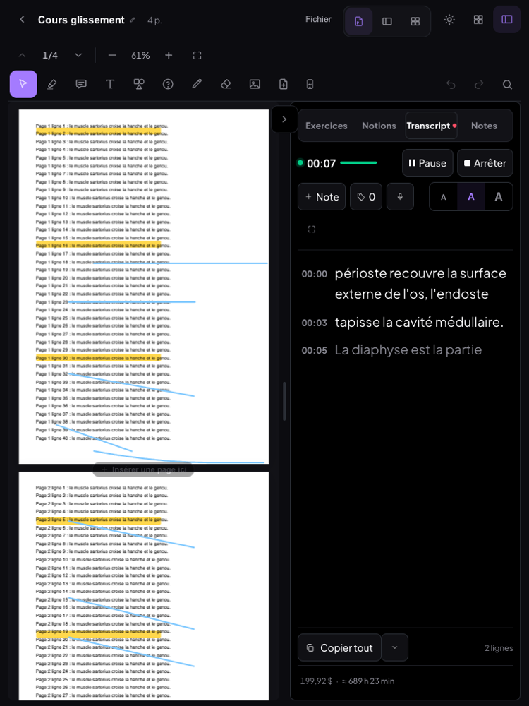 | 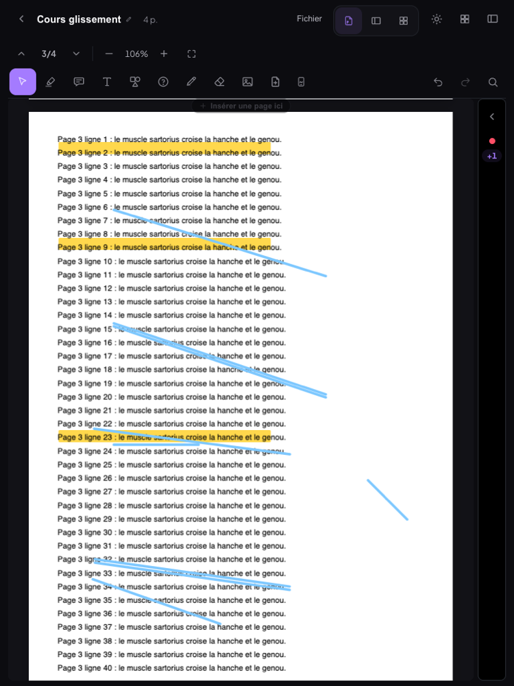 | 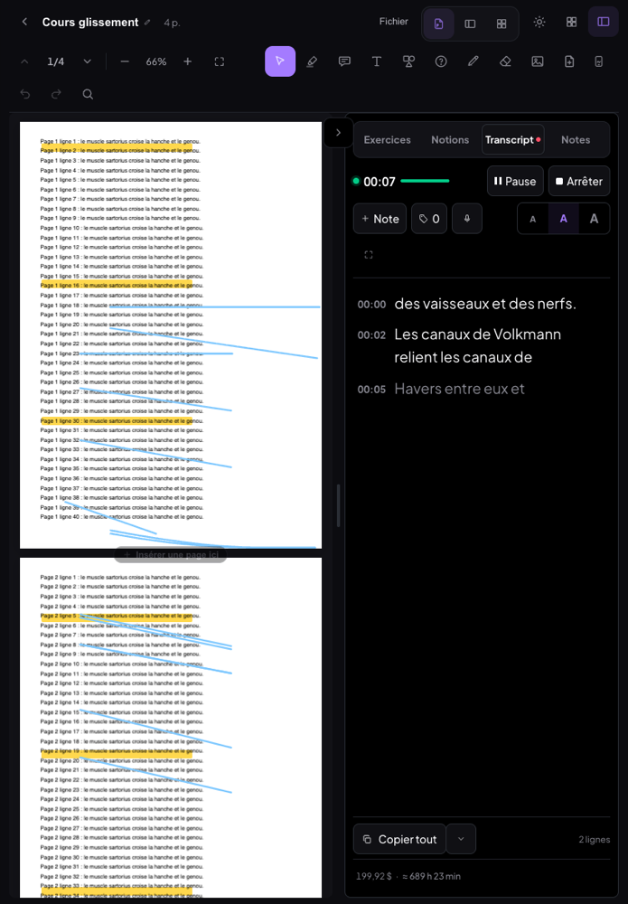 | 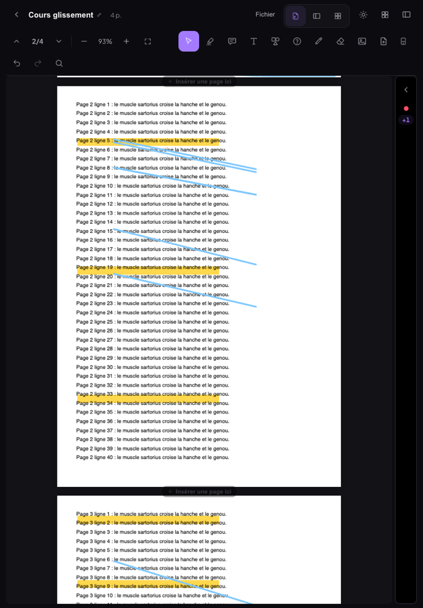 |

| iPad paysage — ouvert | iPad paysage — fermé | Mac 900 — ouvert | Mac 900 — fermé |
|---|---|---|---|
| 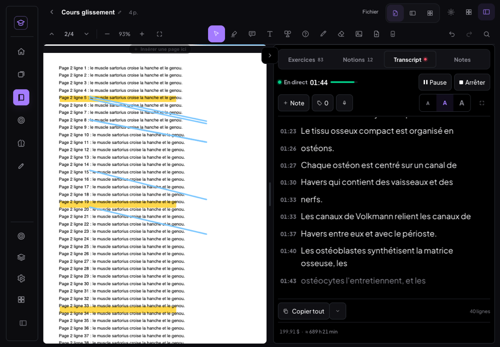 | 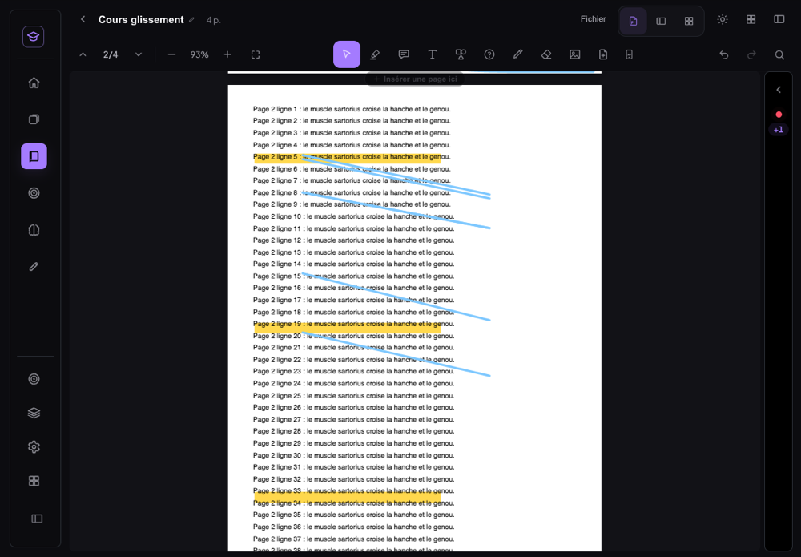 | 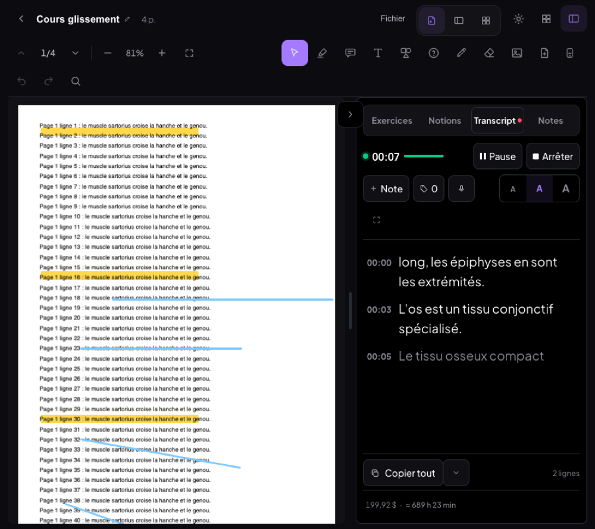 | 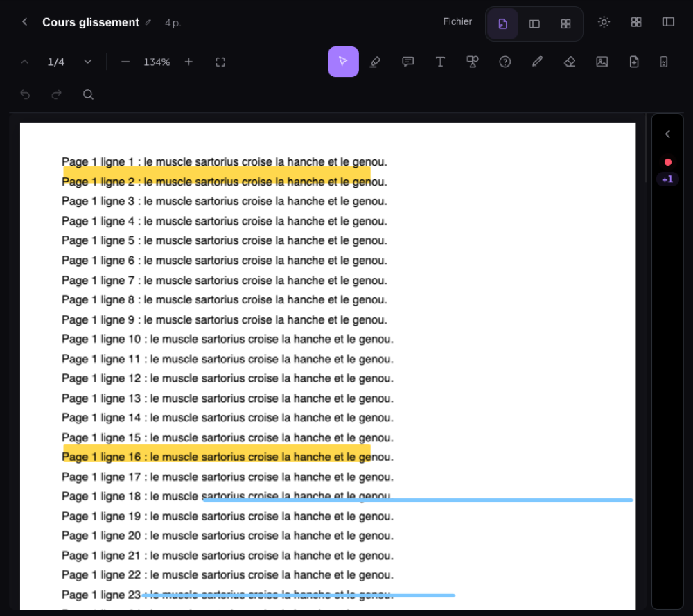 |

---

## Non-régression

| | Résultat |
|---|---|
| Ordinateur 1 440 et 1 200 px | ✅ pas de mode tablette, barre inchangée (61 px). Seul ajout : le mode « Notes » du panneau. 0 exception |
| Glissement du panneau (v1.3 / v1.4) | ✅ 18 / 18 au trackpad et au doigt, plus les tests v1.3 (segments, focus, défilement, modale, clavier) — **4 modes** maintenant |
| Mobile 390 px | ✅ capture **identique à l'octet** avant / après (`c3d3c32` → maintenant) |
| Mobile 480 px | ✅ 0 exception, aucun débordement |
| Synchro des nouveaux types | ✅ `reading_position` et `notes_doc` vont au faux cloud et arrivent sur le 2ᵉ appareil |
| MealWeek | ✅ ouverte depuis le hub, 0 erreur. `git diff c3d3c32 -- src/mealweek src/shared src/styles/design.css src/App.jsx src/Selecteur.jsx` : **vide** |
| Build | ✅ `npm run build` vert |

---

## Décisions prises seul

1. **« Nouveau document » à côté de « Nouveau transcript »** : la Bibliothèque n'a pas de bouton
   « Importer un PDF » (les PDF s'importent par glisser-déposer sur l'arbre). Le bouton est placé dans
   la barre où vivent les créations de documents.
2. **Pas d'export .docx** : aucune bibliothèque docx dans le projet. Je ne l'ai pas ajoutée, comme le
   prévoyait la consigne : export Markdown, plus impression / PDF par une feuille d'impression.
3. **Un seul moteur d'édition** : `richtext.js` l'impose, donc les cases à cocher, tableaux et notions
   sont des extensions de ce moteur. Seule dépendance ajoutée : `@tiptap/extension-table`, en version
   3.27.3 comme les autres TipTap.
4. **Notions du document dans le store `highlights`** (avec `source: 'doc'`) plutôt qu'un store à
   part : elles comptent ainsi partout où comptent les notions. Le lecteur PDF les isole, puisqu'elles
   n'ont ni page ni rectangles.
5. **L'onglet « Notes » d'un cours PDF est un 4ᵉ mode du panneau**, à côté du transcript, et non une
   disposition : on prend ses notes en regardant le PDF.
6. **Position de lecture d'un document** = bloc en haut de la zone visible + décalage dans ce bloc,
   indépendant de la largeur de l'écran.
7. **Volet ≤ 60 %** du lecteur et ≥ 280 px. Largeur mémorisée **par orientation** : on ne veut pas la
   même en portrait et en paysage.
8. **Cibles 40 px partout**. La consigne disait « icônes 36–40 px » mais aussi « cibles ≥ 40 px » :
   quand la place manque, ce sont les espacements qui se resserrent et la barre qui passe sur deux
   rangées, jamais la taille de la cible.
9. **Bande « en direct » et onglets du bas supprimés** : avec le volet, PDF et transcript sont
   visibles ensemble en portrait aussi.
10. **Citation : Entrée sur une ligne vide en sort.** Sans ça, tout ce qu'on tapait ensuite restait
    dans la citation (défaut trouvé au test).
11. **Détection de l'inertie du trackpad indépendante de la cadence des événements.** Le panneau v1.4
    supposait des événements à moins de 50 ms d'intervalle ; avec une cadence plus lente (~67 ms
    mesurés dans le banc), deux gestes collés n'en faisaient qu'un. Corrigé et revérifié : 18 / 18.

## Migrations SQL à appliquer

`supabase/migrations/20261007_reading_position_notes_doc.sql`. **Additive, idempotente, non
appliquée.** Elle ajoute deux index partiels (`reading_position`, `notes_doc`) sur
`medrevise_records`. **L'app fonctionne sans elle** : la table et `medrevise_push` sont génériques et
acceptent déjà ces types. Pour l'appliquer : Supabase → SQL Editor → coller le fichier → Run, puis
lancer les requêtes de vérification (lecture seule) en bas du fichier.

## Limites connues

- **Pas d'iPad réel ni d'Apple Pencil** : tactile et stylet sont émulés par Chrome. Le rejet de la
  paume repose sur `pointerType`, que Safari iPadOS fournit pour le Pencil. Le « mode stylet » dure
  jusqu'au rechargement de la page.
- **Pas d'export .docx** (voir décision 2).
- **Images du Markdown** incluses en data URL : le .md est autonome mais lourd s'il y a beaucoup
  d'images.
- **Volet fermé** : le contenu du panneau n'est pas monté. On retrouve le mode et la session, mais pas
  le défilement interne des listes.
- **Position d'un document** : précise au bloc près, un long bloc peut décaler de quelques lignes.
  Mesuré : 905 → 931 px.
- **Les zones « insérer une page ici » entre deux pages** gardent leur hauteur (16 px à l'écran).
  Elles font partie du document, pas des barres.
- La reprise de position attend au plus 2,5 s le dessin de la page visée, puis affiche quand même.
- **Transcription** : voix de synthèse et faux Deepgram, aucun vrai cours ni vraie vidéo.

## Commits

| Commit | Message |
|---|---|
| `be38b27` | feat(medrevise): reprendre exactement où l'on en était dans un PDF (position de lecture) |
| `bf46a7f` | feat(medrevise): document de notes — cours sans PDF et onglet « Notes » de tout cours |
| `34fbf9d` | feat(medrevise): mode tablette refait — volet latéral, tous les outils visibles |
| (ce commit) | fix(medrevise): inertie du trackpad indépendante de la cadence + migration SQL + compte-rendu |
