# Volet tablette, images et curseur des documents, intervenants du transcript, séance des J (08/10/2026)

La consigne annonçait six points ; elle en détaille cinq. Les cinq sont livrés.

**Conditions de test**
- Chrome headless piloté en CDP, avec de vrais événements souris, clavier et tactiles (`Input.dispatch*`).
- Vite local, `VITE_SUPABASE_URL` vide : **aucune écriture Supabase**.
- Données semées dans une base IndexedDB isolée.
- Tailles :
  - bureau 1 440 × 900 ;
  - iPad mini 768 × 1024, iPad Air 820 × 1180 et 1180 × 820, tactile émulé ;
  - téléphone 390 × 844, tactile.
- Transcription : le faux Deepgram du dépôt (`scripts/faux-deepgram.mjs`) et un micro simulé lisant un fichier à deux voix de synthèse (Thomas et Amélie, `say`). Voir les limites en fin de document.

---

## 1. Tablette : le panneau monte depuis le bas

**Ce qui est fait** (même comportement en portrait et en paysage) :
- Le PDF reste **au-dessus**, sur toute la largeur. Le panneau (Exercices · Notions · Transcript · Notes) est un **volet qui monte depuis le bas**.
- Le lecteur est une grille de 3 rangées :
  - PDF (et tableau éventuel) ;
  - séparateur horizontal ;
  - volet.
- **Poignée toujours visible en bas** quand le volet est fermé. Taper ou glisser vers le haut l'ouvre, à ~45 % par défaut. Un geste jusqu'en haut l'ouvre directement en plein écran.
- **Séparateur horizontal glissable**. Sa hauteur est mémorisée par appareil (`medrevise.tablette.voletBas`, fraction de 22 à 80 %). Il a aussi un bouton « replier ».
  - **Relâché tout en haut** (≥ 90 %) : plein écran. Le PDF est replié à 0 px de haut, sans changer de largeur, donc ni zoom ni page ne bougent.
  - **Depuis le plein écran**, un geste vers le bas revient à la hauteur mémorisée.
  - **Glissé tout en bas** : volet fermé.
- Le PDF garde son **zoom à la largeur** et sa **page**. Sa largeur ne change pas quand le volet bouge.
- **Volet latéral supprimé** : CSS du volet de côté, fractions par orientation et clés de largeur retirées.

| Test (`volet.mjs`, `volet-pos.mjs`) | 768 × 1024 | 820 × 1180 | 1180 × 820 |
|---|---|---|---|
| Volet ouvert : PDF au-dessus, volet en dessous, même largeur | ✅ | ✅ | ✅ (rail des apps à gauche, ≥ 1 000 px) |
| Séparateur +120 px → hauteur mémorisée | ✅ | ✅ | ✅ |
| Geste jusqu'en haut → plein écran, PDF à 0 px | ✅ | ✅ | ✅ |
| Geste vers le bas depuis le plein écran → hauteur mémorisée | ✅ | ✅ | ✅ |
| Glissé tout en bas → fermé, poignée visible | ✅ | ✅ | ✅ |
| Poignée glissée vers le haut → rouvert | ✅ | ✅ | ✅ |
| Reliquat du volet latéral (séparateur vertical) | aucun | aucun | aucun |

Page et position conservées sur un PDF de 20 pages, à la page 7. Après séparateur, plein écran, retour, fermeture, puis rotation 820 × 1180 → 1180 × 820 → 820 × 1180 :
- l'indicateur reste à **7/20** ;
- en portrait, le zoom reste à 129 % et `scrollTop` à 6 651 ;
- en paysage, le zoom passe à 175 % : il s'ajuste à la nouvelle largeur, sur la même page 7.

Bureau à 1 440 px : rien ne change (pas de mode tablette).

| 820 × 1180 ouvert | fermé | plein écran |
|---|---|---|
| 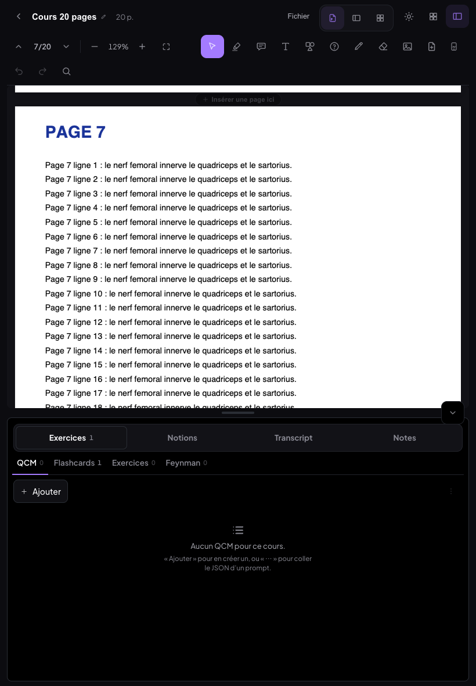 | 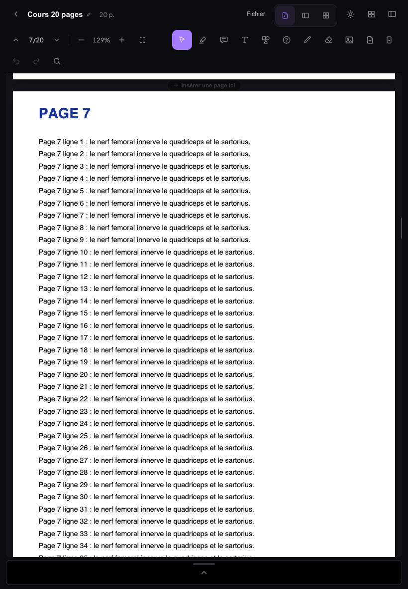 | 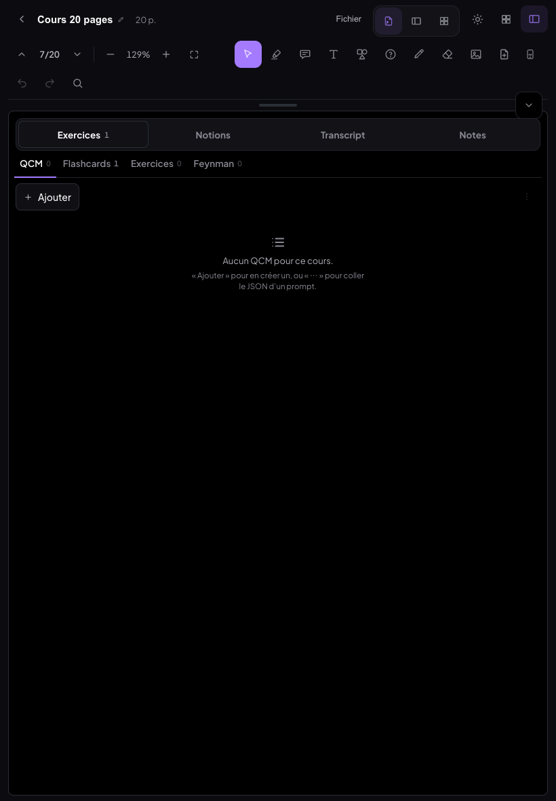 |

| 768 × 1024 ouvert | 768 × 1024 fermé | 1180 × 820 ouvert | 1180 × 820 fermé |
|---|---|---|---|
| 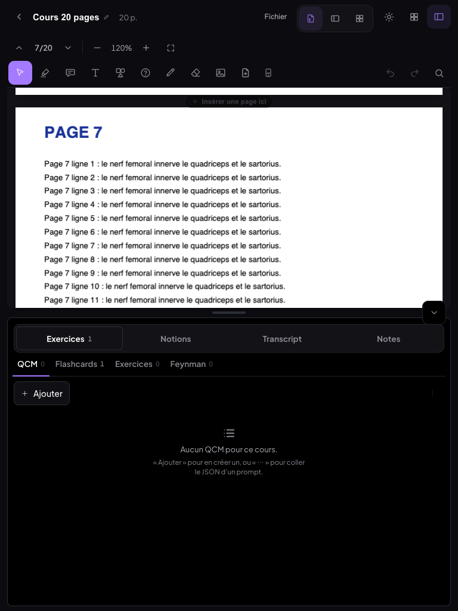 | 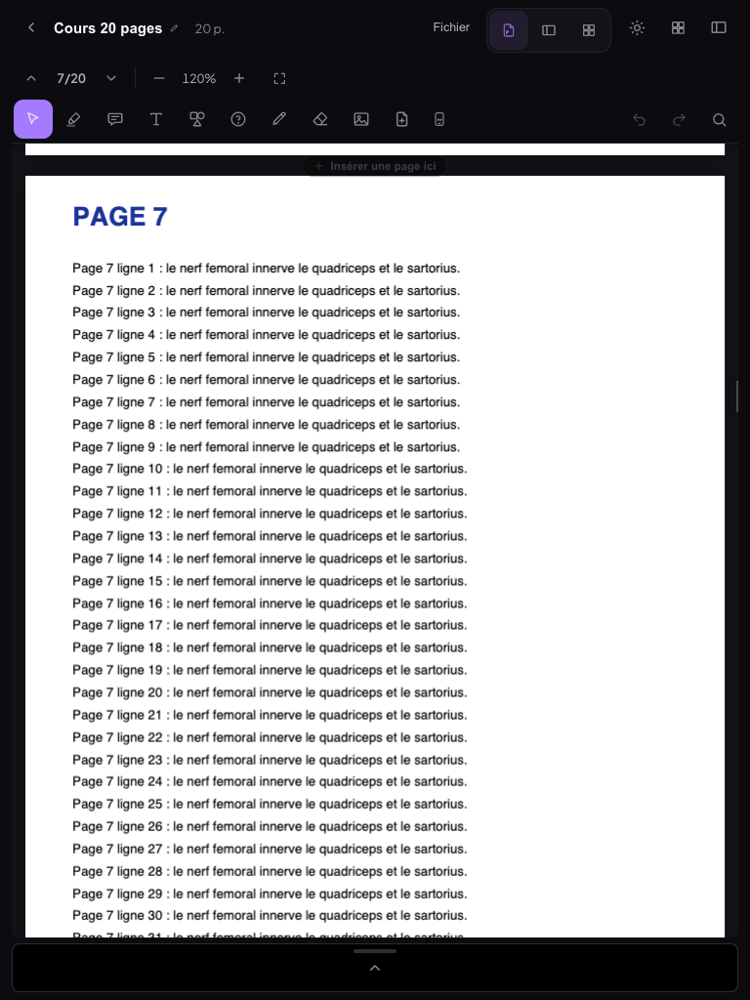 | 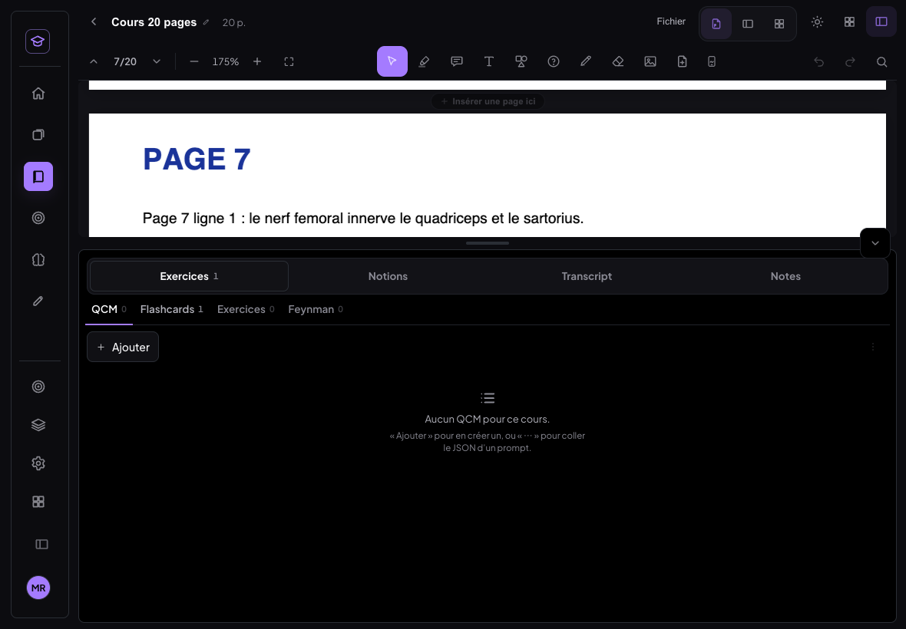 | 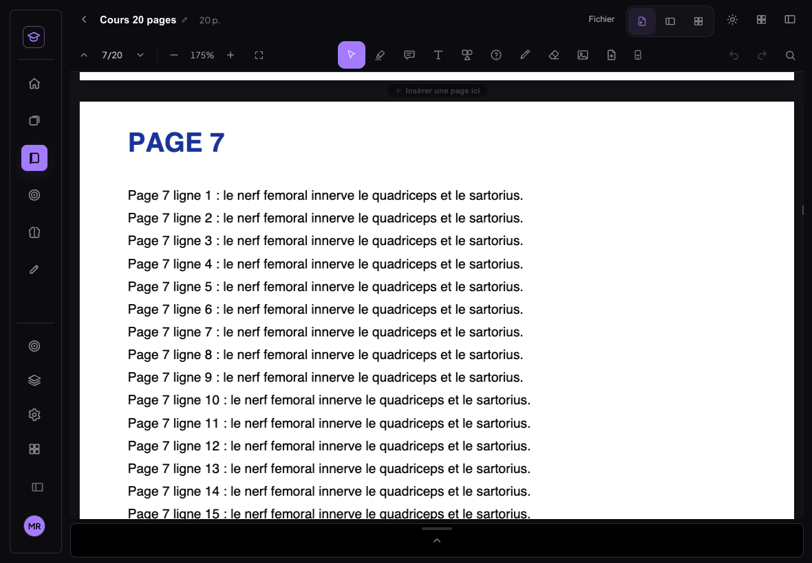 |

---

## 2. Images dans les documents

**Ce qui cassait la mise en page.** Déposer un fichier insérait l'image à la position du texte sous le pointeur, **en coupant le paragraphe en deux** (vu au test : « Pa » / « ragraphe 3 »).

S'y ajoutaient trois défauts :
- une image plus haute que la place restante n'était revérifiée qu'à la frappe suivante ;
- une image en tête de page plus haute que la page était rognée ;
- au test, une **boucle** est apparue. StarterKit v3 remet toujours un paragraphe vide après une image en fin de page (TrailingNode). Quand l'image remplit la page, ce paragraphe déborde, part sur la page suivante, est recréé, et ainsi de suite (3 paragraphes vides créés).

**Ce qui est fait** (`documents/lib/imageVue.js`, extension `ImageDoc` de `richtext.js`) :
- **Insertion** par collage, glisser-déposer ou bouton : toujours un **bloc entre deux paragraphes**, jamais au milieu d'une ligne.
  - L'image est centrée par défaut.
  - Sa largeur ne dépasse pas celle du texte ; sa hauteur reste proportionnelle.
  - Un paragraphe vide sous le curseur est remplacé par l'image.
- **Sélection** au clic ou au tap.
  - Le cadre, les poignées et la barre ne s'affichent que dans la page qui a le focus : chaque page est un éditeur distinct.
  - La bulle « Notion / Flashcard » ne s'ouvre plus sur une image.
- **Quatre poignées d'angle**, placées *dans* l'image : la zone d'écriture rogne ce qui dépasse.
  - Les proportions sont gardées ; **Maj** permet un redimensionnement libre.
  - Taille à l'écran : 14 px à la souris, **40 px au doigt**, quel que soit le zoom de la page.
- **Mini barre flottante** : gauche / centre / droite, et supprimer.
  - Elle se place au-dessus de l'image si la place le permet, sinon en dessous, jamais sur l'image.
  - **Suppr** fonctionne aussi, et ⌘Z restaure l'image.
- **Déplacement** au pointeur (souris, doigt, stylet) une fois l'image sélectionnée :
  - entre les paragraphes et **entre les pages** ;
  - un **trait de dépôt** montre la cible ;
  - la vue défile automatiquement près des bords.
- **Pagination** :
  - une image qui ne tient pas sur la page passe **sur la page suivante**, créée si c'était la dernière, et n'est jamais coupée ;
  - la vérification est relancée quand l'image finit de charger ou change de taille ;
  - une image plus haute qu'une page est **réduite à la hauteur de page**, en laissant une ligne libre pour écrire dessous ;
  - un paragraphe vide final n'est plus jamais déplacé seul, ce qui supprime la boucle.
- **Données** : les bornes sont appliquées à l'affichage seulement. Les documents existants ne sont pas réécrits. Seuls un redimensionnement ou un alignement écrivent `width`, `height` (après Maj) et `align` sur le nœud.

| Tests (`img-doc.mjs`, `img-doc2.mjs`, `img-doc3.mjs`, `img-tactile.mjs`, `notes-img.mjs`) | Résultat |
|---|---|
| Coller (⌘V depuis l'éditeur) : image 1 200 × 800 → bloc centré de 483 × 322, la largeur du texte | ✅ |
| Glisser un fichier entre deux paragraphes : bloc, paragraphes intacts | ✅ (avant : paragraphe coupé) |
| Bouton « Image » → vrai sélecteur de fichier (intercepté par CDP) → bloc | ✅ |
| Clic : sélection, poignées et barre visibles | ✅ |
| Coin bas-droit −120 px : 483 × 322 → 333 × 222, proportions 0,667 gardées ; défilement 198 → 198 | ✅ |
| Maj + coin vers le haut : 333 × 185 (libre) | ✅ |
| Aligner à droite / à gauche (marge 0 du bon côté) ; enregistré `333×185 right` | ✅ |
| Déplacer avant le 1er paragraphe (même page), trait de dépôt affiché | ✅ |
| Déplacer de la page 1 à la page 2 (sous « Paragraphe 4 ») : enregistré avec taille et alignement | ✅ |
| Maintenir au bord bas : défilement automatique (scrollTop 0 → 2 062) | ✅ |
| Suppr sur l'image sélectionnée (3 → 2), ⌘Z (2 → 3) | ✅ |
| Page remplie à 80 % + image de 322 de haut → page 2 créée, image entière, page 1 intacte | ✅ |
| Image géante 600 × 5 000 → 686 de haut, entière sur sa page, aucun paragraphe vide en trop | ✅ |
| Tablette 820 × 1180 tactile : tap → sélection, poignée 40 × 40 px, barre en boutons de 40 px | ✅ |
| Coin tiré au doigt : redimensionné | ✅ |
| Déplacement au doigt sous le paragraphe suivant | ✅ |
| Onglet « Notes » d'un cours (même moteur) : image collée en bloc, largeur ≤ éditeur | ✅ |

| Image redimensionnée et sélectionnée (barre au-dessus) | Déplacement : trait de dépôt | Fin de page → page suivante | Image géante réduite | Au doigt (820 px) |
|---|---|---|---|---|
| 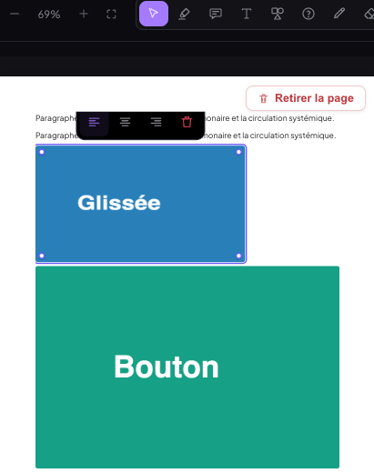 | 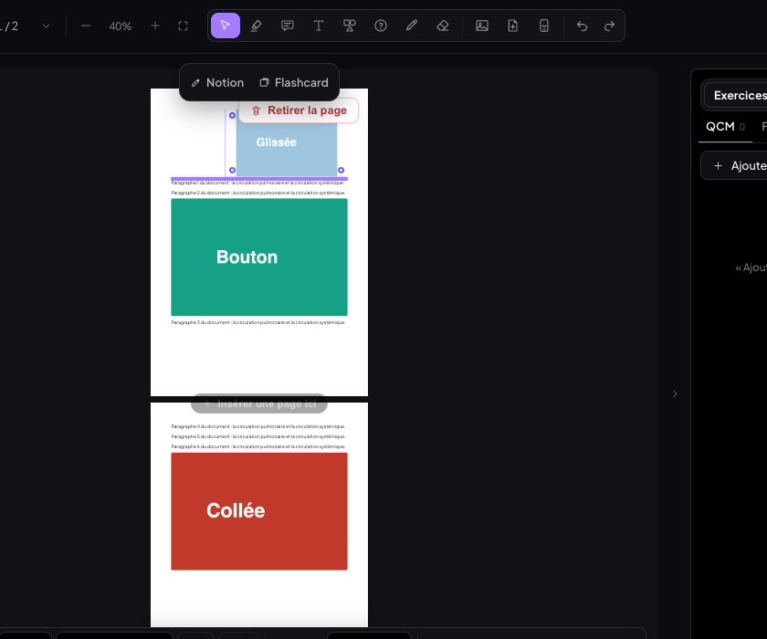 | 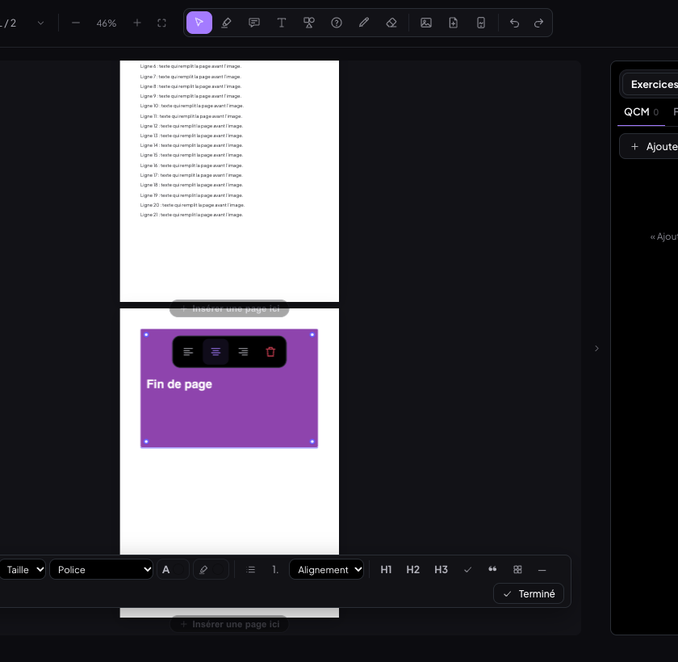 | 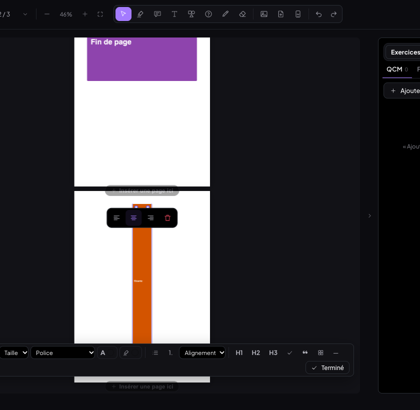 | 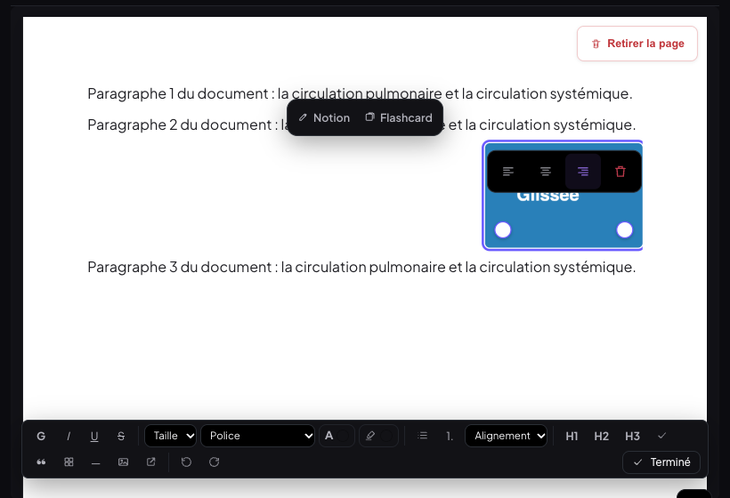 |

---

## 3. Document : la vue qui « téléportait » vers une autre page

**Reproduction.** Document de 5 pages, tablette 820 × 1180 tactile (`saut.mjs`).
- Chaque premier tap dans une page provoquait, ~300 ms plus tard, un défilement non demandé (60 → 84, 1 170 → 1 195…).
- Entrée et collage en provoquaient aussi.
- Au bureau à 1 440 px, aucun saut.

**Cause exacte.** Une sonde sur `Element.prototype.scrollIntoView`, avec pile d'appels, a désigné deux appels de `PdfReader.jsx`. Tous deux ne sont actifs qu'en **mode tablette**, c'est-à-dire sur iPad **et sur toute fenêtre Mac de 761 à 1 199 px** :
1. **Le gestionnaire `focusin`**, 300 ms après qu'un champ prend le focus, faisait `t.scrollIntoView({ block: 'nearest' })`.
2. **Le gestionnaire du clavier virtuel** (`visualViewport` resize) faisait `a.scrollIntoView({ block: 'center', behavior: 'smooth' })`.

Ces gestionnaires visaient de petits champs (note, flashcard). Dans un document, l'élément focalisé est **l'éditeur de la page entière**, une page A4 plus haute que la zone visible :
- `nearest` réalignait le haut de la page dès qu'il était visible ;
- `center` centrait une page entière.

La vue sautait donc vers le haut de la page ou vers une autre page, à chaque tap et à l'ouverture du clavier de l'iPad.

Hypothèses écartées par les mesures :
- la pagination et le recalcul des hauteurs (aucun saut au bureau avec le même texte) ;
- plusieurs éditeurs se disputant le focus (le focus reste sur la page tapée) ;
- la restauration de position, qui ne se rejoue qu'au changement de cours (`ficheId`).

**Correctif** (`montrerSaisie`) :
- On ne vise plus que le **curseur**, et seulement s'il est caché : décalage minimal du conteneur qui défile, en tenant compte du clavier virtuel.
- S'il est visible, rien ne bouge.
- Les petits champs gardent le comportement d'avant.

| `saut.mjs` (sauts non demandés : le curseur était visible et la vue a bougé) | Avant | Après |
|---|---|---|
| 820 × 1180 tactile : 2 taps par page × 5 pages, puis clic, frappe, Entrée ×3, collage, sélection au glisser | ❌ 7 sauts | ✅ aucun |
| 1024 × 768 tactile, même scénario | — | ✅ aucun (le collage de 400 caractères fait défiler pour **suivre le curseur** sorti de la zone : légitime) |
| 1 440 × 900 souris | ✅ aucun | ✅ aucun |
| Redimensionner une image (1 440 px) | — | ✅ scrollTop 198 → 198 |

---

## 4. Transcript : filtre par intervenant (diarisation Deepgram)

**Surcoût vérifié** sur deepgram.com/pricing le 08/10/2026, en paiement à l'usage :
- **Speaker Diarization (Streaming) : 0,0020 $/min, soit +0,12 $/h.**
- C'est un supplément au modèle Nova-3 en direct, à 0,0048 $/min (0,29 $/h), le tarif déjà utilisé par l'app.
- Le surcoût est donc d'environ **+42 %**, soit ≈ 0,41 $/h avec la diarisation.
- Mesuré sur la session de test : 32,8 s diarisées → coût enregistré 0,004 $ (32,8 s × 0,41 $/h).

**Ce qui est fait :**
- Feuille « Transcrire le cours » : interrupteur **« Distinguer les intervenants »**.
  - **OFF par défaut**, jamais mémorisé ; en reprise de session, il garde l'état de la session.
  - L'infobulle et le sous-titre donnent le surcoût.
  - Activé, il ajoute `diarize=true` à la connexion.
- **Moteur** :
  - chaque segment porte `speaker` (0, 1, 2…) ;
  - un résultat final qui mêle deux voix est **coupé en segments par intervenant** ;
  - le décompte local des crédits et le coût de session incluent le surcoût.
- **Panneau**, en direct comme en relecture :
  - une **pastille colorée** par intervenant devant chaque ligne ;
  - taper la pastille ouvre une bulle pour **renommer** (« Prof », « Étudiant ») ; les noms sont mémorisés dans la session (`intervenants`) ;
  - une **rangée de puces filtre** en haut du transcript : « Tous », puis multi-sélection. Le premier tap n'affiche que cet intervenant, les suivants en ajoutent ou en retirent. Le filtre n'agit que sur l'**affichage**.
  - **Copier tout**, quand un filtre est actif, propose « Tous les intervenants » ou « Filtrés : … ».
  - Le texte et le Markdown exportés portent « Nom : ».
- **Sans diarisation** : ni pastille ni filtre, rien ne change.

| Test (`trx-diar.mjs on/off`, `trx-relire.mjs`) | Résultat |
|---|---|
| Feuille : interrupteur décoché par défaut, surcoût dans l'infobulle et le sous-titre | ✅ |
| Connexion avec `diarize=true` (journal du faux Deepgram) | ✅ |
| En direct après 26 s : pastilles « Intervenant 1 / 2 », filtre « Tous ✓ · Intervenant 1 (8) · Intervenant 2 (7) » | ✅ |
| Renommer en tapant la pastille → « Prof », « Étudiant » | ✅ |
| Filtre « Étudiant » seul : toutes les lignes visibles sont d'Étudiant | ✅ |
| Copier tout → menu « Tous » / « Filtrés : Étudiant » | ✅ |
| Copie filtrée : 10 lignes, toutes « Étudiant : » | ✅ |
| Copie « tous » : 21 lignes (Prof 11, Étudiant 10) | ✅ |
| Session enregistrée : `diarize`, `intervenants {0: Prof, 1: Étudiant}`, 23 segments avec `speaker` | ✅ |
| Relecture : renommer « Prof » → « Professeure », enregistré | ✅ |
| Session sans diarisation : pas de `diarize` dans la connexion, 0 pastille, 0 filtre | ✅ |
| Non-régression du direct : lignes, arrêt, enregistrement, coût (la pause n’a pas été rejouée) | ✅ |

| Feuille « Transcrire » | Filtre « Étudiant » en direct | Relecture avec noms |
|---|---|---|
| 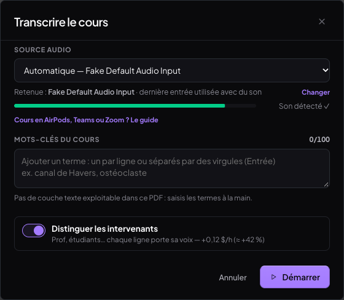 | 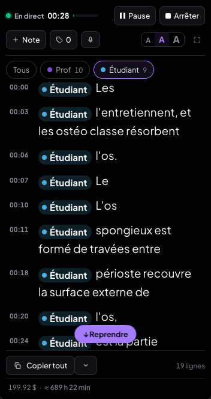 | 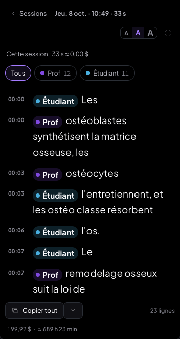 |

---

## 5. Séance des J : Révisions ou Apprentissage

**Ce qui est fait** (bureau, espace Réviser, et accueil mobile) :
- À côté de **« Démarrer la séance »** (révisions puis apprentissage, inchangé) : un sélecteur à deux segments, **« Révisions (6) · Apprentissage (15) »**.
  - Chaque segment lance directement ce bloc seul.
  - Un bloc vide a son segment grisé.
  - Le sélecteur est aussi sous « Reprendre la séance », avec les restantes de chaque bloc.
- **En séance**, un bouton discret dans l'en-tête : **« Passer à l'apprentissage (n) »** ou **« Revenir aux révisions (n) »**. Sur mobile, il prend toute la largeur sous la barre de progression.
- **Rien n'est perdu** : les deux blocs vivent dans le même état (`seanceFC`) : liste et position des révisions, file d'apprentissage.
  - Basculer ne change que la phase.
  - Le bloc quitté se reprend exactement où il était, y compris d'un jour à l'autre, par la logique de reprise existante.
- Un bloc seul terminé alors que l'autre a encore des cartes → écran **« Révisions terminées · Il reste 15 cartes à apprendre »**, avec « Commencer l'apprentissage » ou « Plus tard ». La séance n'est pas close.
- **La logique de chaque bloc ne change pas** : notation Raté / Difficile / Facile, paquet à 3 succès, réinsertion.

| Test (`seance.mjs` bureau 1 440 et mobile 390 tactile, `seance2.mjs`, `lendemain.mjs`) | Bureau | Mobile |
|---|---|---|
| Carte « Aujourd'hui » : « 6 à réviser · … » + « Révisions (6) · Apprentissage (15) » | ✅ | ✅ |
| « Révisions » seules → Révisions 1/6 ; 2 notées → 3/6 | ✅ | ✅ |
| « Passer à l'apprentissage (15) » → Apprendre, révisions restantes 4 | ✅ | ✅ |
| « Revenir aux révisions (4) » → **Révisions 3/6**, même carte qu'avant | ✅ | ✅ |
| Quitter → « Reprendre la séance (19 restantes) » + « Révisions (4) · Apprentissage (15) » | ✅ | ✅ |
| « Apprentissage » seul depuis la reprise → Apprendre, 15 restantes, révisions gardées | ✅ | ✅ |
| Doublons dans l'état de séance (révisions restantes + file) | 0 | 0 |
| Révisions seules jusqu'au bout → « Révisions terminées · Il reste 15 cartes à apprendre » ; « Plus tard » → séance à reprendre (15) | ✅ | — |
| **Le lendemain** (horloge de la page à J+1) : « 15 à reprendre », nouvelle séance datée du 09/10, **15 / 15** cartes non terminées la veille retrouvées, 0 doublon | ✅ | — |

| Sélecteur (bureau) | Sélecteur (mobile) | En séance (mobile) | Bloc terminé |
|---|---|---|---|
| 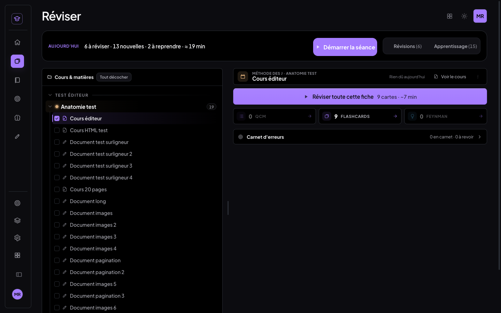 | 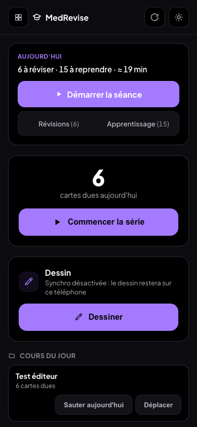 | 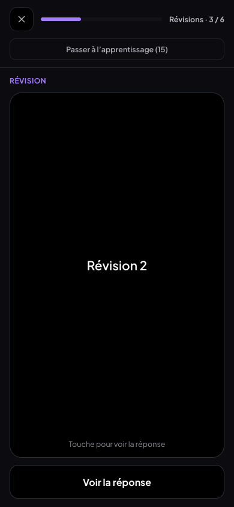 | 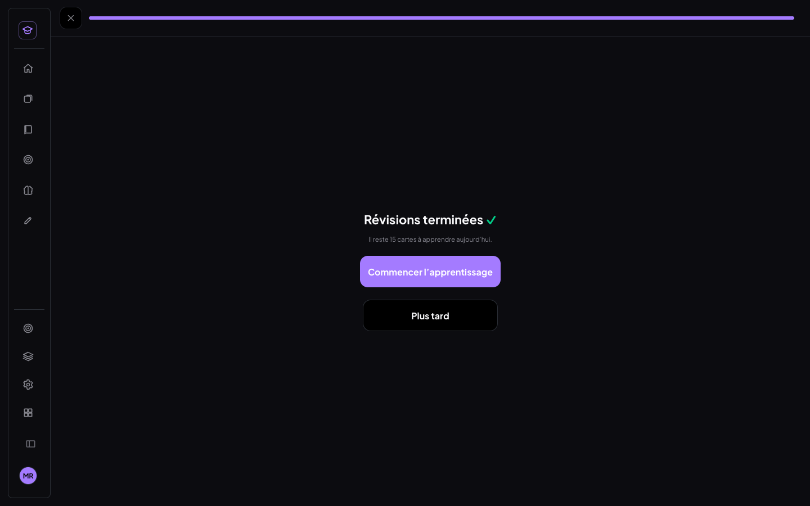 |

---

## Non-régression

- `npm run build` : ✅ vert.
- 0 erreur JavaScript dans tous les scénarios.
- MedRevise s'affiche sans erreur : Accueil, Réviser, Bibliothèque, Carnet d'erreurs, Apprentissage.
- Aller-retour hub → MealWeek → MedRevise : ✅.
- Lecteur PDF au bureau, scénarios du chantier précédent rejoués :
  - surligneur (créer / retirer / recolorer) ;
  - mode Sélection sans bulle, copie ;
  - éditeur de flashcard sans chevauchement.
- **MealWeek et `src/shared/`** : `git diff --stat 1c4b2ef HEAD -- src/mealweek src/shared` est **vide**.
- Aucune requête vers Supabase. Les cartes, sessions, documents et images existants ne sont pas réécrits par ces changements.

## Limites et points à connaître

- **Diarisation testée avec le faux Deepgram**, pas sur une vraie interview YouTube. Le faux serveur attribue les voix par alternance (tous les 7 mots), il ne reconnaît pas les voix.
  - Le chemin réel (paramètre `diarize=true`, champ `speaker` des mots, définis dans la doc Deepgram) est le même.
  - Le test avec le vrai Deepgram demande un relais vers la fonction de prod. Ce relais a été refusé par le garde-fou de permissions lors d'un chantier précédent ; je ne l'ai pas retenté.
  - **À faire de ton côté** : une session avec l'interrupteur sur une vidéo à deux voix, onglet Chrome partagé. Coût : ≈ 0,41 $/h.
- **Pas d'iPad réel** : tactile, stylet et clavier virtuel sont émulés par Chrome. Le correctif du curseur vise justement le clavier de l'iPad ; le revérifier sur l'appareil reste utile.
- **Déplacer une image vers une page lointaine** : la vue défile automatiquement près des bords pendant le geste. Il est plus simple de dézoomer pour voir deux pages.
- **Le volet du bas** a une seule hauteur mémorisée pour le portrait et le paysage (consigne : « hauteur mémorisée par appareil »). Valeurs : 22 à 80 %, au-delà de 90 % plein écran.
- Au test, chaque collage synthétique envoyé sur `window` a aussi posé une image sur le PDF. C'est un **artefact du banc** : un ⌘V réel, ciblé sur l'élément qui a le focus, va uniquement à la carte, ce qui a été vérifié.

## Commits

| Commit | Contenu |
|---|---|
| `a050042` | feat : tablette — le panneau devient un volet qui monte depuis le bas |
| `c193126` | fix : document — la vue ne saute plus vers une autre page au clic |
| `3e007ba` | feat : images des documents — un bloc qu'on redimensionne, aligne et déplace |
| `0cf05d5` | feat : transcript — distinguer les intervenants (diarisation Deepgram) et filtrer |
| `0fc8289` | feat : séance des J — lancer Révisions ou Apprentissage seul, basculer en cours de séance |
| `5980e67` | docs : ce compte-rendu + captures |
