# Mode tablette du lecteur — compte-rendu (07/10/2026)

Point de départ : l'audit en conditions réelles, `docs/audit-ux-tablette.md` (iPad mini 768 × 1 024,
iPad Air 820 × 1 180, iPad paysage 1 180 × 820, Mac 900 × 800, transcription active). Objectif :
lire le PDF, annoter et suivre la transcription **en même temps** entre ~700 et ~1 100 px.

## 1. Décisions prises à partir de l'audit

| Constat de l'audit | Décision |
|---|---|
| A1 — PDF et transcript jamais visibles ensemble sous 900 px | **≥ 900 px : côte à côte**, toujours. **< 900 px** : onglets Cours / Panneau, et la **bande « transcript en direct »** sur l'onglet Cours, qui montre la dernière phrase sans quitter la page |
| A2 — bascule Cours / Panneau en haut, 28 px | **Onglets en bas** (zone du pouce), 52 px de haut, marge `safe-area` |
| A3 — panneau de largeur fixe, repli muet | **Séparateur glissable** 320–560 px, largeur **mémorisée par appareil** (`medrevise.tablette.panneau`) ; par défaut 42 % du lecteur (380 px au plus). **Repli en colonne fine** (60 px) : bouton d'ouverture, point de session, nombre de lignes arrivées depuis le repli |
| A4 — l'écran entier défile, bas du panneau coupé | Le lecteur occupe **exactement la hauteur visible** (`visualViewport`) : plus rien ne déborde, « Copier tout » et les crédits restent à l'écran |
| A5 — 148 px de large perdus à gauche | Pendant la lecture en tablette, la **liste repliée** de la Bibliothèque s'efface, ainsi que le **rail des apps sous 1 000 px** ; « Retour » les ramène. Au-dessus de 1 000 px (iPad paysage), le rail reste |
| B1 — un tiers de la hauteur en interface | En-tête 48 px + barre 52 px : le PDF commence à **y = 108** (contre 243, et 346 avec un outil) ; la barre se masque en lisant |
| B2 — en-tête qui se chevauche | **Une ligne** : ‹ Retour · titre tronqué · nb de pages · (panneau) · « … ». Le « … » regroupe Fichier, **Disposition** (PDF / Les deux / Tableau) et **Affichage** (thème, changer d'app) |
| B3 — barre sur deux lignes, outils de même poids | **Une barre de 48 px** : pages et zoom à gauche (le % ajuste à la largeur), **outils au centre** — Sélection, Surligneur, Crayon, Gomme (+ Texte à partir de 800 px, + Boîte à partir de 1 000 px) — les autres dans **« Plus d'outils »** (Boîte, Forme, « ? », insérer une image ou une page) ; l'outil secondaire actif prend la place du bouton. Annuler / Rétablir / Rechercher à droite ; la recherche s'ouvre **par-dessus la barre** |
| B4 — réglages de l'outil sur 95 px | **Une ligne défilante** de 52 px, sans la phrase d'aide |
| B5 — barres toujours affichées | **Barre auto-masquée** : se retire en descendant dans le cours (> 120 px), revient en remontant, au tap sur la bande haute de la zone de lecture, ou dès qu'on cherche |
| B6 — barre PDF sur l'onglet Panneau | Masquée sur l'onglet Panneau |
| C1/C2 — cibles de 22 à 32 px | **Toutes les cibles ≥ 44 px** dans le lecteur tablette (barre, en-tête, segments, sous-onglets, contrôles de session, menus contextuels, crédits). Contrôles de session **sur 2 lignes** : ① état + chrono + VU + Pause + Arrêter ; ② Note, mots-clés, micro, **« Aa »** (taille du texte et plein écran regroupés dans un menu). Panneau à moins de 380 px : le libellé « En direct » s'efface (le point coloré et le chrono restent) |
| D1 — un tracé suit tous les pointeurs, pas de rejet de la paume | **Un tracé ne suit que SON pointeur** ; **un seul tracé à la fois** ; un 2e doigt posé dans les 250 ms d'un tracé au doigt = geste à deux doigts → tracé **annulé**. **Stylet** (`pointerType: pen`) : dès qu'il a touché une page, le doigt et la paume ne dessinent plus — ils font défiler (comme Notes / GoodNotes) |
| D2 — page rognée à 160 % | En tablette, la page est **ajustée à la largeur** tant qu'on n'a pas zoomé à la main ; un zoom manuel est gardé tel quel (y compris à la rotation) |
| D3 — clavier virtuel | Le lecteur suit la hauteur visible ; à l'ouverture du clavier, le champ en cours est ramené au centre ; au focus d'un champ (note, carte), il est ramené dans la vue |
| E1 — transcript à 19 px, horodatages à 11 px | Taille du transcript **gardée** ; **jamais sous 16 px** en tablette (taille S : 15 → 16 px ; notes ≥ 16 px) ; horodatages 11 → 13 px |
| E2 — rien du direct visible depuis le cours | Bande 2 lignes (dernière ligne validée + provisoire en grisé, la **fin** du texte reste visible) : **tap** → panneau, mode Transcript ; **glisser vers le bas** → masquée jusqu'au prochain passage par le panneau. Point rouge sur l'onglet Panneau |

### Écarts assumés

- **Horodatages à 13 px** (pas 16) : ce sont des repères, pas du texte à lire ; à 16 px ils prenaient
  la place du texte. Le texte du transcript, lui, n'est jamais sous 16 px.
- **Mode stylet tenu jusqu'au rechargement de la page** : une fois l'Apple Pencil utilisé, le doigt
  ne dessine plus (il défile). C'est le comportement attendu en cours (paume posée) ; pour
  redessiner au doigt, recharger.
- **Rail des apps masqué sous 1 000 px pendant la lecture** : décision tirée de l'audit (A5) ; la
  navigation revient avec « Retour ».

## 2. Architecture

- `lib/tablette.js` : `useTablette()` → `{ tablette, cote, portrait }` (761–1 199 px ; côte à côte ≥ 900 px) ;
  largeur du panneau (bornes, mémoire) ; stylet (`noterPointeur`, `pointeurIgnore`) ; tracé unique (`prendreTrace`).
- `styles/tablette.css` : **toutes** les règles, sous `.lecteur-tab` (posée par le lecteur) — fichier propre à
  MedRevise. Rien dans `design.css` (partagé avec MealWeek) ni dans `src/shared/`.
- `PdfReader.jsx` : en-tête compact, barre fusionnée dans `.tab-barres` (`display: contents` hors tablette),
  hauteur visible, barre auto-masquée, séparateur, onglets du bas et bande, clavier virtuel. Le mode n'est
  actif que là où le lecteur a son en-tête (Bibliothèque, plein écran, Prise de notes) ; Apprentissage et
  Anatomie gardent leur disposition.
- **Rotation sans perte** : on ne change que des classes et quelques éléments optionnels — l'arbre React du
  lecteur et du panneau n'est jamais démonté (page, zoom, défilement, mode du panneau, session intacts).
- `PdfToolbar.jsx` (`tablette`, `nbPrincipaux`), `MenuFichier.jsx` (`compact`), `CourseItemsSidebar.jsx`
  (`contenuReplie`), `TranscriptPanel.jsx` (`BandeDirect`, `ResumeReplie`, menu « Aa »), `PdfPage.jsx`
  (pointeurs).
- **Correctif trouvé en chemin** (`components/ui.jsx`, ordinateur compris) : un `ContextMenu` se fermait à
  **tout** défilement de la page ; pendant une transcription, chaque nouvelle ligne fait défiler le
  transcript et refermait aussitôt le menu ouvert (« Plus d'outils » s'ouvrait et disparaissait). Il ne se
  ferme plus que si ce qui défile emporte l'endroit d'où il a été ouvert.

## 3. Captures — session de transcription active

| iPad mini portrait 768 × 1 024 | iPad mini paysage 1 024 × 768 |
|---|---|
| 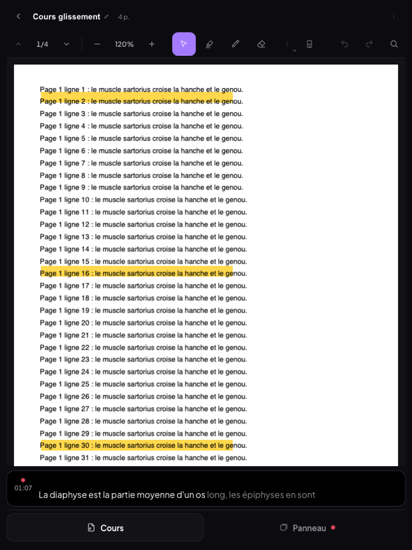 | 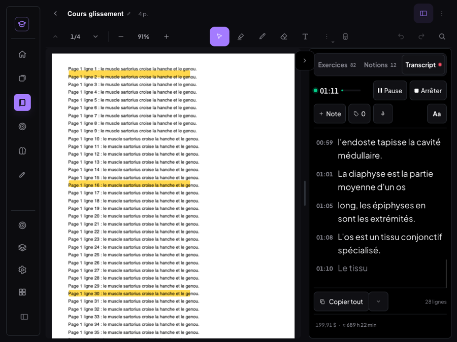 |

| iPad Air portrait 820 × 1 180 | iPad Air paysage 1 180 × 820 |
|---|---|
| 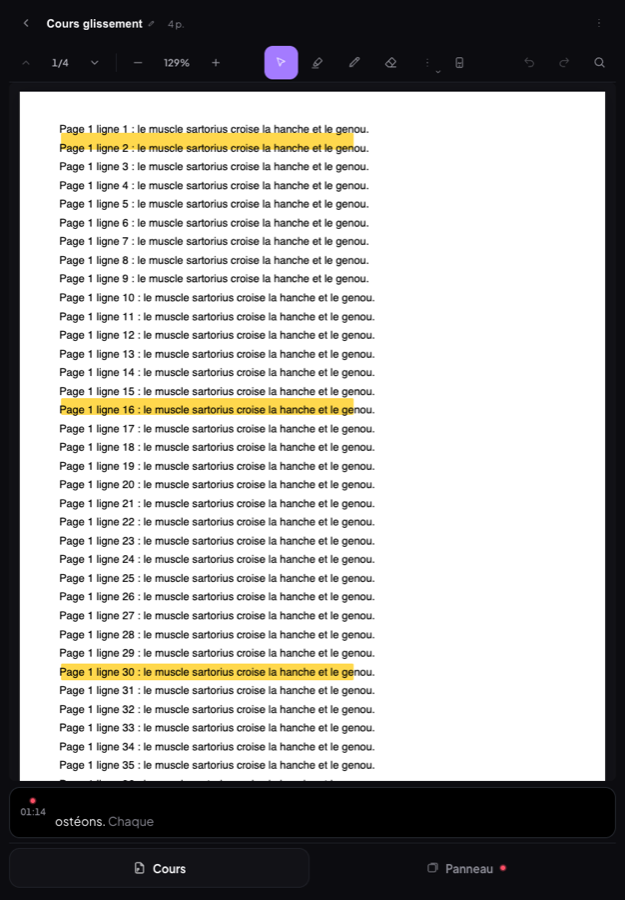 | 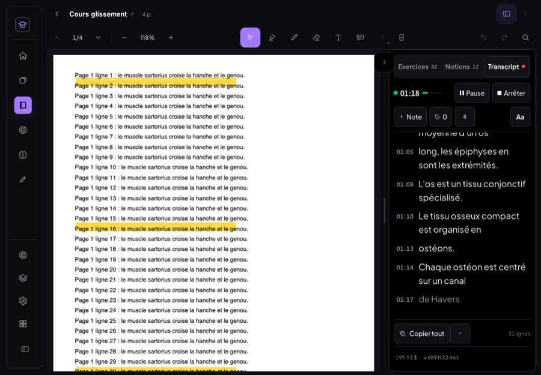 |

| Mac 900 × 800 (côte à côte) | Mac 860 × 1 000 (fenêtre haute, < 900 px) |
|---|---|
| 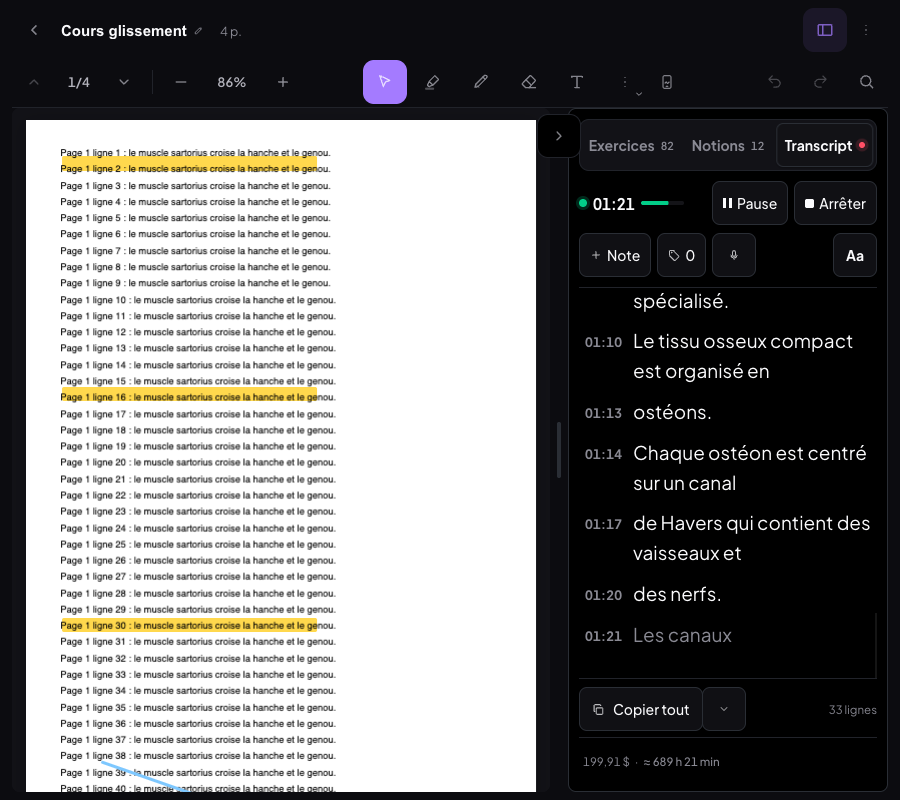 | 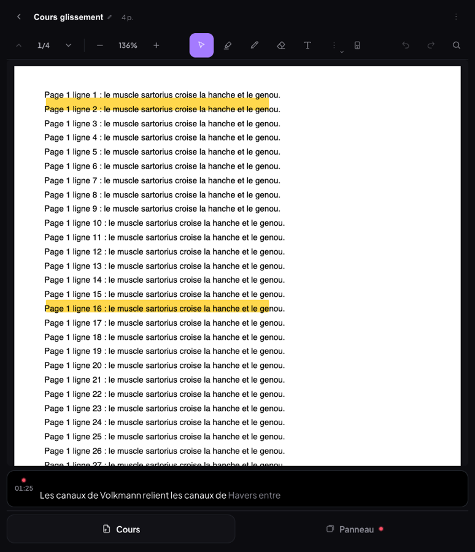 |

| Barre masquée en lisant | Onglet Panneau (2 lignes de contrôles) | Clavier ouvert sur une note | Panneau replié (+N lignes) |
|---|---|---|---|
| 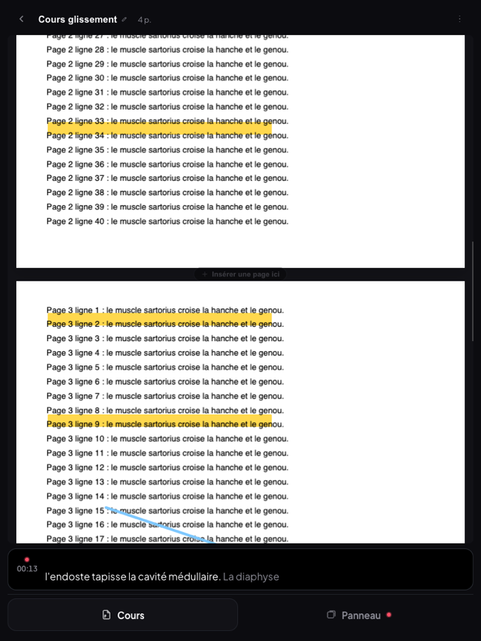 | 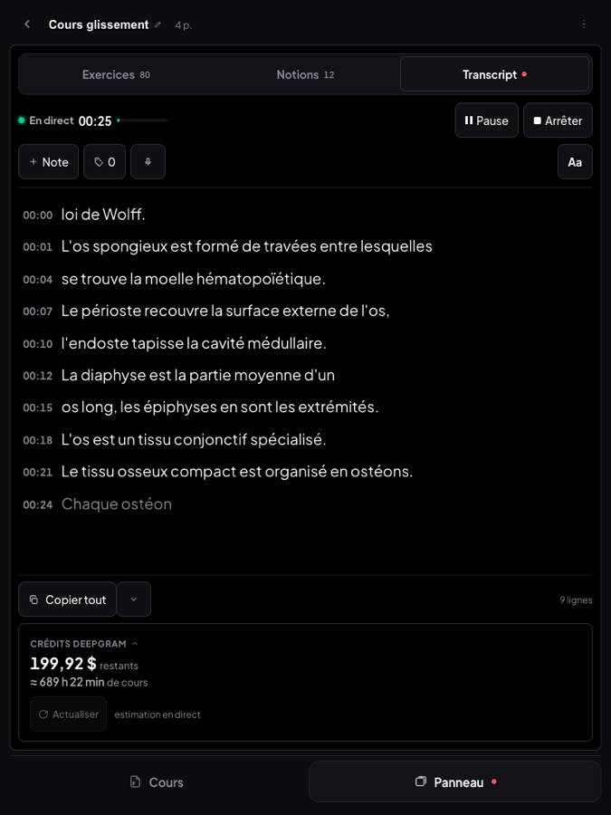 | 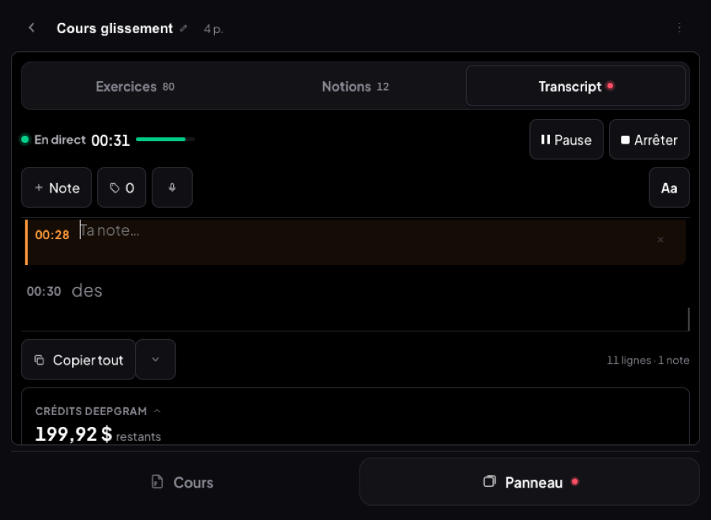 | 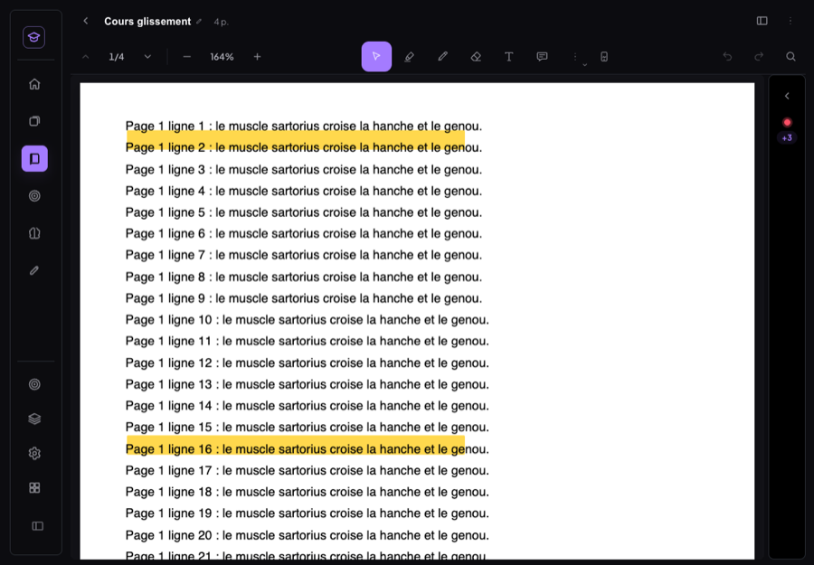 |

| Mode focus (Prise de notes), portrait | Menu « … » de l'en-tête (Mac 900) |
|---|---|
| 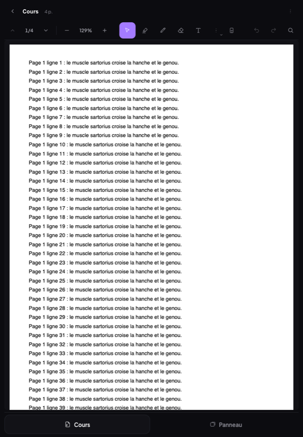 | 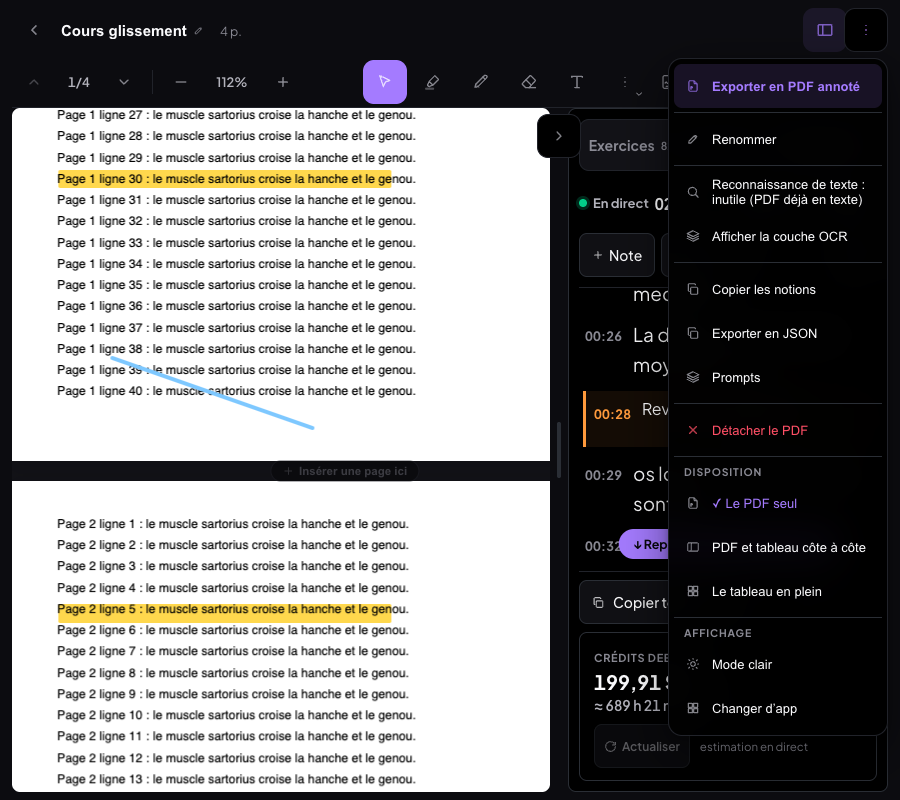 |

## 4. Mesures avant / après

| | Avant | Après |
|---|---|---|
| Haut de la zone PDF (les 4 tailles) | y = 155 à 243 (346 avec un outil) | **y = 108** (56 barre masquée) |
| PDF et transcript ensemble | paysage seulement | **≥ 900 px** ; < 900 px : bande en direct |
| Cibles < 44 px (iPad mini) | 29 / 30 | **0** (le séparateur visuel de 18 px a une zone de prise de 44 px) |
| Défilement de l'écran entier | oui (lecteur plus haut que l'écran) | non |
| Page PDF rognée à 768 px | oui | non (ajustée à la largeur) |
| Défilement horizontal de la page | non | non |

## 5. Tests (Chrome headless piloté en CDP — émulation appareil + **tactile activé**, vrais événements tactiles, stylet `pointerType: pen`, souris, molette, clavier ; faux Supabase vide et faux Deepgram locaux, jamais le cloud)

Session de transcription active pendant tous les tests (voix de synthèse française en micro simulé ;
pas de vidéo YouTube possible dans le banc headless). Cours de test : PDF 4 pages, 80 flashcards, 12 notions.

**Portrait — iPad mini 768 × 1 024 et iPad Air 820 × 1 180 (21 vérifications chacun, toutes ✅ sur les deux)**

| Vérification | Résultat (mini / Air) |
|---|---|
| Onglets Cours / Panneau en bas, ≥ 48 px | bas à 1 016 / 1 172 px, boutons 52 px |
| Bande « en direct » 2 lignes max, 16 px, provisoire en grisé | 45 px (2 × 22,4), dernière ligne + provisoire |
| Changer de page (bouton 44 px) | 1/4 → 2/4 |
| Défilement au doigt vers le bas → barre masquée ; vers le haut → revenue ; tap en haut → revenue | ✅ (PDF remonte à y = 56) |
| Trait au doigt (Crayon) | 1 trait, `scrollTop` inchangé (page immobile) |
| Annotation au doigt : mode du panneau inchangé | ✅ |
| Deux doigts posés ensemble | **0 trait** (avant : 2 traits, ou un zigzag) |
| Stylet simulé | 1 trait ; ensuite le doigt (paume) ne trace plus, classe `stylet-actif` |
| Bande glissée vers le bas → masquée ; passage par le panneau → revenue ; tap → panneau, mode Transcript | ✅ |
| Contrôles de session ≤ 2 lignes, cibles ≥ 44 px, texte ≥ 16 px | 2 lignes, 0 cible < 44, 19 px |
| Glissement au doigt sur le panneau → Notions ; deux glissements → Exercices | ✅ |
| Chercher une notion (« Notion 1 ») | 4 résultats (Notion 1, 10, 11, 12) |
| Note au transcript, **clavier simulé** (hauteur visible réduite à 55 %) | le champ reste visible (y 237–261 / 563) |
| Flashcard au doigt, clavier simulé sur le recto | champ visible ; 80 → 81 (mini), 81 → 82 (Air) |
| Défilement horizontal | aucun |

**Paysage — iPad 1 180 × 820 (9 vérifications ✅)**

| Vérification | Résultat |
|---|---|
| PDF et transcript ensemble | PDF 639–668 px, panneau 380–409 px, transcript 408 px de haut |
| Séparateur glissé au doigt de −100 px | 409 → 509 px, mémorisé 509 (sans saut à la prise) |
| Bornes | 560 au plus, 320 au moins |
| Repli → colonne fine | 60 px, point de session ; **+3** lignes après 9 s |
| Réouverture | à la largeur mémorisée |
| **Rotation** paysage → portrait → paysage, après un zoom manuel et une page suivante | zoom 120 % / page 2/4 gardés, mode du panneau gardé ; session continue (lignes 10 → 11, chrono 00:25 → 00:28) ; largeur du panneau gardée |
| Glissement au doigt entre les modes | Transcript → Notions → Transcript |

**Mac 900 × 800, souris et molette (7 ✅)** : côte à côte (PDF 458 px, panneau 400 px, transcript 281 px) ;
rail masqué ; séparateur à la souris ; barre masquée / revenue à la molette ; trait à la souris ;
« Plus d'outils » (Boîte, Forme, « ? », image, page — lignes de 44 px) ; « … » (Fichier, Disposition, Affichage).

**Mode focus (Prise de notes, lecteur plein écran)** : PDF ouvert en disposition tablette portrait (820 px),
page suivante, onglet Panneau plein écran (1 051 px), rotation en paysage → côte à côte, page gardée. ✅

**Recherche dans le PDF** (5 tailles, champ par-dessus la barre) : « sartorius » → 1/160 partout. **0 erreur console**.

**Non-régression**

| | Résultat |
|---|---|
| Ordinateur 1 440 × 900 et 1 200 × 800 (lecteur ouvert) | captures **identiques à l'octet** entre l'avant (`81a6c8a`) et l'après (même serveur, mêmes données, fichiers de l'ancien commit remis temporairement) |
| Mobile 390 × 844 (shell mobile) | capture **identique à l'octet** |
| MealWeek | ouverte depuis le hub : accueil normal, 0 erreur ; `git diff 81a6c8a -- src/mealweek src/shared src/styles/design.css src/App.jsx src/Selecteur.jsx` : **vide** |
| Supabase | aucune écriture : `VITE_SUPABASE_URL` vide pendant tous les tests |
| Build | `npm run build` vert |

## 6. Limites connues

- **Pas d'iPad réel ni d'Apple Pencil** : tactile et stylet émulés par Chrome (CDP). La paume réelle (grande
  surface de contact) et la pression ne sont pas reproduites ; le rejet repose sur `pointerType`, que
  Safari iPadOS fournit pour le Pencil.
- **Clavier virtuel simulé** en réduisant la hauteur visible de la fenêtre : le vrai clavier iPadOS (qui ne
  redimensionne que le *visual viewport*) est géré par le même code (`visualViewport`), non vérifié sur
  appareil.
- **Pas de vidéo YouTube en fond** : la transcription tournait sur une voix de synthèse et un faux Deepgram.
- **Mode stylet** tenu jusqu'au rechargement (voir écarts assumés).
- **Panneau à 320 px** (iPad mini paysage) : la 1re ligne de session tient sans le libellé « En direct ».
- **Disposition « Les deux » (PDF + tableau)** en tablette : conservée telle quelle (pas de séparateur de
  panneau dans ce cas) ; non retravaillée.
- **Vue HTML d'une fiche** : hors périmètre (le mode tablette ne s'applique qu'au PDF).
- **Plein écran du transcript** et **bande en direct** : la bande n'apparaît qu'en portrait, sur l'onglet Cours.

## 7. Commits

| Commit | Message |
|---|---|
| `e0a7357` | docs(medrevise): audit UX du mode tablette (4 tailles, session active) |
| `d00a9e4` | feat(medrevise): mode tablette du lecteur — côte à côte ou onglets en bas, barre fusionnée, bande en direct |
| `08e1c20` | fix(medrevise): menus contextuels non refermés par le défilement du transcript ; séparateur tablette ancré au doigt |
| (ce commit) | fix(medrevise): contrôles de session lisibles dans un panneau de 320 px + compte-rendu tablette |
