# Transcription de cours en direct — compte-rendu (05/10/2026)

Fonctionnalité livrée dans MedRevise : un bouton **Transcrire** dans le lecteur PDF d'un cours,
un onglet **Transcript** à droite (à côté de « Notions ») qui affiche le cours en français,
ligne par ligne, en direct (Deepgram nova-3), et qui ne perd rien : coupure réseau,
onglet rechargé, plantage, pause, onglet en arrière-plan.

Les deux paliers sont livrés, commités et poussés sur `main`. Build vert. MealWeek identique
au pixel près (voir § Tests).

---

## 1. Architecture retenue

```
                         ┌──────────────────── navigateur (MedRevise) ─────────────────────┐
  micro / BlackHole      │                                                                  │
  ou onglet Chrome ──────┼─▶ audio.js : AudioWorklet → PCM16 mono 16 kHz, blocs de 100 ms   │
  (getUserMedia /        │        │  (+ niveau RMS → VU-mètre, « Pas de son ? »)            │
   getDisplayMedia)      │        ▼                                                         │
                         │   engine.js (singleton hors React)                               │
                         │     • tampon de rejeu ≤ 120 s (audio non encore transcrit,       │
                         │       jamais écrit nulle part)                                   │
                         │     • horloge = blocs audio (KeepAlive, chien de garde,          │
                         │       reconnexion — insensible au bridage des onglets cachés)    │
                         │        │ ① POST /api/deepgram-token                               │
                         │        │ ② WebSocket wss://api.deepgram.com/v1/listen             │
                         │        │    sous-protocole ["bearer", jeton]                      │
                         │        │    ?model=nova-3&language=fr&interim_results=true        │
                         │        │    &smart_format=true&punctuate=true&utterance_end_ms=1500│
                         │        │    &vad_events=true&encoding=linear16&sample_rate=16000  │
                         │        │    &channels=1&keyterm=…&keyterm=…                       │
                         │        ▼                                                         │
                         │   Results interim → ligne grisée (même nœud DOM que la future    │
                         │   ligne validée : pas de saut) · is_final → segment validé       │
                         │        │ écrit dans IndexedDB À CHAQUE segment (sessions.js)     │
                         │        ▼                                                         │
                         │   store transcript_session (IndexedDB)                           │
                         │        │ à l'arrêt seulement                                     │
                         │        ▼                                                         │
                         │   synchro.js → outbox → RPC medrevise_push (garde-fou updated_at)│
                         └────────┼─────────────────────────────────────────────────────────┘
                                  │                         ▲
  ① /api/deepgram-token (Vercel)  │                         │ lecture ciblée : métadonnées
     origine vérifiée, 120/10 min │                         │ (record_id, updated_at), puis
     POST /v1/auth/grant ttl 300 s│                         │ seulement les sessions plus récentes
     avec DEEPGRAM_API_KEY ───────┘                Supabase medrevise_records (store = 'transcript_session')
```

**Jeton** : le serveur appelle `POST https://api.deepgram.com/v1/auth/grant` avec la clé et
renvoie `{ access_token, expires_in: 300 }`. Le jeton ne sert qu'à ouvrir la connexion ; une
nouvelle connexion (reconnexion) redemande un jeton. La clé n'existe que dans la fonction.

**Segments** : `{ id, t0, t1, text, status }`, `status` ∈ `final` (validé par Deepgram),
`uncertain` (texte provisoire figé au moment d'une coupure), `gap` (repère : « Reprise de la
session », « Audio non transcrit… »). Temps en secondes de cours enregistré (hors pauses).

**Reconnexion sans trou ni doublon** : l'audio reste dans un tampon tant qu'aucun texte ne le
couvre. À la reconnexion (1 → 2 → 5 → 10 s, nouveau jeton), tout l'audio postérieur au dernier
mot acquis est renvoyé à Deepgram : ce qui a été dit pendant la coupure est transcrit à
retardement. Le provisoire affiché au moment de la coupure est figé « incertain » jusqu'à la
fin de son dernier mot ; le rejeu part de là. Garde-fou mot à mot : un mot validé qui finit
avant ce point est écarté.

### Fichiers

| Fichier | Rôle |
|---|---|
| `api/deepgram-token.js` | fonction Vercel : jeton temporaire, origine, débit, erreurs lisibles |
| `vite.config.js` | middleware de **dev** qui exécute la même fonction (`apply: 'serve'`, rien au build) |
| `src/medrevise/transcription/audio.js` | capture micro/onglet, AudioWorklet PCM16, liste des entrées |
| `…/engine.js` | moteur de session (WebSocket, rejeu, KeepAlive, pause, arrêt, notes, mots-clés) |
| `…/keyterms.js` | découpage de la saisie, compteur, propositions depuis le PDF, surlignage |
| `…/sessions.js` | enregistrements IndexedDB (écriture sérialisée), mots-clés du cours, suppression |
| `…/synchro.js` | palier 2 : envoi par l'outbox, lecture ciblée, LWW |
| `…/TranscriptPanel.jsx` | bouton, feuille de démarrage, panneau, lecture, liste des sessions |
| `…/IndicateurGlobal.jsx` | pastille flottante quand la session tourne hors du lecteur |
| `…/exporter.js`, `useTranscription.js` | copie / .txt / .md ; pont React |
| `src/styles/transcription.css` | styles (tokens du thème uniquement) |
| `src/medrevise/data/sync.js` | + stores isolés, `pullStoreMeta`, `pullStoreIds`, exclusion de `pullAllRecords` |
| `src/medrevise/lib/storage.js` | + store `transcript_session` (hors `SYNCABLE`), écritures « depuis le cloud », appel dans `syncNow` |
| `PdfReader.jsx`, `PdfToolbar.jsx`, `CourseItemsSidebar.jsx`, `MedReviseApp.jsx` | intégration (quelques lignes chacun) |
| `scripts/faux-deepgram.mjs`, `scripts/faux-supabase.mjs` | outils de test locaux (jamais chargés par l'app) |

---

## 2. Décisions prises seul

1. **Moteur hors de React (singleton)** : changer d'onglet du panneau, replier le panneau,
   passer en mode focus ou quitter le lecteur **n'arrête pas** la session. Une pastille flottante
   (chrono, Pause, Arrêter) apparaît dès que le lecteur du cours n'est plus affiché.
2. **Pas de SDK `@deepgram/sdk`** : un WebSocket natif suffit (sous-protocole `bearer`) ; zéro
   dépendance ajoutée.
3. **AudioWorklet + décimation maison vers 16 kHz** (pas d'`AudioContext` à 16 kHz, mal supporté hors Chrome).
4. **Horloge = blocs audio** : KeepAlive (toutes les 5 s en pause), chien de garde (aucune réponse
   depuis 15 s, ou tampon d'envoi bloqué 5 s) et échéance de reconnexion sont lus à chaque bloc
   de 100 ms, en plus d'un `setTimeout` de secours — le fil audio n'est pas bridé onglet caché.
5. **Rejeu de l'audio non couvert** (≤ 120 s en mémoire) plutôt que d'accepter un trou ; au-delà
   de 120 s de coupure, l'audio le plus ancien est perdu et le transcript le **dit** (repère).
6. **Jeton demandé avant d'ouvrir le micro** : clé absente/invalide ou crédits épuisés
   s'affichent dans la feuille, rien ne démarre et rien n'est enregistré.
7. **Une ligne par `is_final`** (comme demandé), provisoire en **gris sans italique** : l'italique
   change la largeur du texte et peut faire sauter une ligne au moment de la validation. La
   ligne provisoire porte déjà l'id de la future ligne validée → même nœud DOM, seule la couleur
   change (transition 0,35 s).
8. **Horodatages non sélectionnables** : une sélection à la souris copie du texte propre ;
   « Copier tout » donne la version horodatée, et un menu propose « sans horodatage », .txt, .md.
9. **Auto-défilement** : seule une montée volontaire le met en pause (un panneau qui rétrécit —
   éditeur de mots-clés, note — ne le fait pas). Une session passée s'ouvre en haut.
10. **2 000 lignes sans virtualisation JS** : `content-visibility: auto` sur chaque ligne + lignes
    mémoïsées. Mesuré : 60 images/s pendant le flux et en parcourant toute la liste (§ 5).
11. **Mots-clés du cours** : un enregistrement `kt:<id du cours>` dans le même store (synchronisé
    avec lui). Surlignage insensible à la casse et aux accents, pluriel en -s/-x toléré.
    Propositions depuis la couche texte du PDF par heuristique (suffixes/préfixes médicaux, mots
    longs, noms propres, « canal de Havers »), 40 au plus, **non cochées** par défaut (v1 — **remplacé en v1.1** : tout coché, voir en fin de document). Au-delà de
    100 mots, les derniers termes ne sont pas envoyés (et l'UI le dit).
12. **Id du cours** = l'id du document ouvert dans le lecteur (`ficheId`) : marche aussi pour un
    document de Prise de notes.
13. **Limiteur du jeton à 120 / 10 min / IP** (et non 20) : avec un wifi d'amphi instable, une
    reconnexion toutes les 10 s fait 60 jetons / 10 min ; à 20, la transcription se bloquait
    plusieurs minutes (constaté pendant les tests).
14. **Palier 2 — store hors `SYNCABLE`, synchro ciblée** : `reconcileAll` relit toute la table à
    chaque retour sur l'onglet ; y mettre des sessions de 100–400 Ko aurait alourdi toute la
    synchro. Le type est exclu de `pullAllRecords` (`store=not.in.(transcript_session)`), lu par
    métadonnées puis par ids. Envoi par la même outbox et la même RPC conditionnelle, mais **un
    enregistrement par appel, après le lot commun** : un refus de ce type ne retient jamais les
    autres. Une session en direct n'est jamais poussée avant l'arrêt.
15. **Migration** : la table étant générique, **aucune DDL n'est nécessaire** ; la migration
    n'ajoute qu'un index partiel (lecture des métadonnées). Sans elle, tout fonctionne.
16. **Téléphone** : le shell mobile de MedRevise n'a pas de lecteur PDF → pas de bouton
    Transcrire sur téléphone ; une session lancée sur ordinateur reste pilotable par la pastille
    si la fenêtre devient étroite. Tablette / fenêtre étroite : lecteur complet, le bouton bascule
    sur « Panneau ».
17. **Plein écran** = superposition plein cadre dans la page (pas l'API Fullscreen, qui sort au
    moindre changement d'onglet) ; Échap pour sortir ; tailles ×1,5.

---

## 3. Commits

| Commit | Message |
|---|---|
| `d957d7e` | feat(medrevise): /api/deepgram-token — jeton Deepgram temporaire côté serveur |
| `48cba8a` | feat(medrevise): moteur de transcription en direct (Deepgram nova-3, fr) |
| `af6bd94` | feat(medrevise): panneau Transcript dans le lecteur PDF |
| `42069ba` | test(medrevise): faux Deepgram local (grant, WebSocket, pannes injectables) |
| `690a4a7` | feat(medrevise): synchro cloud des sessions de transcription (additive) |
| `75bbd95` | chore(supabase): migration additive transcript_session (index partiel, non appliquée) |
| `1c59264` | test(medrevise): faux Supabase — refus injectable d'un store, filtres in./not.in. |
| `cd0a6c2` | fix(medrevise): transcription — la reprise après coupure repart du dernier mot reconnu |
| (ce commit) | docs(medrevise): compte-rendu transcription directe |

Paliers : **1** = `d957d7e` → `42069ba` · **2** = `690a4a7` → `1c59264`.

---

## 4. Captures

| | |
|---|---|
| Feuille de démarrage (source, mots-clés proposés depuis le PDF) | 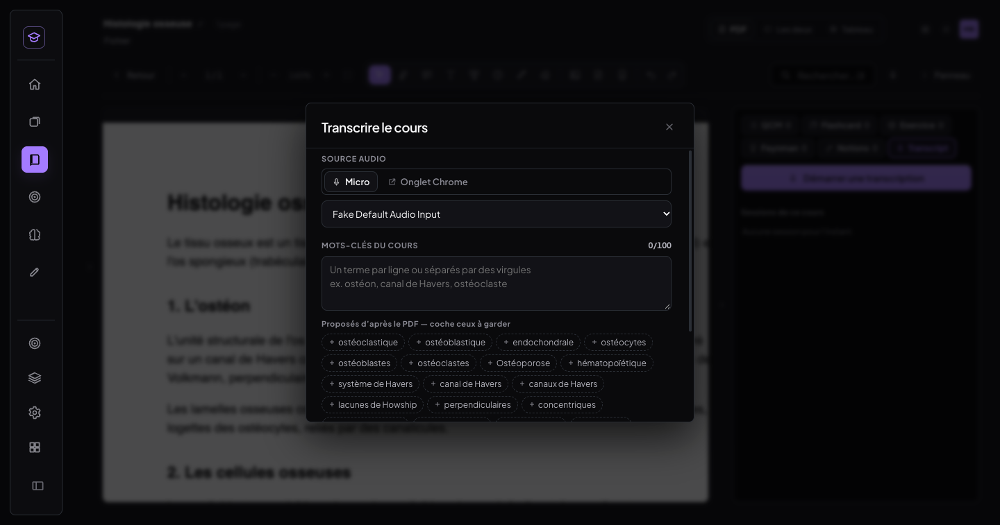 |
| **Session réelle Deepgram** (10 min 32 s) | 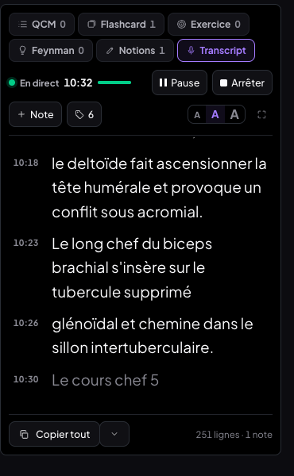 |
| Mot-clé ajouté en pleine session | 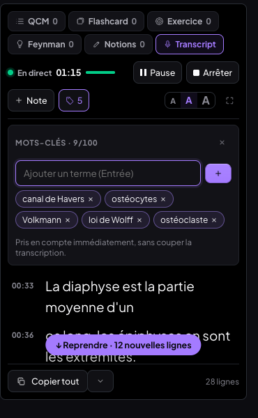 |
| Note personnelle (bordure ambre) | 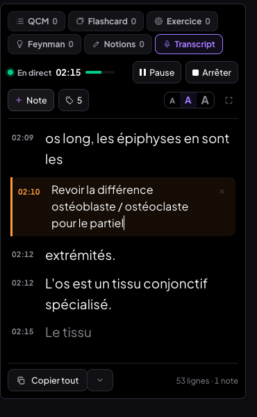 |
| Auto-défilement en pause : « ↓ Reprendre · N nouvelles lignes » | 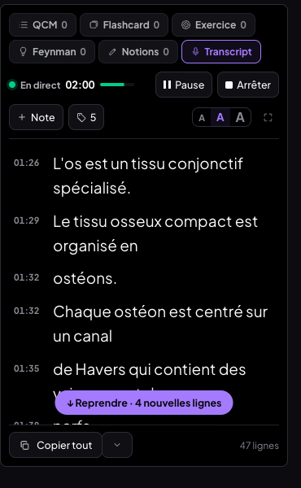 |
| Plein écran, grande taille | 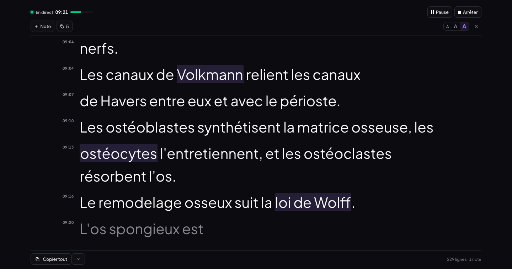 |
| Reprise après rechargement de l'onglet | 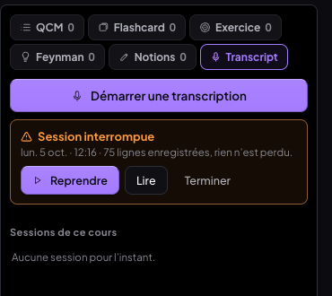 |
| Erreur fatale en cours (crédits épuisés) | 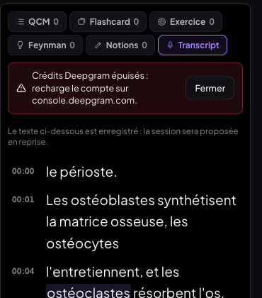 |
| Sans clé serveur | 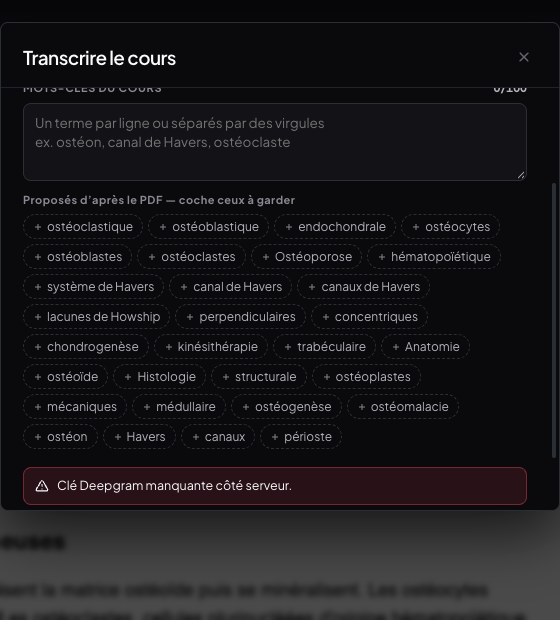 |
| Pastille de session sur téléphone | 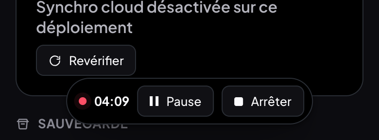 |
| Tablette (820 px) | 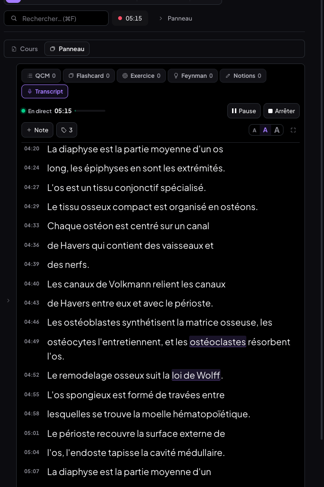 |

---

## 5. Tests réalisés (Chrome)

Banc : Chrome 154 headless piloté en CDP (vrais événements souris/clavier), micro simulé lisant
un fichier audio, Vite local avec **faux Supabase** (`scripts/faux-supabase.mjs`) — le vrai cloud
n'a jamais été touché. Deux sources Deepgram : le **vrai Deepgram** (jeton obtenu auprès de la
fonction de production, qui détient la clé) et un faux Deepgram local pour injecter des pannes.

### Avec le vrai Deepgram

Audio : 6 min de cours d'anatomie/histologie/myologie en français (voix macOS « Thomas »,
893 mots, en boucle) injecté comme micro.

| Test | Résultat |
|---|---|
| Session > 10 min | ✅ 10 min 32 s, **251 lignes validées**, ~1 500 mots, 1 note |
| Texte continu, lignes séparées, ponctuation | ✅ « Aujourd'hui nous poursuivons l'ostéologie et l'histologie osseuse, » / « avant d'attaquer la myologie du membre supérieur. » |
| Vocabulaire | ✅ canal de Havers, canaux de Volkmann, lacunes de Howship, ostéoclastes, mécanotransduction, déminéralisation, sillon intertuberculaire… · ❌ quelques erreurs de reconnaissance de la voix de synthèse (« Poutot-Coll », « calorim » pour cal mou, « supprimé glénoïdal ») |
| Mots-clés surlignés | ✅ |
| Mot-clé ajouté en session (« fibres de Sharpey ») | ✅ `Configure` accepté sans reconnexion ; terme correctement transcrit ensuite (je ne peux pas prouver qu'il ne l'aurait pas été sans) |
| Hors ligne 20 s | ✅ coupure détectée aussitôt, reconnexion dès le retour (nouveau jeton), 21,6 s d'audio rejouées, aucune ligne perdue ni doublée |
| Pause 32 s | ✅ connexion restée ouverte (Deepgram coupe à 10 s sans KeepAlive) |
| Rechargement en pleine session | ✅ 125 lignes + note retrouvées, reprise proposée puis relancée |
| Arrêt | ✅ Finalize → CloseStream → fermeture 1000, session écrite avec `endedAt` |
| Frontière de coupure (après correctif `cd0a6c2`) | ✅ « L'ostéocyte est un *(incertain)* \| Mécanorécepteur » — avant le correctif, un mot à cheval sur la coupure pouvait sauter |

### Avec le faux Deepgram (pannes contrôlées)

| Test | Résultat |
|---|---|
| Coupure franche + refus 20 s | ✅ une seule reconnexion, texte continu |
| Connexion gelée 20 s (wifi coupé vu du navigateur) | ✅ détectée en 15 s, reconnexion 3 s après le retour, texte d'un seul tenant (« …vaisseaux et \| des *(incertain)* \| nerfs. Les canaux… ») |
| Mode hors ligne du navigateur 20 s | ✅ coupure immédiate, reconnexion dès `online` |
| Pause 30 s | ✅ Finalize puis KeepAlive toutes les 5 s, même connexion |
| Ajout de mot-clé en session | ✅ `Configure` reçu, effet simulé visible |
| Rechargements / redémarrage brutal de Chrome en session | ✅ (×6) reprise proposée, rien de perdu, provisoire sauvé « incertain » |
| Crédits épuisés au démarrage / en cours | ✅ message clair ; en cours : texte gardé, session proposée en reprise |
| Sans clé serveur | ✅ « Clé Deepgram manquante côté serveur. » dans la feuille, micro jamais ouvert, rien enregistré |
| Onglet Chrome sans piste audio | ✅ message « Aucun son reçu : … coche « Partager aussi le son de l'onglet » … », piste vidéo arrêtée |
| Onglet Chrome avec audio | ✅ (source simulée de Chrome) vidéo arrêtée, audio transcrit |

### Interface, robustesse, non-régression

| Test | Résultat |
|---|---|
| Auto-défilement / pause au scroll / « Reprendre · N nouvelles lignes » | ✅ |
| Sélection souris + copie | ✅ texte propre (horodatages exclus) |
| Copier tout / sans horodatage / .txt / .md | ✅ |
| Note inline, écrite dans IndexedDB | ✅ |
| 3 tailles mémorisées, plein écran, Échap | ✅ |
| Navigation : onglet Notions, panneau replié, mode focus | ✅ la session continue ; pastille hors du lecteur |
| 2 000 lignes | ✅ rendu initial OK, **60 images/s** (médiane et p95 16,7 ms, 0 image > 50 ms) en flux et en parcourant 147 000 px |
| Mémoire 25 min | ✅ tas 18,8 → 21,5 Mo pour 613 lignes (≈ 4 Ko par ligne de texte), linéaire ; aucun audio conservé → ≈ 40 Mo estimés pour 3 h |
| Console | ✅ aucune erreur ; seul avertissement « Multiple GoTrueClient » préexistant (deux clients Supabase MealWeek/MedRevise) |
| Mobile 390 px / tablette 820 px | ✅ (voir § 2, décision 16) |
| Annotations PDF (surligneur, boîte), onglet Notions, ajout de flashcard, menu des dessins du téléphone | ✅ |
| Synchro des autres types pendant que ce type est refusé par le cloud | ✅ la flashcard modifiée est partie, la session est restée dans l'outbox, puis est partie quand le refus a été levé |
| Deux appareils (faux Supabase) | ✅ sessions et mots-clés de A visibles sur B ; suppression sur B (sauvegarde `pre-delete-transcript-…` puis tombstone) → disparaît de A |
| MealWeek | ✅ aucun fichier MealWeek/`src/shared` modifié ; build avant (`6516d71`) et après comparés : hub, accueil et liste de courses **identiques au pixel près** |
| Production | ✅ `/api/deepgram-token` sur my-org-blue.vercel.app : jeton délivré (origine de l'app), 403 pour une autre origine, 405 en GET |

### Non fait / écarts

- **Micro réel du Mac + YouTube dans les haut-parleurs** : remplacé par une voix de synthèse
  injectée comme micro (reproductible, sans faire jouer de son chez toi). À refaire en vrai.
- **Source « Onglet Chrome » sur un vrai onglet YouTube** : la fenêtre de partage de Chrome est
  une interface native que je ne peux pas piloter ; testé sur la source simulée de Chrome et sur
  le cas « pas de son ». À refaire en vrai (choisir l'onglet, cocher « Partager le son »).
- **Périphérique virtuel BlackHole** : non installé sur cette machine ; la liste des entrées
  (`enumerateDevices`) l'affichera comme n'importe quelle entrée.
- **Session de 3 h réelle** : non faite ; extrapolation depuis 25 min + test 2 000 lignes.

---

## 6. Consommation mesurée (console.deepgram.com)

- **11,8 minutes** de transcription au compteur « Usage — Speech to Text » (session réelle de
  10 min 32 s + rejeux après coupures + test de frontière de ~1 min 40).
- **Crédit : 200,00 $ → 199,92 $**, soit **≈ 0,08 $** (≈ 0,007 $/min, mots-clés compris).
- Ordre de grandeur : 1 h de cours ≈ 0,40–0,45 $ ; 200 $ offerts ≈ 450 h de cours.
  (Tarif public nova-3 streaming : 0,0048 $/min promotionnel, 0,0077 $/min normal ; l'option
  « keyterm prompting » est facturée en plus — [diyai.io](https://diyai.io/ai-tools/speech-to-text/deepgram-pricing-2026/),
  [convertaudiototext.com](https://convertaudiototext.com/blog/deepgram-nova-3-explained).)
- Une pause ne consomme rien (aucun audio envoyé, seulement des KeepAlive).

---

## 7. Migration SQL à appliquer (toi, à la main)

**Chemin** : `supabase/migrations/20261005_transcript_session.sql`
**Facultative** : la synchro des sessions marche sans elle (la table est générique).
Supabase → SQL Editor → New query → coller → Run.

```sql
create index if not exists medrevise_records_transcript_meta
  on public.medrevise_records (record_id, updated_at, deleted)
  where store = 'transcript_session';

notify pgrst, 'reload schema';
```

Aucune ligne lue, écrite ou supprimée ; idempotente. Requêtes de vérification (lecture seule)
en commentaire dans le fichier.

---

## 8. Variables d'environnement Vercel

| Variable | Où | Obligatoire | Rôle |
|---|---|---|---|
| `DEEPGRAM_API_KEY` | Production, Preview, Development — **déjà présente** (ajoutée le 05/10) | oui | clé Deepgram (rôle « Member » au minimum pour créer des jetons) — serveur uniquement |
| `DEEPGRAM_ALLOWED_ORIGINS` | facultatif | non | origines autorisées en plus du domaine qui sert l'app (ex. un domaine perso), séparées par des virgules |
| `VITE_SUPABASE_URL`, `VITE_SUPABASE_ANON_KEY` | inchangées | — | synchro (déjà en place) |

`DEEPGRAM_API_URL` / `DEEPGRAM_LISTEN_URL` existent pour les tests locaux contre
`scripts/faux-deepgram.mjs` : **ne pas les définir sur Vercel**. Aucun Redeploy nécessaire
(la clé est déjà là et le dernier déploiement est postérieur).

En local : `DEEPGRAM_API_KEY=…` dans `.env.local` (non commité) puis `npm run dev` — le
middleware de dev sert `/api/deepgram-token`.

---

## 9. Limites connues

- **Arrière-plan (vérifié)** : quand l'onglet est caché, Chrome bride ses minuteurs (1/s, puis
  1/min au bout de 5 min). Testé avec ce bridage avancé à 10 s : un onglet témoin sans micro
  tombe à 23 tops en 45 s, alors que l'onglet qui **capture le micro n'est pas bridé** (50/50) ;
  la transcription continue (20 lignes en 50 s onglet caché), une coupure survenue onglet caché
  est rattrapée en 3 s, et une pause de 40 s onglet caché garde la connexion (KeepAlive). Le moteur
  ne dépend de toute façon pas des minuteurs (horloge = fil audio). Non couvert : la mise en
  veille du Mac (capot fermé) coupe l'audio — la session reprend en « Reconnexion… » au réveil.
- **Coupure > 120 s** : l'audio le plus ancien n'est plus rejoué ; le transcript affiche
  « Audio non transcrit (coupure réseau trop longue) » à cet endroit.
- **Frontière de coupure** : un fragment de mot peut apparaître en « incertain » juste avant le
  mot complet rejoué (« le père *(incertain)* \| Périoste ») — jamais de perte, au pire un fragment signalé.
- **Une session à la fois** sur l'appareil ; deux onglets ouverts sur le même cours ne se
  coordonnent pas.
- **Téléphone** : pas de lecteur PDF dans le shell mobile, donc pas de démarrage depuis le téléphone.
- **Le limiteur de débit** est en mémoire, par instance de fonction Vercel : il freine un abus
  naïf, ce n'est pas une authentification (l'app n'en a pas ; l'origine est vérifiée).
- **Sauvegarde locale (Réglages)** : les transcripts ne sont pas inclus dans le fichier de
  sauvegarde JSON (store hors `SYNCABLE`) ; ils sont dans IndexedDB et au cloud.
- **Seconde passe « médicale »** : aucune, comme demandé — une seule passe en direct.

---

## 10. Reproduire les tests

```sh
node scripts/faux-supabase.mjs                      # :54399
node scripts/faux-deepgram.mjs                      # :54400
VITE_SUPABASE_URL=http://localhost:54399 VITE_SUPABASE_ANON_KEY=cle-de-test \
DEEPGRAM_API_KEY=cle-de-test DEEPGRAM_API_URL=http://localhost:54400 \
DEEPGRAM_LISTEN_URL=ws://localhost:54400/v1/listen npx vite --port 5199
# pannes : curl -X POST 'localhost:54400/__couper?refus=20' | '/__geler?s=20' | '/__credits?zero=1'
#          curl -X POST 'localhost:54399/__refuser?stores=transcript_session'
# Chrome : --use-fake-device-for-media-stream --use-fake-ui-for-media-stream
#          --use-file-for-fake-audio-capture=cours.wav --no-sandbox (sinon le fichier n'est pas lu)
```
Piège de dev : modifier `engine.js`, `keyterms.js`, `api/…` ou `scripts/…` recharge la page
(Vite) — c'est un rechargement en pleine session, la reprise le gère.

---

## v1.1 — crédits et mots-clés (05/10/2026)

### Mots-clés : tout coché par défaut

- **Pertinence** des termes proposés = **rareté × fréquence** : rareté = indices de
  vocabulaire technique (suffixes/préfixes médicaux, mots longs, noms propres, « canal de
  Havers »), fréquence amortie `1 + log2(n)` dans le PDF. Jusqu'à 150 propositions.
- **Mémorisé avec le cours** (enregistrement `kt:<cours>`, synchronisé comme en v1) :
  `{ terms, manuels, decoches, connus }`. Un enregistrement v1 (`terms` seul) est relu comme
  « manuels ».
  - les termes **saisis à la main** restent **en tête** ;
  - un terme proposé **nouveau** est **coché** s'il tient dans la limite, sinon laissé
    décoché (hors limite) ;
  - un terme **décoché** reste décoché aux ouvertures suivantes (testé : 3 décochés →
    fermeture → rechargement → toujours décochés) ;
  - **Tout cocher** (dans la limite, les plus pertinents d'abord) / **Tout décocher**.
- **Limite** : 100 mots (≈ 500 jetons). Compteur « N/100 » ; à 100 :
  « 100/100 — décoche pour en ajouter d'autres ». Cocher, ajouter à la main ou ajouter en
  session au-delà de la limite est **refusé avec un message** ; décocher un terme **ne recoche
  rien en douce**. Garde-fou final à l'envoi (`termesEnvoyables`) : jamais plus de 100 mots,
  ni dans l'URL ni dans `Configure`.
- En session : un terme ajouté devient « manuel » du cours, un terme retiré passe en décoché.

Tests (Chrome) : cours 28 propositions → 28/28 cochés ; décocher 3 → persistant après
rechargement ; 130 propositions synthétiques → 100 premiers cochés, 101ᵉ refusé, décocher puis
cocher un autre OK, Tout cocher → 100/100, Tout décocher → 0 ; dépassement réel dans
l'interface (glossaire de myologie + termes manuels) → bandeau 100/100, refus affiché.

| | |
|---|---|
| Tout coché par défaut, manuels en tête | 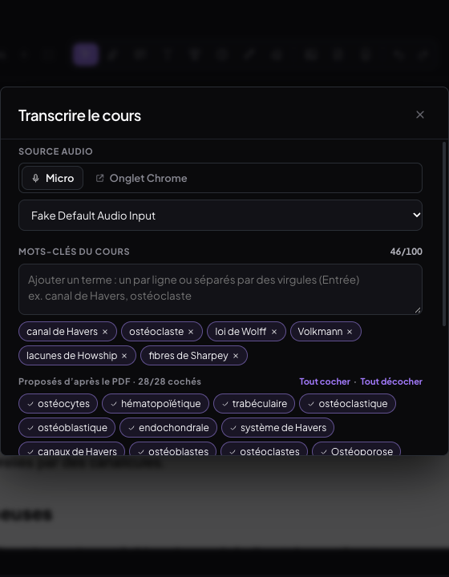 |
| Limite atteinte (Tout cocher → 62/68, 100/100) | 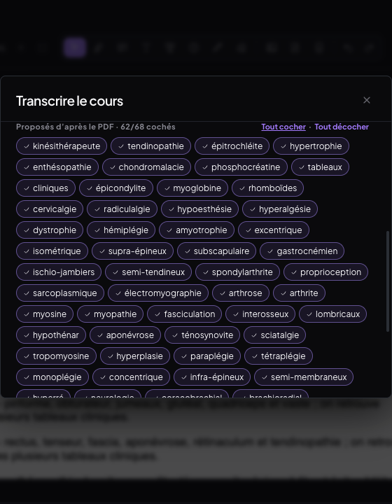 |

### Crédits Deepgram : méthode de calcul retenue

`POST /api/deepgram-credits` — même protection que le jeton (origine + débit, code commun
dans `api/_protection.js`, que Vercel ne publie pas comme route), **cache serveur 10 min**,
réponse `{ remainingUsd, spentUsd, hoursUsed, effectiveRateUsdPerHour, estimatedHoursLeft,
source, spentSource, updatedAt, stale }`.

1. **Projet** : `GET /v1/projects` → le premier (jamais codé en dur).
2. **Solde** : `GET /v1/projects/{id}/balances` → somme des montants USD → `source = "balance"`.
3. Sinon (403) : **heures** = somme des `hours` de `GET /v1/projects/{id}/usage/breakdown?endpoint=listen`
   depuis 2020 (repli `/usage`) ; **dépense** = somme des `dollars` de
   `GET /v1/projects/{id}/billing/breakdown` si la clé y a droit (`spentSource = "billing"`),
   sinon **heures × 0,0048 $/min** (`spentSource = "hours"`) ;
   **solde = DEEPGRAM_INITIAL_CREDIT_USD (200) − dépense** → `source = "usage-estimate"`.
4. **Tarif effectif** = dépense ÷ heures dès 0,5 h transcrite (capte le surcoût réel des
   mots-clés quand la dépense vient du solde ou de la facturation), sinon 0,29 $/h.
   **Heures restantes** = solde ÷ tarif effectif.
5. Erreur Deepgram/réseau → dernière valeur connue avec `stale: true` ; clé absente →
   `{ ok:false, code:"missing_key" }` (HTTP 200) : jamais d'erreur bloquante.

**Côté app** (`transcription/credits.js`) : cache `localStorage` (affichage instantané au
rechargement et hors ligne), rafraîchi à l'ouverture d'un cours, à l'ouverture de la feuille
(« avant démarrage »), à la fin d'une session et par « Actualiser » — **jamais pendant une
session** (vérifié : 0 requête de crédits pendant une session de 5 min, une seule lecture à
l'arrêt).

- Pastille « ≈ 689 h restantes » en tête du panneau Transcript, détail au survol (solde,
  consommé, tarif effectif, « estimation », mise à jour, « dernière valeur connue ») ;
  ambre sous 20 h, rouge sous 5 h avec « Pense à recharger Deepgram ».
- Feuille Transcrire : « Il te reste ≈ 689 h (≈ 344 cours de 2 h). »
- Fin de session : « Cette session : 5 min ≈ 0,03 $ » (durée × tarif effectif connu à
  l'arrêt, figé dans la session : champ `coutUsd`).
- Réglages → carte « Crédits de transcription » + « Actualiser ».

| | |
|---|---|
| Pastille et détail | 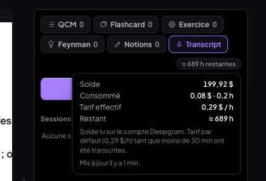 |
| Sous 5 h | 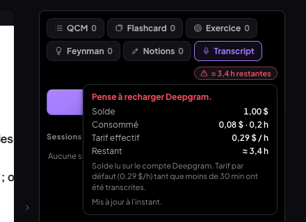 |
| Coût de la session | 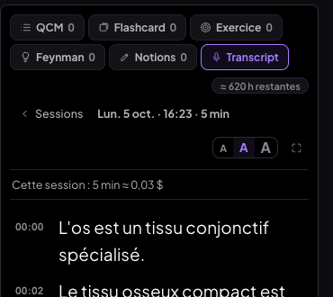 |
| Réglages | 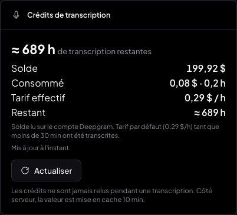 |

### Écart constaté avec la console Deepgram (compte réel, production, 05/10 16 h 30)

| | `/api/deepgram-credits` (prod) | console.deepgram.com |
|---|---|---|
| Source | `usage-estimate`, `spentSource: hours` — la clé (rôle de base) ne lit ni le solde ni la facturation | — |
| Heures transcrites | **0,226 h** (13,56 min) | **13,6 min** ✅ identique |
| Dépense | 0,065 $ | 200 − 199,92 = **0,08 $** |
| Solde | 199,93 $ | **199,92 $** |
| Heures restantes | ≈ 689 h | ≈ 199,92 / 0,354 ≈ 565 h au tarif réel constaté |

**Écart de dépense : −0,015 $ (−19 %)** : l'estimation applique 0,0048 $/min alors que le
tarif réellement facturé ressort à ≈ 0,0059 $/min (≈ 0,354 $/h), surcoût du *keyterm
prompting* compris. Sur le solde, l'écart reste d'un centime, mais l'estimation des **heures
restantes est optimiste d'environ 20 %** tant que la clé ne lit pas le solde.
**Pour un calcul exact** : donner à `DEEPGRAM_API_KEY` le rôle *Admin* (ou créer une clé
dédiée lisant `balances`/`billing`) — la fonction bascule alors d'elle-même sur
`source: "balance"` ou `spentSource: "billing"`, et le tarif effectif intègre le surcoût réel.
Alternative sans changer de clé : ajuster `DEEPGRAM_INITIAL_CREDIT_USD` si le crédit initial
n'est pas de 200 $.

Tests (faux Deepgram réglable, `scripts/faux-deepgram.mjs` → `/__compte`) : solde lisible ;
solde 403 + facturation ; solde 403 + facturation 403 (heures × tarif) ; 12 h → tarif
effectif 0,317 $/h ; panne → `stale` ; mauvaise origine → 403 ; clé absente → pastille
masquée, message calme dans la feuille et les Réglages ; seuils 14 h (ambre) et 3,4 h (rouge).

### Variables d'environnement ajoutées

| Variable | Où | Rôle |
|---|---|---|
| `DEEPGRAM_INITIAL_CREDIT_USD` | Vercel (facultatif) | crédit initial du compte, défaut **200** ; sert au solde estimé quand la clé ne lit pas `balances` |
| `DEEPGRAM_CREDITS_CACHE_S` | **tests uniquement**, ne pas définir sur Vercel | durée du cache serveur (défaut 600 s) |

Aucune variable obligatoire en plus ; aucun Redeploy nécessaire.

### Non-régression v1.1

Direct, reconnexion (coupure franche pendant la session de 5 min), note, Copier tout, sessions
en lecture : ✅. Console : aucune erreur nouvelle. MealWeek : aucun fichier MealWeek/partagé
modifié ; builds avant (`bcde064`) / après comparés — accueil et liste de courses
**identiques au pixel près**.

### Commits v1.1

| Commit | Message |
|---|---|
| `9490c43` | feat(medrevise): mots-clés proposés tous cochés, décochés mémorisés par cours, limite 100 mots |
| `75a8094` | feat(medrevise): crédits Deepgram en direct (/api/deepgram-credits) et affichage |
| `9e90379` | test(medrevise): faux Deepgram — API de gestion réglable |
| (ce commit) | docs(medrevise): compte-rendu v1.1 — crédits et mots-clés |

Note : `9490c43` seul n'est pas cohérent (l'appel en session du nouveau format arrive dans
`75a8094`) ; l'état livré est celui de la tête de `main`.

---

## v1.2 — carte crédits (05/10/2026)

**Ce qui change** : la pastille « ≈ N h restantes » (et son détail au survol) et la ligne de
la feuille « Transcrire » sont **supprimées**. À la place, **un seul bloc**, une carte de la DA
(`card`, comme les cartes du panneau) **en haut du panneau Transcript**, juste sous les onglets,
au-dessus du bouton Démarrer et de la liste des sessions — lisible sans survol ni clic :

```
CRÉDITS DEEPGRAM
199,93 $ restants
≈ 689 h 25 min de cours
[⟳ Actualiser]   mis à jour il y a 12 min
```

- **Valeurs brutes** de `/api/deepgram-credits` (logique inchangée) : solde en $ à 2 décimales ;
  temps restant = **solde ÷ tarif effectif**, en heures et minutes, arrondi à la minute. Pas de
  pourcentage, pas de barre, pas de « ≈ N cours ».
- **Seul signal** : la ligne de temps passe en **ambre sous 5 h**, en **rouge sous 1 h** (aucun
  autre message).
- **Actualiser** : relecture immédiate avec `?force=1` (le cache serveur de 10 min est ignoré —
  le limiteur par IP du serveur reste actif), **au plus un appel toutes les 30 s côté client**
  (bouton inactif, info-bulle « Patiente N s », réactivé pile à la fin du délai) ; l'icône
  tourne pendant la requête. Échec → la valeur reste affichée et **« hors ligne »** (gris)
  remplace « mis à jour il y a… ».
- **Composant unique** `CarteCredits` (`transcription/Credits.jsx`) : le même dans le panneau et
  dans les **Réglages** (aucune copie). Variante `compact` = une ligne
  « 199,93 $ · ≈ 689 h 25 min · ⟳ » **pendant une session et à la lecture d'une session**, pour
  ne pas empiéter sur le transcript ; le bouton y est inactif pendant une session (les crédits ne
  sont jamais relus pendant une transcription).
- **Lecture des crédits dès l'ouverture du cours** (depuis le lecteur, quel que soit l'onglet
  affiché) : en arrivant sur Transcript, la carte a déjà sa valeur. Le dernier résultat reste en
  cache local (affichage instantané au rechargement).
- Inchangé : la ligne de fin de session « Cette session : … ≈ … $ ».

### Décisions prises seul (v1.2)

1. **« Visible dès l'ouverture d'un cours »** interprété comme : aucune action pour *voir* ou
   *charger* la valeur une fois sur l'onglet Transcript. Le panneau de droite continue de
   s'ouvrir sur l'onglet QCM (changer l'onglet par défaut de tous les cours aurait été un effet
   de bord) ; la lecture, elle, part dès l'ouverture du cours.
2. **Où la carte apparaît** : complète sur l'accueil du panneau (au-dessus des sessions) ;
   compacte (une ligne de 32 px) en direct, en lecture et sur l'écran d'erreur.
3. **Réglages** : la carte porte son propre titre « Crédits Deepgram » plutôt que d'être placée
   dans une seconde carte titrée « Crédits de transcription » (carte dans une carte).
4. **Fin de session** : le rafraîchissement automatique utilise aussi `force=1` (pour voir la
   consommation de la session) et partage la limite de 30 s du bouton.
5. **Téléphone** : le shell mobile n'a pas de lecteur PDF (voir § 2, décision 16) — donc pas de
   carte ; sur tablette / fenêtre étroite (≤ 900 px), carte complète 116 px à l'accueil, une
   ligne en session.

### Tests (Chrome, CDP — faux Deepgram réglé sur les valeurs réelles du compte)

| Test | Résultat |
|---|---|
| Cache local vidé, ouverture du cours (onglet QCM affiché) | ✅ crédits déjà lus ; onglet Transcript → carte « 199,93 $ restants · ≈ 689 h 25 min de cours · mis à jour à l'instant » |
| Cohérence console Deepgram (prod, `/api/deepgram-credits`) | ✅ 199,93 $ / 0,226 h ; console : 199,92 $ / 13,6 min — même écart d'1 centime qu'en v1.1 (estimation, voir § v1.1) |
| `force=1` | ✅ local et prod : `cached:true` sans, `cached:false` avec |
| Actualiser | ✅ icône en rotation pendant la requête (latence simulée 1,5 s) ; 2ᵉ clic et appel programmatique dans les 30 s → **aucune** requête ; bouton réactivé au bout de 31 s |
| Hors ligne (navigateur coupé) | ✅ valeur conservée, « hors ligne » en gris |
| Seuils | ✅ 1,20 $ → « ≈ 4 h 08 min » ambre ; 0,20 $ → « ≈ 41 min » rouge ; 12 $ → « ≈ 41 h 23 min » neutre |
| Reliquats | ✅ feuille Transcrire : aucune mention de crédits ; aucun élément `.trx-credits*` dans le DOM ; plus aucune référence dans `src/` |
| En session | ✅ ligne compacte seule, bouton inactif (« Pas de relecture pendant une transcription ») |
| Fin de session | ✅ « Cette session : 28 s ≈ 0,00 $ » + crédits relus |
| Tablette 820 px / téléphone 390 px | ✅ carte 594 × 116 px (accueil), 32 px en session, sans débordement / shell mobile sans lecteur |
| Réglages | ✅ même composant, Actualiser fonctionnel |
| Non-régression module | ✅ session, coupure + reconnexion, note, Copier tout (note incluse), arrêt, liste des sessions ; console : rien de nouveau (seulement les pannes injectées et l'avertissement GoTrue préexistant) |
| MealWeek | ✅ aucun fichier MealWeek/partagé modifié ; builds `7b8900f` / v1.2 **identiques au pixel près sur une même origine** (un écart de 7 px sur la liste de courses suivait le *port*, pas le build : état MealWeek propre à chaque origine — vérifié en inversant les builds) |

| | |
|---|---|
| Carte en haut du panneau | 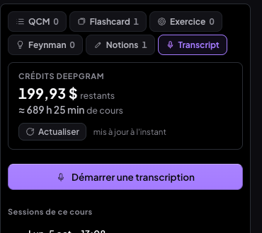 |
| Actualiser en cours |  |
| Hors ligne | 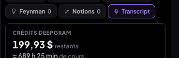 |
| Sous 5 h (ambre) | 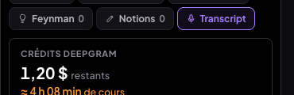 |
| Sous 1 h (rouge) | 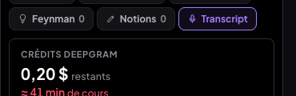 |
| Une ligne pendant la session | 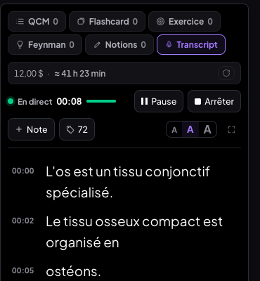 |
| Tablette | 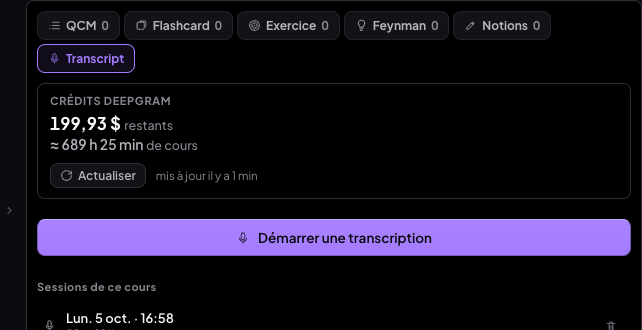 |
| Réglages | 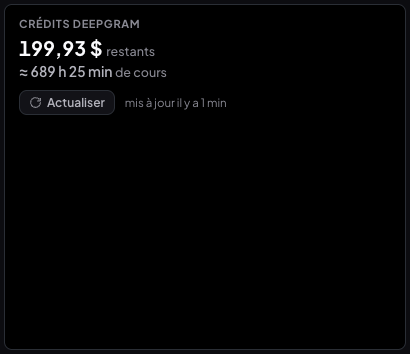 |

### Commits v1.2

| Commit | Message |
|---|---|
| `684ce41` | feat(medrevise): une seule carte « Crédits Deepgram » en haut du panneau Transcript |
| `189624f` | test(medrevise): faux Deepgram — latence réglable de l'API de gestion |
| (ce commit) | docs(medrevise): compte-rendu v1.2 — carte crédits |

Aucune variable d'environnement ajoutée ; aucune migration.

---

## Refonte du 05/10 (panneau en 3 modes)

Le bouton « Transcrire » a quitté la barre du PDF (il vit en tête du mode Transcript du
panneau), la carte crédits est devenue une ligne dépliable en bas de ce mode, et la feuille
Transcrire a une source **Automatique**, une sonde de 3 s, un guide et la bascule de micro à
chaud. Détails, tests et captures : `docs/compte-rendu-panneau-lateral.md`.
