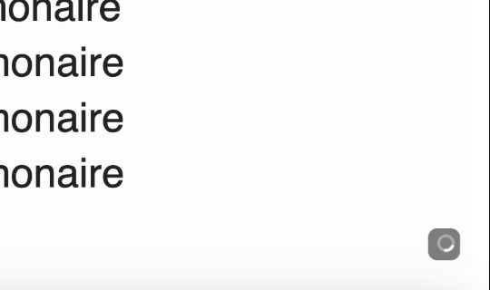
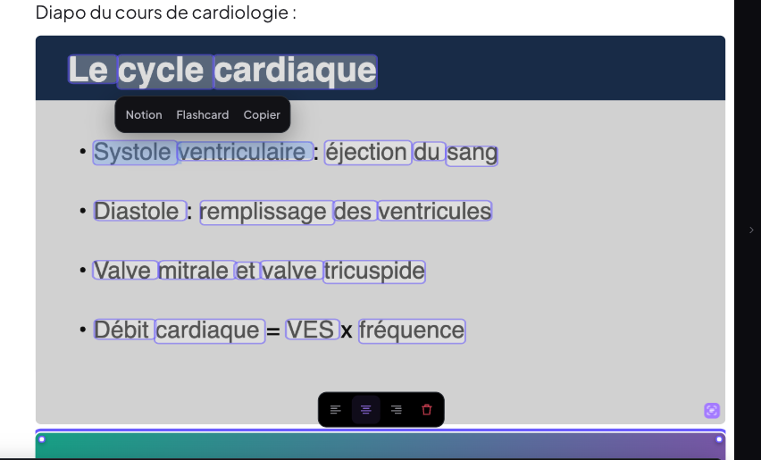
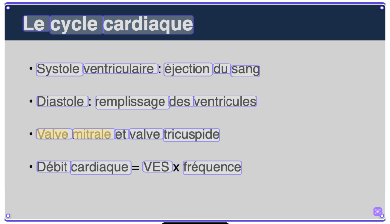
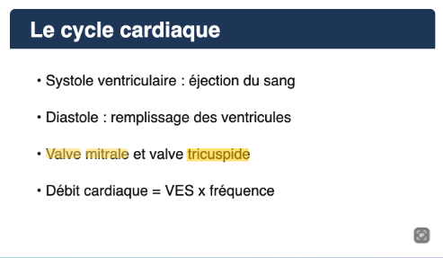
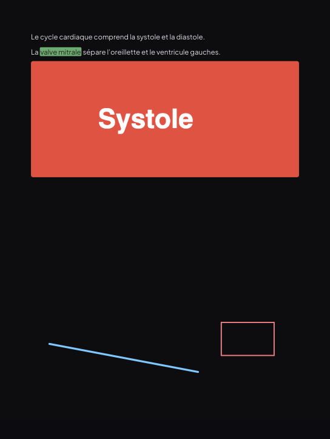
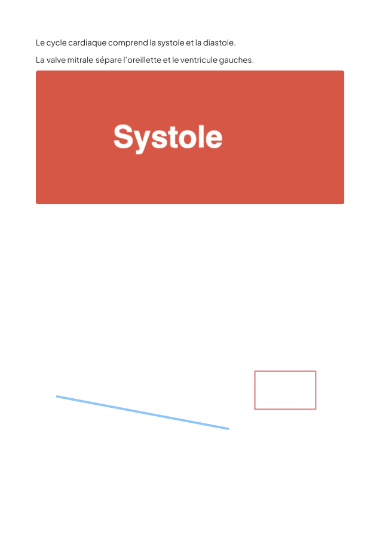
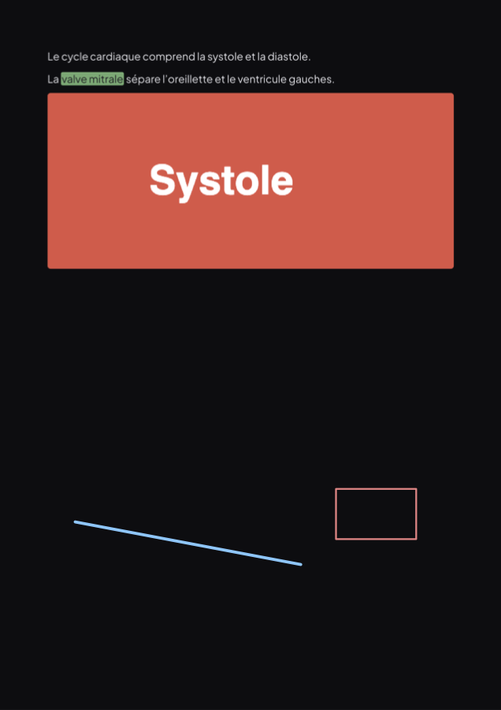

# Annuler / Rétablir, Texte en direct sur les images, renommage, export PDF d'un document (08/10/2026)

La consigne annonçait cinq points ; elle en détaille quatre. Les quatre sont livrés.

**Conditions de test**
- Chrome headless piloté en CDP, avec de vrais événements souris, clavier et tactiles.
- Données locales isolées. Pour le renommage, l'app était branchée sur le **faux Supabase local** du dépôt (`scripts/faux-supabase.mjs`, 120 requêtes reçues), pour avoir une vraie synchro pendant l'édition. **Jamais le vrai cloud.**
- Tailles : bureau 1 440 × 900 et tablette 820 × 1180 tactile.

---

## 1. Annuler / Rétablir

### Cause exacte

**Deux sortes de piles se disputaient ⌘Z :**
- **la pile des annotations** (`lib/annotHistory.js`), servie par un écouteur de la fenêtre **dès que le focus n'était pas dans du texte** ;
- **une pile ProseMirror par page de texte** d'un document, servie quand le focus était dans la page.

⌘Z défaisait donc « ce qui dépend du focus », pas la dernière action.

Mesuré sur le scénario de la consigne (taper « Le cœur droit », surligner « cœur », coller une image, la déplacer, ajouter une page) :
- 6 × ⌘Z ne défaisaient **que la page ajoutée**, jamais le texte, le surlignage ni l'image ;
- les boutons Annuler / Rétablir étaient **grisés** alors que 4 actions étaient annulables ;
- **⌘Y** ne faisait rien : il n'était géré nulle part.

**Défauts de structure trouvés au passage :**
- la pile d'une page **disparaissait** quand la page était démontée (virtualisation au défilement) ;
- une image **déplacée d'une page à l'autre** vivait dans deux piles : un ⌘Z n'en défaisait que la moitié, avec un risque d'image en double ou perdue ;
- les boutons Annuler / Rétablir de la barre de texte appelaient la pile de la page seule ;
- dans le formulaire de flashcard, l'**amorce** et le **trou** ajouté ou retiré remplaçaient la valeur par programme, ce qui les sortait de l'historique natif du champ : ils n'étaient pas annulables.

### Règle retenue (un seul gestionnaire, en capture, avant ProseMirror)

| Raccourci | Effet |
|---|---|
| ⌘Z / Ctrl+Z | annuler |
| ⌘⇧Z / Ctrl+Maj+Z **et** ⌘Y / Ctrl+Y | rétablir |

| Ce qui a le focus | Pile utilisée |
|---|---|
| Texte d'une **page de document**, une image, une annotation, ou rien | **le journal du document** |
| Champ de formulaire (`input`, `textarea` : flashcard, recherche…) | l'historique **natif** du navigateur ; ⌘Y y est traduit en « rétablir » natif |
| Autre éditeur qui a son propre historique (boîte de texte d'un PDF, notes, transcript) | son éditeur |
| Tableau | ses propres raccourcis (⌘Y ajouté) |

**Le journal** (`lib/journalAnnuler.js`) est **une seule liste chronologique** par document ouvert. Chaque entrée contient :
- soit une commande d'annotation (la pile des annotations est gardée : commandes inversibles, effets à l'écran sans attendre) ;
- soit l'**instantané avant / après d'une page de texte**. Un instantané survit au démontage de la page.

Règles de regroupement :
- une frappe continue sur une page compte pour une seule entrée ;
- un débordement d'une page sur l'autre est rattaché à l'action qui l'a causé : un ⌘Z remet les deux pages ;
- une image déplacée d'une page à l'autre compte pour une seule entrée ;
- l'OCR d'une image (point 2) n'entre pas dans le journal.

Les boutons de la barre d'outils et de la barre de texte reflètent l'état réel du journal : grisés quand il est vide.

### Tests

**Document** (`undo-doc.mjs`, bureau puis tablette tactile) :

| Étape | Avant | Après |
|---|---|---|
| ⌘Z n°1 | page retirée | page retirée |
| ⌘Z n°2 | rien | image revenue à sa place d'origine |
| ⌘Z n°3 | rien | image retirée |
| ⌘Z n°4 | rien | surlignage retiré |
| ⌘Z n°5 | rien | texte retiré ; Annuler grisé |
| ⌘Z n°6 | rien | rien (journal vide) |
| ⌘⇧Z ×3 puis ⌘Y ×3 | rien | texte → surlignage → image → déplacement → page ; Rétablir grisé à la fin |

En tablette, même ordre exact. Le déplacement de l'image ne s'y joue pas : le script envoie des événements souris alors que le tactile est émulé. Le déplacement au doigt est validé au chantier précédent.

**PDF annoté** (`undo-pdf.mjs`) : surligner, recolorer en vert, 2ᵉ surlignage, 2ᵉ retiré en repassant, page ajoutée.
- 5 × ⌘Z défont exactement dans l'ordre inverse ; le 6ᵉ ne fait rien.
- 3 × ⌘⇧Z puis ⌘Y rétablissent tout.
- Boutons Annuler / Rétablir de la barre à la souris : ✅ ; grisés quand la pile est vide : ✅.

**Formulaire de flashcard** (`undo-fc.mjs`) :
- Saisie : « Le muscle » → amorce « C'est quoi : » → trou sur « muscle ».
- ⌘Z ×3 donne « Le muscleC'est quoi : », puis « Le muscle », puis « » (vide).
- ⌘⇧Z, puis ⌘Y ×2 : tout revient.
- Le journal du lecteur n'est pas touché.

---

## 2. Texte en direct sur les images d'un document

**Ce qui est fait** (`ocr/ocrImage.js`, `documents/lib/imageVue.js`) :
- **Dès l'insertion d'une image** (coller, glisser, bouton), l'OCR existant tourne en arrière-plan : Tesseract.js fra + eng dans son Web Worker, même préparation de l'image et même filtrage des mots que les PDF.
- **Badge en bas à droite**, 18 px à l'écran quel que soit le zoom :
  - pendant le traitement, un **spinner** discret ;
  - ensuite, si du texte a été trouvé, une icône **« texte détecté »** (coins de viseur et lignes, comme l'indicateur Live Text d'Apple) ;
  - **aucune icône** s'il n'y a pas de texte.
- **Clic ou tap sur l'icône** (cible tactile de 40 px) : mode texte.
  - Les mots sont mis en évidence par des boîtes semi-transparentes, sur l'image légèrement assombrie.
  - Ils sont **sélectionnables** ; ⌘C copie nativement, espaces et retours à la ligne compris.
  - La sélection ouvre la **bulle habituelle : Notion · Flashcard · Copier**.
  - Un nouveau clic revient à l'image normale.
- **Stockage** : le résultat est rangé **sur le nœud image du document**, en coordonnées **relatives** à l'image, donc les boîtes suivent un redimensionnement.
  - Il est enregistré et **synchronisé avec le document** (vérifié : `notes_doc` poussés vers le faux Supabase avec l'OCR).
  - Un **cache local par image** fait qu'une image déjà traitée, rouverte, déplacée ou rétablie, ne repasse jamais par l'OCR.
- **Notions prises sur l'image** : gardées sur le nœud, dessinées sur l'image et collectées avec les autres notions du document (mode Notions, révision).
- **⌘F** : les mots de l'image sont trouvés et surlignés à l'écran.
- **Mots-clés de la transcription** : ils reçoivent le texte du document et celui de ses images. Jusqu'ici, un document, qui n'a pas de PDF, n'avait **aucun** mot-clé proposé.

| Test (`ocr-img.mjs`, `ocr-cap.mjs`, `ocr-rouvrir`, `ocr-motscles.mjs`, `ocr-tab-undo.mjs`) | Résultat |
|---|---|
| Diapo collée : spinner visible tout de suite (`en-cours`, 18 px) | ✅ |
| Fin d'OCR → icône `prêt` | ✅ 21 mots ; 98 mots en 0,8 s sur une image de 2 400 px |
| Texte reconnu | « Le cycle cardiaque / Systole ventriculaire éjection du sang / Diastole remplissage des ventricules / Valve mitrale et valve tricuspide / Débit cardiaque VES fréquence » |
| Image sans texte (dégradé + disque) | ✅ aucune icône |
| Clic sur l'icône → mode texte, boîtes visibles | ✅ |
| Glisser sur « Systole ventriculaire » → sélection exacte | ✅ « Systole ventriculaire » ; bulle Notion · Flashcard · Copier |
| « Copier » → presse-papiers | ✅ « Systole ventriculaire » |
| Notion depuis l'image | ✅ 2 boîtes jaunes sur « Valve mitrale » ; notion « Valve mitrale » dans les notions du document |
| Flashcard depuis l'image | ✅ carte d'ajout ouverte, recto « Débit cardiaque » |
| Redimensionner (773 → 474 px) : position relative du 1ᵉʳ mot | ✅ inchangée (0,050 / 0,053 / 0,068) |
| Fermer / rouvrir le document | ✅ badge directement « prêt », 21 mots, notions là ; **ni worker ni modèles Tesseract chargés** (aucun OCR relancé) |
| ⌘F « tricuspide » | ✅ 1 / 1, surligné dans l'image |
| Mots-clés de transcription d'un document | ✅ « ventriculaire » proposé, mot présent seulement dans l'image |
| Tablette tactile : tap sur l'icône | ✅ mode texte |
| ⌘Z juste après : retire l'**image** (pas le résultat OCR) ; ⌘Y la rend **déjà reconnue** | ✅ |

| Pendant l'OCR | Texte détecté | Mode texte et sélection | Notion sur l'image | ⌘F dans l'image |
|---|---|---|---|---|
|  |  |  |  |  |

---

## 3. Renommage dans la Bibliothèque : le curseur qui sautait en fin de texte

**Cause exacte.**
- Le champ était un composant **défini dans le rendu** de la Bibliothèque : `const RenameInput = () => <input … />`.
- Chaque frappe changeait l'état du parent. React voyait donc un **nouveau type de composant**, démontait l'`<input>` et en remontait un neuf, que `autoFocus` plaçait curseur en fin de texte.
- Mesuré avec l'ancien code : « XYZ » tapé après « Cours » donnait **« CoursX éditeurYZ »**, le curseur repartant au bout dès la 1ʳᵉ lettre.
- En **vue grille**, « Renommer » ne montrait même aucun champ : le titre restait du texte.

**Correctif** (`components/ChampRenommer.jsx`) : un composant de module à identité stable, partagé par l'arbre (fiches, dossiers, matières, sections), la grille et la liste.
- Le texte est **local** pendant l'édition : un rendu du parent ou une synchro ne le touchent pas.
- Le nom n'est écrit qu'à la **validation** (Entrée ou perte du focus). **Échap** annule.
- Tout le texte est sélectionné **une seule fois**, à l'ouverture.
- Entrée dans le champ n'ouvre plus le document de la carte.

| Test (`renommer.mjs`) | Arbre | Grille |
|---|---|---|
| Ouverture : tout sélectionné une fois | ✅ [0, 13] | ✅ [0, 15] |
| Début + 5 × → puis « XYZ » | ✅ « CoursXYZ éditeur », curseur 8 | ✅ |
| Retour arrière, ← ←, Suppr | ✅ « CoursY éditeur », curseur 5 | ✅ |
| **Synchro réelle pendant l'édition** (réconciliation complète avec le faux Supabase) | ✅ champ, texte et curseur intacts | ✅ |
| Frappe après la synchro | ✅ « Cours!Y éditeur », curseur 6 | ✅ |
| Échap | ✅ annulé, nom inchangé | — |
| Entrée | ✅ nom enregistré | ✅ nom enregistré, document non ouvert |

---

## 4. Export PDF d'un document : les surlignages manquaient

**Cause exacte.** L'export d'un document recopie les pages affichées puis passe par l'impression du navigateur.
- **Chrome n'imprime pas les couleurs de fond par défaut** (« Graphiques d'arrière-plan » décoché). Les surlignages du texte, les rectangles de surlignage et le remplissage des formes disparaissaient.
- L'export **retirait le fond noir**.
- Une page de document (595 × 842, rapport 1,4151) est un peu plus haute que l'A4 (1,4142). À la largeur exacte de l'A4, elle débordait de 0,7 px : **une feuille blanche après chaque page**, soit 6 pages pour un document de 3.

**Correctif :**
- couleurs de fond imposées à l'impression (`print-color-adjust: exact`) ;
- pages fixées à 210 × 297 mm ;
- fond noir gardé quand le document est en fond noir.

Le texte, les images, les surlignages, le crayon, les formes et les boîtes sortent des calques mêmes du lecteur, exactement comme à l'écran.

**Pourquoi pas le pipeline pdf-lib (`exportAnnote.js`).**
- Il ne sait poser que du texte brut en Helvetica : pas de titres, listes, tableaux ni mise en forme, avec d'autres retours à la ligne. Pour un document, le PDF serait moins fidèle à l'écran.
- L'export d'un document réutilise donc **le rendu du lecteur lui-même**, c'est-à-dire les mêmes composants de page. Aucun second moteur de mise en page.
- L'export d'un **cours PDF**, lui, reste sur pdf-lib, inchangé.

**Markdown** : les passages surlignés sortent en `==texte==`. Vérifié sur le fichier téléchargé : `La ==valve mitrale== sépare…`.

**Test** (`export-doc.mjs`) : document avec surlignage, crayon, forme, image, 3 pages et fond noir. PDF produit avec les réglages par défaut de Chrome :

| | Avant | Après |
|---|---|---|
| Pages du PDF | ❌ 6 (une blanche sur deux) | ✅ 3 |
| Fond noir | ❌ blanc | ✅ noir |
| Surlignage « valve mitrale » | ❌ absent | ✅ présent |
| Crayon, forme, image | ✅ | ✅ |

| À l'écran | PDF avant (p. 1) | PDF avant (p. 2, blanche) | PDF après (p. 1) |
|---|---|---|---|
|  |  |  |  |

---

## Non-régression

- `npm run build` : ✅ vert.
- 0 erreur JavaScript dans tous les scénarios.
- MedRevise s'affiche sans erreur : Accueil, Réviser, Bibliothèque, Carnet d'erreurs, Apprentissage.
- Aller-retour hub → MealWeek → MedRevise : ✅.
- Rejoués sans écart :
  - surligneur du PDF (créer / retirer / recolorer, mode Sélection sans bulle, copie) ;
  - images de document (collage, dépôt, bouton, poignées, Maj, alignement) ;
  - aucun saut de vue dans un document (bureau et tablette tactile) ;
  - volet du bas en tablette.
- **MealWeek et `src/shared/`** : `git diff --stat 690bc7e HEAD -- src/mealweek src/shared` est **vide**.
- Aucune écriture sur le vrai Supabase. Aucune donnée existante réécrite : le résultat OCR n'est ajouté qu'aux images insérées à partir de maintenant.

## Limites et points à connaître

- **Images déjà présentes dans un document avant ce chantier** : elles sont reconnues à leur premier affichage, en arrière-plan, puis plus jamais.
- **Notions prises sur une image** : on les retire en annulant (⌘Z), ou depuis le mode Notions. La bulle sur l'image ne propose pas « Retirer la notion ».
- **Export PDF d'un document** : il passe par la fenêtre d'impression du navigateur (« Enregistrer au format PDF »), comme avant. Les couleurs sortent désormais même si « Graphiques d'arrière-plan » reste décoché.
- **OCR** : il hérite des limites de Tesseract (écriture manuscrite, texte très petit ou très pâle). Un mot à faible confiance est écarté, comme pour les PDF.

## Commits

| Commit | Contenu |
|---|---|
| `06f7735` | fix : Annuler / Rétablir — un seul journal par document, ⌘⇧Z et ⌘Y rétablissent |
| `8c9a13b` | fix : renommage dans la Bibliothèque — le curseur ne saute plus en fin de texte |
| `a97f1cf` | fix : export PDF d'un document fidèle à l'écran (surlignages, fond noir, pages) |
| `ed1a5b7` | feat : Texte en direct sur les images d'un document (OCR à l'insertion) |
| `db7b353` | docs : ce compte-rendu + captures |
